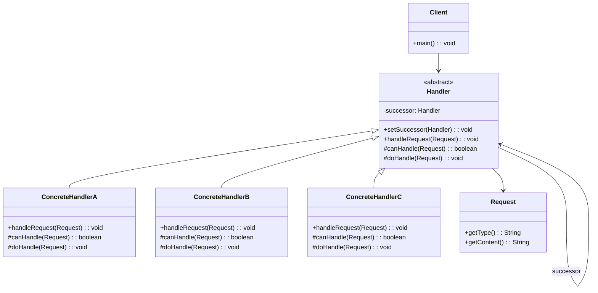
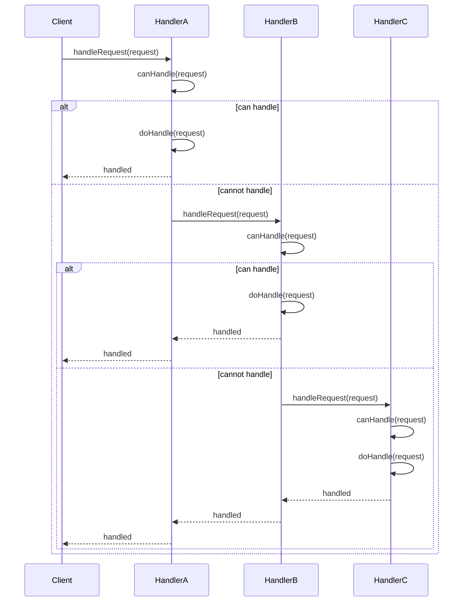

# 责任链模式 (Chain of Responsibility Pattern)

## 📋 模式概述

### 定义

责任链模式使多个对象都有机会处理请求，从而避免请求的发送者和接收者之间的耦合关系。将这些对象连成一条链，并沿着这条链传递该请求，直到有一个对象处理它为止。

### 意图

- 避免请求发送者与接收者耦合在一起
- 让多个对象都有可能接收请求
- 将这些对象连接成一条链，并且沿着这条链传递请求
- 直到有对象处理它为止

## 🏗️ 结构图



## ⏱️ 时序图



## 💻 代码实现

### 基础实现

```java
/**
 * 请求类
 */
public class Request {
    private String type;
    private String content;
    private int level;

    public Request(String type, String content, int level) {
        this.type = type;
        this.content = content;
        this.level = level;
    }

    public String getType() {
        return type;
    }

    public String getContent() {
        return content;
    }

    public int getLevel() {
        return level;
    }

    @Override
    public String toString() {
        return String.format("Request{type='%s', content='%s', level=%d}",
                type, content, level);
    }
}

/**
 * 抽象处理者
 */
public abstract class Handler {
    protected Handler successor;

    public void setSuccessor(Handler successor) {
        this.successor = successor;
    }

    /**
     * 处理请求的模板方法
     */
    public final void handleRequest(Request request) {
        if (canHandle(request)) {
            doHandle(request);
        } else if (successor != null) {
            System.out.println(getClass().getSimpleName() + " 无法处理，转发给下一个处理者");
            successor.handleRequest(request);
        } else {
            System.out.println("没有处理者能够处理该请求: " + request);
        }
    }

    /**
     * 判断是否能处理请求
     */
    protected abstract boolean canHandle(Request request);

    /**
     * 具体处理请求
     */
    protected abstract void doHandle(Request request);
}

/**
 * 具体处理者A - 处理级别1的请求
 */
public class ConcreteHandlerA extends Handler {

    @Override
    protected boolean canHandle(Request request) {
        return request.getLevel() == 1;
    }

    @Override
    protected void doHandle(Request request) {
        System.out.println("ConcreteHandlerA 处理请求: " + request);
    }
}

/**
 * 具体处理者B - 处理级别2的请求
 */
public class ConcreteHandlerB extends Handler {

    @Override
    protected boolean canHandle(Request request) {
        return request.getLevel() == 2;
    }

    @Override
    protected void doHandle(Request request) {
        System.out.println("ConcreteHandlerB 处理请求: " + request);
    }
}

/**
 * 具体处理者C - 处理级别3的请求
 */
public class ConcreteHandlerC extends Handler {

    @Override
    protected boolean canHandle(Request request) {
        return request.getLevel() == 3;
    }

    @Override
    protected void doHandle(Request request) {
        System.out.println("ConcreteHandlerC 处理请求: " + request);
    }
}

// 使用示例
public class ChainOfResponsibilityDemo {
    public static void main(String[] args) {
        // 创建处理者
        Handler handlerA = new ConcreteHandlerA();
        Handler handlerB = new ConcreteHandlerB();
        Handler handlerC = new ConcreteHandlerC();

        // 构建责任链
        handlerA.setSuccessor(handlerB);
        handlerB.setSuccessor(handlerC);

        // 创建请求
        Request[] requests = {
                new Request("TYPE_A", "处理A类型请求", 1),
                new Request("TYPE_B", "处理B类型请求", 2),
                new Request("TYPE_C", "处理C类型请求", 3),
                new Request("TYPE_D", "无法处理的请求", 4)
        };

        // 处理请求
        for (Request request : requests) {
            System.out.println("\n开始处理: " + request);
            handlerA.handleRequest(request);
        }
    }
}
```

## 🧪 实际应用示例

### 1. 请假审批系统

```java
/**
 * 请假申请
 */
public class LeaveRequest {
    private String employeeName;
    private int days;
    private String reason;

    public LeaveRequest(String employeeName, int days, String reason) {
        this.employeeName = employeeName;
        this.days = days;
        this.reason = reason;
    }

    public String getEmployeeName() {
        return employeeName;
    }

    public int getDays() {
        return days;
    }

    public String getReason() {
        return reason;
    }

    @Override
    public String toString() {
        return String.format("请假申请{员工='%s', 天数=%d, 原因='%s'}",
                employeeName, days, reason);
    }
}

/**
 * 抽象审批者
 */
public abstract class Approver {
    protected Approver nextApprover;
    protected String name;

    public Approver(String name) {
        this.name = name;
    }

    public void setNextApprover(Approver nextApprover) {
        this.nextApprover = nextApprover;
    }

    /**
     * 处理请假申请
     */
    public final void processRequest(LeaveRequest request) {
        if (canApprove(request)) {
            approve(request);
        } else if (nextApprover != null) {
            System.out.println(name + " 权限不足，转交给上级审批");
            nextApprover.processRequest(request);
        } else {
            reject(request);
        }
    }

    protected abstract boolean canApprove(LeaveRequest request);

    protected abstract void approve(LeaveRequest request);

    protected void reject(LeaveRequest request) {
        System.out.println("❌ " + name + " 拒绝了请假申请: " + request);
        System.out.println("   原因: 超出所有审批者的权限范围");
    }
}

/**
 * 组长 - 可以审批1天以内的请假
 */
public class TeamLeader extends Approver {

    public TeamLeader(String name) {
        super(name);
    }

    @Override
    protected boolean canApprove(LeaveRequest request) {
        return request.getDays() <= 1;
    }

    @Override
    protected void approve(LeaveRequest request) {
        System.out.println("✅ 组长 " + name + " 批准了请假申请: " + request);
    }
}

/**
 * 部门经理 - 可以审批3天以内的请假
 */
public class DepartmentManager extends Approver {

    public DepartmentManager(String name) {
        super(name);
    }

    @Override
    protected boolean canApprove(LeaveRequest request) {
        return request.getDays() <= 3;
    }

    @Override
    protected void approve(LeaveRequest request) {
        System.out.println("✅ 部门经理 " + name + " 批准了请假申请: " + request);
    }
}

/**
 * 总经理 - 可以审批7天以内的请假
 */
public class GeneralManager extends Approver {

    public GeneralManager(String name) {
        super(name);
    }

    @Override
    protected boolean canApprove(LeaveRequest request) {
        return request.getDays() <= 7;
    }

    @Override
    protected void approve(LeaveRequest request) {
        System.out.println("✅ 总经理 " + name + " 批准了请假申请: " + request);
    }
}

/**
 * 董事长 - 可以审批任何请假
 */
public class Chairman extends Approver {

    public Chairman(String name) {
        super(name);
    }

    @Override
    protected boolean canApprove(LeaveRequest request) {
        return request.getDays() <= 30; // 最多30天
    }

    @Override
    protected void approve(LeaveRequest request) {
        System.out.println("✅ 董事长 " + name + " 批准了请假申请: " + request);
    }
}

// 使用示例
public class LeaveApprovalDemo {
    public static void main(String[] args) {
        // 创建审批链
        Approver teamLeader = new TeamLeader("张三");
        Approver deptManager = new DepartmentManager("李四");
        Approver generalManager = new GeneralManager("王五");
        Approver chairman = new Chairman("赵六");

        // 构建责任链
        teamLeader.setNextApprover(deptManager);
        deptManager.setNextApprover(generalManager);
        generalManager.setNextApprover(chairman);

        // 创建请假申请
        LeaveRequest[] requests = {
                new LeaveRequest("小明", 1, "感冒发烧"),
                new LeaveRequest("小红", 3, "家中有事"),
                new LeaveRequest("小刚", 5, "结婚度蜜月"),
                new LeaveRequest("小丽", 15, "生孩子"),
                new LeaveRequest("小华", 45, "环游世界")
        };

        // 处理请假申请
        for (LeaveRequest request : requests) {
            System.out.println("\n" + "=".repeat(50));
            System.out.println("处理请假申请: " + request);
            System.out.println("=".repeat(50));
            teamLeader.processRequest(request);
        }
    }
}
```

### 2. 日志处理系统

```java
/**
 * 日志级别枚举
 */
public enum LogLevel {
    DEBUG(1), INFO(2), WARN(3), ERROR(4);

    private final int level;

    LogLevel(int level) {
        this.level = level;
    }

    public int getLevel() {
        return level;
    }
}

/**
 * 日志消息
 */
public class LogMessage {
    private LogLevel level;
    private String message;
    private String timestamp;

    public LogMessage(LogLevel level, String message) {
        this.level = level;
        this.message = message;
        this.timestamp = java.time.LocalDateTime.now().toString();
    }

    public LogLevel getLevel() {
        return level;
    }

    public String getMessage() {
        return message;
    }

    public String getTimestamp() {
        return timestamp;
    }

    @Override
    public String toString() {
        return String.format("[%s] %s - %s", level, timestamp, message);
    }
}

/**
 * 抽象日志处理器
 */
public abstract class LogHandler {
    protected LogHandler nextHandler;
    protected LogLevel level;

    public LogHandler(LogLevel level) {
        this.level = level;
    }

    public void setNextHandler(LogHandler nextHandler) {
        this.nextHandler = nextHandler;
    }

    public final void handle(LogMessage message) {
        if (message.getLevel().getLevel() >= level.getLevel()) {
            writeLog(message);
        }

        if (nextHandler != null) {
            nextHandler.handle(message);
        }
    }

    protected abstract void writeLog(LogMessage message);
}

/**
 * 控制台日志处理器
 */
public class ConsoleLogHandler extends LogHandler {

    public ConsoleLogHandler(LogLevel level) {
        super(level);
    }

    @Override
    protected void writeLog(LogMessage message) {
        System.out.println("控制台输出: " + message);
    }
}

/**
 * 文件日志处理器
 */
public class FileLogHandler extends LogHandler {
    private String filename;

    public FileLogHandler(LogLevel level, String filename) {
        super(level);
        this.filename = filename;
    }

    @Override
    protected void writeLog(LogMessage message) {
        System.out.println("写入文件 " + filename + ": " + message);
        // 实际实现中会写入文件
    }
}

/**
 * 邮件日志处理器
 */
public class EmailLogHandler extends LogHandler {
    private String emailAddress;

    public EmailLogHandler(LogLevel level, String emailAddress) {
        super(level);
        this.emailAddress = emailAddress;
    }

    @Override
    protected void writeLog(LogMessage message) {
        System.out.println("发送邮件到 " + emailAddress + ": " + message);
        // 实际实现中会发送邮件
    }
}

/**
 * 数据库日志处理器
 */
public class DatabaseLogHandler extends LogHandler {
    private String tableName;

    public DatabaseLogHandler(LogLevel level, String tableName) {
        super(level);
        this.tableName = tableName;
    }

    @Override
    protected void writeLog(LogMessage message) {
        System.out.println("写入数据库表 " + tableName + ": " + message);
        // 实际实现中会写入数据库
    }
}

/**
 * 日志记录器
 */
public class Logger {
    private LogHandler handlerChain;

    public Logger(LogHandler handlerChain) {
        this.handlerChain = handlerChain;
    }

    public void debug(String message) {
        handlerChain.handle(new LogMessage(LogLevel.DEBUG, message));
    }

    public void info(String message) {
        handlerChain.handle(new LogMessage(LogLevel.INFO, message));
    }

    public void warn(String message) {
        handlerChain.handle(new LogMessage(LogLevel.WARN, message));
    }

    public void error(String message) {
        handlerChain.handle(new LogMessage(LogLevel.ERROR, message));
    }
}

// 使用示例
public class LoggingDemo {
    public static void main(String[] args) {
        // 创建日志处理器链
        LogHandler consoleHandler = new ConsoleLogHandler(LogLevel.DEBUG);
        LogHandler fileHandler = new FileLogHandler(LogLevel.INFO, "app.log");
        LogHandler emailHandler = new EmailLogHandler(LogLevel.ERROR, "admin@example.com");
        LogHandler dbHandler = new DatabaseLogHandler(LogLevel.WARN, "log_table");

        // 构建责任链
        consoleHandler.setNextHandler(fileHandler);
        fileHandler.setNextHandler(dbHandler);
        dbHandler.setNextHandler(emailHandler);

        // 创建日志记录器
        Logger logger = new Logger(consoleHandler);

        // 测试不同级别的日志
        System.out.println("=== DEBUG 级别日志 ===");
        logger.debug("这是一个调试信息");

        System.out.println("\n=== INFO 级别日志 ===");
        logger.info("应用程序启动成功");

        System.out.println("\n=== WARN 级别日志 ===");
        logger.warn("内存使用率超过80%");

        System.out.println("\n=== ERROR 级别日志 ===");
        logger.error("数据库连接失败");
    }
}
```

## 🎯 适用场景

### 何时使用责任链模式

1. **多个对象可以处理同一个请求** - 具体哪个对象处理该请求在运行时刻自动确定
2. **想在不明确指定接收者的情况下** - 向多个对象中的一个提交一个请求
3. **可处理一个请求的对象集合** - 应该被动态指定
4. **需要动态指定处理者** - 处理者的集合可以动态配置

### 实际应用场景

- **审批流程** - 请假审批、报销审批、采购审批等
- **异常处理** - 不同级别的异常由不同的处理器处理
- **日志系统** - 根据日志级别选择不同的输出方式
- **权限验证** - 多级权限验证系统
- **过滤器链** - Web请求过滤、数据验证等
- **事件处理** - GUI事件处理、消息处理等

## ✅ 优点

1. **降低耦合度** - 请求发送者和接收者解耦
2. **增强灵活性** - 可以动态地增加或删除处理者
3. **增强责任分配** - 每个类只需要处理自己该处理的工作
4. **符合开闭原则** - 增加新的处理者无需修改现有代码

## ❌ 缺点

1. **性能问题** - 请求可能需要遍历整个链
2. **调试困难** - 运行时的结构不够清晰
3. **不保证被接收** - 请求可能到达链的末端都得不到处理
4. **系统性能影响** - 链过长会影响性能

## 🔄 模式关系

### 与其他模式的关系

- **与命令模式** - 责任链常用于处理命令对象
- **与装饰器模式** - 都使用链式结构，但目的不同
- **与组合模式** - 可以结合使用处理树形结构的请求

## 💡 最佳实践

### 设计建议

1. **合理设计链的长度** - 避免链过长影响性能
2. **提供默认处理** - 确保请求总能得到处理
3. **使用抽象基类** - 统一处理逻辑和链的管理
4. **考虑性能优化** - 对于频繁调用的场景要优化链的结构

### 实现技巧

```java
// 1. 使用建造者模式构建责任链
public class HandlerChainBuilder {
    private Handler first;
    private Handler current;

    public HandlerChainBuilder addHandler(Handler handler) {
        if (first == null) {
            first = current = handler;
        } else {
            current.setSuccessor(handler);
            current = handler;
        }
        return this;
    }

    public Handler build() {
        return first;
    }
}

// 2. 支持多种处理结果
public enum ProcessResult {
    HANDLED,        // 已处理
    NOT_HANDLED,    // 未处理
    STOP_CHAIN      // 停止链式传递
}
```

## ⚠️ 注意事项

1. **避免循环引用** - 确保链不会形成环
2. **处理链断裂** - 考虑链中某个处理者失效的情况
3. **性能监控** - 监控链的执行时间和处理效率
4. **异常处理** - 确保异常不会中断整个链的执行

---

责任链模式是一个非常实用的行为型模式，特别适合处理具有层级关系的业务逻辑。通过将请求的发送者和接收者解耦，它提供了一种灵活的方式来处理各种类型的请求。