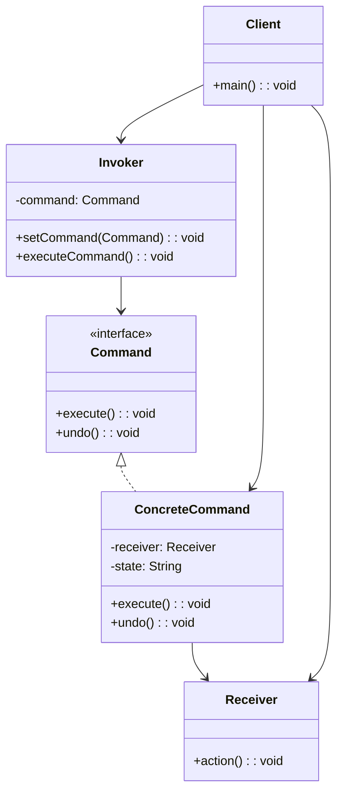
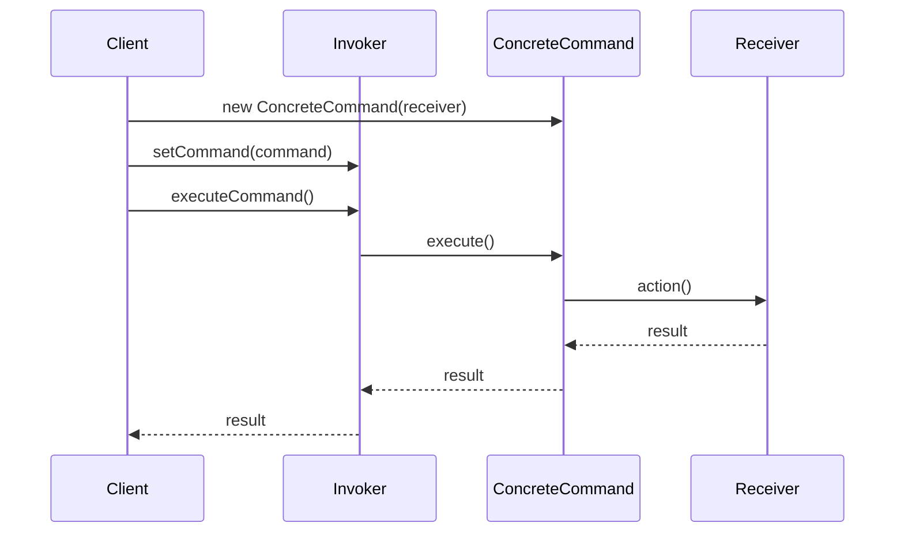

# 命令模式 (Command Pattern)

## 📋 模式概述

### 定义
命令模式将请求封装成对象，从而可以用不同的请求对客户进行参数化，对请求排队或记录请求日志，以及支持可撤销的操作。

### 意图
- 将请求封装为对象
- 支持撤销操作
- 支持日志记录和事务
- 将调用者与接收者解耦
- 支持宏命令（组合命令）

## 🏗️ 结构图



## ⏱️ 时序图



## 💻 代码实现

### 基础实现

```java
/**
 * 命令接口
 */
public interface Command {
    void execute();
    void undo();
}

/**
 * 接收者
 */
public class Receiver {
    public void action() {
        System.out.println("Receiver: 执行操作");
    }
    
    public void undoAction() {
        System.out.println("Receiver: 撤销操作");
    }
}

/**
 * 具体命令
 */
public class ConcreteCommand implements Command {
    private Receiver receiver;
    
    public ConcreteCommand(Receiver receiver) {
        this.receiver = receiver;
    }
    
    @Override
    public void execute() {
        System.out.println("ConcreteCommand: 执行命令");
        receiver.action();
    }
    
    @Override
    public void undo() {
        System.out.println("ConcreteCommand: 撤销命令");
        receiver.undoAction();
    }
}

/**
 * 调用者
 */
public class Invoker {
    private Command command;
    
    public void setCommand(Command command) {
        this.command = command;
    }
    
    public void executeCommand() {
        if (command != null) {
            command.execute();
        }
    }
    
    public void undoCommand() {
        if (command != null) {
            command.undo();
        }
    }
}
```

## 🧪 实际应用示例

### 1. 文本编辑器

```java
/**
 * 文本编辑器（接收者）
 */
public class TextEditor {
    private StringBuilder content;
    
    public TextEditor() {
        this.content = new StringBuilder();
    }
    
    public void write(String text) {
        content.append(text);
        System.out.println("写入文本: " + text);
        System.out.println("当前内容: " + content.toString());
    }
    
    public void delete(int length) {
        if (length > content.length()) {
            length = content.length();
        }
        content.delete(content.length() - length, content.length());
        System.out.println("删除 " + length + " 个字符");
        System.out.println("当前内容: " + content.toString());
    }
    
    public void insert(int position, String text) {
        if (position > content.length()) {
            position = content.length();
        }
        content.insert(position, text);
        System.out.println("在位置 " + position + " 插入: " + text);
        System.out.println("当前内容: " + content.toString());
    }
    
    public String getContent() {
        return content.toString();
    }
    
    public int getLength() {
        return content.length();
    }
}

/**
 * 写入命令
 */
public class WriteCommand implements Command {
    private TextEditor editor;
    private String text;
    
    public WriteCommand(TextEditor editor, String text) {
        this.editor = editor;
        this.text = text;
    }
    
    @Override
    public void execute() {
        editor.write(text);
    }
    
    @Override
    public void undo() {
        editor.delete(text.length());
    }
}

/**
 * 删除命令
 */
public class DeleteCommand implements Command {
    private TextEditor editor;
    private int length;
    private String deletedText;
    
    public DeleteCommand(TextEditor editor, int length) {
        this.editor = editor;
        this.length = length;
    }
    
    @Override
    public void execute() {
        String content = editor.getContent();
        int startPos = Math.max(0, content.length() - length);
        deletedText = content.substring(startPos);
        editor.delete(length);
    }
    
    @Override
    public void undo() {
        if (deletedText != null) {
            editor.write(deletedText);
        }
    }
}

/**
 * 插入命令
 */
public class InsertCommand implements Command {
    private TextEditor editor;
    private int position;
    private String text;
    
    public InsertCommand(TextEditor editor, int position, String text) {
        this.editor = editor;
        this.position = position;
        this.text = text;
    }
    
    @Override
    public void execute() {
        editor.insert(position, text);
    }
    
    @Override
    public void undo() {
        // 删除插入的文本
        String content = editor.getContent();
        if (position + text.length() <= content.length()) {
            StringBuilder sb = new StringBuilder(content);
            sb.delete(position, position + text.length());
            editor.content = sb;
            System.out.println("撤销插入操作");
            System.out.println("当前内容: " + editor.getContent());
        }
    }
}

/**
 * 编辑器调用者（支持撤销/重做）
 */
public class EditorInvoker {
    private Stack<Command> undoStack;
    private Stack<Command> redoStack;
    
    public EditorInvoker() {
        this.undoStack = new Stack<>();
        this.redoStack = new Stack<>();
    }
    
    public void executeCommand(Command command) {
        command.execute();
        undoStack.push(command);
        redoStack.clear(); // 执行新命令后清空重做栈
    }
    
    public void undo() {
        if (!undoStack.isEmpty()) {
            Command command = undoStack.pop();
            command.undo();
            redoStack.push(command);
            System.out.println("撤销操作完成");
        } else {
            System.out.println("没有可撤销的操作");
        }
    }
    
    public void redo() {
        if (!redoStack.isEmpty()) {
            Command command = redoStack.pop();
            command.execute();
            undoStack.push(command);
            System.out.println("重做操作完成");
        } else {
            System.out.println("没有可重做的操作");
        }
    }
    
    public boolean canUndo() {
        return !undoStack.isEmpty();
    }
    
    public boolean canRedo() {
        return !redoStack.isEmpty();
    }
}

// 使用示例
public class TextEditorDemo {
    public static void main(String[] args) {
        TextEditor editor = new TextEditor();
        EditorInvoker invoker = new EditorInvoker();
        
        System.out.println("=== 文本编辑操作 ===");
        
        // 写入文本
        invoker.executeCommand(new WriteCommand(editor, "Hello "));
        invoker.executeCommand(new WriteCommand(editor, "World!"));
        
        // 插入文本
        invoker.executeCommand(new InsertCommand(editor, 6, "Beautiful "));
        
        // 删除文本
        invoker.executeCommand(new DeleteCommand(editor, 1));
        
        System.out.println("\n=== 撤销操作 ===");
        invoker.undo(); // 撤销删除
        invoker.undo(); // 撤销插入
        
        System.out.println("\n=== 重做操作 ===");
        invoker.redo(); // 重做插入
        
        System.out.println("\n=== 继续编辑 ===");
        invoker.executeCommand(new WriteCommand(editor, " Amazing!"));
        
        System.out.println("\n=== 最终撤销测试 ===");
        invoker.undo();
        invoker.undo();
    }
}
```

### 2. 智能家居控制系统

```java
/**
 * 电灯（接收者）
 */
public class Light {
    private String location;
    private boolean isOn;
    private int brightness;
    
    public Light(String location) {
        this.location = location;
        this.isOn = false;
        this.brightness = 0;
    }
    
    public void turnOn() {
        isOn = true;
        brightness = 100;
        System.out.println(location + "的灯已打开，亮度: " + brightness + "%");
    }
    
    public void turnOff() {
        isOn = false;
        brightness = 0;
        System.out.println(location + "的灯已关闭");
    }
    
    public void setBrightness(int brightness) {
        if (isOn) {
            this.brightness = Math.max(0, Math.min(100, brightness));
            System.out.println(location + "的灯亮度设置为: " + this.brightness + "%");
        } else {
            System.out.println(location + "的灯未开启，无法调节亮度");
        }
    }
    
    public boolean isOn() { return isOn; }
    public int getBrightness() { return brightness; }
    public String getLocation() { return location; }
}

/**
 * 空调（接收者）
 */
public class AirConditioner {
    private String location;
    private boolean isOn;
    private int temperature;
    
    public AirConditioner(String location) {
        this.location = location;
        this.isOn = false;
        this.temperature = 25;
    }
    
    public void turnOn() {
        isOn = true;
        System.out.println(location + "的空调已打开，温度: " + temperature + "°C");
    }
    
    public void turnOff() {
        isOn = false;
        System.out.println(location + "的空调已关闭");
    }
    
    public void setTemperature(int temperature) {
        if (isOn) {
            this.temperature = Math.max(16, Math.min(30, temperature));
            System.out.println(location + "的空调温度设置为: " + this.temperature + "°C");
        } else {
            System.out.println(location + "的空调未开启，无法调节温度");
        }
    }
    
    public boolean isOn() { return isOn; }
    public int getTemperature() { return temperature; }
    public String getLocation() { return location; }
}

/**
 * 开灯命令
 */
public class LightOnCommand implements Command {
    private Light light;
    
    public LightOnCommand(Light light) {
        this.light = light;
    }
    
    @Override
    public void execute() {
        light.turnOn();
    }
    
    @Override
    public void undo() {
        light.turnOff();
    }
}

/**
 * 关灯命令
 */
public class LightOffCommand implements Command {
    private Light light;
    
    public LightOffCommand(Light light) {
        this.light = light;
    }
    
    @Override
    public void execute() {
        light.turnOff();
    }
    
    @Override
    public void undo() {
        light.turnOn();
    }
}

/**
 * 调节灯光亮度命令
 */
public class LightBrightnessCommand implements Command {
    private Light light;
    private int brightness;
    private int previousBrightness;
    
    public LightBrightnessCommand(Light light, int brightness) {
        this.light = light;
        this.brightness = brightness;
    }
    
    @Override
    public void execute() {
        previousBrightness = light.getBrightness();
        light.setBrightness(brightness);
    }
    
    @Override
    public void undo() {
        light.setBrightness(previousBrightness);
    }
}

/**
 * 空调开启命令
 */
public class AirConditionerOnCommand implements Command {
    private AirConditioner ac;
    
    public AirConditionerOnCommand(AirConditioner ac) {
        this.ac = ac;
    }
    
    @Override
    public void execute() {
        ac.turnOn();
    }
    
    @Override
    public void undo() {
        ac.turnOff();
    }
}

/**
 * 空调温度设置命令
 */
public class AirConditionerTemperatureCommand implements Command {
    private AirConditioner ac;
    private int temperature;
    private int previousTemperature;
    
    public AirConditionerTemperatureCommand(AirConditioner ac, int temperature) {
        this.ac = ac;
        this.temperature = temperature;
    }
    
    @Override
    public void execute() {
        previousTemperature = ac.getTemperature();
        ac.setTemperature(temperature);
    }
    
    @Override
    public void undo() {
        ac.setTemperature(previousTemperature);
    }
}

/**
 * 宏命令（组合命令）
 */
public class MacroCommand implements Command {
    private Command[] commands;
    
    public MacroCommand(Command[] commands) {
        this.commands = commands;
    }
    
    @Override
    public void execute() {
        System.out.println("执行宏命令...");
        for (Command command : commands) {
            command.execute();
        }
        System.out.println("宏命令执行完成");
    }
    
    @Override
    public void undo() {
        System.out.println("撤销宏命令...");
        // 逆序撤销
        for (int i = commands.length - 1; i >= 0; i--) {
            commands[i].undo();
        }
        System.out.println("宏命令撤销完成");
    }
}

/**
 * 空命令（空对象模式）
 */
public class NoCommand implements Command {
    @Override
    public void execute() {
        // 什么都不做
    }
    
    @Override
    public void undo() {
        // 什么都不做
    }
}

/**
 * 智能遥控器
 */
public class SmartRemoteControl {
    private Command[] onCommands;
    private Command[] offCommands;
    private Command undoCommand;
    
    public SmartRemoteControl() {
        onCommands = new Command[7]; // 7个插槽
        offCommands = new Command[7];
        
        Command noCommand = new NoCommand();
        for (int i = 0; i < 7; i++) {
            onCommands[i] = noCommand;
            offCommands[i] = noCommand;
        }
        undoCommand = noCommand;
    }
    
    public void setCommand(int slot, Command onCommand, Command offCommand) {
        onCommands[slot] = onCommand;
        offCommands[slot] = offCommand;
    }
    
    public void onButtonPressed(int slot) {
        onCommands[slot].execute();
        undoCommand = onCommands[slot];
    }
    
    public void offButtonPressed(int slot) {
        offCommands[slot].execute();
        undoCommand = offCommands[slot];
    }
    
    public void undoButtonPressed() {
        undoCommand.undo();
    }
    
    public String toString() {
        StringBuilder sb = new StringBuilder();
        sb.append("\n------ 智能遥控器 ------\n");
        for (int i = 0; i < onCommands.length; i++) {
            sb.append("[插槽 ").append(i).append("] ")
              .append(onCommands[i].getClass().getSimpleName())
              .append("    ")
              .append(offCommands[i].getClass().getSimpleName())
              .append("\n");
        }
        sb.append("[撤销] ").append(undoCommand.getClass().getSimpleName()).append("\n");
        return sb.toString();
    }
}

// 使用示例
public class SmartHomeDemo {
    public static void main(String[] args) {
        // 创建设备
        Light livingRoomLight = new Light("客厅");
        Light kitchenLight = new Light("厨房");
        AirConditioner livingRoomAC = new AirConditioner("客厅");
        
        // 创建命令
        LightOnCommand livingRoomLightOn = new LightOnCommand(livingRoomLight);
        LightOffCommand livingRoomLightOff = new LightOffCommand(livingRoomLight);
        LightOnCommand kitchenLightOn = new LightOnCommand(kitchenLight);
        LightOffCommand kitchenLightOff = new LightOffCommand(kitchenLight);
        
        AirConditionerOnCommand acOn = new AirConditionerOnCommand(livingRoomAC);
        Command acOff = new Command() {
            @Override
            public void execute() {
                livingRoomAC.turnOff();
            }
            
            @Override
            public void undo() {
                livingRoomAC.turnOn();
            }
        };
        
        // 创建宏命令 - 回家模式
        Command[] homeCommands = {livingRoomLightOn, kitchenLightOn, acOn};
        MacroCommand homeMacro = new MacroCommand(homeCommands);
        
        Command[] awayCommands = {livingRoomLightOff, kitchenLightOff, acOff};
        MacroCommand awayMacro = new MacroCommand(awayCommands);
        
        // 设置遥控器
        SmartRemoteControl remote = new SmartRemoteControl();
        remote.setCommand(0, livingRoomLightOn, livingRoomLightOff);
        remote.setCommand(1, kitchenLightOn, kitchenLightOff);
        remote.setCommand(2, acOn, acOff);
        remote.setCommand(3, homeMacro, awayMacro);
        
        System.out.println(remote);
        
        System.out.println("=== 测试单个命令 ===");
        remote.onButtonPressed(0);  // 客厅灯开
        remote.offButtonPressed(0); // 客厅灯关
        remote.undoButtonPressed(); // 撤销（客厅灯开）
        
        System.out.println("\n=== 测试宏命令 - 回家模式 ===");
        remote.onButtonPressed(3);  // 执行回家宏命令
        
        System.out.println("\n=== 撤销宏命令 ===");
        remote.undoButtonPressed(); // 撤销回家宏命令
        
        System.out.println("\n=== 测试离家模式 ===");
        remote.onButtonPressed(0);  // 先开客厅灯
        remote.onButtonPressed(1);  // 开厨房灯
        remote.onButtonPressed(2);  // 开空调
        remote.offButtonPressed(3); // 执行离家宏命令
    }
}
```

## 🎯 适用场景

### 适合使用命令模式的场景：

1. **撤销/重做功能** - 需要支持撤销和重做操作
2. **日志记录** - 需要记录操作历史
3. **事务处理** - 需要支持事务回滚
4. **宏命令** - 需要组合多个命令
5. **队列请求** - 需要对请求进行排队处理

### 具体应用场景：

- **文本编辑器** - 撤销/重做功能
- **GUI应用** - 菜单操作、按钮点击
- **游戏开发** - 游戏操作记录和回放
- **智能家居** - 设备控制命令
- **数据库操作** - 事务管理

## ✅ 优点

1. **解耦调用者和接收者** - 调用者不需要知道接收者的具体实现
2. **支持撤销操作** - 可以实现撤销和重做功能
3. **支持日志记录** - 可以记录命令执行历史
4. **支持宏命令** - 可以组合多个命令
5. **符合开闭原则** - 容易添加新的命令

## ❌ 缺点

1. **类数量增加** - 每个命令都需要一个类
2. **系统复杂性** - 增加了系统的复杂性
3. **内存开销** - 需要存储命令对象和历史记录

## 🔄 与其他模式的关系

- **组合模式** - 宏命令可以使用组合模式实现
- **备忘录模式** - 可以结合使用实现更复杂的撤销功能
- **原型模式** - 可以使用原型模式复制命令
- **策略模式** - 都封装算法，但命令模式关注请求封装

## 📝 最佳实践

1. **命令接口设计** - 保持命令接口简单明确
2. **撤销功能实现** - 正确实现撤销逻辑，保存必要的状态
3. **宏命令设计** - 合理设计宏命令的执行和撤销顺序
4. **内存管理** - 及时清理不需要的命令历史
5. **异常处理** - 正确处理命令执行中的异常

## 🚨 注意事项

1. **状态保存** - 撤销操作需要保存足够的状态信息
2. **内存使用** - 命令历史可能占用大量内存
3. **执行顺序** - 宏命令的执行和撤销顺序要正确
4. **线程安全** - 多线程环境下的命令执行安全

---

*命令模式是实现撤销/重做功能和解耦调用者与接收者的经典模式，广泛应用于需要记录操作历史的系统中。*