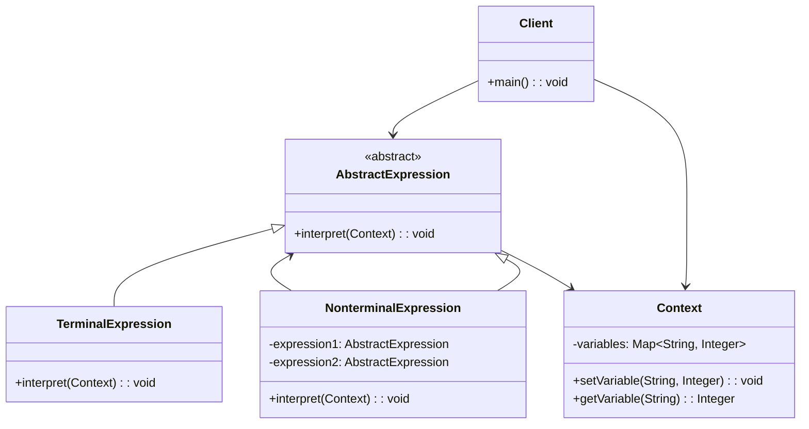
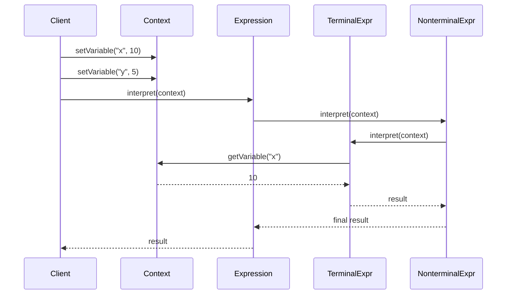

# 解释器模式 (Interpreter Pattern)

## 📋 模式概述

### 定义

解释器模式定义了一个语言的文法表示，并定义一个解释器来处理这个文法。它使用类来表示文法规则，可以容易地改变和扩展文法。

### 意图

- 定义一个语言的文法表示
- 定义一个解释器来解释语言中的句子
- 提供一种评估语言文法的方式
- 支持简单语言的解析和执行

## 🏗️ 结构图



## ⏱️ 时序图



## 💻 代码实现

### 基础实现

```java
/**
 * 上下文类 - 存储解释器需要的全局信息
 */
public class Context {
    private Map<String, Integer> variables;

    public Context() {
        this.variables = new HashMap<>();
    }

    public void setVariable(String name, int value) {
        variables.put(name, value);
        System.out.println("设置变量 " + name + " = " + value);
    }

    public int getVariable(String name) {
        Integer value = variables.get(name);
        if (value == null) {
            throw new RuntimeException("未定义的变量: " + name);
        }
        return value;
    }

    public boolean hasVariable(String name) {
        return variables.containsKey(name);
    }

    public void showVariables() {
        System.out.println("当前变量: " + variables);
    }
}

/**
 * 抽象表达式
 */
public abstract class AbstractExpression {
    public abstract int interpret(Context context);
}

/**
 * 终结符表达式 - 变量
 */
public class VariableExpression extends AbstractExpression {
    private String name;

    public VariableExpression(String name) {
        this.name = name;
    }

    @Override
    public int interpret(Context context) {
        int value = context.getVariable(name);
        System.out.println("解释变量 " + name + " = " + value);
        return value;
    }

    @Override
    public String toString() {
        return name;
    }
}

/**
 * 终结符表达式 - 数字
 */
public class NumberExpression extends AbstractExpression {
    private int number;

    public NumberExpression(int number) {
        this.number = number;
    }

    @Override
    public int interpret(Context context) {
        System.out.println("解释数字 " + number);
        return number;
    }

    @Override
    public String toString() {
        return String.valueOf(number);
    }
}

/**
 * 非终结符表达式 - 加法
 */
public class AddExpression extends AbstractExpression {
    private AbstractExpression left;
    private AbstractExpression right;

    public AddExpression(AbstractExpression left, AbstractExpression right) {
        this.left = left;
        this.right = right;
    }

    @Override
    public int interpret(Context context) {
        int leftValue = left.interpret(context);
        int rightValue = right.interpret(context);
        int result = leftValue + rightValue;
        System.out.println("执行加法: " + leftValue + " + " + rightValue + " = " + result);
        return result;
    }

    @Override
    public String toString() {
        return "(" + left + " + " + right + ")";
    }
}

/**
 * 非终结符表达式 - 减法
 */
public class SubtractExpression extends AbstractExpression {
    private AbstractExpression left;
    private AbstractExpression right;

    public SubtractExpression(AbstractExpression left, AbstractExpression right) {
        this.left = left;
        this.right = right;
    }

    @Override
    public int interpret(Context context) {
        int leftValue = left.interpret(context);
        int rightValue = right.interpret(context);
        int result = leftValue - rightValue;
        System.out.println("执行减法: " + leftValue + " - " + rightValue + " = " + result);
        return result;
    }

    @Override
    public String toString() {
        return "(" + left + " - " + right + ")";
    }
}

/**
 * 非终结符表达式 - 乘法
 */
public class MultiplyExpression extends AbstractExpression {
    private AbstractExpression left;
    private AbstractExpression right;

    public MultiplyExpression(AbstractExpression left, AbstractExpression right) {
        this.left = left;
        this.right = right;
    }

    @Override
    public int interpret(Context context) {
        int leftValue = left.interpret(context);
        int rightValue = right.interpret(context);
        int result = leftValue * rightValue;
        System.out.println("执行乘法: " + leftValue + " * " + rightValue + " = " + result);
        return result;
    }

    @Override
    public String toString() {
        return "(" + left + " * " + right + ")";
    }
}

// 使用示例
public class InterpreterDemo {
    public static void main(String[] args) {
        Context context = new Context();

        // 设置变量
        context.setVariable("x", 10);
        context.setVariable("y", 5);
        context.setVariable("z", 2);

        // 构建表达式: (x + y) * z - 3
        AbstractExpression expression = new SubtractExpression(
                new MultiplyExpression(
                        new AddExpression(
                                new VariableExpression("x"),
                                new VariableExpression("y")
                        ),
                        new VariableExpression("z")
                ),
                new NumberExpression(3)
        );

        System.out.println("表达式: " + expression);
        context.showVariables();

        System.out.println("\n=== 开始解释执行 ===");
        int result = expression.interpret(context);
        System.out.println("\n最终结果: " + result);
    }
}
```

## 🧪 实际应用示例

### 1. 简单计算器语言解释器

```java
/**
 * 词法分析器 - 将输入字符串分解为标记
 */
public class Lexer {
    private String input;
    private int position;
    private char currentChar;

    public Lexer(String input) {
        this.input = input;
        this.position = 0;
        this.currentChar = input.length() > 0 ? input.charAt(0) : '\0';
    }

    private void advance() {
        position++;
        if (position >= input.length()) {
            currentChar = '\0';
        } else {
            currentChar = input.charAt(position);
        }
    }

    private void skipWhitespace() {
        while (currentChar != '\0' && Character.isWhitespace(currentChar)) {
            advance();
        }
    }

    private int parseNumber() {
        StringBuilder sb = new StringBuilder();
        while (currentChar != '\0' && Character.isDigit(currentChar)) {
            sb.append(currentChar);
            advance();
        }
        return Integer.parseInt(sb.toString());
    }

    private String parseVariable() {
        StringBuilder sb = new StringBuilder();
        while (currentChar != '\0' && (Character.isLetter(currentChar) || Character.isDigit(currentChar))) {
            sb.append(currentChar);
            advance();
        }
        return sb.toString();
    }

    public List<Token> tokenize() {
        List<Token> tokens = new ArrayList<>();

        while (currentChar != '\0') {
            skipWhitespace();

            if (currentChar == '\0') break;

            if (Character.isDigit(currentChar)) {
                tokens.add(new Token(TokenType.NUMBER, String.valueOf(parseNumber())));
            } else if (Character.isLetter(currentChar)) {
                tokens.add(new Token(TokenType.VARIABLE, parseVariable()));
            } else if (currentChar == '+') {
                tokens.add(new Token(TokenType.PLUS, "+"));
                advance();
            } else if (currentChar == '-') {
                tokens.add(new Token(TokenType.MINUS, "-"));
                advance();
            } else if (currentChar == '*') {
                tokens.add(new Token(TokenType.MULTIPLY, "*"));
                advance();
            } else if (currentChar == '/') {
                tokens.add(new Token(TokenType.DIVIDE, "/"));
                advance();
            } else if (currentChar == '(') {
                tokens.add(new Token(TokenType.LPAREN, "("));
                advance();
            } else if (currentChar == ')') {
                tokens.add(new Token(TokenType.RPAREN, ")"));
                advance();
            } else if (currentChar == '=') {
                tokens.add(new Token(TokenType.ASSIGN, "="));
                advance();
            } else {
                throw new RuntimeException("无效字符: " + currentChar);
            }
        }

        tokens.add(new Token(TokenType.EOF, ""));
        return tokens;
    }
}

/**
 * 标记类型
 */
public enum TokenType {
    NUMBER, VARIABLE, PLUS, MINUS, MULTIPLY, DIVIDE,
    LPAREN, RPAREN, ASSIGN, EOF
}

/**
 * 标记类
 */
public class Token {
    private TokenType type;
    private String value;

    public Token(TokenType type, String value) {
        this.type = type;
        this.value = value;
    }

    public TokenType getType() {
        return type;
    }

    public String getValue() {
        return value;
    }

    @Override
    public String toString() {
        return String.format("Token{%s, '%s'}", type, value);
    }
}

/**
 * 语法分析器 - 构建抽象语法树
 */
public class Parser {
    private List<Token> tokens;
    private int position;
    private Token currentToken;

    public Parser(List<Token> tokens) {
        this.tokens = tokens;
        this.position = 0;
        this.currentToken = tokens.get(0);
    }

    private void advance() {
        position++;
        if (position < tokens.size()) {
            currentToken = tokens.get(position);
        }
    }

    private void consume(TokenType expectedType) {
        if (currentToken.getType() == expectedType) {
            advance();
        } else {
            throw new RuntimeException("期望 " + expectedType + " 但得到 " + currentToken.getType());
        }
    }

    /**
     * 解析表达式: expression = term ((PLUS | MINUS) term)*
     */
    public AbstractExpression parseExpression() {
        AbstractExpression node = parseTerm();

        while (currentToken.getType() == TokenType.PLUS || currentToken.getType() == TokenType.MINUS) {
            TokenType op = currentToken.getType();
            advance();
            AbstractExpression right = parseTerm();

            if (op == TokenType.PLUS) {
                node = new AddExpression(node, right);
            } else {
                node = new SubtractExpression(node, right);
            }
        }

        return node;
    }

    /**
     * 解析项: term = factor ((MULTIPLY | DIVIDE) factor)*
     */
    private AbstractExpression parseTerm() {
        AbstractExpression node = parseFactor();

        while (currentToken.getType() == TokenType.MULTIPLY || currentToken.getType() == TokenType.DIVIDE) {
            TokenType op = currentToken.getType();
            advance();
            AbstractExpression right = parseFactor();

            if (op == TokenType.MULTIPLY) {
                node = new MultiplyExpression(node, right);
            } else {
                node = new DivideExpression(node, right);
            }
        }

        return node;
    }

    /**
     * 解析因子: factor = NUMBER | VARIABLE | LPAREN expression RPAREN
     */
    private AbstractExpression parseFactor() {
        Token token = currentToken;

        if (token.getType() == TokenType.NUMBER) {
            advance();
            return new NumberExpression(Integer.parseInt(token.getValue()));
        } else if (token.getType() == TokenType.VARIABLE) {
            advance();
            return new VariableExpression(token.getValue());
        } else if (token.getType() == TokenType.LPAREN) {
            advance();
            AbstractExpression node = parseExpression();
            consume(TokenType.RPAREN);
            return node;
        } else {
            throw new RuntimeException("无效的因子: " + token);
        }
    }

    /**
     * 解析赋值语句: assignment = VARIABLE ASSIGN expression
     */
    public AssignmentExpression parseAssignment() {
        if (currentToken.getType() != TokenType.VARIABLE) {
            throw new RuntimeException("期望变量名");
        }

        String varName = currentToken.getValue();
        advance();
        consume(TokenType.ASSIGN);
        AbstractExpression expression = parseExpression();

        return new AssignmentExpression(varName, expression);
    }
}

/**
 * 除法表达式
 */
public class DivideExpression extends AbstractExpression {
    private AbstractExpression left;
    private AbstractExpression right;

    public DivideExpression(AbstractExpression left, AbstractExpression right) {
        this.left = left;
        this.right = right;
    }

    @Override
    public int interpret(Context context) {
        int leftValue = left.interpret(context);
        int rightValue = right.interpret(context);

        if (rightValue == 0) {
            throw new RuntimeException("除零错误");
        }

        int result = leftValue / rightValue;
        System.out.println("执行除法: " + leftValue + " / " + rightValue + " = " + result);
        return result;
    }

    @Override
    public String toString() {
        return "(" + left + " / " + right + ")";
    }
}

/**
 * 赋值表达式
 */
public class AssignmentExpression extends AbstractExpression {
    private String variableName;
    private AbstractExpression expression;

    public AssignmentExpression(String variableName, AbstractExpression expression) {
        this.variableName = variableName;
        this.expression = expression;
    }

    @Override
    public int interpret(Context context) {
        int value = expression.interpret(context);
        context.setVariable(variableName, value);
        System.out.println("赋值: " + variableName + " = " + value);
        return value;
    }

    @Override
    public String toString() {
        return variableName + " = " + expression;
    }
}

/**
 * 计算器解释器
 */
public class Calculator {
    private Context context;

    public Calculator() {
        this.context = new Context();
    }

    public int evaluate(String expression) {
        System.out.println("输入表达式: " + expression);

        // 词法分析
        Lexer lexer = new Lexer(expression);
        List<Token> tokens = lexer.tokenize();
        System.out.println("词法分析结果: " + tokens);

        // 语法分析
        Parser parser = new Parser(tokens);
        AbstractExpression ast;

        // 检查是否是赋值语句
        if (tokens.size() >= 3 && tokens.get(0).getType() == TokenType.VARIABLE
                && tokens.get(1).getType() == TokenType.ASSIGN) {
            ast = parser.parseAssignment();
        } else {
            ast = parser.parseExpression();
        }

        System.out.println("抽象语法树: " + ast);

        // 解释执行
        System.out.println("开始解释执行:");
        int result = ast.interpret(context);

        return result;
    }

    public void showVariables() {
        context.showVariables();
    }
}

// 使用示例
public class CalculatorDemo {
    public static void main(String[] args) {
        Calculator calculator = new Calculator();

        try {
            System.out.println("=== 简单计算器演示 ===\n");

            // 基本运算
            System.out.println("结果: " + calculator.evaluate("3 + 5 * 2"));
            System.out.println();

            // 带括号的运算
            System.out.println("结果: " + calculator.evaluate("(3 + 5) * 2"));
            System.out.println();

            // 变量赋值
            System.out.println("结果: " + calculator.evaluate("x = 10"));
            System.out.println("结果: " + calculator.evaluate("y = 20"));
            calculator.showVariables();
            System.out.println();

            // 使用变量进行运算
            System.out.println("结果: " + calculator.evaluate("x + y * 2"));
            System.out.println();

            // 复杂表达式
            System.out.println("结果: " + calculator.evaluate("z = (x + y) / 3"));
            calculator.showVariables();
            System.out.println();

            // 使用所有变量
            System.out.println("结果: " + calculator.evaluate("x * y - z + 5"));

        } catch (Exception e) {
            System.err.println("错误: " + e.getMessage());
        }
    }
}
```

### 2. 布尔表达式解释器

```java
/**
 * 布尔上下文
 */
public class BooleanContext {
    private Map<String, Boolean> variables;

    public BooleanContext() {
        this.variables = new HashMap<>();
    }

    public void setVariable(String name, boolean value) {
        variables.put(name, value);
        System.out.println("设置布尔变量 " + name + " = " + value);
    }

    public boolean getVariable(String name) {
        Boolean value = variables.get(name);
        if (value == null) {
            throw new RuntimeException("未定义的布尔变量: " + name);
        }
        return value;
    }

    public void showVariables() {
        System.out.println("当前布尔变量: " + variables);
    }
}

/**
 * 抽象布尔表达式
 */
public abstract class BooleanExpression {
    public abstract boolean interpret(BooleanContext context);
}

/**
 * 布尔常量表达式
 */
public class BooleanConstant extends BooleanExpression {
    private boolean value;

    public BooleanConstant(boolean value) {
        this.value = value;
    }

    @Override
    public boolean interpret(BooleanContext context) {
        System.out.println("解释布尔常量: " + value);
        return value;
    }

    @Override
    public String toString() {
        return String.valueOf(value);
    }
}

/**
 * 布尔变量表达式
 */
public class BooleanVariable extends BooleanExpression {
    private String name;

    public BooleanVariable(String name) {
        this.name = name;
    }

    @Override
    public boolean interpret(BooleanContext context) {
        boolean value = context.getVariable(name);
        System.out.println("解释布尔变量 " + name + " = " + value);
        return value;
    }

    @Override
    public String toString() {
        return name;
    }
}

/**
 * AND表达式
 */
public class AndExpression extends BooleanExpression {
    private BooleanExpression left;
    private BooleanExpression right;

    public AndExpression(BooleanExpression left, BooleanExpression right) {
        this.left = left;
        this.right = right;
    }

    @Override
    public boolean interpret(BooleanContext context) {
        boolean leftValue = left.interpret(context);
        boolean rightValue = right.interpret(context);
        boolean result = leftValue && rightValue;
        System.out.println("执行AND: " + leftValue + " && " + rightValue + " = " + result);
        return result;
    }

    @Override
    public String toString() {
        return "(" + left + " && " + right + ")";
    }
}

/**
 * OR表达式
 */
public class OrExpression extends BooleanExpression {
    private BooleanExpression left;
    private BooleanExpression right;

    public OrExpression(BooleanExpression left, BooleanExpression right) {
        this.left = left;
        this.right = right;
    }

    @Override
    public boolean interpret(BooleanContext context) {
        boolean leftValue = left.interpret(context);
        boolean rightValue = right.interpret(context);
        boolean result = leftValue || rightValue;
        System.out.println("执行OR: " + leftValue + " || " + rightValue + " = " + result);
        return result;
    }

    @Override
    public String toString() {
        return "(" + left + " || " + right + ")";
    }
}

/**
 * NOT表达式
 */
public class NotExpression extends BooleanExpression {
    private BooleanExpression expression;

    public NotExpression(BooleanExpression expression) {
        this.expression = expression;
    }

    @Override
    public boolean interpret(BooleanContext context) {
        boolean value = expression.interpret(context);
        boolean result = !value;
        System.out.println("执行NOT: !" + value + " = " + result);
        return result;
    }

    @Override
    public String toString() {
        return "!" + expression;
    }
}

// 使用示例
public class BooleanInterpreterDemo {
    public static void main(String[] args) {
        BooleanContext context = new BooleanContext();

        // 设置变量
        context.setVariable("A", true);
        context.setVariable("B", false);
        context.setVariable("C", true);

        // 构建表达式: (A && B) || (!C && A)
        BooleanExpression expression = new OrExpression(
                new AndExpression(
                        new BooleanVariable("A"),
                        new BooleanVariable("B")
                ),
                new AndExpression(
                        new NotExpression(new BooleanVariable("C")),
                        new BooleanVariable("A")
                )
        );

        System.out.println("布尔表达式: " + expression);
        context.showVariables();

        System.out.println("\n=== 开始解释执行 ===");
        boolean result = expression.interpret(context);
        System.out.println("\n最终结果: " + result);

        System.out.println("\n=== 测试其他表达式 ===");

        // 测试: A && (B || C)
        BooleanExpression expr2 = new AndExpression(
                new BooleanVariable("A"),
                new OrExpression(
                        new BooleanVariable("B"),
                        new BooleanVariable("C")
                )
        );

        System.out.println("表达式: " + expr2);
        boolean result2 = expr2.interpret(context);
        System.out.println("结果: " + result2);
    }
}
```

## 🎯 适用场景

### 何时使用解释器模式

1. **需要解释执行简单的语言或表达式**
2. **文法相对简单且稳定**
3. **效率不是主要考虑因素**
4. **需要频繁改变和扩展语言规则**

### 实际应用场景

- **表达式求值** - 数学表达式、布尔表达式
- **配置文件解析** - 简单的配置语言
- **规则引擎** - 业务规则的表达和执行
- **SQL解析** - 简单的查询语言
- **正则表达式** - 模式匹配
- **脚本语言** - 简单的脚本解释器

## ✅ 优点

1. **易于扩展** - 容易添加新的解释规则
2. **易于实现** - 每个文法规则对应一个类
3. **灵活性高** - 可以动态改变和组合规则
4. **符合开闭原则** - 扩展新规则不需要修改现有代码

## ❌ 缺点

1. **效率较低** - 大量的递归调用影响性能
2. **复杂文法难以维护** - 类的数量会急剧增加
3. **调试困难** - 复杂的表达式树难以调试
4. **内存开销** - 需要构建抽象语法树

## 🔄 模式关系

### 与其他模式的关系

- **与组合模式** - 抽象语法树通常使用组合模式构建
- **与访问者模式** - 可以结合使用来处理语法树
- **与享元模式** - 可以共享终结符表达式实例

## 💡 最佳实践

### 设计建议

1. **保持文法简单** - 复杂文法考虑使用专门的解析器生成工具
2. **使用缓存** - 对重复的子表达式进行缓存
3. **考虑性能** - 对于性能敏感的场景要谨慎使用
4. **提供错误处理** - 完善的错误报告和恢复机制

### 实现技巧

```java
// 1. 使用享元模式优化终结符表达式
public class ExpressionFactory {
    private static Map<String, VariableExpression> variables = new HashMap<>();
    private static Map<Integer, NumberExpression> numbers = new HashMap<>();

    public static VariableExpression getVariable(String name) {
        return variables.computeIfAbsent(name, VariableExpression::new);
    }

    public static NumberExpression getNumber(int value) {
        return numbers.computeIfAbsent(value, NumberExpression::new);
    }
}

// 2. 添加缓存机制
public abstract class CachedExpression extends AbstractExpression {
    private Integer cachedResult;
    private Context cachedContext;

    @Override
    public final int interpret(Context context) {
        if (cachedResult != null && context.equals(cachedContext)) {
            return cachedResult;
        }

        cachedResult = doInterpret(context);
        cachedContext = context;
        return cachedResult;
    }

    protected abstract int doInterpret(Context context);
}

// 3. 使用访问者模式处理语法树
public interface ExpressionVisitor {
    void visit(NumberExpression expr);

    void visit(VariableExpression expr);

    void visit(AddExpression expr);
    // ... 其他表达式类型
}

public abstract class VisitableExpression extends AbstractExpression {
    public abstract void accept(ExpressionVisitor visitor);
}
```

## ⚠️ 注意事项

1. **文法复杂度** - 避免过于复杂的文法规则
2. **性能考虑** - 对于大量计算的场景要评估性能影响
3. **内存使用** - 注意抽象语法树的内存占用
4. **错误处理** - 提供清晰的错误信息和恢复机制

---

解释器模式适用于需要解释执行简单语言的场景。虽然实现相对简单，但要注意控制文法的复杂度，避免性能问题。对于复杂的语言解析需求，建议使用专门的解析器生成工具。