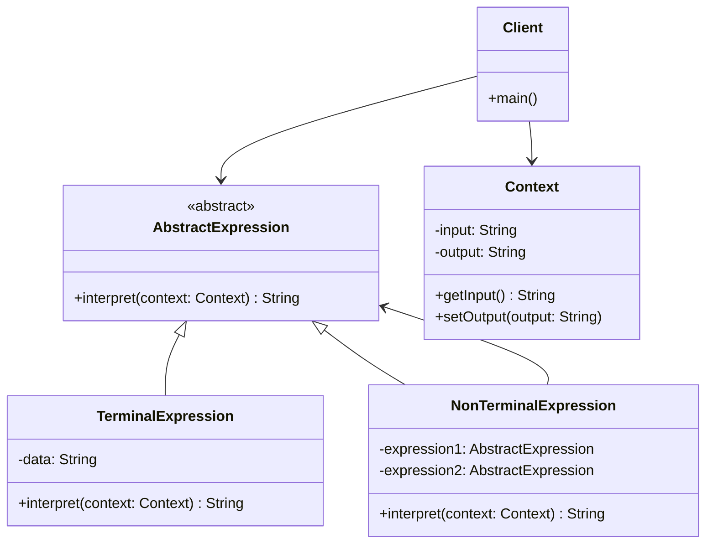
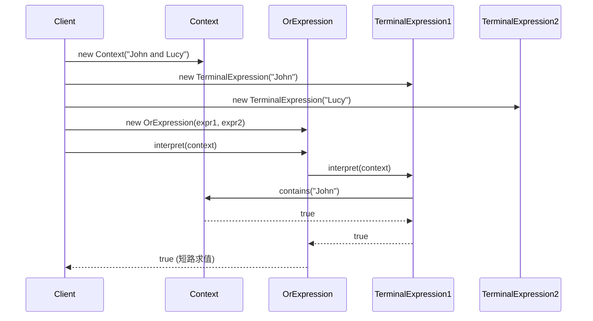

# 解释器模式 (Interpreter Pattern) ⚠️ 低应用价值

> **⚠️ 注意：此模式在实际项目中应用价值较低**
> - 适用场景非常有限，主要用于DSL或编译器开发
> - 实现复杂度高，维护成本大
> - 大多数情况下有更好的替代方案
> - **代码已删除，仅保留文档作为学习参考**

## 📋 模式概述

### 定义
解释器模式定义了一个语言的文法表示，并定义一个解释器来处理这个文法。它将每个语法规则表示为一个类，从而可以容易地实现一个语言。

### 核心思想
- 为语言创建解释器
- 将语法规则表示为类层次结构
- 使用组合模式来表示语法树
- 通过递归调用来解释表达式

## 🎯 解决的问题

### 主要问题
1. **语言解释**：需要解释特定的语言或表达式
2. **语法分析**：将复杂的语法规则转换为可执行的代码
3. **表达式求值**：对数学表达式或逻辑表达式进行求值

### 适用场景（极其有限）
- 开发简单的DSL（领域特定语言）
- 实现配置文件解析器
- 构建简单的脚本引擎
- 数学表达式计算器

## 🏗️ 模式结构

### UML类图


## 💻 代码示例

### 基础实现（已删除源码）

```java
// 抽象表达式
public abstract class AbstractExpression {
    public abstract boolean interpret(Context context);
}

// 终结符表达式
public class TerminalExpression extends AbstractExpression {
    private String data;
    
    public TerminalExpression(String data) {
        this.data = data;
    }
    
    @Override
    public boolean interpret(Context context) {
        return context.contains(data);
    }
}

// 非终结符表达式 - OR
public class OrExpression extends AbstractExpression {
    private AbstractExpression expr1;
    private AbstractExpression expr2;
    
    public OrExpression(AbstractExpression expr1, AbstractExpression expr2) {
        this.expr1 = expr1;
        this.expr2 = expr2;
    }
    
    @Override
    public boolean interpret(Context context) {
        return expr1.interpret(context) || expr2.interpret(context);
    }
}

// 上下文
public class Context {
    private String data;
    
    public Context(String data) {
        this.data = data;
    }
    
    public boolean contains(String str) {
        return data.contains(str);
    }
}
```

## 🔄 时序图



## ⚡ 实际应用案例

### 案例1：简单计算器（学术示例）
```java
// 数字表达式
public class NumberExpression extends AbstractExpression {
    private int number;
    
    public NumberExpression(int number) {
        this.number = number;
    }
    
    @Override
    public int interpret() {
        return number;
    }
}

// 加法表达式
public class AddExpression extends AbstractExpression {
    private AbstractExpression left;
    private AbstractExpression right;
    
    public AddExpression(AbstractExpression left, AbstractExpression right) {
        this.left = left;
        this.right = right;
    }
    
    @Override
    public int interpret() {
        return left.interpret() + right.interpret();
    }
}
```

## ⚠️ 为什么应用价值低

### 主要问题
1. **复杂度过高**：实现简单语法都需要大量类
2. **性能问题**：递归解释效率低下
3. **维护困难**：语法变更需要修改多个类
4. **替代方案更好**：
   - ANTLR等解析器生成工具
   - 正则表达式
   - 脚本引擎（如JavaScript引擎）
   - 表达式求值库

### 更好的替代方案

```java
// 使用ScriptEngine替代解释器模式
ScriptEngineManager manager = new ScriptEngineManager();
ScriptEngine engine = manager.getEngineByName("JavaScript");

try {
    Object result = engine.eval("2 + 3 * 4");
    System.out.println(result); // 14
} catch (ScriptException e) {
    e.printStackTrace();
}

// 使用正则表达式替代简单模式匹配
Pattern pattern = Pattern.compile("John|Lucy");
Matcher matcher = pattern.matcher("John and Lucy");
boolean found = matcher.find(); // true
```

## 📊 优缺点分析

### 优点
- ✅ 易于改变和扩展文法
- ✅ 实现文法较为容易
- ✅ 增加新的解释表达式较为方便

### 缺点（致命缺陷）
- ❌ 对于复杂文法难以维护
- ❌ 执行效率较低
- ❌ 类的数量会急剧增加
- ❌ 现有工具和库提供更好的解决方案

## 🎯 总结

解释器模式虽然是GoF 23种设计模式之一，但在现代软件开发中应用价值极低：

1. **学术价值**：有助于理解编译原理和语法分析
2. **实用价值**：几乎为零，现有工具更强大
3. **建议**：除非开发编译器或特殊DSL，否则不推荐使用

**推荐替代方案**：
- 使用ANTLR、JavaCC等解析器生成工具
- 利用脚本引擎（JavaScript、Groovy等）
- 采用表达式求值库
- 使用正则表达式处理简单模式

> 💡 **学习建议**：了解概念即可，重点学习其他更实用的设计模式。