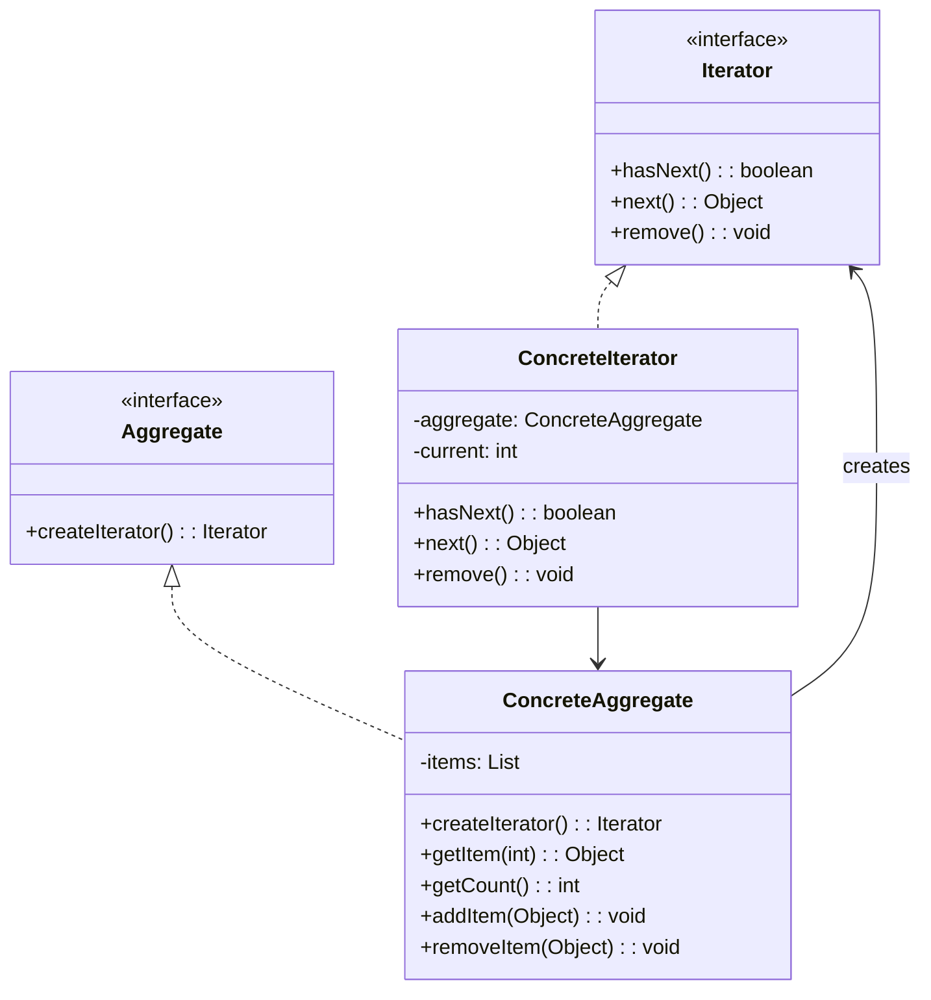
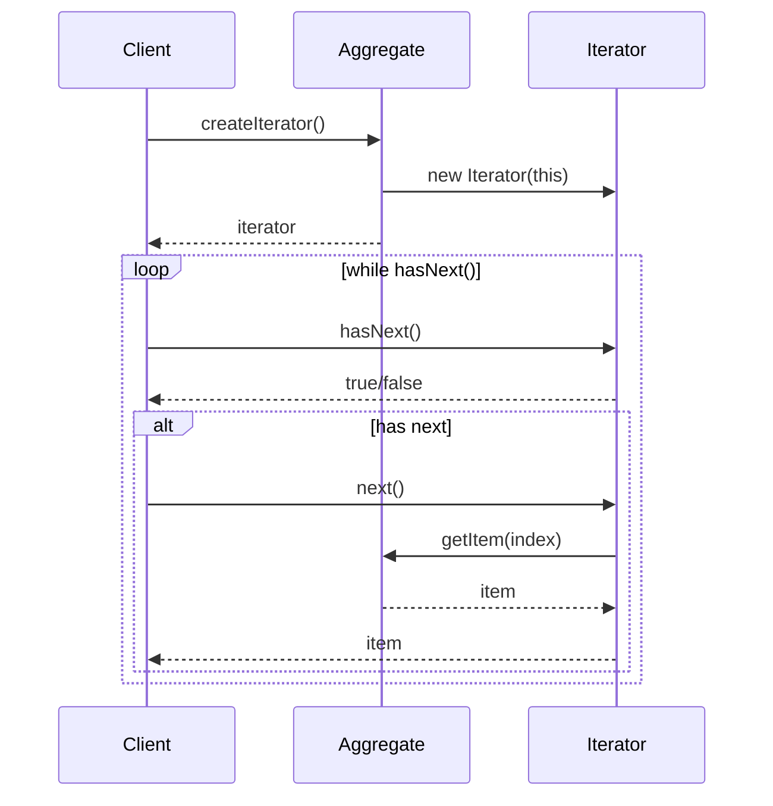

# 迭代器模式 (Iterator Pattern)

## 📋 模式概述

### 定义
迭代器模式提供一种方法顺序访问一个聚合对象中各个元素，而又不需暴露该对象的内部表示。

### 意图
- 提供一种方法来访问聚合对象，而不用暴露这个对象的内部表示
- 支持对聚合对象的多种遍历
- 为遍历不同的聚合结构提供一个统一的接口

## 🏗️ 结构图



## ⏱️ 时序图



## 💻 代码实现

### 基础实现

```java
/**
 * 迭代器接口
 */
public interface Iterator<T> {
    boolean hasNext();
    T next();
    void remove();
}

/**
 * 聚合接口
 */
public interface Aggregate<T> {
    Iterator<T> createIterator();
}

/**
 * 具体聚合类 - 书籍集合
 */
public class BookCollection implements Aggregate<Book> {
    private List<Book> books;
    
    public BookCollection() {
        this.books = new ArrayList<>();
    }
    
    public void addBook(Book book) {
        books.add(book);
    }
    
    public void removeBook(Book book) {
        books.remove(book);
    }
    
    public Book getBook(int index) {
        return books.get(index);
    }
    
    public int getCount() {
        return books.size();
    }
    
    @Override
    public Iterator<Book> createIterator() {
        return new BookIterator(this);
    }
    
    // 内部迭代器类
    private class BookIterator implements Iterator<Book> {
        private BookCollection collection;
        private int current = 0;
        
        public BookIterator(BookCollection collection) {
            this.collection = collection;
        }
        
        @Override
        public boolean hasNext() {
            return current < collection.getCount();
        }
        
        @Override
        public Book next() {
            if (!hasNext()) {
                throw new NoSuchElementException("没有更多元素");
            }
            return collection.getBook(current++);
        }
        
        @Override
        public void remove() {
            if (current <= 0) {
                throw new IllegalStateException("无法删除元素");
            }
            collection.books.remove(--current);
        }
    }
}

/**
 * 书籍类
 */
public class Book {
    private String title;
    private String author;
    private String isbn;
    
    public Book(String title, String author, String isbn) {
        this.title = title;
        this.author = author;
        this.isbn = isbn;
    }
    
    // getters
    public String getTitle() { return title; }
    public String getAuthor() { return author; }
    public String getIsbn() { return isbn; }
    
    @Override
    public String toString() {
        return String.format("Book{title='%s', author='%s', isbn='%s'}", 
                           title, author, isbn);
    }
}

// 使用示例
public class IteratorDemo {
    public static void main(String[] args) {
        // 创建书籍集合
        BookCollection library = new BookCollection();
        library.addBook(new Book("设计模式", "GoF", "978-0201633610"));
        library.addBook(new Book("重构", "Martin Fowler", "978-0201485677"));
        library.addBook(new Book("代码整洁之道", "Robert Martin", "978-0132350884"));
        
        // 使用迭代器遍历
        System.out.println("=== 遍历图书馆藏书 ===");
        Iterator<Book> iterator = library.createIterator();
        while (iterator.hasNext()) {
            Book book = iterator.next();
            System.out.println(book);
        }
        
        // 使用迭代器删除元素
        System.out.println("\n=== 删除第二本书 ===");
        iterator = library.createIterator();
        iterator.next(); // 跳过第一本
        iterator.next(); // 到第二本
        iterator.remove(); // 删除第二本
        
        System.out.println("删除后的藏书:");
        iterator = library.createIterator();
        while (iterator.hasNext()) {
            System.out.println(iterator.next());
        }
    }
}
```

## 🧪 实际应用示例

### 1. 多种遍历方式的数据结构

```java
/**
 * 二维数组聚合类
 */
public class Matrix implements Aggregate<Integer> {
    private int[][] data;
    private int rows;
    private int cols;
    
    public Matrix(int rows, int cols) {
        this.rows = rows;
        this.cols = cols;
        this.data = new int[rows][cols];
        
        // 初始化数据
        int value = 1;
        for (int i = 0; i < rows; i++) {
            for (int j = 0; j < cols; j++) {
                data[i][j] = value++;
            }
        }
    }
    
    public int get(int row, int col) {
        return data[row][col];
    }
    
    public int getRows() { return rows; }
    public int getCols() { return cols; }
    
    @Override
    public Iterator<Integer> createIterator() {
        return new RowMajorIterator();
    }
    
    // 按行遍历的迭代器
    public Iterator<Integer> createRowMajorIterator() {
        return new RowMajorIterator();
    }
    
    // 按列遍历的迭代器
    public Iterator<Integer> createColumnMajorIterator() {
        return new ColumnMajorIterator();
    }
    
    // 对角线遍历的迭代器
    public Iterator<Integer> createDiagonalIterator() {
        return new DiagonalIterator();
    }
    
    /**
     * 按行遍历迭代器
     */
    private class RowMajorIterator implements Iterator<Integer> {
        private int currentRow = 0;
        private int currentCol = 0;
        
        @Override
        public boolean hasNext() {
            return currentRow < rows;
        }
        
        @Override
        public Integer next() {
            if (!hasNext()) {
                throw new NoSuchElementException();
            }
            
            int value = data[currentRow][currentCol];
            currentCol++;
            if (currentCol >= cols) {
                currentCol = 0;
                currentRow++;
            }
            return value;
        }
        
        @Override
        public void remove() {
            throw new UnsupportedOperationException("Matrix不支持删除操作");
        }
    }
    
    /**
     * 按列遍历迭代器
     */
    private class ColumnMajorIterator implements Iterator<Integer> {
        private int currentRow = 0;
        private int currentCol = 0;
        
        @Override
        public boolean hasNext() {
            return currentCol < cols;
        }
        
        @Override
        public Integer next() {
            if (!hasNext()) {
                throw new NoSuchElementException();
            }
            
            int value = data[currentRow][currentCol];
            currentRow++;
            if (currentRow >= rows) {
                currentRow = 0;
                currentCol++;
            }
            return value;
        }
        
        @Override
        public void remove() {
            throw new UnsupportedOperationException("Matrix不支持删除操作");
        }
    }
    
    /**
     * 对角线遍历迭代器
     */
    private class DiagonalIterator implements Iterator<Integer> {
        private int current = 0;
        private int maxDiagonal;
        
        public DiagonalIterator() {
            this.maxDiagonal = Math.min(rows, cols);
        }
        
        @Override
        public boolean hasNext() {
            return current < maxDiagonal;
        }
        
        @Override
        public Integer next() {
            if (!hasNext()) {
                throw new NoSuchElementException();
            }
            
            int value = data[current][current];
            current++;
            return value;
        }
        
        @Override
        public void remove() {
            throw new UnsupportedOperationException("Matrix不支持删除操作");
        }
    }
    
    public void printMatrix() {
        System.out.println("矩阵内容:");
        for (int i = 0; i < rows; i++) {
            for (int j = 0; j < cols; j++) {
                System.out.printf("%3d ", data[i][j]);
            }
            System.out.println();
        }
    }
}

// 使用示例
public class MatrixIteratorDemo {
    public static void main(String[] args) {
        Matrix matrix = new Matrix(3, 4);
        matrix.printMatrix();
        
        System.out.println("\n=== 按行遍历 ===");
        Iterator<Integer> rowIterator = matrix.createRowMajorIterator();
        while (rowIterator.hasNext()) {
            System.out.print(rowIterator.next() + " ");
        }
        
        System.out.println("\n\n=== 按列遍历 ===");
        Iterator<Integer> colIterator = matrix.createColumnMajorIterator();
        while (colIterator.hasNext()) {
            System.out.print(colIterator.next() + " ");
        }
        
        System.out.println("\n\n=== 对角线遍历 ===");
        Iterator<Integer> diagIterator = matrix.createDiagonalIterator();
        while (diagIterator.hasNext()) {
            System.out.print(diagIterator.next() + " ");
        }
        System.out.println();
    }
}
```

### 2. 文件系统遍历器

```java
/**
 * 文件节点
 */
public abstract class FileNode {
    protected String name;
    protected FileNode parent;
    
    public FileNode(String name) {
        this.name = name;
    }
    
    public String getName() { return name; }
    public FileNode getParent() { return parent; }
    public void setParent(FileNode parent) { this.parent = parent; }
    
    public abstract boolean isDirectory();
    public abstract long getSize();
}

/**
 * 文件类
 */
public class File extends FileNode {
    private long size;
    
    public File(String name, long size) {
        super(name);
        this.size = size;
    }
    
    @Override
    public boolean isDirectory() {
        return false;
    }
    
    @Override
    public long getSize() {
        return size;
    }
    
    @Override
    public String toString() {
        return String.format("File{name='%s', size=%d}", name, size);
    }
}

/**
 * 目录类
 */
public class Directory extends FileNode implements Aggregate<FileNode> {
    private List<FileNode> children;
    
    public Directory(String name) {
        super(name);
        this.children = new ArrayList<>();
    }
    
    public void addChild(FileNode child) {
        children.add(child);
        child.setParent(this);
    }
    
    public void removeChild(FileNode child) {
        children.remove(child);
        child.setParent(null);
    }
    
    public List<FileNode> getChildren() {
        return new ArrayList<>(children);
    }
    
    @Override
    public boolean isDirectory() {
        return true;
    }
    
    @Override
    public long getSize() {
        return children.stream()
                      .mapToLong(FileNode::getSize)
                      .sum();
    }
    
    @Override
    public Iterator<FileNode> createIterator() {
        return new DepthFirstIterator();
    }
    
    // 深度优先遍历迭代器
    public Iterator<FileNode> createDepthFirstIterator() {
        return new DepthFirstIterator();
    }
    
    // 广度优先遍历迭代器
    public Iterator<FileNode> createBreadthFirstIterator() {
        return new BreadthFirstIterator();
    }
    
    // 只遍历文件的迭代器
    public Iterator<FileNode> createFileOnlyIterator() {
        return new FileOnlyIterator();
    }
    
    /**
     * 深度优先遍历迭代器
     */
    private class DepthFirstIterator implements Iterator<FileNode> {
        private Stack<FileNode> stack;
        
        public DepthFirstIterator() {
            stack = new Stack<>();
            stack.push(Directory.this);
        }
        
        @Override
        public boolean hasNext() {
            return !stack.isEmpty();
        }
        
        @Override
        public FileNode next() {
            if (!hasNext()) {
                throw new NoSuchElementException();
            }
            
            FileNode current = stack.pop();
            
            // 如果是目录，将其子节点压入栈（逆序压入以保持正确的遍历顺序）
            if (current.isDirectory() && current != Directory.this) {
                Directory dir = (Directory) current;
                List<FileNode> children = dir.getChildren();
                for (int i = children.size() - 1; i >= 0; i--) {
                    stack.push(children.get(i));
                }
            } else if (current == Directory.this) {
                // 根目录的子节点
                for (int i = children.size() - 1; i >= 0; i--) {
                    stack.push(children.get(i));
                }
            }
            
            return current;
        }
        
        @Override
        public void remove() {
            throw new UnsupportedOperationException("不支持删除操作");
        }
    }
    
    /**
     * 广度优先遍历迭代器
     */
    private class BreadthFirstIterator implements Iterator<FileNode> {
        private Queue<FileNode> queue;
        
        public BreadthFirstIterator() {
            queue = new LinkedList<>();
            queue.offer(Directory.this);
        }
        
        @Override
        public boolean hasNext() {
            return !queue.isEmpty();
        }
        
        @Override
        public FileNode next() {
            if (!hasNext()) {
                throw new NoSuchElementException();
            }
            
            FileNode current = queue.poll();
            
            // 如果是目录，将其子节点加入队列
            if (current.isDirectory()) {
                Directory dir = (Directory) current;
                queue.addAll(dir.getChildren());
            }
            
            return current;
        }
        
        @Override
        public void remove() {
            throw new UnsupportedOperationException("不支持删除操作");
        }
    }
    
    /**
     * 只遍历文件的迭代器
     */
    private class FileOnlyIterator implements Iterator<FileNode> {
        private Iterator<FileNode> baseIterator;
        private FileNode nextFile;
        
        public FileOnlyIterator() {
            this.baseIterator = new DepthFirstIterator();
            findNextFile();
        }
        
        private void findNextFile() {
            nextFile = null;
            while (baseIterator.hasNext()) {
                FileNode node = baseIterator.next();
                if (!node.isDirectory()) {
                    nextFile = node;
                    break;
                }
            }
        }
        
        @Override
        public boolean hasNext() {
            return nextFile != null;
        }
        
        @Override
        public FileNode next() {
            if (!hasNext()) {
                throw new NoSuchElementException();
            }
            
            FileNode result = nextFile;
            findNextFile();
            return result;
        }
        
        @Override
        public void remove() {
            throw new UnsupportedOperationException("不支持删除操作");
        }
    }
    
    @Override
    public String toString() {
        return String.format("Directory{name='%s', children=%d, size=%d}", 
                           name, children.size(), getSize());
    }
}

// 使用示例
public class FileSystemIteratorDemo {
    public static void main(String[] args) {
        // 构建文件系统结构
        Directory root = new Directory("root");
        
        Directory documents = new Directory("documents");
        documents.addChild(new File("resume.pdf", 1024));
        documents.addChild(new File("report.docx", 2048));
        
        Directory photos = new Directory("photos");
        photos.addChild(new File("vacation.jpg", 5120));
        photos.addChild(new File("family.png", 3072));
        
        Directory work = new Directory("work");
        work.addChild(new File("project.zip", 10240));
        work.addChild(documents);
        
        root.addChild(photos);
        root.addChild(work);
        root.addChild(new File("readme.txt", 512));
        
        System.out.println("=== 深度优先遍历 ===");
        Iterator<FileNode> dfsIterator = root.createDepthFirstIterator();
        while (dfsIterator.hasNext()) {
            FileNode node = dfsIterator.next();
            String indent = "  ".repeat(getDepth(node));
            System.out.println(indent + node);
        }
        
        System.out.println("\n=== 广度优先遍历 ===");
        Iterator<FileNode> bfsIterator = root.createBreadthFirstIterator();
        while (bfsIterator.hasNext()) {
            FileNode node = bfsIterator.next();
            System.out.println(node);
        }
        
        System.out.println("\n=== 只遍历文件 ===");
        Iterator<FileNode> fileIterator = root.createFileOnlyIterator();
        while (fileIterator.hasNext()) {
            FileNode file = fileIterator.next();
            System.out.println(file);
        }
    }
    
    private static int getDepth(FileNode node) {
        int depth = 0;
        FileNode current = node.getParent();
        while (current != null) {
            depth++;
            current = current.getParent();
        }
        return depth;
    }
}
```

## 🎯 适用场景

### 何时使用迭代器模式

1. **访问聚合对象的内容而无需暴露内部表示**
2. **支持对聚合对象的多种遍历**
3. **为遍历不同的聚合结构提供统一的接口**
4. **需要提供多种遍历方式**

### 实际应用场景

- **集合框架** - Java的Collection框架
- **数据库结果集** - ResultSet的遍历
- **文件系统** - 目录和文件的遍历
- **树形结构** - 各种树的遍历算法
- **图形界面** - 组件的遍历
- **配置文件** - 配置项的遍历

## ✅ 优点

1. **简化聚合类** - 聚合类不需要提供各种遍历方法
2. **支持多种遍历** - 可以为同一个聚合提供多种遍历方式
3. **封装性好** - 迭代器封装了遍历算法
4. **一致的接口** - 为不同的聚合结构提供统一的遍历接口

## ❌ 缺点

1. **增加系统复杂性** - 需要额外的迭代器类
2. **效率问题** - 对于简单的遍历，直接访问可能更高效
3. **内存开销** - 每个迭代器都需要维护遍历状态

## 🔄 模式关系

### 与其他模式的关系

- **与组合模式** - 经常一起使用来遍历组合结构
- **与工厂方法模式** - 可以用工厂方法创建不同类型的迭代器
- **与备忘录模式** - 迭代器可以使用备忘录来保存遍历状态

## 💡 最佳实践

### 设计建议

1. **实现fail-fast机制** - 在遍历过程中检测集合的修改
2. **支持并发访问** - 考虑多线程环境下的安全性
3. **提供多种迭代器** - 为不同的遍历需求提供专门的迭代器
4. **合理的异常处理** - 对边界条件进行适当的异常处理

### 实现技巧

```java
// 1. Fail-fast机制
public class SafeIterator<T> implements Iterator<T> {
    private List<T> list;
    private int expectedModCount;
    private int cursor = 0;
    
    public SafeIterator(List<T> list, int modCount) {
        this.list = list;
        this.expectedModCount = modCount;
    }
    
    @Override
    public boolean hasNext() {
        checkForModification();
        return cursor < list.size();
    }
    
    @Override
    public T next() {
        checkForModification();
        if (!hasNext()) {
            throw new NoSuchElementException();
        }
        return list.get(cursor++);
    }
    
    private void checkForModification() {
        if (expectedModCount != list.getModCount()) {
            throw new ConcurrentModificationException();
        }
    }
}

// 2. 支持过滤的迭代器
public class FilterIterator<T> implements Iterator<T> {
    private Iterator<T> baseIterator;
    private Predicate<T> filter;
    private T nextItem;
    private boolean hasNextItem = false;
    
    public FilterIterator(Iterator<T> baseIterator, Predicate<T> filter) {
        this.baseIterator = baseIterator;
        this.filter = filter;
        findNext();
    }
    
    private void findNext() {
        hasNextItem = false;
        while (baseIterator.hasNext()) {
            T item = baseIterator.next();
            if (filter.test(item)) {
                nextItem = item;
                hasNextItem = true;
                break;
            }
        }
    }
    
    @Override
    public boolean hasNext() {
        return hasNextItem;
    }
    
    @Override
    public T next() {
        if (!hasNext()) {
            throw new NoSuchElementException();
        }
        T result = nextItem;
        findNext();
        return result;
    }
}
```

## ⚠️ 注意事项

1. **并发修改** - 注意在遍历过程中集合被修改的情况
2. **内存泄漏** - 确保迭代器不会持有不必要的引用
3. **性能考虑** - 对于大型数据结构，考虑懒加载和缓存策略
4. **线程安全** - 在多线程环境中使用时要考虑同步问题

---

迭代器模式是一个非常基础且重要的设计模式，它为访问聚合对象提供了统一的接口，同时保持了良好的封装性。在现代编程语言中，迭代器模式已经成为标准库的重要组成部分。