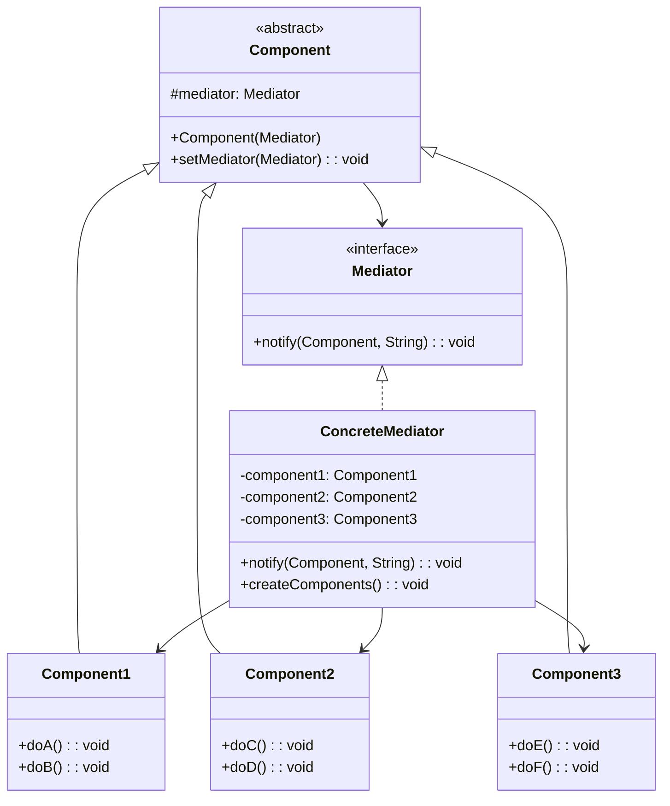
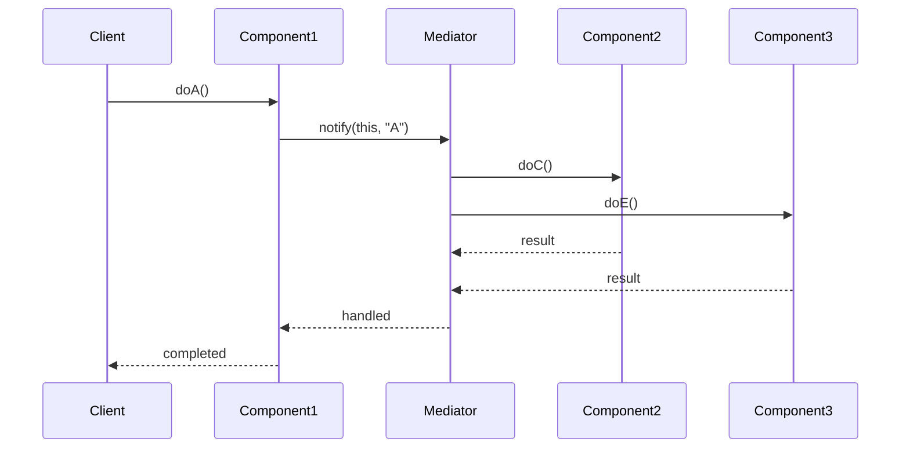

# 中介者模式 (Mediator Pattern)

## 📋 模式概述

### 定义
中介者模式定义了一个中介对象来封装一系列对象之间的交互。中介者使各对象不需要显式地相互引用，从而使其耦合松散，而且可以独立地改变它们之间的交互。

### 意图
- 减少对象间的直接通信，降低耦合度
- 将多对多的关系转化为一对多的关系
- 集中控制对象间的交互逻辑
- 提高系统的可维护性和可扩展性

## 🏗️ 结构图



## ⏱️ 时序图



## 💻 代码实现

### 基础实现

```java
/**
 * 中介者接口
 */
public interface Mediator {
    void notify(Component sender, String event);
}

/**
 * 抽象组件类
 */
public abstract class Component {
    protected Mediator mediator;
    
    public Component(Mediator mediator) {
        this.mediator = mediator;
    }
    
    public void setMediator(Mediator mediator) {
        this.mediator = mediator;
    }
}

/**
 * 具体组件A
 */
public class ComponentA extends Component {
    
    public ComponentA(Mediator mediator) {
        super(mediator);
    }
    
    public void doA() {
        System.out.println("ComponentA: 执行操作A");
        mediator.notify(this, "A");
    }
    
    public void doB() {
        System.out.println("ComponentA: 执行操作B");
        mediator.notify(this, "B");
    }
}

/**
 * 具体组件B
 */
public class ComponentB extends Component {
    
    public ComponentB(Mediator mediator) {
        super(mediator);
    }
    
    public void doC() {
        System.out.println("ComponentB: 执行操作C");
        mediator.notify(this, "C");
    }
    
    public void doD() {
        System.out.println("ComponentB: 执行操作D");
        mediator.notify(this, "D");
    }
}

/**
 * 具体中介者
 */
public class ConcreteMediator implements Mediator {
    private ComponentA componentA;
    private ComponentB componentB;
    
    public ConcreteMediator() {
        this.componentA = new ComponentA(this);
        this.componentB = new ComponentB(this);
    }
    
    @Override
    public void notify(Component sender, String event) {
        System.out.println("Mediator: 处理事件 " + event + " 来自 " + sender.getClass().getSimpleName());
        
        if (sender == componentA) {
            handleComponentAEvent(event);
        } else if (sender == componentB) {
            handleComponentBEvent(event);
        }
    }
    
    private void handleComponentAEvent(String event) {
        switch (event) {
            case "A":
                System.out.println("Mediator: A事件触发，通知ComponentB执行C操作");
                componentB.doC();
                break;
            case "B":
                System.out.println("Mediator: B事件触发，通知ComponentB执行D操作");
                componentB.doD();
                break;
        }
    }
    
    private void handleComponentBEvent(String event) {
        switch (event) {
            case "C":
                System.out.println("Mediator: C事件触发，通知ComponentA执行B操作");
                componentA.doB();
                break;
            case "D":
                System.out.println("Mediator: D事件触发，无需其他操作");
                break;
        }
    }
    
    public ComponentA getComponentA() { return componentA; }
    public ComponentB getComponentB() { return componentB; }
}

// 使用示例
public class MediatorDemo {
    public static void main(String[] args) {
        ConcreteMediator mediator = new ConcreteMediator();
        
        System.out.println("=== 测试ComponentA的操作 ===");
        mediator.getComponentA().doA();
        
        System.out.println("\n=== 测试ComponentB的操作 ===");
        mediator.getComponentB().doC();
    }
}
```

## 🧪 实际应用示例

### 1. 聊天室系统

```java
/**
 * 聊天室中介者接口
 */
public interface ChatMediator {
    void sendMessage(String message, User user);
    void addUser(User user);
    void removeUser(User user);
}

/**
 * 抽象用户类
 */
public abstract class User {
    protected ChatMediator mediator;
    protected String name;
    
    public User(ChatMediator mediator, String name) {
        this.mediator = mediator;
        this.name = name;
    }
    
    public abstract void send(String message);
    public abstract void receive(String message);
    
    public String getName() {
        return name;
    }
}

/**
 * 具体用户类
 */
public class ConcreteUser extends User {
    
    public ConcreteUser(ChatMediator mediator, String name) {
        super(mediator, name);
    }
    
    @Override
    public void send(String message) {
        System.out.println(name + " 发送消息: " + message);
        mediator.sendMessage(message, this);
    }
    
    @Override
    public void receive(String message) {
        System.out.println(name + " 收到消息: " + message);
    }
}

/**
 * 聊天室实现
 */
public class ChatRoom implements ChatMediator {
    private List<User> users;
    
    public ChatRoom() {
        this.users = new ArrayList<>();
    }
    
    @Override
    public void addUser(User user) {
        users.add(user);
        System.out.println(user.getName() + " 加入了聊天室");
        
        // 通知其他用户
        String joinMessage = user.getName() + " 加入了聊天室";
        for (User u : users) {
            if (u != user) {
                u.receive("系统消息: " + joinMessage);
            }
        }
    }
    
    @Override
    public void removeUser(User user) {
        users.remove(user);
        System.out.println(user.getName() + " 离开了聊天室");
        
        // 通知其他用户
        String leaveMessage = user.getName() + " 离开了聊天室";
        for (User u : users) {
            u.receive("系统消息: " + leaveMessage);
        }
    }
    
    @Override
    public void sendMessage(String message, User sender) {
        for (User user : users) {
            if (user != sender) {
                user.receive(sender.getName() + ": " + message);
            }
        }
    }
    
    public void sendPrivateMessage(String message, User sender, String receiverName) {
        User receiver = users.stream()
                           .filter(u -> u.getName().equals(receiverName))
                           .findFirst()
                           .orElse(null);
        
        if (receiver != null) {
            receiver.receive("私聊来自 " + sender.getName() + ": " + message);
            System.out.println(sender.getName() + " 向 " + receiverName + " 发送私聊: " + message);
        } else {
            sender.receive("系统消息: 用户 " + receiverName + " 不存在");
        }
    }
    
    public void broadcastSystemMessage(String message) {
        System.out.println("系统广播: " + message);
        for (User user : users) {
            user.receive("系统广播: " + message);
        }
    }
    
    public List<String> getOnlineUsers() {
        return users.stream()
                   .map(User::getName)
                   .collect(Collectors.toList());
    }
}

// 使用示例
public class ChatRoomDemo {
    public static void main(String[] args) {
        ChatRoom chatRoom = new ChatRoom();
        
        // 创建用户
        User alice = new ConcreteUser(chatRoom, "Alice");
        User bob = new ConcreteUser(chatRoom, "Bob");
        User charlie = new ConcreteUser(chatRoom, "Charlie");
        
        // 用户加入聊天室
        chatRoom.addUser(alice);
        chatRoom.addUser(bob);
        chatRoom.addUser(charlie);
        
        System.out.println("\n=== 群聊消息 ===");
        alice.send("大家好！");
        bob.send("你好，Alice！");
        charlie.send("欢迎大家！");
        
        System.out.println("\n=== 私聊消息 ===");
        chatRoom.sendPrivateMessage("你好吗？", alice, "Bob");
        chatRoom.sendPrivateMessage("我很好，谢谢！", bob, "Alice");
        
        System.out.println("\n=== 系统广播 ===");
        chatRoom.broadcastSystemMessage("聊天室将在5分钟后维护");
        
        System.out.println("\n=== 用户离开 ===");
        chatRoom.removeUser(charlie);
        
        System.out.println("\n=== 在线用户列表 ===");
        System.out.println("当前在线用户: " + chatRoom.getOnlineUsers());
    }
}
```

### 2. 智能家居控制系统

```java
/**
 * 智能家居中介者接口
 */
public interface SmartHomeMediator {
    void notify(SmartDevice device, String event, Object data);
    void registerDevice(SmartDevice device);
    void unregisterDevice(SmartDevice device);
}

/**
 * 智能设备抽象类
 */
public abstract class SmartDevice {
    protected SmartHomeMediator mediator;
    protected String deviceId;
    protected String deviceName;
    protected boolean isOn;
    
    public SmartDevice(String deviceId, String deviceName) {
        this.deviceId = deviceId;
        this.deviceName = deviceName;
        this.isOn = false;
    }
    
    public void setMediator(SmartHomeMediator mediator) {
        this.mediator = mediator;
    }
    
    public void turnOn() {
        isOn = true;
        System.out.println(deviceName + " 已开启");
        if (mediator != null) {
            mediator.notify(this, "TURNED_ON", null);
        }
    }
    
    public void turnOff() {
        isOn = false;
        System.out.println(deviceName + " 已关闭");
        if (mediator != null) {
            mediator.notify(this, "TURNED_OFF", null);
        }
    }
    
    public abstract void handleEvent(String event, Object data);
    
    // Getters
    public String getDeviceId() { return deviceId; }
    public String getDeviceName() { return deviceName; }
    public boolean isOn() { return isOn; }
}

/**
 * 智能灯泡
 */
public class SmartLight extends SmartDevice {
    private int brightness = 100; // 亮度 0-100
    
    public SmartLight(String deviceId, String deviceName) {
        super(deviceId, deviceName);
    }
    
    public void setBrightness(int brightness) {
        this.brightness = Math.max(0, Math.min(100, brightness));
        System.out.println(deviceName + " 亮度设置为: " + this.brightness + "%");
        if (mediator != null) {
            mediator.notify(this, "BRIGHTNESS_CHANGED", this.brightness);
        }
    }
    
    @Override
    public void handleEvent(String event, Object data) {
        switch (event) {
            case "MOTION_DETECTED":
                if (!isOn) {
                    turnOn();
                }
                break;
            case "NO_MOTION":
                if (isOn) {
                    turnOff();
                }
                break;
            case "NIGHT_MODE":
                setBrightness(20);
                break;
            case "DAY_MODE":
                setBrightness(100);
                break;
        }
    }
    
    public int getBrightness() { return brightness; }
}

/**
 * 智能空调
 */
public class SmartAirConditioner extends SmartDevice {
    private int temperature = 25; // 温度
    
    public SmartAirConditioner(String deviceId, String deviceName) {
        super(deviceId, deviceName);
    }
    
    public void setTemperature(int temperature) {
        this.temperature = temperature;
        System.out.println(deviceName + " 温度设置为: " + temperature + "°C");
        if (mediator != null) {
            mediator.notify(this, "TEMPERATURE_CHANGED", temperature);
        }
    }
    
    @Override
    public void handleEvent(String event, Object data) {
        switch (event) {
            case "HIGH_TEMPERATURE":
                if (!isOn) {
                    turnOn();
                    setTemperature(22);
                }
                break;
            case "LOW_TEMPERATURE":
                if (isOn) {
                    setTemperature(26);
                }
                break;
            case "NOBODY_HOME":
                turnOff();
                break;
            case "SOMEONE_HOME":
                turnOn();
                break;
        }
    }
    
    public int getTemperature() { return temperature; }
}

/**
 * 智能门锁
 */
public class SmartDoorLock extends SmartDevice {
    private boolean isLocked = true;
    
    public SmartDoorLock(String deviceId, String deviceName) {
        super(deviceId, deviceName);
    }
    
    public void lock() {
        isLocked = true;
        System.out.println(deviceName + " 已上锁");
        if (mediator != null) {
            mediator.notify(this, "DOOR_LOCKED", null);
        }
    }
    
    public void unlock() {
        isLocked = false;
        System.out.println(deviceName + " 已解锁");
        if (mediator != null) {
            mediator.notify(this, "DOOR_UNLOCKED", null);
        }
    }
    
    @Override
    public void handleEvent(String event, Object data) {
        switch (event) {
            case "OWNER_APPROACHING":
                unlock();
                break;
            case "OWNER_LEAVING":
                lock();
                break;
            case "SECURITY_ALERT":
                lock();
                break;
        }
    }
    
    public boolean isLocked() { return isLocked; }
}

/**
 * 运动传感器
 */
public class MotionSensor extends SmartDevice {
    
    public MotionSensor(String deviceId, String deviceName) {
        super(deviceId, deviceName);
    }
    
    public void detectMotion() {
        System.out.println(deviceName + " 检测到运动");
        if (mediator != null) {
            mediator.notify(this, "MOTION_DETECTED", null);
        }
    }
    
    public void noMotionDetected() {
        System.out.println(deviceName + " 未检测到运动");
        if (mediator != null) {
            mediator.notify(this, "NO_MOTION", null);
        }
    }
    
    @Override
    public void handleEvent(String event, Object data) {
        // 传感器通常不需要处理其他设备的事件
    }
}

/**
 * 智能家居控制中心
 */
public class SmartHomeController implements SmartHomeMediator {
    private Map<String, SmartDevice> devices;
    private boolean isNightMode = false;
    private boolean isAwayMode = false;
    
    public SmartHomeController() {
        this.devices = new HashMap<>();
    }
    
    @Override
    public void registerDevice(SmartDevice device) {
        devices.put(device.getDeviceId(), device);
        device.setMediator(this);
        System.out.println("设备已注册: " + device.getDeviceName());
    }
    
    @Override
    public void unregisterDevice(SmartDevice device) {
        devices.remove(device.getDeviceId());
        System.out.println("设备已注销: " + device.getDeviceName());
    }
    
    @Override
    public void notify(SmartDevice sender, String event, Object data) {
        System.out.println("控制中心收到事件: " + event + " 来自 " + sender.getDeviceName());
        
        switch (event) {
            case "MOTION_DETECTED":
                handleMotionDetected();
                break;
            case "NO_MOTION":
                handleNoMotion();
                break;
            case "DOOR_UNLOCKED":
                handleDoorUnlocked();
                break;
            case "DOOR_LOCKED":
                handleDoorLocked();
                break;
            case "TEMPERATURE_CHANGED":
                handleTemperatureChanged((Integer) data);
                break;
        }
    }
    
    private void handleMotionDetected() {
        // 通知所有灯光设备
        devices.values().stream()
               .filter(device -> device instanceof SmartLight)
               .forEach(device -> device.handleEvent("MOTION_DETECTED", null));
    }
    
    private void handleNoMotion() {
        if (isAwayMode) {
            // 离家模式下，无运动时关闭灯光
            devices.values().stream()
                   .filter(device -> device instanceof SmartLight)
                   .forEach(device -> device.handleEvent("NO_MOTION", null));
        }
    }
    
    private void handleDoorUnlocked() {
        isAwayMode = false;
        System.out.println("欢迎回家模式激活");
        
        // 通知所有设备主人回家了
        devices.values().forEach(device -> device.handleEvent("SOMEONE_HOME", null));
    }
    
    private void handleDoorLocked() {
        isAwayMode = true;
        System.out.println("离家模式激活");
        
        // 通知所有设备主人离开了
        devices.values().forEach(device -> device.handleEvent("NOBODY_HOME", null));
    }
    
    private void handleTemperatureChanged(int temperature) {
        // 根据温度调整其他设备
        if (temperature < 20) {
            devices.values().stream()
                   .filter(device -> device instanceof SmartLight)
                   .forEach(device -> device.handleEvent("LOW_TEMPERATURE", null));
        } else if (temperature > 28) {
            devices.values().stream()
                   .filter(device -> device instanceof SmartLight)
                   .forEach(device -> device.handleEvent("HIGH_TEMPERATURE", null));
        }
    }
    
    public void setNightMode(boolean nightMode) {
        this.isNightMode = nightMode;
        String mode = nightMode ? "NIGHT_MODE" : "DAY_MODE";
        System.out.println("设置为" + (nightMode ? "夜间" : "白天") + "模式");
        
        devices.values().forEach(device -> device.handleEvent(mode, null));
    }
    
    public void emergencyMode() {
        System.out.println("紧急模式激活！");
        
        // 所有灯光全亮
        devices.values().stream()
               .filter(device -> device instanceof SmartLight)
               .forEach(device -> {
                   device.turnOn();
                   ((SmartLight) device).setBrightness(100);
               });
        
        // 门锁上锁
        devices.values().stream()
               .filter(device -> device instanceof SmartDoorLock)
               .forEach(device -> device.handleEvent("SECURITY_ALERT", null));
    }
    
    public void showDeviceStatus() {
        System.out.println("\n=== 设备状态 ===");
        devices.values().forEach(device -> {
            System.out.println(device.getDeviceName() + ": " + 
                             (device.isOn() ? "开启" : "关闭"));
        });
    }
}

// 使用示例
public class SmartHomeDemo {
    public static void main(String[] args) {
        // 创建智能家居控制中心
        SmartHomeController controller = new SmartHomeController();
        
        // 创建智能设备
        SmartLight livingRoomLight = new SmartLight("light_001", "客厅灯");
        SmartLight bedroomLight = new SmartLight("light_002", "卧室灯");
        SmartAirConditioner airConditioner = new SmartAirConditioner("ac_001", "客厅空调");
        SmartDoorLock doorLock = new SmartDoorLock("lock_001", "前门锁");
        MotionSensor motionSensor = new MotionSensor("sensor_001", "客厅运动传感器");
        
        // 注册设备
        controller.registerDevice(livingRoomLight);
        controller.registerDevice(bedroomLight);
        controller.registerDevice(airConditioner);
        controller.registerDevice(doorLock);
        controller.registerDevice(motionSensor);
        
        System.out.println("\n=== 模拟场景：主人回家 ===");
        doorLock.unlock();
        
        System.out.println("\n=== 模拟场景：检测到运动 ===");
        motionSensor.detectMotion();
        
        System.out.println("\n=== 模拟场景：设置夜间模式 ===");
        controller.setNightMode(true);
        
        System.out.println("\n=== 模拟场景：主人离开 ===");
        doorLock.lock();
        
        System.out.println("\n=== 模拟场景：紧急情况 ===");
        controller.emergencyMode();
        
        controller.showDeviceStatus();
    }
}
```

## 🎯 适用场景

### 何时使用中介者模式

1. **一组对象以定义良好但复杂的方式进行通信**
2. **想要重用一个对象，但很难重用，因为它引用并与许多其他对象通信**
3. **想定制一个分布在多个类中的行为，而又不想生成太多的子类**

### 实际应用场景

- **GUI框架** - 对话框中各控件间的交互
- **聊天系统** - 用户间的消息传递
- **工作流系统** - 各个步骤间的协调
- **智能家居** - 设备间的联动控制
- **MVC架构** - Controller作为View和Model的中介者
- **消息队列** - 生产者和消费者间的解耦

## ✅ 优点

1. **减少类间依赖** - 将多对多关系转化为一对多关系
2. **集中控制交互** - 交互逻辑集中在中介者中
3. **提高可重用性** - 组件可以独立重用
4. **符合开闭原则** - 可以独立扩展中介者和组件

## ❌ 缺点

1. **中介者复杂化** - 中介者可能变得过于复杂
2. **单点故障** - 中介者成为系统的关键点
3. **性能开销** - 增加了一层间接调用

## 🔄 模式关系

### 与其他模式的关系

- **与外观模式** - 都提供了简化接口，但目的不同
- **与观察者模式** - 可以结合使用实现更复杂的通信
- **与命令模式** - 中介者可以使用命令来封装请求

## 💡 最佳实践

### 设计建议

1. **保持中介者简单** - 避免中介者变得过于复杂
2. **使用事件驱动** - 采用事件机制来解耦组件
3. **考虑性能** - 对于高频交互要优化性能
4. **提供扩展点** - 为新的交互类型预留扩展接口

### 实现技巧

```java
// 1. 使用事件总线实现中介者
public class EventBus implements SmartHomeMediator {
    private Map<String, List<Consumer<Object>>> listeners = new HashMap<>();
    
    public void subscribe(String event, Consumer<Object> listener) {
        listeners.computeIfAbsent(event, k -> new ArrayList<>()).add(listener);
    }
    
    public void publish(String event, Object data) {
        List<Consumer<Object>> eventListeners = listeners.get(event);
        if (eventListeners != null) {
            eventListeners.forEach(listener -> listener.accept(data));
        }
    }
}

// 2. 使用策略模式处理不同类型的事件
public class EventHandlerStrategy {
    private Map<String, EventHandler> handlers = new HashMap<>();
    
    public void registerHandler(String eventType, EventHandler handler) {
        handlers.put(eventType, handler);
    }
    
    public void handleEvent(String eventType, Object data) {
        EventHandler handler = handlers.get(eventType);
        if (handler != null) {
            handler.handle(data);
        }
    }
}
```

## ⚠️ 注意事项

1. **避免过度设计** - 不要为简单的交互引入中介者
2. **控制复杂度** - 监控中介者的复杂度增长
3. **性能考虑** - 对于性能敏感的场景要谨慎使用
4. **测试策略** - 确保中介者的逻辑得到充分测试

---

中介者模式是一个强大的解耦工具，它通过引入中介对象来管理对象间的复杂交互。虽然会增加系统的复杂性，但在处理复杂的对象关系时，它能显著提高系统的可维护性和可扩展性。