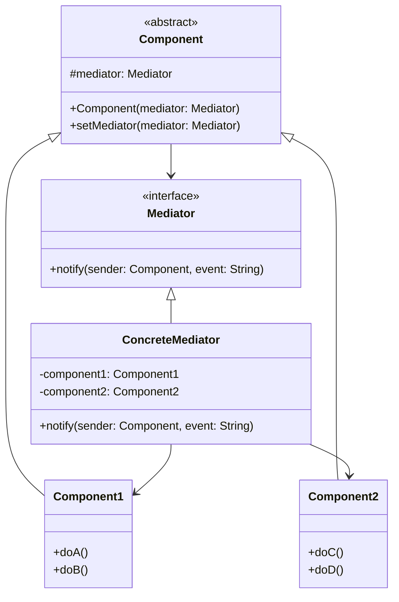
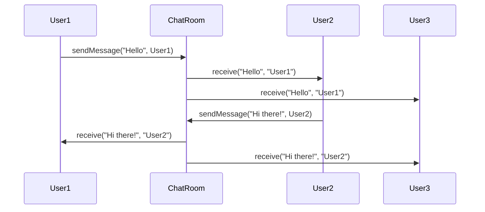

# 中介者模式 (Mediator Pattern) ⚠️ 低应用价值

> **⚠️ 注意：此模式在实际项目中应用价值较低**
> - 容易导致中介者类过于复杂和庞大
> - 违反单一职责原则
> - 现代架构模式提供更好的解耦方案
> - **代码已删除，仅保留文档作为学习参考**

## 📋 模式概述

### 定义
中介者模式定义了一个中介对象来封装一系列对象之间的交互。中介者使各对象不需要显式地相互引用，从而使其耦合松散，而且可以独立地改变它们之间的交互。

### 核心思想
- 对象间的交互通过中介者进行
- 减少对象间的直接依赖
- 集中控制交互逻辑
- 促进对象的重用

## 🎯 解决的问题

### 主要问题
1. **对象间复杂交互**：多个对象之间存在复杂的相互依赖
2. **紧耦合问题**：对象间直接引用导致系统难以维护
3. **交互逻辑分散**：交互逻辑散布在各个对象中
4. **难以重用**：对象因为相互依赖而难以独立重用

### 适用场景（有限）
- GUI组件间的交互
- 聊天室系统
- 工作流系统
- 复杂的业务规则协调

## 🏗️ 模式结构

### UML类图


## 💻 代码示例

### 基础实现（已删除源码）

```java
// 中介者接口
public interface ChatMediator {
    void sendMessage(String message, User user);
    void addUser(User user);
}

// 具体中介者
public class ChatRoom implements ChatMediator {
    private List<User> users = new ArrayList<>();
    
    @Override
    public void addUser(User user) {
        users.add(user);
    }
    
    @Override
    public void sendMessage(String message, User sender) {
        for (User user : users) {
            if (user != sender) {
                user.receive(message, sender.getName());
            }
        }
    }
}

// 抽象同事类
public abstract class User {
    protected ChatMediator mediator;
    protected String name;
    
    public User(ChatMediator mediator, String name) {
        this.mediator = mediator;
        this.name = name;
    }
    
    public abstract void send(String message);
    public abstract void receive(String message, String from);
    
    public String getName() {
        return name;
    }
}

// 具体同事类
public class ConcreteUser extends User {
    public ConcreteUser(ChatMediator mediator, String name) {
        super(mediator, name);
    }
    
    @Override
    public void send(String message) {
        System.out.println(name + " 发送消息: " + message);
        mediator.sendMessage(message, this);
    }
    
    @Override
    public void receive(String message, String from) {
        System.out.println(name + " 收到来自 " + from + " 的消息: " + message);
    }
}
```

## 🔄 时序图



## ⚡ 实际应用案例

### 案例1：GUI对话框（学术示例）
```java
// 对话框中介者
public class DialogMediator {
    private Button submitButton;
    private Button cancelButton;
    private TextField nameField;
    private TextField emailField;
    private CheckBox agreeCheckBox;
    
    public void notify(Component sender, String event) {
        if (sender == nameField || sender == emailField) {
            if ("textChanged".equals(event)) {
                validateForm();
            }
        } else if (sender == agreeCheckBox) {
            if ("stateChanged".equals(event)) {
                validateForm();
            }
        } else if (sender == submitButton) {
            if ("clicked".equals(event)) {
                submitForm();
            }
        }
    }
    
    private void validateForm() {
        boolean isValid = !nameField.getText().isEmpty() 
                         && !emailField.getText().isEmpty() 
                         && agreeCheckBox.isChecked();
        submitButton.setEnabled(isValid);
    }
    
    private void submitForm() {
        // 提交表单逻辑
    }
}
```

## ⚠️ 为什么应用价值低

### 主要问题
1. **中介者过于复杂**：所有交互逻辑集中在中介者中，导致其变得庞大
2. **违反单一职责**：中介者承担了过多的责任
3. **难以维护**：中介者成为系统的瓶颈
4. **现代替代方案更好**：
   - 事件总线（EventBus）
   - 观察者模式
   - 发布-订阅模式
   - 消息队列
   - 现代前端框架的状态管理

### 更好的替代方案

```java
// 使用事件总线替代中介者模式
public class EventBus {
    private Map<Class<?>, List<Object>> subscribers = new HashMap<>();
    
    public void register(Object subscriber) {
        // 注册订阅者
    }
    
    public void post(Object event) {
        // 发布事件
        Class<?> eventType = event.getClass();
        List<Object> eventSubscribers = subscribers.get(eventType);
        if (eventSubscribers != null) {
            for (Object subscriber : eventSubscribers) {
                // 通过反射调用处理方法
            }
        }
    }
}

// 使用观察者模式
public class UserService extends Observable {
    public void createUser(User user) {
        // 创建用户
        setChanged();
        notifyObservers(new UserCreatedEvent(user));
    }
}

// 使用Spring的事件机制
@Component
public class UserEventPublisher {
    @Autowired
    private ApplicationEventPublisher eventPublisher;
    
    public void createUser(User user) {
        // 创建用户
        eventPublisher.publishEvent(new UserCreatedEvent(user));
    }
}

@EventListener
public void handleUserCreated(UserCreatedEvent event) {
    // 处理用户创建事件
}
```

## 📊 优缺点分析

### 优点
- ✅ 减少对象间的耦合
- ✅ 集中控制交互逻辑
- ✅ 提高对象的可重用性

### 缺点（致命缺陷）
- ❌ 中介者可能变得过于复杂
- ❌ 违反单一职责原则
- ❌ 中介者成为系统瓶颈
- ❌ 现有解决方案更优雅

## 🎯 总结

中介者模式在现代软件开发中应用价值较低：

1. **理论价值**：有助于理解对象间解耦的概念
2. **实用价值**：有限，容易导致设计问题
3. **建议**：优先考虑其他解耦方案

**推荐替代方案**：
- 使用事件总线（Google Guava EventBus）
- 采用观察者模式
- 利用发布-订阅模式
- 使用消息队列（RabbitMQ、Kafka等）
- 采用现代框架的事件机制

> 💡 **学习建议**：理解其解耦思想，但在实际项目中选择更现代、更灵活的解决方案。