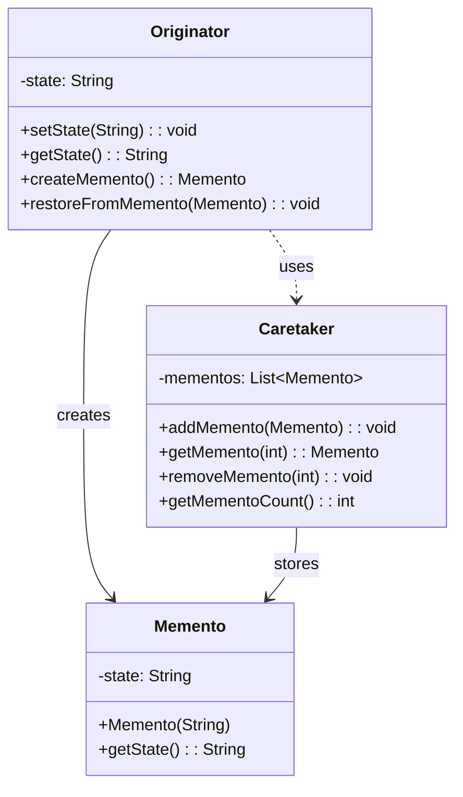
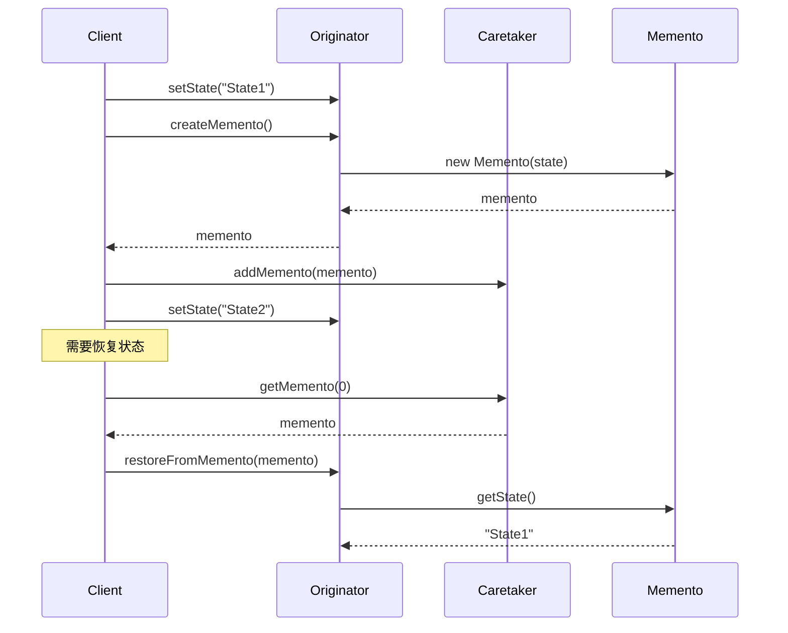

# 备忘录模式 (Memento Pattern)

## 📋 模式概述

### 定义
备忘录模式在不破坏封装性的前提下，捕获一个对象的内部状态，并在该对象之外保存这个状态。这样以后就可将该对象恢复到原先保存的状态。

### 意图
- 保存对象的内部状态，以便之后恢复
- 不破坏对象的封装性
- 提供撤销操作的实现机制
- 实现检查点和回滚功能

## 🏗️ 结构图



## ⏱️ 时序图



## 💻 代码实现

### 基础实现

```java
/**
 * 备忘录类 - 存储原发器的内部状态
 */
public class Memento {
    private final String state;
    private final long timestamp;
    
    public Memento(String state) {
        this.state = state;
        this.timestamp = System.currentTimeMillis();
    }
    
    public String getState() {
        return state;
    }
    
    public long getTimestamp() {
        return timestamp;
    }
    
    @Override
    public String toString() {
        return String.format("Memento{state='%s', timestamp=%d}", state, timestamp);
    }
}

/**
 * 原发器类 - 需要保存状态的对象
 */
public class Originator {
    private String state;
    
    public void setState(String state) {
        System.out.println("设置状态为: " + state);
        this.state = state;
    }
    
    public String getState() {
        return state;
    }
    
    /**
     * 创建备忘录
     */
    public Memento createMemento() {
        System.out.println("创建备忘录，保存状态: " + state);
        return new Memento(state);
    }
    
    /**
     * 从备忘录恢复状态
     */
    public void restoreFromMemento(Memento memento) {
        this.state = memento.getState();
        System.out.println("从备忘录恢复状态: " + state);
    }
}

/**
 * 管理者类 - 负责保存备忘录
 */
public class Caretaker {
    private List<Memento> mementos = new ArrayList<>();
    
    public void addMemento(Memento memento) {
        mementos.add(memento);
        System.out.println("保存备忘录: " + memento);
    }
    
    public Memento getMemento(int index) {
        if (index >= 0 && index < mementos.size()) {
            return mementos.get(index);
        }
        throw new IndexOutOfBoundsException("无效的备忘录索引: " + index);
    }
    
    public void removeMemento(int index) {
        if (index >= 0 && index < mementos.size()) {
            Memento removed = mementos.remove(index);
            System.out.println("删除备忘录: " + removed);
        }
    }
    
    public int getMementoCount() {
        return mementos.size();
    }
    
    public void showAllMementos() {
        System.out.println("所有备忘录:");
        for (int i = 0; i < mementos.size(); i++) {
            System.out.println("  [" + i + "] " + mementos.get(i));
        }
    }
}

// 使用示例
public class MementoDemo {
    public static void main(String[] args) {
        Originator originator = new Originator();
        Caretaker caretaker = new Caretaker();
        
        // 设置初始状态并保存
        originator.setState("状态1");
        caretaker.addMemento(originator.createMemento());
        
        // 修改状态并保存
        originator.setState("状态2");
        caretaker.addMemento(originator.createMemento());
        
        // 再次修改状态并保存
        originator.setState("状态3");
        caretaker.addMemento(originator.createMemento());
        
        System.out.println("\n当前状态: " + originator.getState());
        caretaker.showAllMementos();
        
        // 恢复到状态1
        System.out.println("\n恢复到状态1:");
        originator.restoreFromMemento(caretaker.getMemento(0));
        System.out.println("当前状态: " + originator.getState());
        
        // 恢复到状态2
        System.out.println("\n恢复到状态2:");
        originator.restoreFromMemento(caretaker.getMemento(1));
        System.out.println("当前状态: " + originator.getState());
    }
}
```

## 🧪 实际应用示例

### 1. 文本编辑器的撤销/重做功能

```java
/**
 * 文档备忘录
 */
public class DocumentMemento {
    private final String content;
    private final int cursorPosition;
    private final String operation;
    private final long timestamp;
    
    public DocumentMemento(String content, int cursorPosition, String operation) {
        this.content = content;
        this.cursorPosition = cursorPosition;
        this.operation = operation;
        this.timestamp = System.currentTimeMillis();
    }
    
    public String getContent() { return content; }
    public int getCursorPosition() { return cursorPosition; }
    public String getOperation() { return operation; }
    public long getTimestamp() { return timestamp; }
    
    @Override
    public String toString() {
        return String.format("DocumentMemento{operation='%s', content='%s', cursor=%d}", 
                           operation, content.substring(0, Math.min(20, content.length())) + "...", 
                           cursorPosition);
    }
}

/**
 * 文档编辑器
 */
public class TextEditor {
    private StringBuilder content;
    private int cursorPosition;
    
    public TextEditor() {
        this.content = new StringBuilder();
        this.cursorPosition = 0;
    }
    
    /**
     * 插入文本
     */
    public void insertText(String text) {
        content.insert(cursorPosition, text);
        cursorPosition += text.length();
        System.out.println("插入文本: \"" + text + "\" 在位置 " + (cursorPosition - text.length()));
    }
    
    /**
     * 删除文本
     */
    public void deleteText(int length) {
        if (cursorPosition >= length) {
            String deleted = content.substring(cursorPosition - length, cursorPosition);
            content.delete(cursorPosition - length, cursorPosition);
            cursorPosition -= length;
            System.out.println("删除文本: \"" + deleted + "\"");
        }
    }
    
    /**
     * 移动光标
     */
    public void moveCursor(int position) {
        if (position >= 0 && position <= content.length()) {
            this.cursorPosition = position;
            System.out.println("光标移动到位置: " + position);
        }
    }
    
    /**
     * 替换文本
     */
    public void replaceText(int start, int end, String newText) {
        if (start >= 0 && end <= content.length() && start <= end) {
            String oldText = content.substring(start, end);
            content.replace(start, end, newText);
            cursorPosition = start + newText.length();
            System.out.println("替换文本: \"" + oldText + "\" -> \"" + newText + "\"");
        }
    }
    
    /**
     * 创建备忘录
     */
    public DocumentMemento createMemento(String operation) {
        return new DocumentMemento(content.toString(), cursorPosition, operation);
    }
    
    /**
     * 从备忘录恢复
     */
    public void restoreFromMemento(DocumentMemento memento) {
        this.content = new StringBuilder(memento.getContent());
        this.cursorPosition = memento.getCursorPosition();
        System.out.println("恢复操作: " + memento.getOperation());
    }
    
    public String getContent() {
        return content.toString();
    }
    
    public int getCursorPosition() {
        return cursorPosition;
    }
    
    public void showDocument() {
        System.out.println("文档内容: \"" + content.toString() + "\"");
        System.out.println("光标位置: " + cursorPosition);
    }
}

/**
 * 撤销/重做管理器
 */
public class UndoRedoManager {
    private List<DocumentMemento> history;
    private int currentIndex;
    private static final int MAX_HISTORY_SIZE = 50;
    
    public UndoRedoManager() {
        this.history = new ArrayList<>();
        this.currentIndex = -1;
    }
    
    /**
     * 保存状态
     */
    public void saveState(DocumentMemento memento) {
        // 如果当前不在历史记录的末尾，删除后面的记录
        if (currentIndex < history.size() - 1) {
            history.subList(currentIndex + 1, history.size()).clear();
        }
        
        // 添加新的备忘录
        history.add(memento);
        currentIndex++;
        
        // 限制历史记录大小
        if (history.size() > MAX_HISTORY_SIZE) {
            history.remove(0);
            currentIndex--;
        }
        
        System.out.println("保存状态: " + memento.getOperation());
    }
    
    /**
     * 撤销操作
     */
    public DocumentMemento undo() {
        if (canUndo()) {
            currentIndex--;
            DocumentMemento memento = history.get(currentIndex);
            System.out.println("撤销操作: " + history.get(currentIndex + 1).getOperation());
            return memento;
        }
        System.out.println("无法撤销：已到达历史记录开始");
        return null;
    }
    
    /**
     * 重做操作
     */
    public DocumentMemento redo() {
        if (canRedo()) {
            currentIndex++;
            DocumentMemento memento = history.get(currentIndex);
            System.out.println("重做操作: " + memento.getOperation());
            return memento;
        }
        System.out.println("无法重做：已到达历史记录末尾");
        return null;
    }
    
    public boolean canUndo() {
        return currentIndex > 0;
    }
    
    public boolean canRedo() {
        return currentIndex < history.size() - 1;
    }
    
    public void showHistory() {
        System.out.println("\n=== 操作历史 ===");
        for (int i = 0; i < history.size(); i++) {
            String marker = (i == currentIndex) ? " -> " : "    ";
            System.out.println(marker + "[" + i + "] " + history.get(i).getOperation());
        }
        System.out.println("当前位置: " + currentIndex);
    }
}

// 使用示例
public class TextEditorDemo {
    public static void main(String[] args) {
        TextEditor editor = new TextEditor();
        UndoRedoManager undoRedoManager = new UndoRedoManager();
        
        // 保存初始状态
        undoRedoManager.saveState(editor.createMemento("初始状态"));
        
        // 执行一系列编辑操作
        System.out.println("=== 执行编辑操作 ===");
        
        editor.insertText("Hello");
        undoRedoManager.saveState(editor.createMemento("插入 'Hello'"));
        editor.showDocument();
        
        editor.insertText(" World");
        undoRedoManager.saveState(editor.createMemento("插入 ' World'"));
        editor.showDocument();
        
        editor.moveCursor(5);
        editor.insertText(",");
        undoRedoManager.saveState(editor.createMemento("插入 ','"));
        editor.showDocument();
        
        editor.moveCursor(editor.getContent().length());
        editor.insertText("!");
        undoRedoManager.saveState(editor.createMemento("插入 '!'"));
        editor.showDocument();
        
        undoRedoManager.showHistory();
        
        // 测试撤销操作
        System.out.println("\n=== 撤销操作 ===");
        DocumentMemento memento = undoRedoManager.undo();
        if (memento != null) {
            editor.restoreFromMemento(memento);
            editor.showDocument();
        }
        
        memento = undoRedoManager.undo();
        if (memento != null) {
            editor.restoreFromMemento(memento);
            editor.showDocument();
        }
        
        // 测试重做操作
        System.out.println("\n=== 重做操作 ===");
        memento = undoRedoManager.redo();
        if (memento != null) {
            editor.restoreFromMemento(memento);
            editor.showDocument();
        }
        
        undoRedoManager.showHistory();
        
        // 在中间位置进行新的编辑
        System.out.println("\n=== 新的编辑操作 ===");
        editor.replaceText(6, 11, "Java");
        undoRedoManager.saveState(editor.createMemento("替换 'World' -> 'Java'"));
        editor.showDocument();
        
        undoRedoManager.showHistory();
    }
}
```

### 2. 游戏存档系统

```java
/**
 * 游戏状态备忘录
 */
public class GameStateMemento {
    private final int level;
    private final int score;
    private final int health;
    private final int lives;
    private final Map<String, Integer> inventory;
    private final String playerName;
    private final long saveTime;
    private final String saveName;
    
    public GameStateMemento(int level, int score, int health, int lives, 
                           Map<String, Integer> inventory, String playerName, String saveName) {
        this.level = level;
        this.score = score;
        this.health = health;
        this.lives = lives;
        this.inventory = new HashMap<>(inventory);
        this.playerName = playerName;
        this.saveName = saveName;
        this.saveTime = System.currentTimeMillis();
    }
    
    // Getters
    public int getLevel() { return level; }
    public int getScore() { return score; }
    public int getHealth() { return health; }
    public int getLives() { return lives; }
    public Map<String, Integer> getInventory() { return new HashMap<>(inventory); }
    public String getPlayerName() { return playerName; }
    public long getSaveTime() { return saveTime; }
    public String getSaveName() { return saveName; }
    
    @Override
    public String toString() {
        return String.format("GameSave{name='%s', level=%d, score=%d, health=%d, lives=%d, time=%s}",
                           saveName, level, score, health, lives, 
                           new java.util.Date(saveTime).toString());
    }
}

/**
 * 游戏状态类
 */
public class GameState {
    private int level;
    private int score;
    private int health;
    private int lives;
    private Map<String, Integer> inventory;
    private String playerName;
    
    public GameState(String playerName) {
        this.playerName = playerName;
        this.level = 1;
        this.score = 0;
        this.health = 100;
        this.lives = 3;
        this.inventory = new HashMap<>();
        
        // 初始装备
        inventory.put("金币", 100);
        inventory.put("生命药水", 2);
        inventory.put("魔法药水", 1);
    }
    
    /**
     * 升级
     */
    public void levelUp() {
        level++;
        score += 1000;
        health = 100; // 升级回满血
        System.out.println(playerName + " 升级到第 " + level + " 级！");
    }
    
    /**
     * 获得分数
     */
    public void addScore(int points) {
        score += points;
        System.out.println("获得 " + points + " 分，总分: " + score);
    }
    
    /**
     * 受到伤害
     */
    public void takeDamage(int damage) {
        health -= damage;
        if (health <= 0) {
            health = 0;
            loseLife();
        }
        System.out.println("受到 " + damage + " 点伤害，剩余生命值: " + health);
    }
    
    /**
     * 失去生命
     */
    private void loseLife() {
        lives--;
        if (lives > 0) {
            health = 100; // 重生回满血
            System.out.println("失去一条生命，剩余生命数: " + lives);
        } else {
            System.out.println("游戏结束！");
        }
    }
    
    /**
     * 使用物品
     */
    public void useItem(String itemName) {
        Integer count = inventory.get(itemName);
        if (count != null && count > 0) {
            inventory.put(itemName, count - 1);
            
            switch (itemName) {
                case "生命药水":
                    health = Math.min(100, health + 50);
                    System.out.println("使用生命药水，生命值恢复到: " + health);
                    break;
                case "魔法药水":
                    // 假设魔法药水增加分数
                    addScore(500);
                    System.out.println("使用魔法药水，获得额外分数！");
                    break;
            }
        } else {
            System.out.println("没有 " + itemName + " 可以使用");
        }
    }
    
    /**
     * 获得物品
     */
    public void addItem(String itemName, int count) {
        inventory.put(itemName, inventory.getOrDefault(itemName, 0) + count);
        System.out.println("获得 " + itemName + " x" + count);
    }
    
    /**
     * 创建游戏存档
     */
    public GameStateMemento createSave(String saveName) {
        System.out.println("创建存档: " + saveName);
        return new GameStateMemento(level, score, health, lives, inventory, playerName, saveName);
    }
    
    /**
     * 加载游戏存档
     */
    public void loadFromSave(GameStateMemento save) {
        this.level = save.getLevel();
        this.score = save.getScore();
        this.health = save.getHealth();
        this.lives = save.getLives();
        this.inventory = save.getInventory();
        System.out.println("加载存档: " + save.getSaveName());
    }
    
    public void showStatus() {
        System.out.println("\n=== 游戏状态 ===");
        System.out.println("玩家: " + playerName);
        System.out.println("等级: " + level);
        System.out.println("分数: " + score);
        System.out.println("生命值: " + health);
        System.out.println("生命数: " + lives);
        System.out.println("背包: " + inventory);
    }
    
    // Getters
    public int getLevel() { return level; }
    public int getScore() { return score; }
    public int getHealth() { return health; }
    public int getLives() { return lives; }
    public String getPlayerName() { return playerName; }
}

/**
 * 存档管理器
 */
public class SaveGameManager {
    private Map<String, GameStateMemento> saveSlots;
    private List<GameStateMemento> autoSaves;
    private static final int MAX_AUTO_SAVES = 5;
    
    public SaveGameManager() {
        this.saveSlots = new HashMap<>();
        this.autoSaves = new ArrayList<>();
    }
    
    /**
     * 手动存档
     */
    public void saveGame(String slotName, GameStateMemento save) {
        saveSlots.put(slotName, save);
        System.out.println("游戏已保存到存档槽: " + slotName);
    }
    
    /**
     * 自动存档
     */
    public void autoSave(GameStateMemento save) {
        autoSaves.add(save);
        
        // 保持自动存档数量限制
        if (autoSaves.size() > MAX_AUTO_SAVES) {
            GameStateMemento removed = autoSaves.remove(0);
            System.out.println("删除旧的自动存档: " + removed.getSaveName());
        }
        
        System.out.println("自动存档完成");
    }
    
    /**
     * 加载存档
     */
    public GameStateMemento loadGame(String slotName) {
        GameStateMemento save = saveSlots.get(slotName);
        if (save != null) {
            System.out.println("加载存档: " + slotName);
            return save;
        } else {
            System.out.println("存档槽 " + slotName + " 为空");
            return null;
        }
    }
    
    /**
     * 删除存档
     */
    public void deleteSave(String slotName) {
        GameStateMemento removed = saveSlots.remove(slotName);
        if (removed != null) {
            System.out.println("删除存档: " + slotName);
        } else {
            System.out.println("存档槽 " + slotName + " 不存在");
        }
    }
    
    /**
     * 显示所有存档
     */
    public void showAllSaves() {
        System.out.println("\n=== 手动存档 ===");
        if (saveSlots.isEmpty()) {
            System.out.println("没有手动存档");
        } else {
            saveSlots.forEach((slot, save) -> {
                System.out.println("[" + slot + "] " + save);
            });
        }
        
        System.out.println("\n=== 自动存档 ===");
        if (autoSaves.isEmpty()) {
            System.out.println("没有自动存档");
        } else {
            for (int i = 0; i < autoSaves.size(); i++) {
                System.out.println("[自动存档" + (i + 1) + "] " + autoSaves.get(i));
            }
        }
    }
    
    /**
     * 获取最近的自动存档
     */
    public GameStateMemento getLatestAutoSave() {
        if (!autoSaves.isEmpty()) {
            return autoSaves.get(autoSaves.size() - 1);
        }
        return null;
    }
}

// 使用示例
public class GameSaveDemo {
    public static void main(String[] args) {
        GameState game = new GameState("勇者小明");
        SaveGameManager saveManager = new SaveGameManager();
        
        // 显示初始状态
        game.showStatus();
        
        // 创建初始存档
        saveManager.saveGame("开始游戏", game.createSave("游戏开始"));
        
        // 游戏进行中...
        System.out.println("\n=== 游戏进行中 ===");
        game.addScore(500);
        game.addItem("金币", 50);
        game.takeDamage(30);
        
        // 自动存档
        saveManager.autoSave(game.createSave("自动存档-关卡1"));
        
        // 继续游戏
        game.levelUp();
        game.addItem("生命药水", 1);
        game.addItem("魔法剑", 1);
        
        // 手动存档
        saveManager.saveGame("关卡2开始", game.createSave("第2关开始"));
        
        // 继续游戏，遇到困难
        game.takeDamage(80);
        game.useItem("生命药水");
        game.takeDamage(60);
        game.takeDamage(50); // 死亡
        
        game.showStatus();
        
        // 显示所有存档
        saveManager.showAllSaves();
        
        // 加载之前的存档
        System.out.println("\n=== 加载存档 ===");
        GameStateMemento save = saveManager.loadGame("关卡2开始");
        if (save != null) {
            game.loadFromSave(save);
            game.showStatus();
        }
        
        // 尝试不同的策略
        System.out.println("\n=== 重新尝试 ===");
        game.useItem("魔法药水"); // 先用魔法药水获得分数
        game.addScore(200);
        
        // 创建检查点存档
        saveManager.saveGame("检查点1", game.createSave("重要检查点"));
        
        game.showStatus();
        saveManager.showAllSaves();
    }
}
```

## 🎯 适用场景

### 何时使用备忘录模式

1. **需要保存对象状态的快照** - 以便之后恢复到这个状态
2. **直接获取状态会暴露实现细节** - 违反对象的封装性
3. **需要实现撤销操作** - 如编辑器的撤销/重做功能
4. **需要实现检查点机制** - 如游戏存档、事务回滚等

### 实际应用场景

- **文本编辑器** - 撤销/重做功能
- **游戏系统** - 存档和读档功能
- **数据库事务** - 事务回滚机制
- **图形编辑软件** - 操作历史记录
- **配置管理** - 配置版本管理
- **工作流系统** - 流程状态保存和恢复

## ✅ 优点

1. **保持封装性** - 不破坏对象的封装边界
2. **简化原发器** - 原发器不需要管理状态的多个版本
3. **提供恢复机制** - 可以方便地恢复到之前的状态
4. **支持撤销操作** - 实现复杂的撤销/重做功能

## ❌ 缺点

1. **内存开销** - 如果状态对象很大，会消耗大量内存
2. **创建开销** - 频繁创建备忘录可能影响性能
3. **生命周期管理** - 需要合理管理备忘录的生命周期

## 🔄 模式关系

### 与其他模式的关系

- **与命令模式** - 命令模式可以使用备忘录来实现撤销功能
- **与迭代器模式** - 迭代器可以使用备忘录来保存遍历状态
- **与原型模式** - 都涉及对象的复制，但目的不同

## 💡 最佳实践

### 设计建议

1. **控制备忘录数量** - 设置合理的历史记录上限
2. **优化存储** - 只保存必要的状态信息
3. **考虑压缩** - 对大型状态对象进行压缩存储
4. **提供清理机制** - 定期清理不需要的备忘录

### 实现技巧

```java
// 1. 增量备忘录 - 只保存变化的部分
public class IncrementalMemento {
    private Map<String, Object> changes;
    private Memento baseMemento;
    
    public IncrementalMemento(Map<String, Object> changes, Memento base) {
        this.changes = new HashMap<>(changes);
        this.baseMemento = base;
    }
    
    public Object getState(String key) {
        return changes.containsKey(key) ? changes.get(key) : baseMemento.getState(key);
    }
}

// 2. 压缩备忘录 - 使用压缩算法减少内存占用
public class CompressedMemento {
    private byte[] compressedData;
    
    public CompressedMemento(Object state) {
        this.compressedData = compress(serialize(state));
    }
    
    public Object getState() {
        return deserialize(decompress(compressedData));
    }
    
    private byte[] compress(byte[] data) {
        // 使用GZIP或其他压缩算法
        return data; // 简化实现
    }
}

// 3. 智能备忘录管理器
public class SmartMementoManager {
    private List<Memento> mementos = new ArrayList<>();
    private int maxSize = 20;
    private long maxAge = 24 * 60 * 60 * 1000; // 24小时
    
    public void addMemento(Memento memento) {
        // 清理过期的备忘录
        cleanupExpiredMementos();
        
        mementos.add(memento);
        
        // 如果超过大小限制，删除最旧的
        if (mementos.size() > maxSize) {
            mementos.remove(0);
        }
    }
    
    private void cleanupExpiredMementos() {
        long now = System.currentTimeMillis();
        mementos.removeIf(m -> now - m.getTimestamp() > maxAge);
    }
}
```

## ⚠️ 注意事项

1. **内存管理** - 注意备忘录对象的内存占用
2. **性能影响** - 频繁创建备忘录可能影响性能
3. **线程安全** - 在多线程环境中要考虑同步问题
4. **序列化问题** - 如果需要持久化，要考虑序列化兼容性

---

备忘录模式是实现撤销/重做功能的经典解决方案。它在保持对象封装性的同时，提供了灵活的状态管理机制。在设计时要特别注意内存使用和性能影响，选择合适的实现策略。