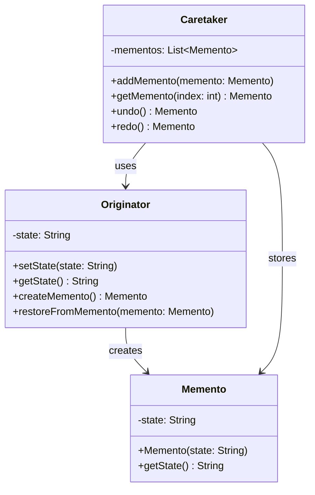
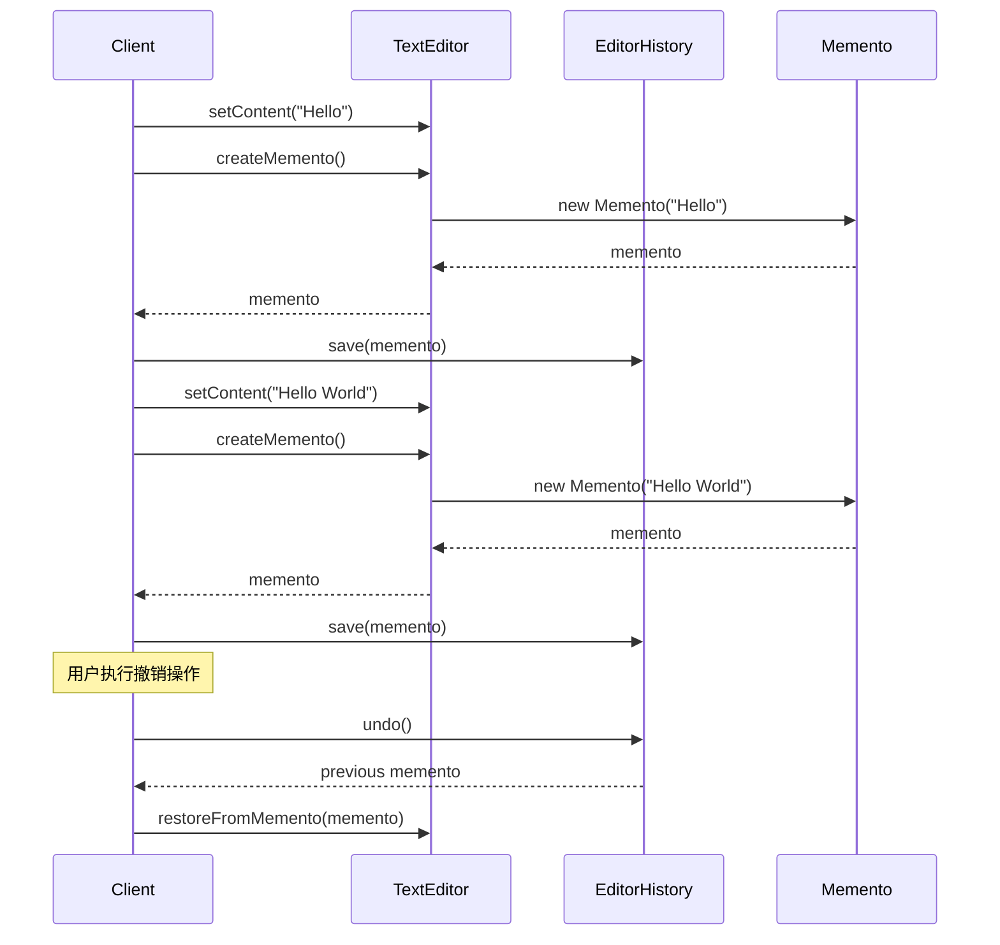

# 备忘录模式 (Memento Pattern) ⚠️ 低应用价值

> **⚠️ 注意：此模式在实际项目中应用价值较低**
> - 适用场景有限，主要用于撤销操作
> - 内存消耗大，可能导致性能问题
> - 现代框架提供更好的状态管理方案
> - **代码已删除，仅保留文档作为学习参考**

## 📋 模式概述

### 定义
备忘录模式在不破坏封装性的前提下，捕获一个对象的内部状态，并在该对象之外保存这个状态，以便以后当需要时能将该对象恢复到原先保存的状态。

### 核心思想
- 保存对象的内部状态
- 不破坏对象的封装性
- 支持撤销操作
- 状态的外部存储

## 🎯 解决的问题

### 主要问题
1. **状态恢复**：需要将对象恢复到之前的状态
2. **撤销操作**：实现撤销/重做功能
3. **快照保存**：保存对象在某个时刻的完整状态
4. **封装保护**：在不暴露对象内部结构的情况下保存状态

### 适用场景（有限）
- 文本编辑器的撤销功能
- 游戏存档系统
- 数据库事务回滚
- 配置文件的版本管理

## 🏗️ 模式结构

### UML类图


## 💻 代码示例

### 基础实现（已删除源码）

```java
// 备忘录类
public class Memento {
    private final String state;
    private final long timestamp;
    
    public Memento(String state) {
        this.state = state;
        this.timestamp = System.currentTimeMillis();
    }
    
    public String getState() {
        return state;
    }
    
    public long getTimestamp() {
        return timestamp;
    }
}

// 原发器类
public class TextEditor {
    private String content;
    
    public void setContent(String content) {
        this.content = content;
    }
    
    public String getContent() {
        return content;
    }
    
    // 创建备忘录
    public Memento createMemento() {
        return new Memento(content);
    }
    
    // 从备忘录恢复
    public void restoreFromMemento(Memento memento) {
        this.content = memento.getState();
    }
}

// 管理者类
public class EditorHistory {
    private Stack<Memento> history = new Stack<>();
    private Stack<Memento> redoStack = new Stack<>();
    
    public void save(Memento memento) {
        history.push(memento);
        redoStack.clear(); // 清除重做栈
    }
    
    public Memento undo() {
        if (!history.isEmpty()) {
            Memento memento = history.pop();
            redoStack.push(memento);
            return history.isEmpty() ? null : history.peek();
        }
        return null;
    }
    
    public Memento redo() {
        if (!redoStack.isEmpty()) {
            Memento memento = redoStack.pop();
            history.push(memento);
            return memento;
        }
        return null;
    }
}
```

## 🔄 时序图



## ⚡ 实际应用案例

### 案例1：游戏存档系统（学术示例）
```java
public class GameState {
    private int level;
    private int score;
    private int lives;
    
    // 构造函数、getter、setter...
    
    public GameMemento createSave() {
        return new GameMemento(level, score, lives);
    }
    
    public void loadSave(GameMemento memento) {
        this.level = memento.getLevel();
        this.score = memento.getScore();
        this.lives = memento.getLives();
    }
    
    public static class GameMemento {
        private final int level;
        private final int score;
        private final int lives;
        
        public GameMemento(int level, int score, int lives) {
            this.level = level;
            this.score = score;
            this.lives = lives;
        }
        
        // getter方法...
    }
}
```

## ⚠️ 为什么应用价值低

### 主要问题
1. **内存消耗大**：保存完整状态占用大量内存
2. **性能问题**：频繁创建备忘录影响性能
3. **复杂度高**：需要管理备忘录的生命周期
4. **现代替代方案更好**：
   - 数据库事务和回滚
   - Git等版本控制系统
   - Redux等状态管理库
   - 命令模式 + 撤销栈

### 更好的替代方案

```java
// 使用命令模式实现撤销功能（更轻量）
public interface Command {
    void execute();
    void undo();
}

public class InsertTextCommand implements Command {
    private TextEditor editor;
    private String text;
    private int position;
    
    public InsertTextCommand(TextEditor editor, String text, int position) {
        this.editor = editor;
        this.text = text;
        this.position = position;
    }
    
    @Override
    public void execute() {
        editor.insertText(text, position);
    }
    
    @Override
    public void undo() {
        editor.deleteText(position, text.length());
    }
}

// 使用数据库事务（更可靠）
@Transactional
public void updateUserData(User user) {
    try {
        userRepository.save(user);
        // 其他操作...
    } catch (Exception e) {
        // 自动回滚
        throw e;
    }
}
```

## 📊 优缺点分析

### 优点
- ✅ 保持封装边界
- ✅ 简化原发器类
- ✅ 支持多级撤销

### 缺点（致命缺陷）
- ❌ 消耗内存过大
- ❌ 管理备忘录的成本高
- ❌ 可能影响系统性能
- ❌ 现有解决方案更优

## 🎯 总结

备忘录模式在现代软件开发中应用价值较低：

1. **理论价值**：有助于理解状态管理概念
2. **实用价值**：有限，现有工具更强大
3. **建议**：优先考虑其他状态管理方案

**推荐替代方案**：
- 使用命令模式实现撤销功能
- 利用数据库事务机制
- 采用版本控制系统
- 使用现代状态管理库（Redux、MobX等）

> 💡 **学习建议**：了解概念和原理，但在实际项目中优先选择更现代的解决方案。