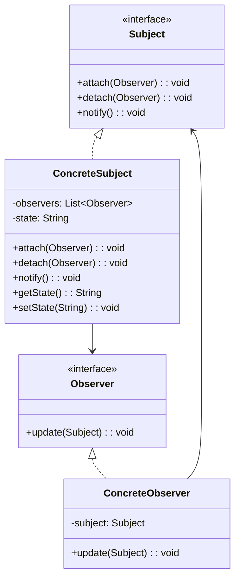
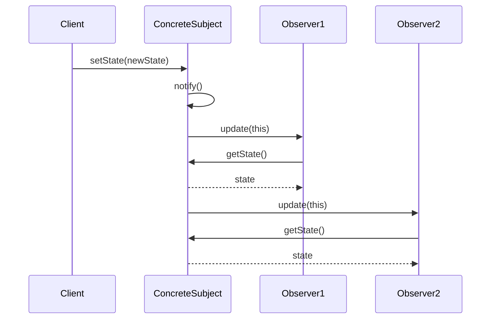

# 观察者模式 (Observer Pattern)

## 📋 模式概述

### 定义
观察者模式定义了对象之间的一对多依赖关系，当一个对象的状态发生改变时，所有依赖于它的对象都会得到通知并自动更新。

### 意图
- 定义对象间的一对多依赖关系
- 当一个对象状态改变时，自动通知所有依赖对象
- 实现松耦合的通知机制
- 支持广播通信

## 🏗️ 结构图



## ⏱️ 时序图



## 💻 代码实现

### 基础实现

```java
/**
 * 主题接口
 */
public interface Subject {
    void attach(Observer observer);
    void detach(Observer observer);
    void notifyObservers();
}

/**
 * 观察者接口
 */
public interface Observer {
    void update(Subject subject);
}

/**
 * 具体主题
 */
public class ConcreteSubject implements Subject {
    private List<Observer> observers = new ArrayList<>();
    private String state;
    
    @Override
    public void attach(Observer observer) {
        observers.add(observer);
        System.out.println("ConcreteSubject: 观察者已添加");
    }
    
    @Override
    public void detach(Observer observer) {
        observers.remove(observer);
        System.out.println("ConcreteSubject: 观察者已移除");
    }
    
    @Override
    public void notifyObservers() {
        System.out.println("ConcreteSubject: 通知所有观察者");
        for (Observer observer : observers) {
            observer.update(this);
        }
    }
    
    public String getState() {
        return state;
    }
    
    public void setState(String state) {
        this.state = state;
        System.out.println("ConcreteSubject: 状态已改变为 " + state);
        notifyObservers();
    }
}

/**
 * 具体观察者
 */
public class ConcreteObserver implements Observer {
    private String name;
    
    public ConcreteObserver(String name) {
        this.name = name;
    }
    
    @Override
    public void update(Subject subject) {
        if (subject instanceof ConcreteSubject) {
            String state = ((ConcreteSubject) subject).getState();
            System.out.println("ConcreteObserver " + name + ": 收到状态更新 - " + state);
        }
    }
}
```

## 🎯 适用场景

### 适合使用观察者模式的场景：

1. **状态变化通知** - 一个对象状态改变需要通知多个对象
2. **事件处理系统** - GUI事件处理、消息系统
3. **模型-视图架构** - MVC、MVP、MVVM架构
4. **发布-订阅系统** - 消息队列、事件总线

### 具体应用场景：

- **GUI应用** - 按钮点击、窗口事件
- **股票系统** - 价格变化通知
- **新闻系统** - 新闻发布订阅
- **游戏开发** - 游戏状态变化
- **监控系统** - 系统状态监控

## ✅ 优点

1. **松耦合** - 主题和观察者之间松耦合
2. **动态关系** - 可以在运行时建立对象间的关系
3. **广播通信** - 支持一对多的通信
4. **开闭原则** - 可以独立扩展主题和观察者

## ❌ 缺点

1. **性能问题** - 观察者过多时通知性能下降
2. **循环依赖** - 可能导致循环调用
3. **内存泄漏** - 观察者未正确移除可能导致内存泄漏
4. **调试困难** - 间接调用使调试变得困难

## 🔄 与其他模式的关系

- **中介者模式** - 都处理对象间通信，但中介者是多对多关系
- **命令模式** - 观察者可以使用命令来封装通知
- **单例模式** - 主题通常设计为单例
- **模板方法模式** - 通知过程可以使用模板方法

## 📝 最佳实践

1. **避免循环依赖** - 确保观察者更新时不会导致循环调用
2. **异步通知** - 考虑使用异步方式通知观察者
3. **异常处理** - 一个观察者的异常不应影响其他观察者
4. **内存管理** - 及时移除不需要的观察者
5. **线程安全** - 多线程环境下确保线程安全

## 🚨 注意事项

1. **观察者数量** - 避免观察者数量过多影响性能
2. **更新顺序** - 观察者的更新顺序可能很重要
3. **状态一致性** - 确保通知时状态的一致性
4. **弱引用** - 考虑使用弱引用避免内存泄漏

---

*观察者模式是实现松耦合通信的经典模式，广泛应用于事件驱动的系统中。*