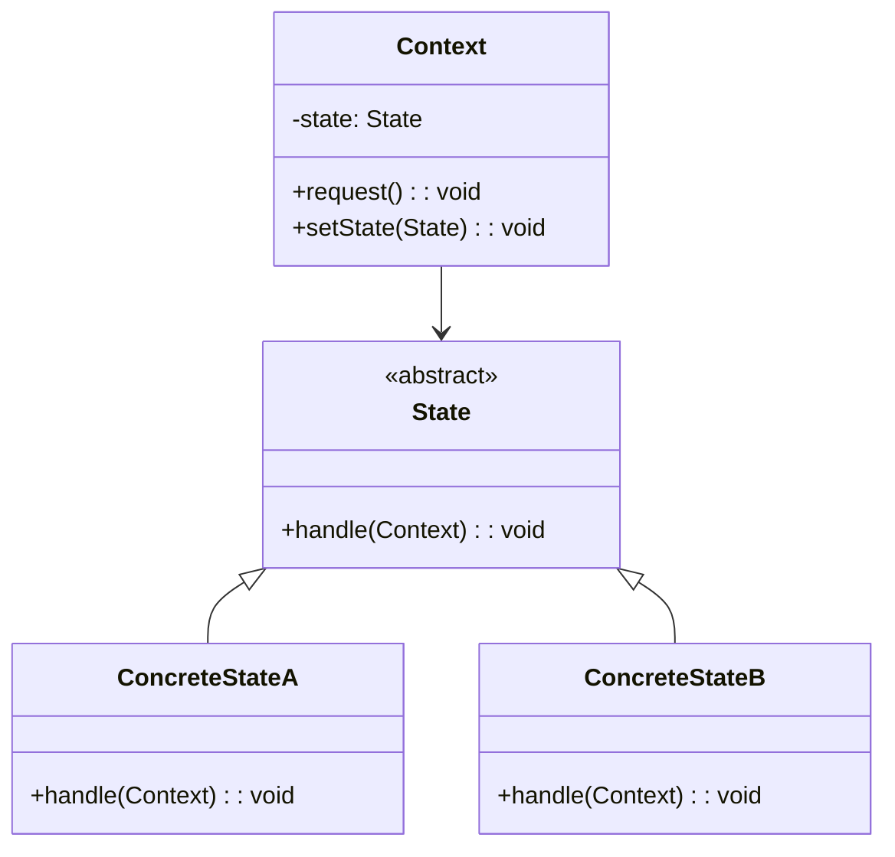

# 状态模式 (State Pattern)

## 📋 模式概述

### 定义
状态模式允许对象在内部状态改变时改变它的行为，对象看起来好像修改了它的类。

### 意图
- 允许对象在内部状态改变时改变其行为
- 将状态相关的行为封装在独立的状态类中
- 消除复杂的条件语句
- 使状态转换更加明确

## 🏗️ 结构图



## 💻 代码实现

### 基础实现

```java
/**
 * 状态接口
 */
public interface State {
    void handle(Context context);
}

/**
 * 上下文类
 */
public class Context {
    private State state;
    
    public Context(State initialState) {
        this.state = initialState;
    }
    
    public void setState(State state) {
        this.state = state;
        System.out.println("状态切换到: " + state.getClass().getSimpleName());
    }
    
    public void request() {
        state.handle(this);
    }
}

/**
 * 具体状态A
 */
public class ConcreteStateA implements State {
    @Override
    public void handle(Context context) {
        System.out.println("ConcreteStateA: 处理请求");
        // 状态转换
        context.setState(new ConcreteStateB());
    }
}

/**
 * 具体状态B
 */
public class ConcreteStateB implements State {
    @Override
    public void handle(Context context) {
        System.out.println("ConcreteStateB: 处理请求");
        // 状态转换
        context.setState(new ConcreteStateA());
    }
}
```

## 🧪 实际应用示例

### 1. 自动售货机

```java
/**
 * 售货机状态接口
 */
public interface VendingMachineState {
    void insertCoin(VendingMachine machine);
    void selectProduct(VendingMachine machine);
    void dispenseProduct(VendingMachine machine);
    void refund(VendingMachine machine);
}

/**
 * 售货机上下文
 */
public class VendingMachine {
    private VendingMachineState state;
    private int coinCount;
    private int productCount;
    
    // 状态实例
    private VendingMachineState noCoinState;
    private VendingMachineState hasCoinState;
    private VendingMachineState soldState;
    private VendingMachineState soldOutState;
    
    public VendingMachine(int productCount) {
        this.productCount = productCount;
        this.coinCount = 0;
        
        // 初始化状态
        noCoinState = new NoCoinState();
        hasCoinState = new HasCoinState();
        soldState = new SoldState();
        soldOutState = new SoldOutState();
        
        // 设置初始状态
        if (productCount > 0) {
            state = noCoinState;
        } else {
            state = soldOutState;
        }
    }
    
    public void insertCoin() {
        state.insertCoin(this);
    }
    
    public void selectProduct() {
        state.selectProduct(this);
    }
    
    public void dispenseProduct() {
        state.dispenseProduct(this);
    }
    
    public void refund() {
        state.refund(this);
    }
    
    // 状态转换方法
    public void setState(VendingMachineState state) {
        this.state = state;
    }
    
    // Getters for states
    public VendingMachineState getNoCoinState() { return noCoinState; }
    public VendingMachineState getHasCoinState() { return hasCoinState; }
    public VendingMachineState getSoldState() { return soldState; }
    public VendingMachineState getSoldOutState() { return soldOutState; }
    
    // 业务方法
    public void addCoin() {
        coinCount++;
        System.out.println("投入硬币，当前硬币数: " + coinCount);
    }
    
    public void returnCoin() {
        if (coinCount > 0) {
            System.out.println("退还硬币: " + coinCount + " 个");
            coinCount = 0;
        }
    }
    
    public void releaseBall() {
        if (productCount > 0) {
            productCount--;
            System.out.println("出货！剩余商品: " + productCount);
        }
    }
    
    public int getCoinCount() { return coinCount; }
    public int getProductCount() { return productCount; }
    
    public String getCurrentState() {
        return state.getClass().getSimpleName();
    }
}

/**
 * 无硬币状态
 */
public class NoCoinState implements VendingMachineState {
    
    @Override
    public void insertCoin(VendingMachine machine) {
        System.out.println("投入硬币");
        machine.addCoin();
        machine.setState(machine.getHasCoinState());
    }
    
    @Override
    public void selectProduct(VendingMachine machine) {
        System.out.println("请先投入硬币");
    }
    
    @Override
    public void dispenseProduct(VendingMachine machine) {
        System.out.println("请先投入硬币");
    }
    
    @Override
    public void refund(VendingMachine machine) {
        System.out.println("没有硬币可退还");
    }
}

/**
 * 有硬币状态
 */
public class HasCoinState implements VendingMachineState {
    
    @Override
    public void insertCoin(VendingMachine machine) {
        System.out.println("已经投入硬币，无需重复投入");
    }
    
    @Override
    public void selectProduct(VendingMachine machine) {
        System.out.println("选择商品");
        machine.setState(machine.getSoldState());
    }
    
    @Override
    public void dispenseProduct(VendingMachine machine) {
        System.out.println("请先选择商品");
    }
    
    @Override
    public void refund(VendingMachine machine) {
        System.out.println("退还硬币");
        machine.returnCoin();
        machine.setState(machine.getNoCoinState());
    }
}

/**
 * 售出状态
 */
public class SoldState implements VendingMachineState {
    
    @Override
    public void insertCoin(VendingMachine machine) {
        System.out.println("正在出货，请稍等");
    }
    
    @Override
    public void selectProduct(VendingMachine machine) {
        System.out.println("正在出货，请稍等");
    }
    
    @Override
    public void dispenseProduct(VendingMachine machine) {
        machine.releaseBall();
        if (machine.getProductCount() > 0) {
            machine.setState(machine.getNoCoinState());
        } else {
            System.out.println("商品已售完");
            machine.setState(machine.getSoldOutState());
        }
    }
    
    @Override
    public void refund(VendingMachine machine) {
        System.out.println("商品已出货，无法退款");
    }
}

/**
 * 售完状态
 */
public class SoldOutState implements VendingMachineState {
    
    @Override
    public void insertCoin(VendingMachine machine) {
        System.out.println("商品已售完，无法投币");
        machine.returnCoin();
    }
    
    @Override
    public void selectProduct(VendingMachine machine) {
        System.out.println("商品已售完");
    }
    
    @Override
    public void dispenseProduct(VendingMachine machine) {
        System.out.println("商品已售完");
    }
    
    @Override
    public void refund(VendingMachine machine) {
        machine.returnCoin();
    }
}

// 使用示例
public class VendingMachineDemo {
    public static void main(String[] args) {
        VendingMachine machine = new VendingMachine(2);
        
        System.out.println("=== 售货机测试 ===");
        System.out.println("初始状态: " + machine.getCurrentState());
        
        // 测试正常购买流程
        System.out.println("\n--- 正常购买流程 ---");
        machine.insertCoin();
        machine.selectProduct();
        machine.dispenseProduct();
        
        // 测试退币功能
        System.out.println("\n--- 退币测试 ---");
        machine.insertCoin();
        machine.refund();
        
        // 测试售完状态
        System.out.println("\n--- 购买剩余商品 ---");
        machine.insertCoin();
        machine.selectProduct();
        machine.dispenseProduct();
        
        System.out.println("\n--- 售完状态测试 ---");
        machine.insertCoin();
        machine.selectProduct();
    }
}
```

### 2. 音乐播放器

```java
/**
 * 播放器状态接口
 */
public interface PlayerState {
    void play(MusicPlayer player);
    void pause(MusicPlayer player);
    void stop(MusicPlayer player);
    void next(MusicPlayer player);
    void previous(MusicPlayer player);
}

/**
 * 音乐播放器上下文
 */
public class MusicPlayer {
    private PlayerState state;
    private String currentSong;
    private List<String> playlist;
    private int currentIndex;
    
    // 状态实例
    private PlayerState stoppedState;
    private PlayerState playingState;
    private PlayerState pausedState;
    
    public MusicPlayer() {
        // 初始化播放列表
        playlist = Arrays.asList("歌曲1", "歌曲2", "歌曲3", "歌曲4");
        currentIndex = 0;
        currentSong = playlist.get(currentIndex);
        
        // 初始化状态
        stoppedState = new StoppedState();
        playingState = new PlayingState();
        pausedState = new PausedState();
        
        // 设置初始状态
        state = stoppedState;
    }
    
    public void play() {
        state.play(this);
    }
    
    public void pause() {
        state.pause(this);
    }
    
    public void stop() {
        state.stop(this);
    }
    
    public void next() {
        state.next(this);
    }
    
    public void previous() {
        state.previous(this);
    }
    
    // 状态转换
    public void setState(PlayerState state) {
        this.state = state;
        System.out.println("播放器状态: " + state.getClass().getSimpleName());
    }
    
    // Getters for states
    public PlayerState getStoppedState() { return stoppedState; }
    public PlayerState getPlayingState() { return playingState; }
    public PlayerState getPausedState() { return pausedState; }
    
    // 业务方法
    public void startPlaying() {
        System.out.println("开始播放: " + currentSong);
    }
    
    public void pausePlaying() {
        System.out.println("暂停播放: " + currentSong);
    }
    
    public void stopPlaying() {
        System.out.println("停止播放");
    }
    
    public void nextSong() {
        if (currentIndex < playlist.size() - 1) {
            currentIndex++;
            currentSong = playlist.get(currentIndex);
            System.out.println("切换到下一首: " + currentSong);
        } else {
            System.out.println("已经是最后一首歌");
        }
    }
    
    public void previousSong() {
        if (currentIndex > 0) {
            currentIndex--;
            currentSong = playlist.get(currentIndex);
            System.out.println("切换到上一首: " + currentSong);
        } else {
            System.out.println("已经是第一首歌");
        }
    }
    
    public String getCurrentSong() { return currentSong; }
    public String getCurrentState() { return state.getClass().getSimpleName(); }
}

/**
 * 停止状态
 */
public class StoppedState implements PlayerState {
    
    @Override
    public void play(MusicPlayer player) {
        player.startPlaying();
        player.setState(player.getPlayingState());
    }
    
    @Override
    public void pause(MusicPlayer player) {
        System.out.println("播放器已停止，无法暂停");
    }
    
    @Override
    public void stop(MusicPlayer player) {
        System.out.println("播放器已经停止");
    }
    
    @Override
    public void next(MusicPlayer player) {
        player.nextSong();
    }
    
    @Override
    public void previous(MusicPlayer player) {
        player.previousSong();
    }
}

/**
 * 播放状态
 */
public class PlayingState implements PlayerState {
    
    @Override
    public void play(MusicPlayer player) {
        System.out.println("已经在播放中");
    }
    
    @Override
    public void pause(MusicPlayer player) {
        player.pausePlaying();
        player.setState(player.getPausedState());
    }
    
    @Override
    public void stop(MusicPlayer player) {
        player.stopPlaying();
        player.setState(player.getStoppedState());
    }
    
    @Override
    public void next(MusicPlayer player) {
        player.nextSong();
        player.startPlaying();
    }
    
    @Override
    public void previous(MusicPlayer player) {
        player.previousSong();
        player.startPlaying();
    }
}

/**
 * 暂停状态
 */
public class PausedState implements PlayerState {
    
    @Override
    public void play(MusicPlayer player) {
        player.startPlaying();
        player.setState(player.getPlayingState());
    }
    
    @Override
    public void pause(MusicPlayer player) {
        System.out.println("已经暂停");
    }
    
    @Override
    public void stop(MusicPlayer player) {
        player.stopPlaying();
        player.setState(player.getStoppedState());
    }
    
    @Override
    public void next(MusicPlayer player) {
        player.nextSong();
        player.setState(player.getStoppedState());
    }
    
    @Override
    public void previous(MusicPlayer player) {
        player.previousSong();
        player.setState(player.getStoppedState());
    }
}

// 使用示例
public class MusicPlayerDemo {
    public static void main(String[] args) {
        MusicPlayer player = new MusicPlayer();
        
        System.out.println("=== 音乐播放器测试 ===");
        System.out.println("初始状态: " + player.getCurrentState());
        System.out.println("当前歌曲: " + player.getCurrentSong());
        
        // 测试播放
        System.out.println("\n--- 播放测试 ---");
        player.play();
        
        // 测试暂停
        System.out.println("\n--- 暂停测试 ---");
        player.pause();
        
        // 测试恢复播放
        System.out.println("\n--- 恢复播放 ---");
        player.play();
        
        // 测试切换歌曲
        System.out.println("\n--- 切换歌曲 ---");
        player.next();
        player.previous();
        
        // 测试停止
        System.out.println("\n--- 停止播放 ---");
        player.stop();
        
        // 在停止状态下切换歌曲
        System.out.println("\n--- 停止状态下切换歌曲 ---");
        player.next();
        player.play();
    }
}
```

## 🎯 适用场景

### 适合使用状态模式的场景：

1. **状态相关行为** - 对象的行为依赖于其状态
2. **复杂条件语句** - 有大量基于状态的条件语句
3. **状态转换** - 需要明确的状态转换逻辑
4. **状态机** - 实现有限状态机

### 具体应用场景：

- **游戏开发** - 游戏角色状态、游戏关卡状态
- **工作流系统** - 订单状态、审批流程
- **UI组件** - 按钮状态、窗口状态
- **网络连接** - 连接状态管理
- **设备控制** - 设备运行状态

## ✅ 优点

1. **消除条件语句** - 避免大量的if-else或switch语句
2. **状态转换明确** - 状态转换逻辑清晰
3. **易于扩展** - 容易添加新的状态
4. **符合开闭原则** - 对扩展开放，对修改关闭

## ❌ 缺点

1. **类数量增加** - 每个状态都需要一个类
2. **系统复杂性** - 增加了系统的复杂性
3. **状态爆炸** - 状态过多时难以管理

## 🔄 与其他模式的关系

- **策略模式** - 都使用组合改变行为，但状态模式关注状态转换
- **单例模式** - 状态对象通常设计为单例
- **享元模式** - 可以共享状态对象
- **观察者模式** - 状态变化时可以通知观察者

## 📝 最佳实践

1. **状态对象管理** - 考虑状态对象的创建和销毁策略
2. **状态转换控制** - 明确定义状态转换规则
3. **上下文接口设计** - 为状态提供必要的上下文接口
4. **异常处理** - 处理非法的状态转换
5. **状态持久化** - 考虑状态的持久化需求

## 🚨 注意事项

1. **状态数量控制** - 避免状态过多导致系统复杂
2. **状态转换逻辑** - 确保状态转换的正确性
3. **内存管理** - 合理管理状态对象的生命周期
4. **线程安全** - 多线程环境下的状态安全

---

*状态模式是管理对象状态和行为变化的经典模式，特别适用于实现状态机和消除复杂的条件语句。*