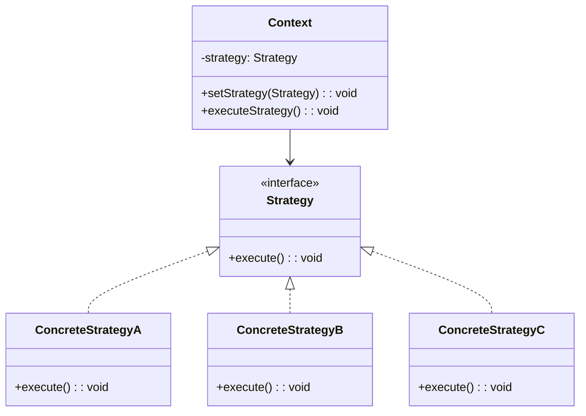
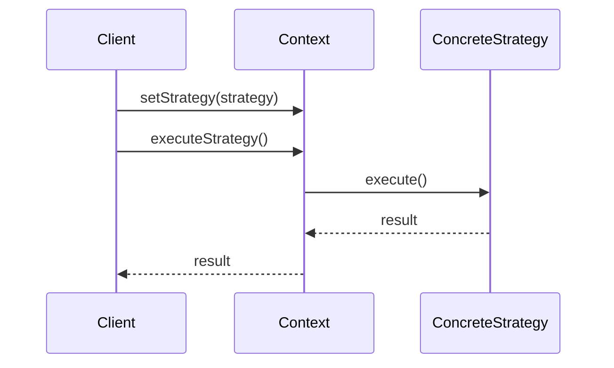

# 策略模式 (Strategy Pattern)

## 📋 模式概述

### 定义
策略模式定义了一系列算法，把它们一个个封装起来，并且使它们可相互替换。策略模式让算法的变化独立于使用算法的客户。

### 意图
- 定义一系列算法，封装每个算法，并使它们可以互换
- 算法可以独立于使用它的客户而变化
- 消除条件语句，用多态替换条件判断
- 提供相同行为的不同实现

## 🏗️ 结构图



## ⏱️ 时序图



## 💻 代码实现

### 基础实现

```java
/**
 * 策略接口
 */
public interface Strategy {
    void execute();
}

/**
 * 具体策略A
 */
public class ConcreteStrategyA implements Strategy {
    @Override
    public void execute() {
        System.out.println("ConcreteStrategyA: 执行算法A");
    }
}

/**
 * 具体策略B
 */
public class ConcreteStrategyB implements Strategy {
    @Override
    public void execute() {
        System.out.println("ConcreteStrategyB: 执行算法B");
    }
}

/**
 * 具体策略C
 */
public class ConcreteStrategyC implements Strategy {
    @Override
    public void execute() {
        System.out.println("ConcreteStrategyC: 执行算法C");
    }
}

/**
 * 上下文类
 */
public class Context {
    private Strategy strategy;
    
    public Context(Strategy strategy) {
        this.strategy = strategy;
    }
    
    public void setStrategy(Strategy strategy) {
        this.strategy = strategy;
    }
    
    public void executeStrategy() {
        strategy.execute();
    }
}
```

## 🧪 实际应用示例

### 1. 支付系统

```java
/**
 * 支付策略接口
 */
public interface PaymentStrategy {
    boolean pay(double amount);
    String getPaymentMethod();
}

/**
 * 信用卡支付策略
 */
public class CreditCardPayment implements PaymentStrategy {
    private String cardNumber;
    private String holderName;
    private String cvv;
    private String expiryDate;
    
    public CreditCardPayment(String cardNumber, String holderName, String cvv, String expiryDate) {
        this.cardNumber = cardNumber;
        this.holderName = holderName;
        this.cvv = cvv;
        this.expiryDate = expiryDate;
    }
    
    @Override
    public boolean pay(double amount) {
        System.out.println("使用信用卡支付 $" + amount);
        System.out.println("卡号: " + maskCardNumber(cardNumber));
        System.out.println("持卡人: " + holderName);
        
        // 模拟支付处理
        if (validateCard()) {
            System.out.println("信用卡支付成功！");
            return true;
        } else {
            System.out.println("信用卡支付失败！");
            return false;
        }
    }
    
    @Override
    public String getPaymentMethod() {
        return "信用卡";
    }
    
    private String maskCardNumber(String cardNumber) {
        return "**** **** **** " + cardNumber.substring(cardNumber.length() - 4);
    }
    
    private boolean validateCard() {
        // 模拟卡片验证
        return cardNumber.length() == 16 && !cvv.isEmpty();
    }
}

/**
 * PayPal支付策略
 */
public class PayPalPayment implements PaymentStrategy {
    private String email;
    private String password;
    
    public PayPalPayment(String email, String password) {
        this.email = email;
        this.password = password;
    }
    
    @Override
    public boolean pay(double amount) {
        System.out.println("使用PayPal支付 $" + amount);
        System.out.println("PayPal账户: " + email);
        
        // 模拟PayPal支付处理
        if (authenticate()) {
            System.out.println("PayPal支付成功！");
            return true;
        } else {
            System.out.println("PayPal支付失败！");
            return false;
        }
    }
    
    @Override
    public String getPaymentMethod() {
        return "PayPal";
    }
    
    private boolean authenticate() {
        // 模拟身份验证
        return email.contains("@") && password.length() >= 6;
    }
}

/**
 * 银行转账支付策略
 */
public class BankTransferPayment implements PaymentStrategy {
    private String bankAccount;
    private String routingNumber;
    
    public BankTransferPayment(String bankAccount, String routingNumber) {
        this.bankAccount = bankAccount;
        this.routingNumber = routingNumber;
    }
    
    @Override
    public boolean pay(double amount) {
        System.out.println("使用银行转账支付 $" + amount);
        System.out.println("银行账户: " + maskAccountNumber(bankAccount));
        System.out.println("路由号: " + routingNumber);
        
        // 模拟银行转账处理
        if (validateBankAccount()) {
            System.out.println("银行转账支付成功！");
            return true;
        } else {
            System.out.println("银行转账支付失败！");
            return false;
        }
    }
    
    @Override
    public String getPaymentMethod() {
        return "银行转账";
    }
    
    private String maskAccountNumber(String accountNumber) {
        return "****" + accountNumber.substring(accountNumber.length() - 4);
    }
    
    private boolean validateBankAccount() {
        // 模拟银行账户验证
        return bankAccount.length() >= 8 && routingNumber.length() == 9;
    }
}

/**
 * 购物车
 */
public class ShoppingCart {
    private List<Item> items;
    private PaymentStrategy paymentStrategy;
    
    public ShoppingCart() {
        this.items = new ArrayList<>();
    }
    
    public void addItem(Item item) {
        items.add(item);
        System.out.println("添加商品: " + item.getName() + " - $" + item.getPrice());
    }
    
    public void removeItem(Item item) {
        items.remove(item);
        System.out.println("移除商品: " + item.getName());
    }
    
    public double calculateTotal() {
        return items.stream().mapToDouble(Item::getPrice).sum();
    }
    
    public void setPaymentStrategy(PaymentStrategy paymentStrategy) {
        this.paymentStrategy = paymentStrategy;
        System.out.println("设置支付方式: " + paymentStrategy.getPaymentMethod());
    }
    
    public boolean checkout() {
        if (paymentStrategy == null) {
            System.out.println("请选择支付方式！");
            return false;
        }
        
        double total = calculateTotal();
        System.out.println("\n=== 结账 ===");
        System.out.println("商品总数: " + items.size());
        System.out.println("总金额: $" + total);
        System.out.println("支付方式: " + paymentStrategy.getPaymentMethod());
        
        return paymentStrategy.pay(total);
    }
    
    public void showItems() {
        System.out.println("购物车商品:");
        for (Item item : items) {
            System.out.println("  - " + item.getName() + ": $" + item.getPrice());
        }
        System.out.println("总计: $" + calculateTotal());
    }
}

/**
 * 商品类
 */
public class Item {
    private String name;
    private double price;
    
    public Item(String name, double price) {
        this.name = name;
        this.price = price;
    }
    
    public String getName() { return name; }
    public double getPrice() { return price; }
}

// 使用示例
public class PaymentSystemDemo {
    public static void main(String[] args) {
        // 创建购物车
        ShoppingCart cart = new ShoppingCart();
        
        // 添加商品
        cart.addItem(new Item("笔记本电脑", 999.99));
        cart.addItem(new Item("无线鼠标", 29.99));
        cart.addItem(new Item("键盘", 79.99));
        
        System.out.println();
        cart.showItems();
        
        System.out.println("\n=== 使用信用卡支付 ===");
        cart.setPaymentStrategy(new CreditCardPayment("1234567890123456", "John Doe", "123", "12/25"));
        cart.checkout();
        
        System.out.println("\n=== 切换到PayPal支付 ===");
        cart.setPaymentStrategy(new PayPalPayment("john.doe@example.com", "password123"));
        cart.checkout();
        
        System.out.println("\n=== 切换到银行转账支付 ===");
        cart.setPaymentStrategy(new BankTransferPayment("12345678", "123456789"));
        cart.checkout();
    }
}
```

### 2. 排序算法策略

```java
/**
 * 排序策略接口
 */
public interface SortStrategy {
    void sort(int[] array);
    String getAlgorithmName();
}

/**
 * 冒泡排序策略
 */
public class BubbleSortStrategy implements SortStrategy {
    @Override
    public void sort(int[] array) {
        System.out.println("使用冒泡排序");
        int n = array.length;
        for (int i = 0; i < n - 1; i++) {
            for (int j = 0; j < n - i - 1; j++) {
                if (array[j] > array[j + 1]) {
                    // 交换元素
                    int temp = array[j];
                    array[j] = array[j + 1];
                    array[j + 1] = temp;
                }
            }
        }
    }
    
    @Override
    public String getAlgorithmName() {
        return "冒泡排序";
    }
}

/**
 * 快速排序策略
 */
public class QuickSortStrategy implements SortStrategy {
    @Override
    public void sort(int[] array) {
        System.out.println("使用快速排序");
        quickSort(array, 0, array.length - 1);
    }
    
    private void quickSort(int[] array, int low, int high) {
        if (low < high) {
            int pi = partition(array, low, high);
            quickSort(array, low, pi - 1);
            quickSort(array, pi + 1, high);
        }
    }
    
    private int partition(int[] array, int low, int high) {
        int pivot = array[high];
        int i = (low - 1);
        
        for (int j = low; j < high; j++) {
            if (array[j] <= pivot) {
                i++;
                int temp = array[i];
                array[i] = array[j];
                array[j] = temp;
            }
        }
        
        int temp = array[i + 1];
        array[i + 1] = array[high];
        array[high] = temp;
        
        return i + 1;
    }
    
    @Override
    public String getAlgorithmName() {
        return "快速排序";
    }
}

/**
 * 归并排序策略
 */
public class MergeSortStrategy implements SortStrategy {
    @Override
    public void sort(int[] array) {
        System.out.println("使用归并排序");
        mergeSort(array, 0, array.length - 1);
    }
    
    private void mergeSort(int[] array, int left, int right) {
        if (left < right) {
            int middle = (left + right) / 2;
            mergeSort(array, left, middle);
            mergeSort(array, middle + 1, right);
            merge(array, left, middle, right);
        }
    }
    
    private void merge(int[] array, int left, int middle, int right) {
        int n1 = middle - left + 1;
        int n2 = right - middle;
        
        int[] leftArray = new int[n1];
        int[] rightArray = new int[n2];
        
        System.arraycopy(array, left, leftArray, 0, n1);
        System.arraycopy(array, middle + 1, rightArray, 0, n2);
        
        int i = 0, j = 0, k = left;
        
        while (i < n1 && j < n2) {
            if (leftArray[i] <= rightArray[j]) {
                array[k] = leftArray[i];
                i++;
            } else {
                array[k] = rightArray[j];
                j++;
            }
            k++;
        }
        
        while (i < n1) {
            array[k] = leftArray[i];
            i++;
            k++;
        }
        
        while (j < n2) {
            array[k] = rightArray[j];
            j++;
            k++;
        }
    }
    
    @Override
    public String getAlgorithmName() {
        return "归并排序";
    }
}

/**
 * 排序上下文
 */
public class SortContext {
    private SortStrategy sortStrategy;
    
    public void setSortStrategy(SortStrategy sortStrategy) {
        this.sortStrategy = sortStrategy;
    }
    
    public void performSort(int[] array) {
        if (sortStrategy == null) {
            System.out.println("请设置排序策略！");
            return;
        }
        
        System.out.println("原始数组: " + Arrays.toString(array));
        
        long startTime = System.nanoTime();
        sortStrategy.sort(array);
        long endTime = System.nanoTime();
        
        System.out.println("排序后数组: " + Arrays.toString(array));
        System.out.println("算法: " + sortStrategy.getAlgorithmName());
        System.out.println("耗时: " + (endTime - startTime) / 1000000.0 + " ms");
    }
}

// 使用示例
public class SortStrategyDemo {
    public static void main(String[] args) {
        SortContext context = new SortContext();
        
        // 测试数据
        int[] data1 = {64, 34, 25, 12, 22, 11, 90};
        int[] data2 = data1.clone();
        int[] data3 = data1.clone();
        
        System.out.println("=== 冒泡排序 ===");
        context.setSortStrategy(new BubbleSortStrategy());
        context.performSort(data1);
        
        System.out.println("\n=== 快速排序 ===");
        context.setSortStrategy(new QuickSortStrategy());
        context.performSort(data2);
        
        System.out.println("\n=== 归并排序 ===");
        context.setSortStrategy(new MergeSortStrategy());
        context.performSort(data3);
    }
}
```

## 🎯 适用场景

### 适合使用策略模式的场景：

1. **算法选择** - 需要在运行时选择不同的算法
2. **条件语句替换** - 替换复杂的条件语句
3. **行为变化** - 对象的行为需要动态改变
4. **算法族** - 有一系列相关的算法

### 具体应用场景：

- **支付系统** - 不同的支付方式
- **排序算法** - 不同的排序策略
- **压缩算法** - 不同的压缩方式
- **游戏AI** - 不同的AI策略
- **验证规则** - 不同的验证策略

## ✅ 优点

1. **算法可切换** - 可以在运行时切换算法
2. **避免条件语句** - 消除大量的条件分支语句
3. **扩展性好** - 容易添加新的策略
4. **符合开闭原则** - 对扩展开放，对修改关闭

## ❌ 缺点

1. **类数量增加** - 每个策略都需要一个类
2. **客户端复杂** - 客户端需要了解所有策略
3. **策略暴露** - 所有策略类都暴露给客户端

## 🔄 与其他模式的关系

- **状态模式** - 都使用组合改变对象行为，但状态模式关注状态转换
- **模板方法模式** - 都定义算法骨架，但模板方法使用继承
- **工厂模式** - 可以使用工厂来创建策略对象
- **装饰器模式** - 都使用组合，但装饰器用于增强功能

## 📝 最佳实践

1. **策略工厂** - 使用工厂模式创建策略对象
2. **默认策略** - 提供默认的策略实现
3. **策略缓存** - 缓存策略对象避免重复创建
4. **参数传递** - 合理设计策略方法的参数
5. **异常处理** - 统一处理策略执行中的异常

## 🚨 注意事项

1. **策略选择** - 确保客户端能正确选择策略
2. **性能考虑** - 频繁切换策略可能影响性能
3. **状态管理** - 策略对象是否需要维护状态
4. **线程安全** - 多线程环境下的策略安全性

---

*策略模式是处理算法变化的经典模式，它让算法的变化独立于使用算法的客户端。*