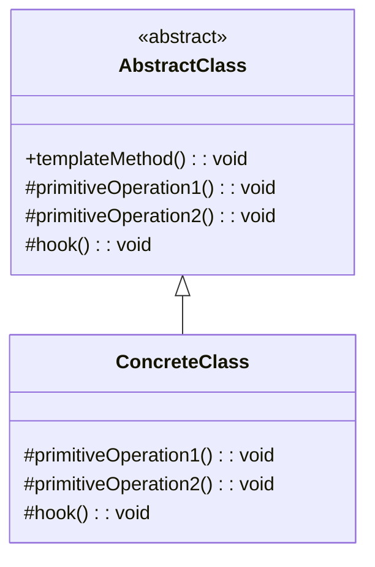

# 模板方法模式 (Template Method Pattern)

## 📋 模式概述

### 定义
模板方法模式在一个方法中定义一个算法的骨架，而将一些步骤延迟到子类中。模板方法使得子类可以在不改变算法结构的情况下，重新定义算法的某些特定步骤。

### 意图
- 定义算法的骨架，将具体步骤延迟到子类
- 让子类在不改变算法结构的前提下重定义算法的某些步骤
- 提取公共行为到父类，避免代码重复
- 控制子类的扩展点

## 🏗️ 结构图



## 💻 代码实现

### 基础实现

```java
/**
 * 抽象类定义模板方法
 */
public abstract class AbstractClass {
    
    /**
     * 模板方法 - 定义算法骨架
     */
    public final void templateMethod() {
        primitiveOperation1();
        primitiveOperation2();
        if (hook()) {
            concreteOperation();
        }
    }
    
    /**
     * 抽象方法 - 子类必须实现
     */
    protected abstract void primitiveOperation1();
    protected abstract void primitiveOperation2();
    
    /**
     * 钩子方法 - 子类可以选择重写
     */
    protected boolean hook() {
        return true;
    }
    
    /**
     * 具体方法 - 已实现的通用操作
     */
    private void concreteOperation() {
        System.out.println("AbstractClass: 执行具体操作");
    }
}

/**
 * 具体类A
 */
public class ConcreteClassA extends AbstractClass {
    
    @Override
    protected void primitiveOperation1() {
        System.out.println("ConcreteClassA: 实现操作1");
    }
    
    @Override
    protected void primitiveOperation2() {
        System.out.println("ConcreteClassA: 实现操作2");
    }
    
    @Override
    protected boolean hook() {
        return false; // 不执行具体操作
    }
}
```

## 🧪 实际应用示例

### 饮料制作系统

```java
/**
 * 饮料制作抽象类
 */
public abstract class Beverage {
    
    /**
     * 模板方法 - 制作饮料的流程
     */
    public final void prepareRecipe() {
        boilWater();
        brew();
        pourInCup();
        if (customerWantsCondiments()) {
            addCondiments();
        }
    }
    
    /**
     * 抽象方法 - 子类必须实现
     */
    protected abstract void brew();
    protected abstract void addCondiments();
    
    /**
     * 具体方法 - 通用步骤
     */
    private void boilWater() {
        System.out.println("烧开水");
    }
    
    private void pourInCup() {
        System.out.println("倒入杯中");
    }
    
    /**
     * 钩子方法 - 子类可以重写
     */
    protected boolean customerWantsCondiments() {
        return true;
    }
}

/**
 * 茶
 */
public class Tea extends Beverage {
    
    @Override
    protected void brew() {
        System.out.println("用沸水冲泡茶叶");
    }
    
    @Override
    protected void addCondiments() {
        System.out.println("加柠檬");
    }
    
    @Override
    protected boolean customerWantsCondiments() {
        String answer = getUserInput();
        return answer.toLowerCase().startsWith("y");
    }
    
    private String getUserInput() {
        // 模拟用户输入
        return "yes";
    }
}

/**
 * 咖啡
 */
public class Coffee extends Beverage {
    
    @Override
    protected void brew() {
        System.out.println("用沸水冲泡咖啡");
    }
    
    @Override
    protected void addCondiments() {
        System.out.println("加糖和牛奶");
    }
}
```

## 🎯 适用场景

### 适合使用模板方法模式的场景：

1. **算法骨架固定** - 算法的整体结构固定，但某些步骤可变
2. **代码复用** - 多个类有相似的算法结构
3. **控制扩展** - 需要控制子类的扩展点
4. **框架设计** - 框架定义流程，应用实现具体步骤

### 具体应用场景：

- **数据处理框架** - 读取、处理、保存数据的流程
- **测试框架** - 测试的初始化、执行、清理流程
- **Web框架** - 请求处理的生命周期
- **游戏开发** - 游戏循环、AI行为模式
- **编译器** - 词法分析、语法分析、代码生成

## ✅ 优点

1. **代码复用** - 提取公共代码到父类
2. **控制扩展** - 通过钩子方法控制扩展点
3. **符合开闭原则** - 对扩展开放，对修改关闭
4. **算法结构稳定** - 保证算法的整体结构不变

## ❌ 缺点

1. **继承限制** - 必须使用继承，限制了灵活性
2. **调试困难** - 算法分散在多个类中，调试困难
3. **违反里氏替换原则** - 子类可能改变父类的行为

## 🔄 与其他模式的关系

- **策略模式** - 都可以改变算法，但策略模式使用组合
- **工厂方法模式** - 工厂方法是模板方法的特殊应用
- **命令模式** - 模板方法可以使用命令来实现步骤

## 📝 最佳实践

1. **使用final修饰模板方法** - 防止子类重写算法结构
2. **合理使用钩子方法** - 提供适当的扩展点
3. **最小化抽象方法** - 减少子类必须实现的方法数量
4. **文档化算法流程** - 清楚说明算法的执行流程

## 🚨 注意事项

1. **避免过多的抽象方法** - 会增加子类的实现负担
2. **钩子方法的合理使用** - 不要提供过多的钩子方法
3. **算法稳定性** - 确保算法的整体结构是稳定的

---

*模板方法模式是代码复用和算法结构控制的经典模式，广泛应用于框架设计中。*