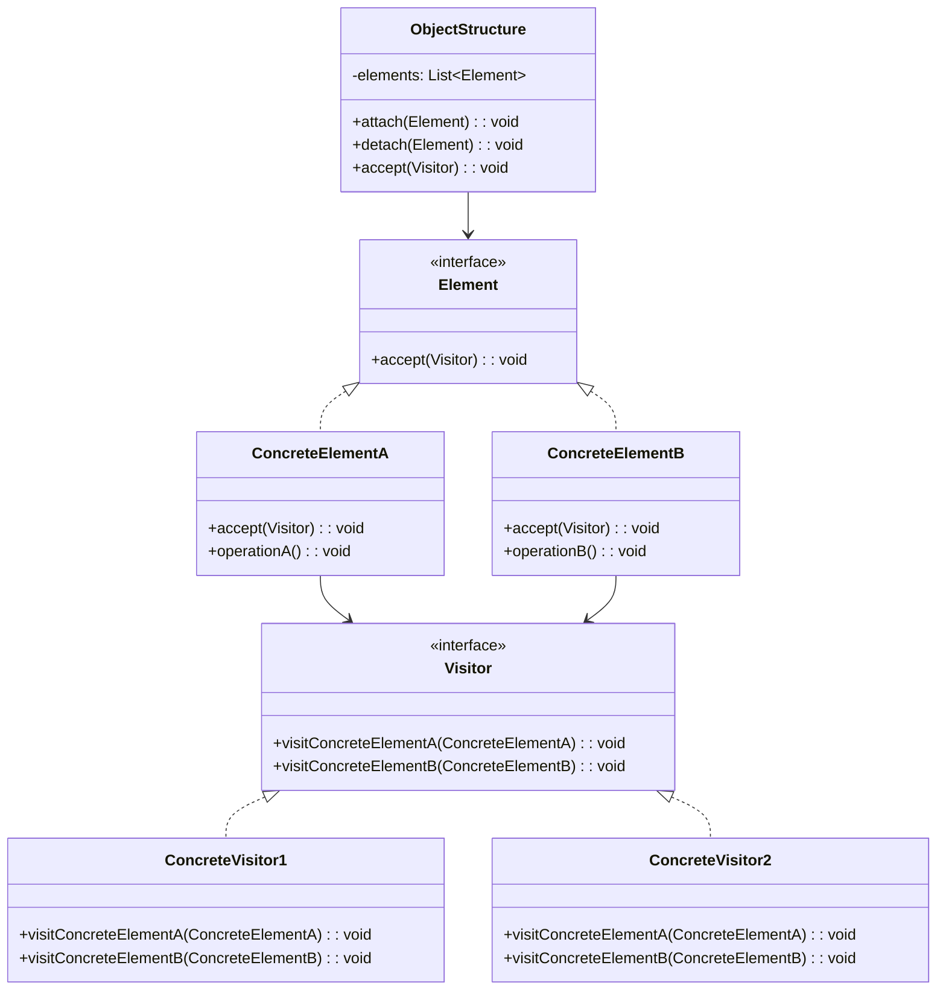
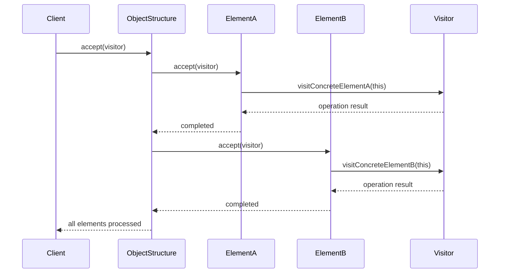

# 访问者模式 (Visitor Pattern)

## 📋 模式概述

### 定义
访问者模式表示一个作用于某对象结构中的各元素的操作。它使你可以在不改变各元素的类的前提下定义作用于这些元素的新操作。

### 意图
- 在不修改现有类结构的情况下，定义新的操作
- 将数据结构与数据操作分离
- 支持对象结构中不同类型元素的不同操作
- 集中相关的操作，分离无关的操作

## 🏗️ 结构图



## ⏱️ 时序图



## 💻 代码实现

### 基础实现

```java
/**
 * 访问者接口
 */
public interface Visitor {
    void visitBook(Book book);
    void visitMusic(Music music);
    void visitVideo(Video video);
}

/**
 * 元素接口
 */
public interface Element {
    void accept(Visitor visitor);
}

/**
 * 具体元素 - 书籍
 */
public class Book implements Element {
    private String title;
    private String author;
    private double price;
    private int pages;
    
    public Book(String title, String author, double price, int pages) {
        this.title = title;
        this.author = author;
        this.price = price;
        this.pages = pages;
    }
    
    @Override
    public void accept(Visitor visitor) {
        visitor.visitBook(this);
    }
    
    // Getters
    public String getTitle() { return title; }
    public String getAuthor() { return author; }
    public double getPrice() { return price; }
    public int getPages() { return pages; }
    
    @Override
    public String toString() {
        return String.format("Book{title='%s', author='%s', price=%.2f, pages=%d}", 
                           title, author, price, pages);
    }
}

/**
 * 具体元素 - 音乐
 */
public class Music implements Element {
    private String title;
    private String artist;
    private double price;
    private int duration; // 秒
    
    public Music(String title, String artist, double price, int duration) {
        this.title = title;
        this.artist = artist;
        this.price = price;
        this.duration = duration;
    }
    
    @Override
    public void accept(Visitor visitor) {
        visitor.visitMusic(this);
    }
    
    // Getters
    public String getTitle() { return title; }
    public String getArtist() { return artist; }
    public double getPrice() { return price; }
    public int getDuration() { return duration; }
    
    @Override
    public String toString() {
        return String.format("Music{title='%s', artist='%s', price=%.2f, duration=%ds}", 
                           title, artist, price, duration);
    }
}

/**
 * 具体元素 - 视频
 */
public class Video implements Element {
    private String title;
    private String director;
    private double price;
    private int duration; // 分钟
    
    public Video(String title, String director, double price, int duration) {
        this.title = title;
        this.director = director;
        this.price = price;
        this.duration = duration;
    }
    
    @Override
    public void accept(Visitor visitor) {
        visitor.visitVideo(this);
    }
    
    // Getters
    public String getTitle() { return title; }
    public String getDirector() { return director; }
    public double getPrice() { return price; }
    public int getDuration() { return duration; }
    
    @Override
    public String toString() {
        return String.format("Video{title='%s', director='%s', price=%.2f, duration=%dmin}", 
                           title, director, price, duration);
    }
}

/**
 * 具体访问者 - 价格计算器
 */
public class PriceCalculatorVisitor implements Visitor {
    private double totalPrice = 0;
    
    @Override
    public void visitBook(Book book) {
        double discount = book.getPages() > 300 ? 0.1 : 0; // 超过300页打9折
        double finalPrice = book.getPrice() * (1 - discount);
        totalPrice += finalPrice;
        System.out.println("书籍价格计算: " + book.getTitle() + 
                         " 原价=" + book.getPrice() + 
                         " 折扣=" + (discount * 100) + "%" +
                         " 实付=" + finalPrice);
    }
    
    @Override
    public void visitMusic(Music music) {
        double discount = music.getDuration() > 300 ? 0.05 : 0; // 超过5分钟打95折
        double finalPrice = music.getPrice() * (1 - discount);
        totalPrice += finalPrice;
        System.out.println("音乐价格计算: " + music.getTitle() + 
                         " 原价=" + music.getPrice() + 
                         " 折扣=" + (discount * 100) + "%" +
                         " 实付=" + finalPrice);
    }
    
    @Override
    public void visitVideo(Video video) {
        double discount = video.getDuration() > 120 ? 0.15 : 0; // 超过2小时打85折
        double finalPrice = video.getPrice() * (1 - discount);
        totalPrice += finalPrice;
        System.out.println("视频价格计算: " + video.getTitle() + 
                         " 原价=" + video.getPrice() + 
                         " 折扣=" + (discount * 100) + "%" +
                         " 实付=" + finalPrice);
    }
    
    public double getTotalPrice() {
        return totalPrice;
    }
    
    public void reset() {
        totalPrice = 0;
    }
}

/**
 * 对象结构 - 购物车
 */
public class ShoppingCart {
    private List<Element> items = new ArrayList<>();
    
    public void addItem(Element item) {
        items.add(item);
        System.out.println("添加商品: " + item);
    }
    
    public void removeItem(Element item) {
        items.remove(item);
        System.out.println("移除商品: " + item);
    }
    
    public void accept(Visitor visitor) {
        for (Element item : items) {
            item.accept(visitor);
        }
    }
    
    public int getItemCount() {
        return items.size();
    }
}

// 使用示例
public class VisitorDemo {
    public static void main(String[] args) {
        ShoppingCart cart = new ShoppingCart();
        
        cart.addItem(new Book("设计模式", "GoF", 59.99, 395));
        cart.addItem(new Music("Bohemian Rhapsody", "Queen", 1.99, 355));
        cart.addItem(new Video("The Matrix", "Wachowski Sisters", 12.99, 136));
        
        PriceCalculatorVisitor priceVisitor = new PriceCalculatorVisitor();
        cart.accept(priceVisitor);
        System.out.println("总价: $" + priceVisitor.getTotalPrice());
    }
}
```

## 🎯 适用场景

### 何时使用访问者模式

1. **对象结构稳定，但经常需要在此结构上定义新操作**
2. **需要对一个对象结构中的对象进行很多不同且不相关的操作**
3. **对象结构包含很多类型的对象，希望对这些对象实施一些依赖其具体类型的操作**

### 实际应用场景

- **编译器** - 语法树的遍历和处理
- **文档处理** - 不同格式文档的处理
- **图形系统** - 图形对象的渲染和变换
- **数据分析** - 对数据结构进行不同类型的分析

## ✅ 优点

1. **增加新操作容易** - 增加新的访问者即可增加新操作
2. **集中相关操作** - 相关的操作被集中在一个访问者中
3. **可以跨越类的层次结构** - 访问者可以访问不同类层次的对象

## ❌ 缺点

1. **增加新元素困难** - 需要修改所有访问者接口
2. **破坏封装** - 访问者可能需要访问元素的内部状态
3. **依赖具体类** - 访问者依赖于具体的元素类

## 💡 最佳实践

1. **保持元素结构稳定** - 访问者模式适用于元素结构相对稳定的场景
2. **合理设计访问者接口** - 避免访问者接口过于复杂
3. **考虑使用反射** - 在某些情况下可以使用反射来简化实现

---

访问者模式是一个强大的行为型模式，特别适合在稳定的对象结构上定义多种操作。虽然增加新元素类型比较困难，但它在处理复杂的对象结构时提供了很好的灵活性。