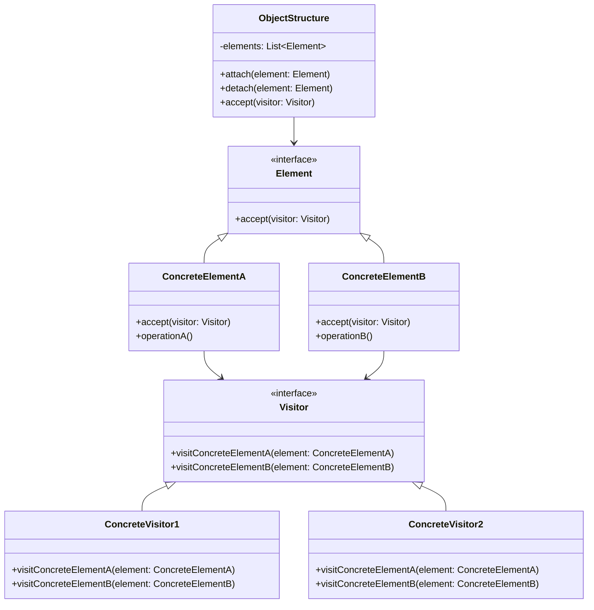
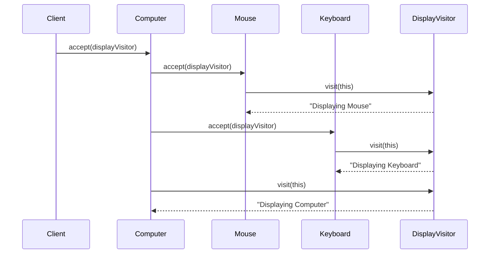

# 访问者模式 (Visitor Pattern) ⚠️ 低应用价值

> **⚠️ 注意：此模式在实际项目中应用价值较低**
> - 违反开闭原则，添加新元素类型困难
> - 破坏封装性，访问者需要了解元素内部结构
> - 实现复杂，维护成本高
> - **代码已删除，仅保留文档作为学习参考**

## 📋 模式概述

### 定义
访问者模式表示一个作用于某对象结构中的各元素的操作。它使你可以在不改变各元素类的前提下定义作用于这些元素的新操作。

### 核心思想
- 将操作与对象结构分离
- 通过双重分派实现操作选择
- 在不修改元素类的情况下增加新操作
- 集中相关操作，分离无关操作

## 🎯 解决的问题

### 主要问题
1. **操作分散**：对象结构中的操作分散在各个类中
2. **难以添加操作**：为对象结构添加新操作需要修改所有类
3. **操作不相关**：某些操作与对象的主要职责无关
4. **类型判断复杂**：需要根据对象类型执行不同操作

### 适用场景（极其有限）
- 编译器的AST处理
- 文档对象模型的操作
- 复杂对象结构的遍历
- 数据结构的序列化

## 🏗️ 模式结构

### UML类图


## 💻 代码示例

### 基础实现（已删除源码）

```java
// 访问者接口
public interface ComputerPartVisitor {
    void visit(Computer computer);
    void visit(Mouse mouse);
    void visit(Keyboard keyboard);
    void visit(Monitor monitor);
}

// 具体访问者 - 显示访问者
public class ComputerPartDisplayVisitor implements ComputerPartVisitor {
    @Override
    public void visit(Computer computer) {
        System.out.println("Displaying Computer.");
    }
    
    @Override
    public void visit(Mouse mouse) {
        System.out.println("Displaying Mouse.");
    }
    
    @Override
    public void visit(Keyboard keyboard) {
        System.out.println("Displaying Keyboard.");
    }
    
    @Override
    public void visit(Monitor monitor) {
        System.out.println("Displaying Monitor.");
    }
}

// 元素接口
public interface ComputerPart {
    void accept(ComputerPartVisitor computerPartVisitor);
}

// 具体元素
public class Mouse implements ComputerPart {
    @Override
    public void accept(ComputerPartVisitor computerPartVisitor) {
        computerPartVisitor.visit(this);
    }
}

public class Keyboard implements ComputerPart {
    @Override
    public void accept(ComputerPartVisitor computerPartVisitor) {
        computerPartVisitor.visit(this);
    }
}

// 复合元素
public class Computer implements ComputerPart {
    private ComputerPart[] parts;
    
    public Computer() {
        parts = new ComputerPart[] {
            new Mouse(), new Keyboard(), new Monitor()
        };
    }
    
    @Override
    public void accept(ComputerPartVisitor computerPartVisitor) {
        for (ComputerPart part : parts) {
            part.accept(computerPartVisitor);
        }
        computerPartVisitor.visit(this);
    }
}
```

## 🔄 时序图



## ⚡ 实际应用案例

### 案例1：AST处理（学术示例）
```java
// AST节点接口
public interface ASTNode {
    void accept(ASTVisitor visitor);
}

// 表达式节点
public class BinaryExpression implements ASTNode {
    private ASTNode left;
    private ASTNode right;
    private String operator;
    
    // 构造函数和getter...
    
    @Override
    public void accept(ASTVisitor visitor) {
        visitor.visit(this);
    }
}

// 访问者 - 代码生成
public class CodeGeneratorVisitor implements ASTVisitor {
    private StringBuilder code = new StringBuilder();
    
    @Override
    public void visit(BinaryExpression expr) {
        expr.getLeft().accept(this);
        code.append(" ").append(expr.getOperator()).append(" ");
        expr.getRight().accept(this);
    }
    
    public String getGeneratedCode() {
        return code.toString();
    }
}
```

## ⚠️ 为什么应用价值低

### 主要问题
1. **违反开闭原则**：添加新的元素类型需要修改所有访问者
2. **破坏封装性**：访问者需要访问元素的内部状态
3. **复杂的双重分派**：实现和理解都很困难
4. **维护困难**：元素和访问者之间的强耦合
5. **现代替代方案更好**：
   - 函数式编程
   - 策略模式
   - 多态方法
   - 反射机制

### 更好的替代方案

```java
// 使用函数式编程替代访问者模式
public class ComputerPart {
    private String type;
    private String name;
    
    // 构造函数和getter...
    
    public void process(Function<ComputerPart, Void> processor) {
        processor.apply(this);
    }
}

// 使用
List<ComputerPart> parts = Arrays.asList(
    new ComputerPart("Mouse", "Logitech"),
    new ComputerPart("Keyboard", "Dell")
);

// 显示操作
parts.forEach(part -> part.process(p -> {
    System.out.println("Displaying " + p.getName());
    return null;
}));

// 使用策略模式
public interface PartProcessor {
    void process(ComputerPart part);
}

public class DisplayProcessor implements PartProcessor {
    @Override
    public void process(ComputerPart part) {
        System.out.println("Displaying " + part.getName());
    }
}

// 使用多态
public abstract class ComputerPart {
    public abstract void display();
    public abstract void repair();
    public abstract double calculateCost();
}

public class Mouse extends ComputerPart {
    @Override
    public void display() {
        System.out.println("Displaying Mouse");
    }
    
    @Override
    public void repair() {
        System.out.println("Repairing Mouse");
    }
    
    @Override
    public double calculateCost() {
        return 25.0;
    }
}
```

## 📊 优缺点分析

### 优点
- ✅ 增加新操作容易
- ✅ 集中相关操作
- ✅ 可以跨越类的等级结构

### 缺点（致命缺陷）
- ❌ 增加新元素类困难
- ❌ 破坏封装性
- ❌ 违反开闭原则
- ❌ 实现复杂，难以理解

## 🎯 总结

访问者模式在现代软件开发中应用价值极低：

1. **理论价值**：有助于理解双重分派概念
2. **实用价值**：几乎为零，设计缺陷明显
3. **建议**：避免使用，选择更好的替代方案

**推荐替代方案**：
- 使用函数式编程和Lambda表达式
- 采用策略模式处理不同操作
- 利用多态机制
- 使用反射和注解
- 采用现代的数据处理库

> 💡 **学习建议**：了解其概念即可，重点学习其他更实用的设计模式。访问者模式是一个反面教材，说明了过度设计的问题。