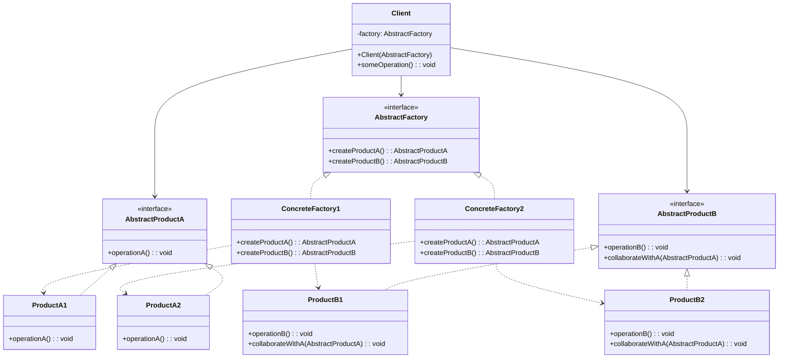
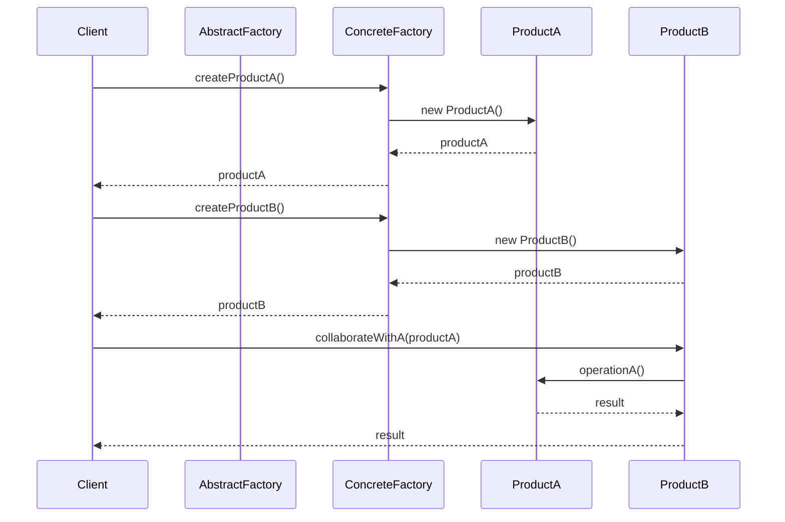

# 抽象工厂模式 (Abstract Factory Pattern)

## 📋 模式概述

### 定义
抽象工厂模式提供一个创建一系列相关或相互依赖对象的接口，而无需指定它们具体的类。

### 意图
- 提供一个创建产品族的接口
- 确保创建的产品之间相互兼容
- 隐藏具体产品的实现细节
- 支持产品族的切换

## 🏗️ 结构图



## ⏱️ 时序图



## 💻 代码实现

### 基础实现

```java
/**
 * 抽象产品A
 */
public interface AbstractProductA {
    void operationA();
    String getInfo();
}

/**
 * 抽象产品B
 */
public interface AbstractProductB {
    void operationB();
    void collaborateWithA(AbstractProductA productA);
    String getInfo();
}

/**
 * 具体产品A1
 */
public class ProductA1 implements AbstractProductA {
    @Override
    public void operationA() {
        System.out.println("ProductA1 执行操作A");
    }
    
    @Override
    public String getInfo() {
        return "产品A1";
    }
}

/**
 * 具体产品A2
 */
public class ProductA2 implements AbstractProductA {
    @Override
    public void operationA() {
        System.out.println("ProductA2 执行操作A");
    }
    
    @Override
    public String getInfo() {
        return "产品A2";
    }
}

/**
 * 具体产品B1
 */
public class ProductB1 implements AbstractProductB {
    @Override
    public void operationB() {
        System.out.println("ProductB1 执行操作B");
    }
    
    @Override
    public void collaborateWithA(AbstractProductA productA) {
        System.out.println("ProductB1 与 " + productA.getInfo() + " 协作");
        productA.operationA();
    }
    
    @Override
    public String getInfo() {
        return "产品B1";
    }
}

/**
 * 具体产品B2
 */
public class ProductB2 implements AbstractProductB {
    @Override
    public void operationB() {
        System.out.println("ProductB2 执行操作B");
    }
    
    @Override
    public void collaborateWithA(AbstractProductA productA) {
        System.out.println("ProductB2 与 " + productA.getInfo() + " 协作");
        productA.operationA();
    }
    
    @Override
    public String getInfo() {
        return "产品B2";
    }
}

/**
 * 抽象工厂
 */
public interface AbstractFactory {
    AbstractProductA createProductA();
    AbstractProductB createProductB();
}

/**
 * 具体工厂1
 */
public class ConcreteFactory1 implements AbstractFactory {
    @Override
    public AbstractProductA createProductA() {
        return new ProductA1();
    }
    
    @Override
    public AbstractProductB createProductB() {
        return new ProductB1();
    }
}

/**
 * 具体工厂2
 */
public class ConcreteFactory2 implements AbstractFactory {
    @Override
    public AbstractProductA createProductA() {
        return new ProductA2();
    }
    
    @Override
    public AbstractProductB createProductB() {
        return new ProductB2();
    }
}

/**
 * 客户端
 */
public class Client {
    private AbstractProductA productA;
    private AbstractProductB productB;
    
    public Client(AbstractFactory factory) {
        productA = factory.createProductA();
        productB = factory.createProductB();
    }
    
    public void run() {
        productA.operationA();
        productB.operationB();
        productB.collaborateWithA(productA);
    }
}
```

## 🧪 实际应用示例

### 1. GUI组件工厂

```java
/**
 * 按钮接口
 */
public interface Button {
    void render();
    void onClick();
}

/**
 * 复选框接口
 */
public interface Checkbox {
    void render();
    void toggle();
}

/**
 * Windows按钮
 */
public class WindowsButton implements Button {
    @Override
    public void render() {
        System.out.println("渲染Windows风格按钮");
    }
    
    @Override
    public void onClick() {
        System.out.println("Windows按钮点击事件");
    }
}

/**
 * Windows复选框
 */
public class WindowsCheckbox implements Checkbox {
    private boolean checked = false;
    
    @Override
    public void render() {
        System.out.println("渲染Windows风格复选框");
    }
    
    @Override
    public void toggle() {
        checked = !checked;
        System.out.println("Windows复选框状态: " + (checked ? "选中" : "未选中"));
    }
}

/**
 * Mac按钮
 */
public class MacButton implements Button {
    @Override
    public void render() {
        System.out.println("渲染Mac风格按钮");
    }
    
    @Override
    public void onClick() {
        System.out.println("Mac按钮点击事件");
    }
}

/**
 * Mac复选框
 */
public class MacCheckbox implements Checkbox {
    private boolean checked = false;
    
    @Override
    public void render() {
        System.out.println("渲染Mac风格复选框");
    }
    
    @Override
    public void toggle() {
        checked = !checked;
        System.out.println("Mac复选框状态: " + (checked ? "选中" : "未选中"));
    }
}

/**
 * GUI工厂接口
 */
public interface GUIFactory {
    Button createButton();
    Checkbox createCheckbox();
}

/**
 * Windows工厂
 */
public class WindowsFactory implements GUIFactory {
    @Override
    public Button createButton() {
        return new WindowsButton();
    }
    
    @Override
    public Checkbox createCheckbox() {
        return new WindowsCheckbox();
    }
}

/**
 * Mac工厂
 */
public class MacFactory implements GUIFactory {
    @Override
    public Button createButton() {
        return new MacButton();
    }
    
    @Override
    public Checkbox createCheckbox() {
        return new MacCheckbox();
    }
}

/**
 * 应用程序类
 */
public class Application {
    private Button button;
    private Checkbox checkbox;
    
    public Application(GUIFactory factory) {
        button = factory.createButton();
        checkbox = factory.createCheckbox();
    }
    
    public void render() {
        button.render();
        checkbox.render();
    }
    
    public void interact() {
        button.onClick();
        checkbox.toggle();
    }
}

// 使用示例
public class GUIFactoryDemo {
    public static void main(String[] args) {
        GUIFactory factory;
        String osName = System.getProperty("os.name").toLowerCase();
        
        if (osName.contains("windows")) {
            factory = new WindowsFactory();
        } else if (osName.contains("mac")) {
            factory = new MacFactory();
        } else {
            factory = new WindowsFactory(); // 默认
        }
        
        Application app = new Application(factory);
        app.render();
        app.interact();
    }
}
```

### 2. 数据库访问工厂

```java
/**
 * 数据库连接接口
 */
public interface DatabaseConnection {
    void connect();
    void disconnect();
    String getConnectionInfo();
}

/**
 * 数据库命令接口
 */
public interface DatabaseCommand {
    void execute(String sql);
    void executeQuery(String sql);
    void executeUpdate(String sql);
}

/**
 * MySQL连接
 */
public class MySQLConnection implements DatabaseConnection {
    private String url;
    
    public MySQLConnection(String url) {
        this.url = url;
    }
    
    @Override
    public void connect() {
        System.out.println("连接到MySQL数据库: " + url);
    }
    
    @Override
    public void disconnect() {
        System.out.println("断开MySQL连接");
    }
    
    @Override
    public String getConnectionInfo() {
        return "MySQL连接: " + url;
    }
}

/**
 * MySQL命令
 */
public class MySQLCommand implements DatabaseCommand {
    private DatabaseConnection connection;
    
    public MySQLCommand(DatabaseConnection connection) {
        this.connection = connection;
    }
    
    @Override
    public void execute(String sql) {
        System.out.println("MySQL执行: " + sql);
    }
    
    @Override
    public void executeQuery(String sql) {
        System.out.println("MySQL查询: " + sql);
    }
    
    @Override
    public void executeUpdate(String sql) {
        System.out.println("MySQL更新: " + sql);
    }
}

/**
 * PostgreSQL连接
 */
public class PostgreSQLConnection implements DatabaseConnection {
    private String url;
    
    public PostgreSQLConnection(String url) {
        this.url = url;
    }
    
    @Override
    public void connect() {
        System.out.println("连接到PostgreSQL数据库: " + url);
    }
    
    @Override
    public void disconnect() {
        System.out.println("断开PostgreSQL连接");
    }
    
    @Override
    public String getConnectionInfo() {
        return "PostgreSQL连接: " + url;
    }
}

/**
 * PostgreSQL命令
 */
public class PostgreSQLCommand implements DatabaseCommand {
    private DatabaseConnection connection;
    
    public PostgreSQLCommand(DatabaseConnection connection) {
        this.connection = connection;
    }
    
    @Override
    public void execute(String sql) {
        System.out.println("PostgreSQL执行: " + sql);
    }
    
    @Override
    public void executeQuery(String sql) {
        System.out.println("PostgreSQL查询: " + sql);
    }
    
    @Override
    public void executeUpdate(String sql) {
        System.out.println("PostgreSQL更新: " + sql);
    }
}

/**
 * 数据库工厂接口
 */
public interface DatabaseFactory {
    DatabaseConnection createConnection(String url);
    DatabaseCommand createCommand(DatabaseConnection connection);
}

/**
 * MySQL工厂
 */
public class MySQLFactory implements DatabaseFactory {
    @Override
    public DatabaseConnection createConnection(String url) {
        return new MySQLConnection(url);
    }
    
    @Override
    public DatabaseCommand createCommand(DatabaseConnection connection) {
        return new MySQLCommand(connection);
    }
}

/**
 * PostgreSQL工厂
 */
public class PostgreSQLFactory implements DatabaseFactory {
    @Override
    public DatabaseConnection createConnection(String url) {
        return new PostgreSQLConnection(url);
    }
    
    @Override
    public DatabaseCommand createCommand(DatabaseConnection connection) {
        return new PostgreSQLCommand(connection);
    }
}

/**
 * 数据库客户端
 */
public class DatabaseClient {
    private DatabaseConnection connection;
    private DatabaseCommand command;
    
    public DatabaseClient(DatabaseFactory factory, String url) {
        connection = factory.createConnection(url);
        command = factory.createCommand(connection);
    }
    
    public void performDatabaseOperations() {
        connection.connect();
        
        command.executeQuery("SELECT * FROM users");
        command.executeUpdate("UPDATE users SET status = 'active'");
        command.execute("CREATE INDEX idx_user_email ON users(email)");
        
        connection.disconnect();
    }
}

// 使用示例
public class DatabaseFactoryDemo {
    public static void main(String[] args) {
        // 根据配置选择数据库类型
        String dbType = "mysql"; // 可以从配置文件读取
        DatabaseFactory factory = getDatabaseFactory(dbType);
        
        DatabaseClient client = new DatabaseClient(factory, "localhost:3306/testdb");
        client.performDatabaseOperations();
        
        // 切换到PostgreSQL
        dbType = "postgresql";
        factory = getDatabaseFactory(dbType);
        client = new DatabaseClient(factory, "localhost:5432/testdb");
        client.performDatabaseOperations();
    }
    
    private static DatabaseFactory getDatabaseFactory(String dbType) {
        switch (dbType.toLowerCase()) {
            case "mysql":
                return new MySQLFactory();
            case "postgresql":
                return new PostgreSQLFactory();
            default:
                throw new IllegalArgumentException("不支持的数据库类型: " + dbType);
        }
    }
}
```

### 3. 游戏角色工厂

```java
/**
 * 武器接口
 */
public interface Weapon {
    void attack();
    int getDamage();
    String getName();
}

/**
 * 护甲接口
 */
public interface Armor {
    void defend();
    int getDefense();
    String getName();
}

/**
 * 战士武器
 */
public class WarriorSword implements Weapon {
    @Override
    public void attack() {
        System.out.println("挥舞战士之剑进行攻击！");
    }
    
    @Override
    public int getDamage() {
        return 50;
    }
    
    @Override
    public String getName() {
        return "战士之剑";
    }
}

/**
 * 战士护甲
 */
public class WarriorArmor implements Armor {
    @Override
    public void defend() {
        System.out.println("战士重甲提供防护！");
    }
    
    @Override
    public int getDefense() {
        return 30;
    }
    
    @Override
    public String getName() {
        return "战士重甲";
    }
}

/**
 * 法师武器
 */
public class MageStaff implements Weapon {
    @Override
    public void attack() {
        System.out.println("挥舞法师法杖释放魔法！");
    }
    
    @Override
    public int getDamage() {
        return 40;
    }
    
    @Override
    public String getName() {
        return "法师法杖";
    }
}

/**
 * 法师护甲
 */
public class MageRobe implements Armor {
    @Override
    public void defend() {
        System.out.println("法师长袍提供魔法防护！");
    }
    
    @Override
    public int getDefense() {
        return 15;
    }
    
    @Override
    public String getName() {
        return "法师长袍";
    }
}

/**
 * 弓箭手武器
 */
public class ArcherBow implements Weapon {
    @Override
    public void attack() {
        System.out.println("拉弓射箭进行远程攻击！");
    }
    
    @Override
    public int getDamage() {
        return 35;
    }
    
    @Override
    public String getName() {
        return "精灵之弓";
    }
}

/**
 * 弓箭手护甲
 */
public class ArcherLeather implements Armor {
    @Override
    public void defend() {
        System.out.println("皮甲提供灵活防护！");
    }
    
    @Override
    public int getDefense() {
        return 20;
    }
    
    @Override
    public String getName() {
        return "精制皮甲";
    }
}

/**
 * 角色装备工厂接口
 */
public interface CharacterEquipmentFactory {
    Weapon createWeapon();
    Armor createArmor();
}

/**
 * 战士装备工厂
 */
public class WarriorEquipmentFactory implements CharacterEquipmentFactory {
    @Override
    public Weapon createWeapon() {
        return new WarriorSword();
    }
    
    @Override
    public Armor createArmor() {
        return new WarriorArmor();
    }
}

/**
 * 法师装备工厂
 */
public class MageEquipmentFactory implements CharacterEquipmentFactory {
    @Override
    public Weapon createWeapon() {
        return new MageStaff();
    }
    
    @Override
    public Armor createArmor() {
        return new MageRobe();
    }
}

/**
 * 弓箭手装备工厂
 */
public class ArcherEquipmentFactory implements CharacterEquipmentFactory {
    @Override
    public Weapon createWeapon() {
        return new ArcherBow();
    }
    
    @Override
    public Armor createArmor() {
        return new ArcherLeather();
    }
}

/**
 * 游戏角色
 */
public class GameCharacter {
    private String name;
    private String characterClass;
    private Weapon weapon;
    private Armor armor;
    private int health = 100;
    
    public GameCharacter(String name, String characterClass, CharacterEquipmentFactory factory) {
        this.name = name;
        this.characterClass = characterClass;
        this.weapon = factory.createWeapon();
        this.armor = factory.createArmor();
    }
    
    public void displayInfo() {
        System.out.println("=== 角色信息 ===");
        System.out.println("姓名: " + name);
        System.out.println("职业: " + characterClass);
        System.out.println("生命值: " + health);
        System.out.println("武器: " + weapon.getName() + " (攻击力: " + weapon.getDamage() + ")");
        System.out.println("护甲: " + armor.getName() + " (防御力: " + armor.getDefense() + ")");
    }
    
    public void attack() {
        System.out.println(name + " 发起攻击:");
        weapon.attack();
    }
    
    public void defend() {
        System.out.println(name + " 进行防御:");
        armor.defend();
    }
}

// 使用示例
public class GameCharacterDemo {
    public static void main(String[] args) {
        // 创建不同职业的角色
        GameCharacter warrior = createCharacter("亚瑟", "战士");
        GameCharacter mage = createCharacter("梅林", "法师");
        GameCharacter archer = createCharacter("罗宾", "弓箭手");
        
        // 显示角色信息
        warrior.displayInfo();
        System.out.println();
        mage.displayInfo();
        System.out.println();
        archer.displayInfo();
        System.out.println();
        
        // 角色行动
        warrior.attack();
        warrior.defend();
        System.out.println();
        
        mage.attack();
        mage.defend();
        System.out.println();
        
        archer.attack();
        archer.defend();
    }
    
    private static GameCharacter createCharacter(String name, String characterClass) {
        CharacterEquipmentFactory factory;
        
        switch (characterClass) {
            case "战士":
                factory = new WarriorEquipmentFactory();
                break;
            case "法师":
                factory = new MageEquipmentFactory();
                break;
            case "弓箭手":
                factory = new ArcherEquipmentFactory();
                break;
            default:
                throw new IllegalArgumentException("未知的角色职业: " + characterClass);
        }
        
        return new GameCharacter(name, characterClass, factory);
    }
}
```

## 🎯 适用场景

### 适合使用抽象工厂模式的场景：

1. **系统需要独立于产品的创建、组合和表示**
2. **系统需要由多个产品系列中的一个来配置**
3. **需要强调一系列相关产品对象的设计以便进行联合使用**
4. **需要提供一个产品类库，只显示接口而不显示实现**

### 具体应用场景：

- **跨平台GUI应用** - 不同操作系统的UI组件
- **数据库访问层** - 不同数据库的连接和操作
- **游戏开发** - 不同角色的装备和技能
- **主题系统** - 不同主题的样式和组件
- **多媒体处理** - 不同格式的编解码器

## ✅ 优点

1. **确保产品族的一致性** - 同一工厂创建的产品相互兼容
2. **分离具体类** - 客户端与具体产品类解耦
3. **易于交换产品系列** - 只需更换工厂即可
4. **有利于产品的一致性** - 强制约束相关产品一起使用

## ❌ 缺点

1. **难以支持新种类的产品** - 需要修改抽象工厂接口
2. **增加了系统的抽象性和理解难度**
3. **代码量增加** - 需要创建很多类

## 🔄 与其他模式的关系

- **工厂方法模式** - 抽象工厂通常用工厂方法实现
- **单例模式** - 具体工厂通常设计为单例
- **原型模式** - 具体工厂可以使用原型模式存储产品原型
- **建造者模式** - 建造者模式关注单个产品的构建，抽象工厂关注产品族

## 📝 最佳实践

1. **保持产品族的一致性** - 确保同一工厂创建的产品能够协同工作
2. **使用配置文件** - 通过配置选择具体工厂
3. **考虑使用依赖注入** - 现代框架中的替代方案
4. **提供工厂注册机制** - 支持动态添加新的工厂
5. **文档化产品族关系** - 清楚说明产品间的依赖关系

## 🚨 注意事项

1. **产品族扩展困难** - 添加新产品类型需要修改所有工厂
2. **不要过度设计** - 简单场景不需要抽象工厂
3. **考虑性能影响** - 工厂创建可能带来性能开销
4. **保持接口稳定** - 抽象工厂接口变更影响所有实现

---

*抽象工厂模式是处理产品族的最佳选择，它确保了相关产品的一致性，同时提供了良好的扩展性。*