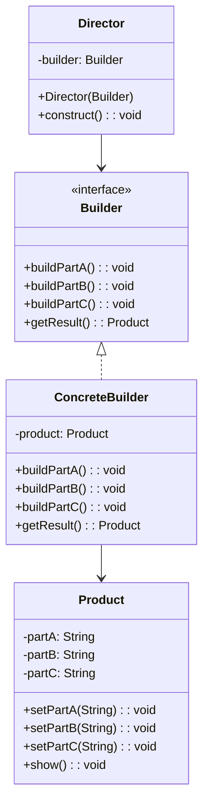
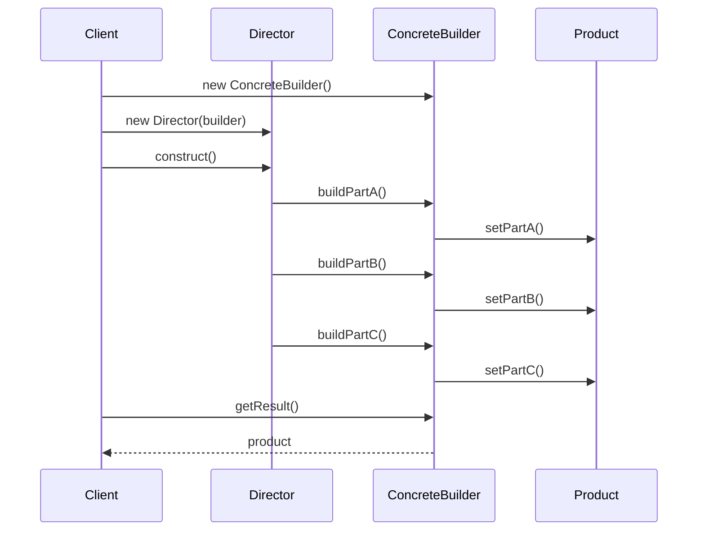

# 建造者模式 (Builder Pattern)

## 📋 模式概述

### 定义
建造者模式将一个复杂对象的构建与它的表示分离，使得同样的构建过程可以创建不同的表示。

### 意图
- 分步骤创建复杂对象
- 相同的构建过程可以创建不同的产品
- 将复杂对象的创建过程封装起来
- 提供对象创建过程的精细控制

## 🏗️ 结构图



## ⏱️ 时序图



## 💻 代码实现

### 基础实现

```java
/**
 * 产品类
 */
public class Product {
    private String partA;
    private String partB;
    private String partC;
    
    public void setPartA(String partA) {
        this.partA = partA;
    }
    
    public void setPartB(String partB) {
        this.partB = partB;
    }
    
    public void setPartC(String partC) {
        this.partC = partC;
    }
    
    public void show() {
        System.out.println("产品组成:");
        System.out.println("部件A: " + partA);
        System.out.println("部件B: " + partB);
        System.out.println("部件C: " + partC);
    }
}

/**
 * 抽象建造者
 */
public abstract class Builder {
    protected Product product = new Product();
    
    public abstract void buildPartA();
    public abstract void buildPartB();
    public abstract void buildPartC();
    
    public Product getResult() {
        return product;
    }
}

/**
 * 具体建造者1
 */
public class ConcreteBuilder1 extends Builder {
    @Override
    public void buildPartA() {
        product.setPartA("建造者1的部件A");
    }
    
    @Override
    public void buildPartB() {
        product.setPartB("建造者1的部件B");
    }
    
    @Override
    public void buildPartC() {
        product.setPartC("建造者1的部件C");
    }
}

/**
 * 具体建造者2
 */
public class ConcreteBuilder2 extends Builder {
    @Override
    public void buildPartA() {
        product.setPartA("建造者2的部件A");
    }
    
    @Override
    public void buildPartB() {
        product.setPartB("建造者2的部件B");
    }
    
    @Override
    public void buildPartC() {
        product.setPartC("建造者2的部件C");
    }
}

/**
 * 指挥者
 */
public class Director {
    private Builder builder;
    
    public Director(Builder builder) {
        this.builder = builder;
    }
    
    public void construct() {
        builder.buildPartA();
        builder.buildPartB();
        builder.buildPartC();
    }
}
```

## 🎯 适用场景

### 适合使用建造者模式的场景：

1. **创建复杂对象** - 对象有很多属性需要设置
2. **构建过程复杂** - 需要多个步骤来创建对象
3. **产品有多种表示** - 同样的构建过程可以创建不同的产品
4. **需要精细控制构建过程** - 可以控制构建的顺序和方式

### 具体应用场景：

- **计算机配置** - 组装不同配置的计算机
- **SQL查询构建** - 动态构建复杂的SQL语句
- **文档生成** - 构建不同格式的文档
- **游戏角色创建** - 创建具有不同属性的游戏角色
- **配置对象** - 创建复杂的配置对象

## ✅ 优点

1. **分离构建和表示** - 构建过程和最终表示分离
2. **精细控制构建过程** - 可以控制构建的每个步骤
3. **代码复用** - 相同的构建过程可以创建不同的产品
4. **易于扩展** - 可以独立扩展构建过程和产品表示

## ❌ 缺点

1. **增加代码复杂性** - 需要创建多个类
2. **产品必须有共同点** - 产品之间必须有足够的相似性
3. **内部结构复杂** - 如果产品内部变化复杂，建造者也会变得复杂

## 🔄 与其他模式的关系

- **抽象工厂模式** - 都用于创建复杂对象，但建造者关注构建过程
- **组合模式** - 建造者通常构建组合模式的产品
- **单例模式** - 建造者通常设计为单例

## 📝 最佳实践

1. **使用链式调用** - 提供流畅的API
2. **提供默认值** - 为可选参数提供合理的默认值
3. **验证参数** - 在构建过程中验证参数的有效性
4. **考虑不可变对象** - 构建不可变的产品对象
5. **提供重置功能** - 允许重用建造者

## 🚨 注意事项

1. **产品复杂性** - 只有在产品足够复杂时才使用
2. **构建顺序** - 注意构建步骤的顺序依赖
3. **线程安全** - 多线程环境下要考虑线程安全
4. **内存使用** - 避免在建造者中保留不必要的引用

---

*建造者模式是创建复杂对象的最佳选择，它提供了灵活的构建过程，同时保持了代码的清晰和可维护性。*