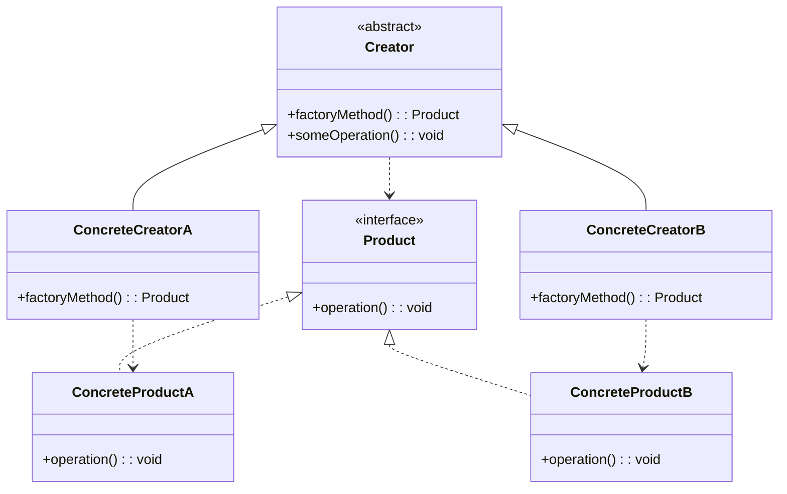
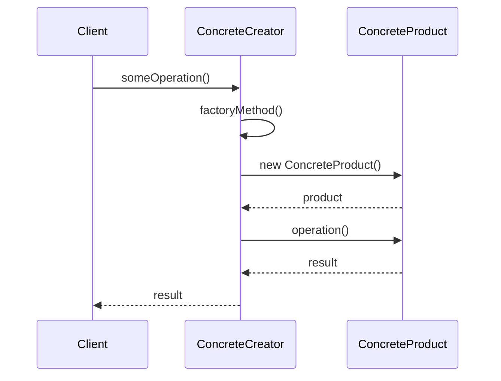

# 工厂方法模式 (Factory Method Pattern)

## 📋 模式概述

### 定义
工厂方法模式定义了一个创建对象的接口，但让子类决定实例化哪一个类。工厂方法让类的实例化推迟到子类。

### 意图
- 创建对象时不指定具体的类
- 将对象的创建和使用分离
- 提供一个创建对象的接口，由子类决定实例化哪个类

## 🏗️ 结构图



## ⏱️ 时序图



## 💻 代码实现

### 基础实现

```java
/**
 * 产品接口
 */
public interface Product {
    void operation();
    String getInfo();
}

/**
 * 具体产品A
 */
public class ConcreteProductA implements Product {
    @Override
    public void operation() {
        System.out.println("ConcreteProductA 执行操作");
    }
    
    @Override
    public String getInfo() {
        return "这是产品A";
    }
}

/**
 * 具体产品B
 */
public class ConcreteProductB implements Product {
    @Override
    public void operation() {
        System.out.println("ConcreteProductB 执行操作");
    }
    
    @Override
    public String getInfo() {
        return "这是产品B";
    }
}

/**
 * 抽象创建者
 */
public abstract class Creator {
    // 工厂方法，由子类实现
    public abstract Product factoryMethod();
    
    // 模板方法，使用工厂方法创建产品
    public void someOperation() {
        System.out.println("Creator: 开始执行操作");
        Product product = factoryMethod();
        System.out.println("Creator: 创建了产品 - " + product.getInfo());
        product.operation();
        System.out.println("Creator: 操作完成");
    }
}

/**
 * 具体创建者A
 */
public class ConcreteCreatorA extends Creator {
    @Override
    public Product factoryMethod() {
        System.out.println("ConcreteCreatorA: 创建产品A");
        return new ConcreteProductA();
    }
}

/**
 * 具体创建者B
 */
public class ConcreteCreatorB extends Creator {
    @Override
    public Product factoryMethod() {
        System.out.println("ConcreteCreatorB: 创建产品B");
        return new ConcreteProductB();
    }
}
```

## 🧪 实际应用示例

### 1. 日志记录器工厂

```java
/**
 * 日志记录器接口
 */
public interface Logger {
    void log(String message);
    void setLevel(LogLevel level);
}

/**
 * 日志级别枚举
 */
public enum LogLevel {
    DEBUG, INFO, WARN, ERROR
}

/**
 * 文件日志记录器
 */
public class FileLogger implements Logger {
    private String filename;
    private LogLevel level = LogLevel.INFO;
    
    public FileLogger(String filename) {
        this.filename = filename;
    }
    
    @Override
    public void log(String message) {
        System.out.println("[FILE:" + filename + "] " + message);
        // 实际实现会写入文件
    }
    
    @Override
    public void setLevel(LogLevel level) {
        this.level = level;
    }
}

/**
 * 控制台日志记录器
 */
public class ConsoleLogger implements Logger {
    private LogLevel level = LogLevel.INFO;
    
    @Override
    public void log(String message) {
        System.out.println("[CONSOLE] " + message);
    }
    
    @Override
    public void setLevel(LogLevel level) {
        this.level = level;
    }
}

/**
 * 数据库日志记录器
 */
public class DatabaseLogger implements Logger {
    private String connectionString;
    private LogLevel level = LogLevel.INFO;
    
    public DatabaseLogger(String connectionString) {
        this.connectionString = connectionString;
    }
    
    @Override
    public void log(String message) {
        System.out.println("[DATABASE:" + connectionString + "] " + message);
        // 实际实现会写入数据库
    }
    
    @Override
    public void setLevel(LogLevel level) {
        this.level = level;
    }
}

/**
 * 抽象日志工厂
 */
public abstract class LoggerFactory {
    // 工厂方法
    public abstract Logger createLogger();
    
    // 模板方法
    public Logger getLogger() {
        Logger logger = createLogger();
        logger.setLevel(LogLevel.INFO);
        return logger;
    }
}

/**
 * 文件日志工厂
 */
public class FileLoggerFactory extends LoggerFactory {
    private String filename;
    
    public FileLoggerFactory(String filename) {
        this.filename = filename;
    }
    
    @Override
    public Logger createLogger() {
        return new FileLogger(filename);
    }
}

/**
 * 控制台日志工厂
 */
public class ConsoleLoggerFactory extends LoggerFactory {
    @Override
    public Logger createLogger() {
        return new ConsoleLogger();
    }
}

/**
 * 数据库日志工厂
 */
public class DatabaseLoggerFactory extends LoggerFactory {
    private String connectionString;
    
    public DatabaseLoggerFactory(String connectionString) {
        this.connectionString = connectionString;
    }
    
    @Override
    public Logger createLogger() {
        return new DatabaseLogger(connectionString);
    }
}

// 使用示例
public class LoggerFactoryDemo {
    public static void main(String[] args) {
        // 创建不同类型的日志工厂
        LoggerFactory fileFactory = new FileLoggerFactory("app.log");
        LoggerFactory consoleFactory = new ConsoleLoggerFactory();
        LoggerFactory dbFactory = new DatabaseLoggerFactory("jdbc:mysql://localhost:3306/logs");
        
        // 使用工厂创建日志记录器
        Logger fileLogger = fileFactory.getLogger();
        Logger consoleLogger = consoleFactory.getLogger();
        Logger dbLogger = dbFactory.getLogger();
        
        // 记录日志
        fileLogger.log("这是文件日志消息");
        consoleLogger.log("这是控制台日志消息");
        dbLogger.log("这是数据库日志消息");
    }
}
```

### 2. 图形界面组件工厂

```java
/**
 * 按钮接口
 */
public interface Button {
    void render();
    void onClick();
}

/**
 * Windows风格按钮
 */
public class WindowsButton implements Button {
    @Override
    public void render() {
        System.out.println("渲染Windows风格按钮");
    }
    
    @Override
    public void onClick() {
        System.out.println("Windows按钮被点击");
    }
}

/**
 * Mac风格按钮
 */
public class MacButton implements Button {
    @Override
    public void render() {
        System.out.println("渲染Mac风格按钮");
    }
    
    @Override
    public void onClick() {
        System.out.println("Mac按钮被点击");
    }
}

/**
 * Linux风格按钮
 */
public class LinuxButton implements Button {
    @Override
    public void render() {
        System.out.println("渲染Linux风格按钮");
    }
    
    @Override
    public void onClick() {
        System.out.println("Linux按钮被点击");
    }
}

/**
 * 抽象对话框类
 */
public abstract class Dialog {
    // 工厂方法
    public abstract Button createButton();
    
    // 模板方法
    public void render() {
        Button okButton = createButton();
        okButton.render();
        okButton.onClick();
    }
}

/**
 * Windows对话框
 */
public class WindowsDialog extends Dialog {
    @Override
    public Button createButton() {
        return new WindowsButton();
    }
}

/**
 * Mac对话框
 */
public class MacDialog extends Dialog {
    @Override
    public Button createButton() {
        return new MacButton();
    }
}

/**
 * Linux对话框
 */
public class LinuxDialog extends Dialog {
    @Override
    public Button createButton() {
        return new LinuxButton();
    }
}

// 使用示例
public class DialogDemo {
    private static Dialog dialog;
    
    public static void main(String[] args) {
        configure();
        runBusinessLogic();
    }
    
    static void configure() {
        String osName = System.getProperty("os.name").toLowerCase();
        if (osName.contains("windows")) {
            dialog = new WindowsDialog();
        } else if (osName.contains("mac")) {
            dialog = new MacDialog();
        } else {
            dialog = new LinuxDialog();
        }
    }
    
    static void runBusinessLogic() {
        dialog.render();
    }
}
```

### 3. 数据库连接工厂

```java
/**
 * 数据库连接接口
 */
public interface DatabaseConnection {
    void connect();
    void executeQuery(String sql);
    void close();
}

/**
 * MySQL连接
 */
public class MySQLConnection implements DatabaseConnection {
    private String url;
    
    public MySQLConnection(String url) {
        this.url = url;
    }
    
    @Override
    public void connect() {
        System.out.println("连接到MySQL数据库: " + url);
    }
    
    @Override
    public void executeQuery(String sql) {
        System.out.println("在MySQL中执行查询: " + sql);
    }
    
    @Override
    public void close() {
        System.out.println("关闭MySQL连接");
    }
}

/**
 * PostgreSQL连接
 */
public class PostgreSQLConnection implements DatabaseConnection {
    private String url;
    
    public PostgreSQLConnection(String url) {
        this.url = url;
    }
    
    @Override
    public void connect() {
        System.out.println("连接到PostgreSQL数据库: " + url);
    }
    
    @Override
    public void executeQuery(String sql) {
        System.out.println("在PostgreSQL中执行查询: " + sql);
    }
    
    @Override
    public void close() {
        System.out.println("关闭PostgreSQL连接");
    }
}

/**
 * Oracle连接
 */
public class OracleConnection implements DatabaseConnection {
    private String url;
    
    public OracleConnection(String url) {
        this.url = url;
    }
    
    @Override
    public void connect() {
        System.out.println("连接到Oracle数据库: " + url);
    }
    
    @Override
    public void executeQuery(String sql) {
        System.out.println("在Oracle中执行查询: " + sql);
    }
    
    @Override
    public void close() {
        System.out.println("关闭Oracle连接");
    }
}

/**
 * 抽象数据库工厂
 */
public abstract class DatabaseFactory {
    // 工厂方法
    public abstract DatabaseConnection createConnection(String url);
    
    // 模板方法
    public void performDatabaseOperation(String url, String sql) {
        DatabaseConnection connection = createConnection(url);
        connection.connect();
        connection.executeQuery(sql);
        connection.close();
    }
}

/**
 * MySQL工厂
 */
public class MySQLFactory extends DatabaseFactory {
    @Override
    public DatabaseConnection createConnection(String url) {
        return new MySQLConnection(url);
    }
}

/**
 * PostgreSQL工厂
 */
public class PostgreSQLFactory extends DatabaseFactory {
    @Override
    public DatabaseConnection createConnection(String url) {
        return new PostgreSQLConnection(url);
    }
}

/**
 * Oracle工厂
 */
public class OracleFactory extends DatabaseFactory {
    @Override
    public DatabaseConnection createConnection(String url) {
        return new OracleConnection(url);
    }
}

// 使用示例
public class DatabaseFactoryDemo {
    public static void main(String[] args) {
        // 根据配置选择数据库类型
        String dbType = "mysql"; // 可以从配置文件读取
        DatabaseFactory factory = getDatabaseFactory(dbType);
        
        // 执行数据库操作
        factory.performDatabaseOperation(
            "jdbc:mysql://localhost:3306/test", 
            "SELECT * FROM users"
        );
    }
    
    private static DatabaseFactory getDatabaseFactory(String dbType) {
        switch (dbType.toLowerCase()) {
            case "mysql":
                return new MySQLFactory();
            case "postgresql":
                return new PostgreSQLFactory();
            case "oracle":
                return new OracleFactory();
            default:
                throw new IllegalArgumentException("不支持的数据库类型: " + dbType);
        }
    }
}
```

## 🎯 适用场景

### 适合使用工厂方法模式的场景：

1. **创建对象的类型在运行时确定**
2. **需要为不同的产品族提供统一的创建接口**
3. **系统需要独立于产品的创建过程**
4. **需要提供一个产品类库，只显示接口而不显示实现**
5. **系统需要由多个产品系列中的一个来配置**

### 具体应用场景：

- **日志记录系统** - 根据配置创建不同类型的日志记录器
- **数据库访问** - 根据数据库类型创建相应的连接
- **UI组件** - 根据操作系统创建相应风格的组件
- **文档处理** - 根据文件类型创建相应的处理器
- **支付系统** - 根据支付方式创建相应的支付处理器

## ✅ 优点

1. **遵循开闭原则** - 添加新产品无需修改现有代码
2. **遵循单一职责原则** - 将产品创建代码移到一个位置
3. **避免创建者和具体产品的紧耦合**
4. **提供了一个创建对象的接口**
5. **支持产品的一致性**

## ❌ 缺点

1. **增加了系统复杂性** - 需要引入很多新的子类
2. **客户端代码可能变得复杂** - 需要创建对应的工厂类
3. **增加了系统的抽象性和理解难度**

## 🔄 与其他模式的关系

- **抽象工厂模式** - 工厂方法模式是抽象工厂模式的基础
- **模板方法模式** - 工厂方法通常在模板方法中被调用
- **原型模式** - 工厂方法可以基于原型来创建对象
- **单例模式** - 工厂类通常设计为单例

## 📝 最佳实践

1. **使用抽象类而不是接口** - 当需要提供默认实现时
2. **考虑使用泛型** - 提高类型安全性
3. **结合配置文件** - 使工厂选择更加灵活
4. **提供工厂注册机制** - 支持动态添加新的工厂
5. **考虑使用依赖注入** - 现代框架中的替代方案

## 🚨 注意事项

1. **不要过度使用** - 简单的对象创建不需要工厂方法
2. **考虑性能影响** - 工厂方法可能带来额外的性能开销
3. **保持接口简单** - 避免工厂方法过于复杂
4. **文档化工厂选择逻辑** - 让其他开发者容易理解

---

*工厂方法模式是创建型模式的核心，它提供了一种创建对象的最佳方式，同时保持了代码的灵活性和可扩展性。*