# 原型模式 (Prototype Pattern)

## 📋 模式概述

### 定义
原型模式通过复制现有的实例来创建新的实例，而不是通过实例化类来创建。

### 意图
- 通过克隆现有对象来创建新对象
- 避免创建对象时的初始化开销
- 动态地添加或删除产品
- 指定新对象的值通过改变结构

## 🏗️ 结构图


## ⏱️ 时序图

```mermaid
sequenceDiagram
    participant Client
    participant Prototype
    participant ClonedObject
    
    Client->>Prototype: clone()
    Prototype->>ClonedObject: new ClonedObject()
    ClonedObject->>ClonedObject: 复制属性
    ClonedObject-->>Prototype: clonedObject
    Prototype-->>Client: clonedObject
    
    Client->>ClonedObject: 修改属性
    
    note over Client, ClonedObject: 原对象和克隆对象独立存在
```



## 💻 代码实现

### 基础实现

```java
/**
 * 原型接口
 */
public interface Prototype extends Cloneable {
    Prototype clone();
}

/**
 * 具体原型类
 */
public class ConcretePrototype implements Prototype {
    private String name;
    private int age;
    private List<String> hobbies;
    
    public ConcretePrototype(String name, int age) {
        this.name = name;
        this.age = age;
        this.hobbies = new ArrayList<>();
    }
    
    // 深拷贝实现
    @Override
    public ConcretePrototype clone() {
        try {
            ConcretePrototype cloned = (ConcretePrototype) super.clone();
            // 深拷贝集合
            cloned.hobbies = new ArrayList<>(this.hobbies);
            return cloned;
        } catch (CloneNotSupportedException e) {
            throw new RuntimeException("克隆失败", e);
        }
    }
    
    // Getters and Setters
    public String getName() { return name; }
    public void setName(String name) { this.name = name; }
    public int getAge() { return age; }
    public void setAge(int age) { this.age = age; }
    public List<String> getHobbies() { return hobbies; }
    public void addHobby(String hobby) { this.hobbies.add(hobby); }
    
    @Override
    public String toString() {
        return "ConcretePrototype{name='" + name + "', age=" + age + 
               ", hobbies=" + hobbies + "}";
    }
}
```

## 🧪 实际应用示例

### 1. 游戏角色原型

```java
/**
 * 游戏角色抽象类
 */
public abstract class GameCharacter implements Cloneable {
    protected String name;
    protected int level;
    protected int health;
    protected int mana;
    protected List<String> skills;
    protected Equipment equipment;
    
    public GameCharacter(String name) {
        this.name = name;
        this.level = 1;
        this.health = 100;
        this.mana = 50;
        this.skills = new ArrayList<>();
        this.equipment = new Equipment();
    }
    
    @Override
    public GameCharacter clone() {
        try {
            GameCharacter cloned = (GameCharacter) super.clone();
            // 深拷贝集合和对象
            cloned.skills = new ArrayList<>(this.skills);
            cloned.equipment = this.equipment.clone();
            return cloned;
        } catch (CloneNotSupportedException e) {
            throw new RuntimeException("克隆失败", e);
        }
    }
    
    public abstract void displayInfo();
    
    // Getters and Setters
    public String getName() { return name; }
    public void setName(String name) { this.name = name; }
    public int getLevel() { return level; }
    public void setLevel(int level) { this.level = level; }
    public void addSkill(String skill) { this.skills.add(skill); }
    public Equipment getEquipment() { return equipment; }
}

/**
 * 装备类
 */
public class Equipment implements Cloneable {
    private String weapon;
    private String armor;
    private String accessory;
    
    public Equipment() {
        this.weapon = "基础武器";
        this.armor = "基础护甲";
        this.accessory = "基础饰品";
    }
    
    @Override
    public Equipment clone() {
        try {
            return (Equipment) super.clone();
        } catch (CloneNotSupportedException e) {
            throw new RuntimeException("装备克隆失败", e);
        }
    }
    
    // Getters and Setters
    public String getWeapon() { return weapon; }
    public void setWeapon(String weapon) { this.weapon = weapon; }
    public String getArmor() { return armor; }
    public void setArmor(String armor) { this.armor = armor; }
    public String getAccessory() { return accessory; }
    public void setAccessory(String accessory) { this.accessory = accessory; }
    
    @Override
    public String toString() {
        return "Equipment{weapon='" + weapon + "', armor='" + armor + 
               "', accessory='" + accessory + "'}";
    }
}

/**
 * 战士角色
 */
public class Warrior extends GameCharacter {
    public Warrior(String name) {
        super(name);
        this.health = 150;
        this.mana = 30;
        this.skills.add("重击");
        this.skills.add("防御");
        this.equipment.setWeapon("长剑");
        this.equipment.setArmor("重甲");
    }
    
    @Override
    public void displayInfo() {
        System.out.println("=== 战士信息 ===");
        System.out.println("姓名: " + name);
        System.out.println("等级: " + level);
        System.out.println("生命值: " + health);
        System.out.println("魔法值: " + mana);
        System.out.println("技能: " + skills);
        System.out.println("装备: " + equipment);
    }
}

/**
 * 法师角色
 */
public class Mage extends GameCharacter {
    public Mage(String name) {
        super(name);
        this.health = 80;
        this.mana = 120;
        this.skills.add("火球术");
        this.skills.add("治疗术");
        this.equipment.setWeapon("法杖");
        this.equipment.setArmor("法袍");
    }
    
    @Override
    public void displayInfo() {
        System.out.println("=== 法师信息 ===");
        System.out.println("姓名: " + name);
        System.out.println("等级: " + level);
        System.out.println("生命值: " + health);
        System.out.println("魔法值: " + mana);
        System.out.println("技能: " + skills);
        System.out.println("装备: " + equipment);
    }
}

/**
 * 角色原型管理器
 */
public class CharacterPrototypeManager {
    private Map<String, GameCharacter> prototypes = new HashMap<>();
    
    public CharacterPrototypeManager() {
        // 初始化原型
        prototypes.put("warrior", new Warrior("战士模板"));
        prototypes.put("mage", new Mage("法师模板"));
    }
    
    public void addPrototype(String key, GameCharacter prototype) {
        prototypes.put(key, prototype);
    }
    
    public GameCharacter createCharacter(String type, String name) {
        GameCharacter prototype = prototypes.get(type);
        if (prototype != null) {
            GameCharacter cloned = prototype.clone();
            cloned.setName(name);
            return cloned;
        }
        throw new IllegalArgumentException("未知的角色类型: " + type);
    }
    
    public Set<String> getAvailableTypes() {
        return prototypes.keySet();
    }
}

// 使用示例
public class GameCharacterDemo {
    public static void main(String[] args) {
        CharacterPrototypeManager manager = new CharacterPrototypeManager();
        
        // 创建角色
        GameCharacter warrior1 = manager.createCharacter("warrior", "亚瑟");
        GameCharacter warrior2 = manager.createCharacter("warrior", "兰斯洛特");
        GameCharacter mage1 = manager.createCharacter("mage", "梅林");
        
        // 自定义角色属性
        warrior1.setLevel(10);
        warrior1.addSkill("狂暴");
        warrior1.getEquipment().setWeapon("神圣之剑");
        
        warrior2.setLevel(8);
        warrior2.addSkill("盾击");
        
        mage1.setLevel(12);
        mage1.addSkill("闪电术");
        mage1.getEquipment().setWeapon("贤者之杖");
        
        // 显示角色信息
        warrior1.displayInfo();
        System.out.println();
        warrior2.displayInfo();
        System.out.println();
        mage1.displayInfo();
    }
}
```

### 2. 文档模板原型

```java
/**
 * 文档接口
 */
public interface Document extends Cloneable {
    Document clone();
    void setContent(String content);
    void addSection(String section);
    void display();
}

/**
 * 抽象文档类
 */
public abstract class AbstractDocument implements Document {
    protected String title;
    protected String author;
    protected Date createDate;
    protected List<String> sections;
    protected Map<String, String> metadata;
    
    public AbstractDocument(String title, String author) {
        this.title = title;
        this.author = author;
        this.createDate = new Date();
        this.sections = new ArrayList<>();
        this.metadata = new HashMap<>();
    }
    
    @Override
    public AbstractDocument clone() {
        try {
            AbstractDocument cloned = (AbstractDocument) super.clone();
            // 深拷贝集合
            cloned.sections = new ArrayList<>(this.sections);
            cloned.metadata = new HashMap<>(this.metadata);
            cloned.createDate = new Date(); // 新文档使用当前时间
            return cloned;
        } catch (CloneNotSupportedException e) {
            throw new RuntimeException("文档克隆失败", e);
        }
    }
    
    @Override
    public void addSection(String section) {
        sections.add(section);
    }
    
    public void addMetadata(String key, String value) {
        metadata.put(key, value);
    }
    
    // Getters and Setters
    public String getTitle() { return title; }
    public void setTitle(String title) { this.title = title; }
    public String getAuthor() { return author; }
    public void setAuthor(String author) { this.author = author; }
}

/**
 * 报告文档
 */
public class ReportDocument extends AbstractDocument {
    private String reportType;
    private String department;
    
    public ReportDocument(String title, String author, String reportType, String department) {
        super(title, author);
        this.reportType = reportType;
        this.department = department;
        
        // 初始化报告模板
        sections.add("1. 执行摘要");
        sections.add("2. 背景介绍");
        sections.add("3. 分析结果");
        sections.add("4. 结论建议");
        
        metadata.put("文档类型", "报告");
        metadata.put("部门", department);
    }
    
    @Override
    public void setContent(String content) {
        addMetadata("主要内容", content);
    }
    
    @Override
    public void display() {
        System.out.println("=== 报告文档 ===");
        System.out.println("标题: " + title);
        System.out.println("作者: " + author);
        System.out.println("报告类型: " + reportType);
        System.out.println("部门: " + department);
        System.out.println("创建时间: " + createDate);
        System.out.println("章节:");
        for (String section : sections) {
            System.out.println("  " + section);
        }
        System.out.println("元数据: " + metadata);
    }
    
    // Getters and Setters
    public String getReportType() { return reportType; }
    public void setReportType(String reportType) { this.reportType = reportType; }
    public String getDepartment() { return department; }
    public void setDepartment(String department) { this.department = department; }
}

/**
 * 合同文档
 */
public class ContractDocument extends AbstractDocument {
    private String contractType;
    private String partyA;
    private String partyB;
    
    public ContractDocument(String title, String author, String contractType) {
        super(title, author);
        this.contractType = contractType;
        
        // 初始化合同模板
        sections.add("第一条 合同双方");
        sections.add("第二条 合同标的");
        sections.add("第三条 权利义务");
        sections.add("第四条 违约责任");
        sections.add("第五条 争议解决");
        sections.add("第六条 其他条款");
        
        metadata.put("文档类型", "合同");
        metadata.put("合同类型", contractType);
    }
    
    @Override
    public void setContent(String content) {
        addMetadata("合同内容", content);
    }
    
    @Override
    public void display() {
        System.out.println("=== 合同文档 ===");
        System.out.println("标题: " + title);
        System.out.println("作者: " + author);
        System.out.println("合同类型: " + contractType);
        System.out.println("甲方: " + partyA);
        System.out.println("乙方: " + partyB);
        System.out.println("创建时间: " + createDate);
        System.out.println("条款:");
        for (String section : sections) {
            System.out.println("  " + section);
        }
        System.out.println("元数据: " + metadata);
    }
    
    // Getters and Setters
    public String getContractType() { return contractType; }
    public void setContractType(String contractType) { this.contractType = contractType; }
    public String getPartyA() { return partyA; }
    public void setPartyA(String partyA) { this.partyA = partyA; }
    public String getPartyB() { return partyB; }
    public void setPartyB(String partyB) { this.partyB = partyB; }
}

/**
 * 文档原型管理器
 */
public class DocumentPrototypeManager {
    private Map<String, Document> prototypes = new HashMap<>();
    
    public DocumentPrototypeManager() {
        // 初始化文档模板
        prototypes.put("monthly_report", 
            new ReportDocument("月度报告模板", "系统", "月度报告", "默认部门"));
        prototypes.put("sales_contract", 
            new ContractDocument("销售合同模板", "系统", "销售合同"));
    }
    
    public void registerPrototype(String key, Document prototype) {
        prototypes.put(key, prototype);
    }
    
    public Document createDocument(String type) {
        Document prototype = prototypes.get(type);
        if (prototype != null) {
            return prototype.clone();
        }
        throw new IllegalArgumentException("未知的文档类型: " + type);
    }
    
    public Set<String> getAvailableTypes() {
        return prototypes.keySet();
    }
}

// 使用示例
public class DocumentPrototypeDemo {
    public static void main(String[] args) {
        DocumentPrototypeManager manager = new DocumentPrototypeManager();
        
        // 创建月度报告
        ReportDocument report1 = (ReportDocument) manager.createDocument("monthly_report");
        report1.setTitle("2024年1月销售报告");
        report1.setAuthor("张三");
        report1.setDepartment("销售部");
        report1.addSection("5. 附录");
        report1.setContent("本月销售业绩良好");
        
        ReportDocument report2 = (ReportDocument) manager.createDocument("monthly_report");
        report2.setTitle("2024年1月技术报告");
        report2.setAuthor("李四");
        report2.setDepartment("技术部");
        report2.setContent("本月技术指标达标");
        
        // 创建销售合同
        ContractDocument contract = (ContractDocument) manager.createDocument("sales_contract");
        contract.setTitle("产品销售合同");
        contract.setAuthor("王五");
        contract.setPartyA("ABC公司");
        contract.setPartyB("XYZ公司");
        contract.setContent("销售产品A，数量100件");
        
        // 显示文档
        report1.display();
        System.out.println();
        report2.display();
        System.out.println();
        contract.display();
    }
}
```

## 🎯 适用场景

### 适合使用原型模式的场景：

1. **对象创建成本高** - 创建对象需要大量时间或资源
2. **对象状态变化少** - 新对象与现有对象差异很小
3. **需要避免工厂层次** - 不想创建复杂的工厂层次结构
4. **运行时指定创建对象** - 需要在运行时动态创建对象

### 具体应用场景：

- **游戏开发** - 创建大量相似的游戏对象
- **文档系统** - 基于模板创建文档
- **数据库记录** - 复制现有记录创建新记录
- **配置对象** - 基于默认配置创建新配置
- **图形编辑器** - 复制图形对象

## ✅ 优点

1. **性能优势** - 避免重新初始化对象
2. **简化对象创建** - 不需要知道具体类
3. **动态添加删除产品** - 运行时注册和删除原型
4. **减少子类数量** - 避免创建工厂层次结构

## ❌ 缺点

1. **深拷贝复杂** - 包含循环引用的对象难以克隆
2. **每个类都需要实现克隆** - 增加了类的复杂性
3. **克隆方法实现复杂** - 特别是对于复杂对象

## 🔄 与其他模式的关系

- **工厂方法模式** - 原型模式可以替代工厂方法
- **抽象工厂模式** - 原型可以与抽象工厂一起使用
- **组合模式** - 原型和组合模式经常一起使用
- **装饰器模式** - 装饰器模式经常使用原型来复制对象

## 📝 最佳实践

1. **实现深拷贝** - 确保克隆对象完全独立
2. **处理循环引用** - 避免克隆时的无限循环
3. **使用原型管理器** - 集中管理原型对象
4. **考虑序列化** - 使用序列化实现深拷贝
5. **文档化克隆行为** - 明确说明克隆的深度

## 🚨 注意事项

1. **克隆深度** - 明确是浅拷贝还是深拷贝
2. **线程安全** - 多线程环境下的克隆安全
3. **性能考虑** - 克隆可能比直接创建更慢
4. **内存使用** - 避免保留不必要的原型对象

---

*原型模式是一种简单而强大的创建型模式，特别适合于需要创建大量相似对象的场景。*