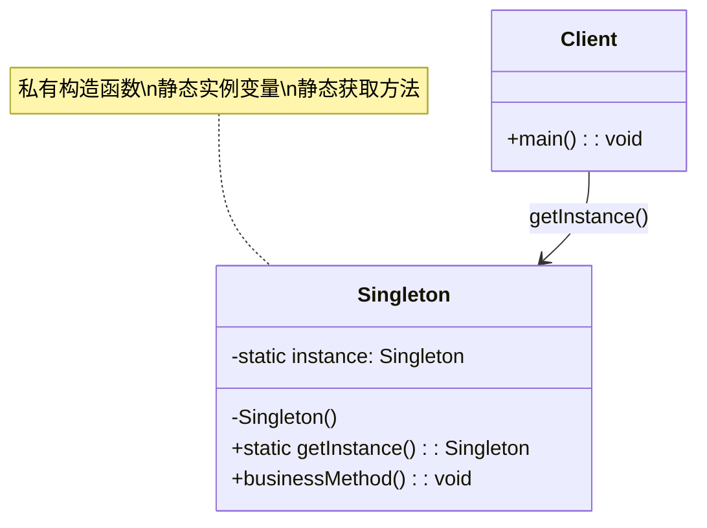
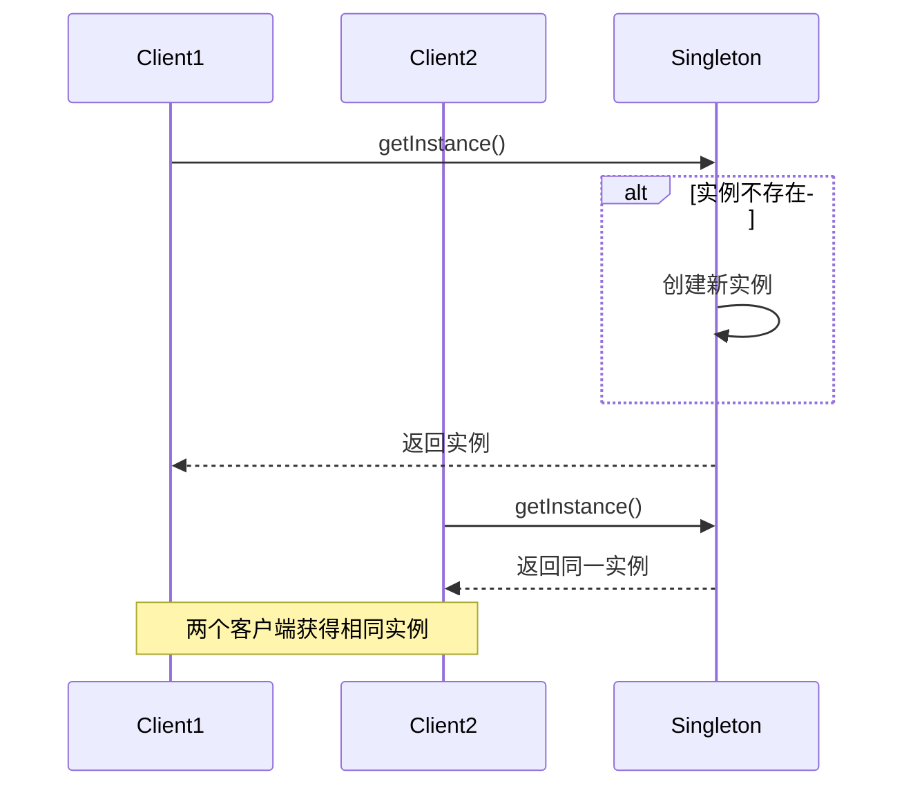

# 单例模式 (Singleton Pattern)

## 📋 模式概述

### 定义

单例模式确保一个类只有一个实例，并提供一个全局访问点来获取该实例。

### 意图

- 确保一个类只有一个实例
- 提供对该实例的全局访问点
- 控制实例化过程

## 🏗️ 结构图



## ⏱️ 时序图



## 💻 代码实现

### 1. 饿汉式（线程安全）

```java
/**
 * 饿汉式单例模式
 * 优点：线程安全，实现简单
 * 缺点：不管是否使用都会创建实例，可能浪费内存
 */
public class EagerSingleton {
    // 在类加载时就创建实例
    private static final EagerSingleton INSTANCE = new EagerSingleton();

    // 私有构造函数，防止外部实例化
    private EagerSingleton() {
        System.out.println("EagerSingleton 实例被创建");
    }

    // 提供全局访问点
    public static EagerSingleton getInstance() {
        return INSTANCE;
    }

    public void doSomething() {
        System.out.println("EagerSingleton 执行业务逻辑");
    }
}
```

### 2. 懒汉式（线程不安全）

```java
/**
 * 懒汉式单例模式（线程不安全版本）
 * 优点：延迟加载，节省内存
 * 缺点：线程不安全
 */
public class LazySingleton {
    private static LazySingleton instance;

    private LazySingleton() {
        System.out.println("LazySingleton 实例被创建");
    }

    public static LazySingleton getInstance() {
        if (instance == null) {
            instance = new LazySingleton();
        }
        return instance;
    }

    public void doSomething() {
        System.out.println("LazySingleton 执行业务逻辑");
    }
}
```

### 3. 懒汉式（线程安全）

```java
/**
 * 懒汉式单例模式（线程安全版本）
 * 优点：线程安全，延迟加载
 * 缺点：性能较差，每次获取实例都需要同步
 */
public class ThreadSafeLazySingleton {
    private static ThreadSafeLazySingleton instance;

    private ThreadSafeLazySingleton() {
        System.out.println("ThreadSafeLazySingleton 实例被创建");
    }

    public static synchronized ThreadSafeLazySingleton getInstance() {
        if (instance == null) {
            instance = new ThreadSafeLazySingleton();
        }
        return instance;
    }

    public void doSomething() {
        System.out.println("ThreadSafeLazySingleton 执行业务逻辑");
    }
}
```

### 4. 双重检查锁定（推荐）

```java
/**
 * 双重检查锁定单例模式
 * 优点：线程安全，性能好，延迟加载
 * 缺点：实现复杂
 */
public class DoubleCheckedLockingSingleton {
    // volatile 确保多线程环境下的可见性
    private static volatile DoubleCheckedLockingSingleton instance;

    private DoubleCheckedLockingSingleton() {
        System.out.println("DoubleCheckedLockingSingleton 实例被创建");
    }

    public static DoubleCheckedLockingSingleton getInstance() {
        if (instance == null) {
            synchronized (DoubleCheckedLockingSingleton.class) {
                if (instance == null) {
                    instance = new DoubleCheckedLockingSingleton();
                }
            }
        }
        return instance;
    }

    public void doSomething() {
        System.out.println("DoubleCheckedLockingSingleton 执行业务逻辑");
    }
}
```

### 5. 静态内部类（推荐）

```java
/**
 * 静态内部类单例模式
 * 优点：线程安全，延迟加载，性能好
 * 缺点：无
 */
public class StaticInnerClassSingleton {

    private StaticInnerClassSingleton() {
        System.out.println("StaticInnerClassSingleton 实例被创建");
    }

    // 静态内部类，只有在被调用时才会加载
    private static class SingletonHolder {
        private static final StaticInnerClassSingleton INSTANCE = new StaticInnerClassSingleton();
    }

    public static StaticInnerClassSingleton getInstance() {
        return SingletonHolder.INSTANCE;
    }

    public void doSomething() {
        System.out.println("StaticInnerClassSingleton 执行业务逻辑");
    }
}
```

### 6. 枚举单例（最佳实践）

```java
/**
 * 枚举单例模式
 * 优点：线程安全，防止反射攻击，防止序列化攻击，实现简单
 * 缺点：不能延迟加载
 */
public enum EnumSingleton {
    INSTANCE;

    // 构造函数
    EnumSingleton() {
        System.out.println("EnumSingleton 实例被创建");
    }

    public void doSomething() {
        System.out.println("EnumSingleton 执行业务逻辑");
    }
}
```

## 🧪 使用示例

### 配置管理器示例

```java
/**
 * 配置管理器 - 单例模式实际应用
 */
public class ConfigManager {
    private static volatile ConfigManager instance;
    private Properties properties;

    private ConfigManager() {
        properties = new Properties();
        loadConfig();
    }

    public static ConfigManager getInstance() {
        if (instance == null) {
            synchronized (ConfigManager.class) {
                if (instance == null) {
                    instance = new ConfigManager();
                }
            }
        }
        return instance;
    }

    private void loadConfig() {
        // 模拟加载配置文件
        properties.setProperty("database.url", "jdbc:mysql://localhost:3306/test");
        properties.setProperty("database.username", "root");
        properties.setProperty("database.password", "password");
        System.out.println("配置文件加载完成");
    }

    public String getProperty(String key) {
        return properties.getProperty(key);
    }

    public void setProperty(String key, String value) {
        properties.setProperty(key, value);
    }
}

// 使用示例
public class ConfigManagerDemo {
    public static void main(String[] args) {
        // 获取配置管理器实例
        ConfigManager config1 = ConfigManager.getInstance();
        ConfigManager config2 = ConfigManager.getInstance();

        // 验证是同一个实例
        System.out.println("config1 == config2: " + (config1 == config2));

        // 使用配置
        String dbUrl = config1.getProperty("database.url");
        System.out.println("数据库URL: " + dbUrl);

        // 修改配置
        config2.setProperty("app.name", "MyApplication");
        System.out.println("应用名称: " + config1.getProperty("app.name"));
    }
}
```

### 日志管理器示例

```java
/**
 * 日志管理器 - 单例模式应用
 */
public class Logger {
    private static volatile Logger instance;
    private PrintWriter writer;

    private Logger() {
        try {
            writer = new PrintWriter(new FileWriter("application.log", true));
        } catch (IOException e) {
            e.printStackTrace();
        }
    }

    public static Logger getInstance() {
        if (instance == null) {
            synchronized (Logger.class) {
                if (instance == null) {
                    instance = new Logger();
                }
            }
        }
        return instance;
    }

    public void log(String level, String message) {
        String timestamp = new SimpleDateFormat("yyyy-MM-dd HH:mm:ss").format(new Date());
        String logEntry = String.format("[%s] %s: %s", timestamp, level, message);

        System.out.println(logEntry);
        if (writer != null) {
            writer.println(logEntry);
            writer.flush();
        }
    }

    public void info(String message) {
        log("INFO", message);
    }

    public void error(String message) {
        log("ERROR", message);
    }

    public void debug(String message) {
        log("DEBUG", message);
    }

    public void close() {
        if (writer != null) {
            writer.close();
        }
    }
}

// 使用示例
public class LoggerDemo {
    public static void main(String[] args) {
        Logger logger = Logger.getInstance();

        logger.info("应用程序启动");
        logger.debug("调试信息");
        logger.error("发生错误");

        // 在不同的类中使用
        processOrder();

        logger.info("应用程序结束");
        logger.close();
    }

    private static void processOrder() {
        Logger logger = Logger.getInstance(); // 获取同一个实例
        logger.info("开始处理订单");
        logger.info("订单处理完成");
    }
}
```

## 🎯 适用场景

### 适合使用单例模式的场景：

1. **配置管理器** - 全局配置信息
2. **日志管理器** - 统一的日志记录
3. **数据库连接池** - 管理数据库连接
4. **缓存管理器** - 全局缓存控制
5. **线程池** - 管理线程资源
6. **计数器** - 全局计数功能
7. **打印机管理器** - 管理打印任务

### 不适合使用的场景：

1. **需要多个实例的情况**
2. **实例状态经常变化**
3. **需要继承的类**
4. **单元测试困难的场景**

## ✅ 优点

1. **内存节省** - 只创建一个实例
2. **全局访问** - 提供全局访问点
3. **延迟初始化** - 可以延迟创建实例
4. **线程安全** - 正确实现可保证线程安全

## ❌ 缺点

1. **违反单一职责** - 既要管理实例又要处理业务逻辑
2. **难以扩展** - 很难继承单例类
3. **隐藏依赖** - 客户端代码依赖全局状态
4. **测试困难** - 难以进行单元测试
5. **并发问题** - 实现不当可能导致线程安全问题

## 🔄 与其他模式的关系

- **工厂模式** - 工厂类通常设计为单例
- **外观模式** - 外观类通常是单例
- **抽象工厂模式** - 抽象工厂通常实现为单例
- **建造者模式** - 建造者可能是单例

## 📝 最佳实践

1. **使用枚举实现** - 最简单且安全的方式
2. **使用静态内部类** - 延迟加载且线程安全
3. **避免反射攻击** - 在构造函数中检查实例是否已存在
4. **考虑序列化** - 实现readResolve()方法
5. **谨慎使用** - 不要滥用单例模式

## 🚨 注意事项

1. **线程安全** - 多线程环境下要确保线程安全
2. **反射攻击** - 防止通过反射创建多个实例
3. **序列化问题** - 序列化和反序列化可能破坏单例
4. **类加载器** - 不同类加载器可能创建不同实例
5. **内存泄漏** - 单例持有的资源要及时释放

---

*单例模式是最常用的设计模式之一，但也是最容易被滥用的模式。在使用时要仔细考虑是否真的需要全局唯一实例。*