# 设计模式业界应用案例

## 🏢 知名公司设计模式应用案例

### 阿里巴巴电商平台架构

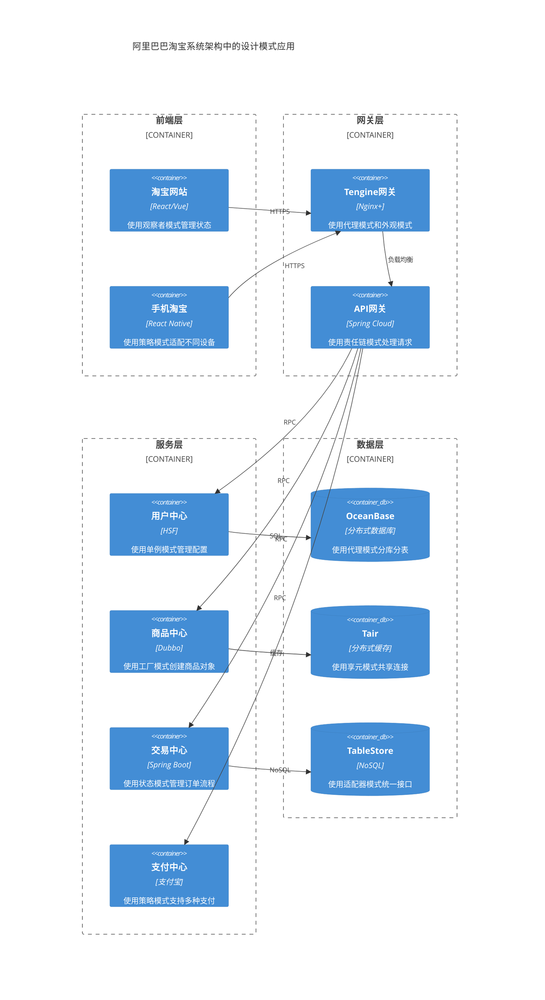

#### 淘宝订单系统状态模式应用

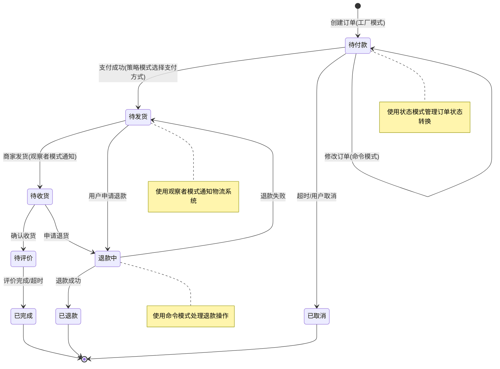

### 腾讯微信架构

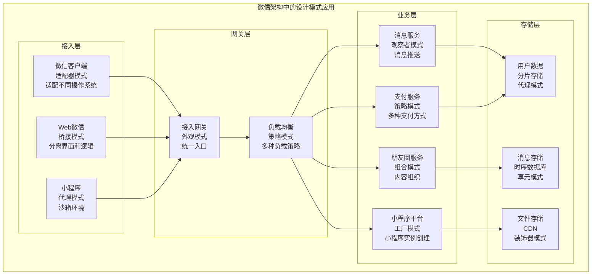

#### 微信消息系统观察者模式应用

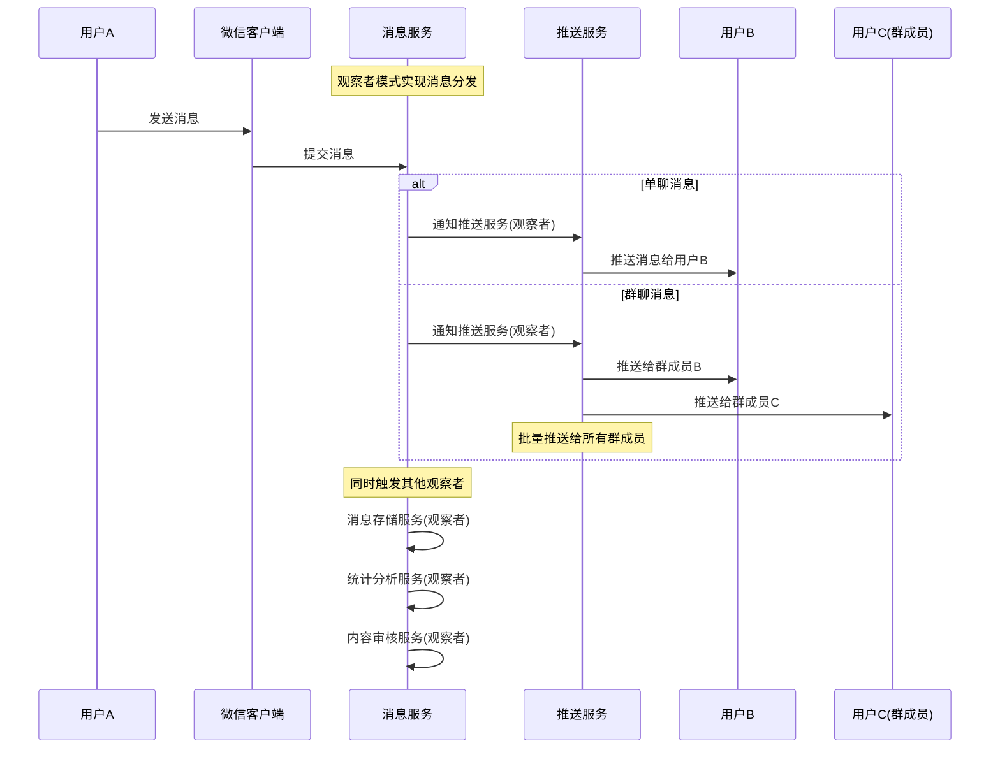

### 字节跳动抖音推荐系统

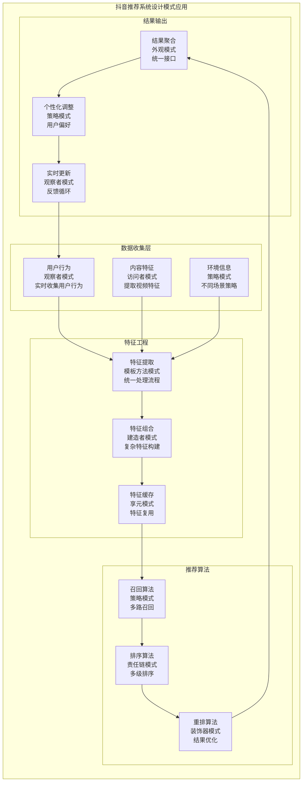

#### 抖音推荐算法策略模式应用

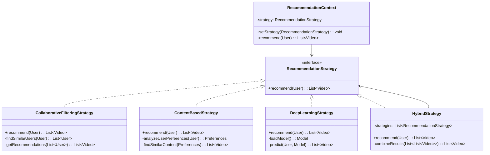

### 美团外卖配送系统

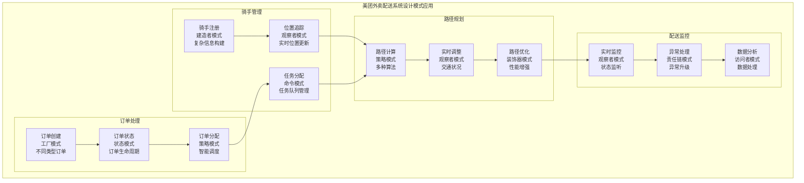

#### 美团配送状态管理时序图

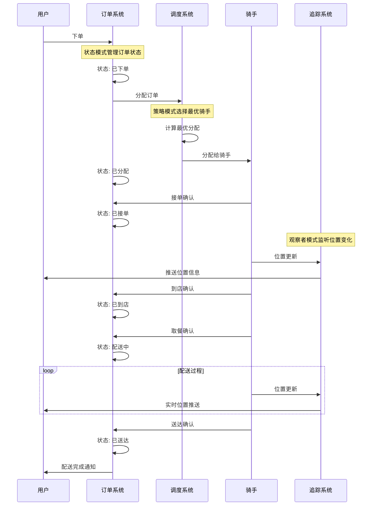

## 🎮 游戏行业应用案例

### Unity游戏引擎设计模式应用

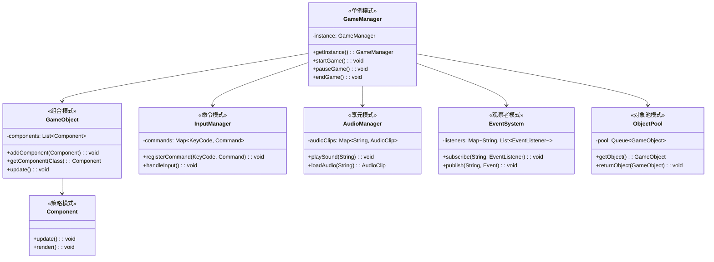

### 王者荣耀技能系统设计

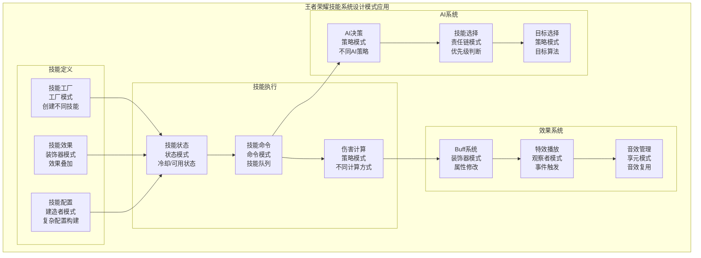

## 🏦 金融行业应用案例

### 支付宝风控系统

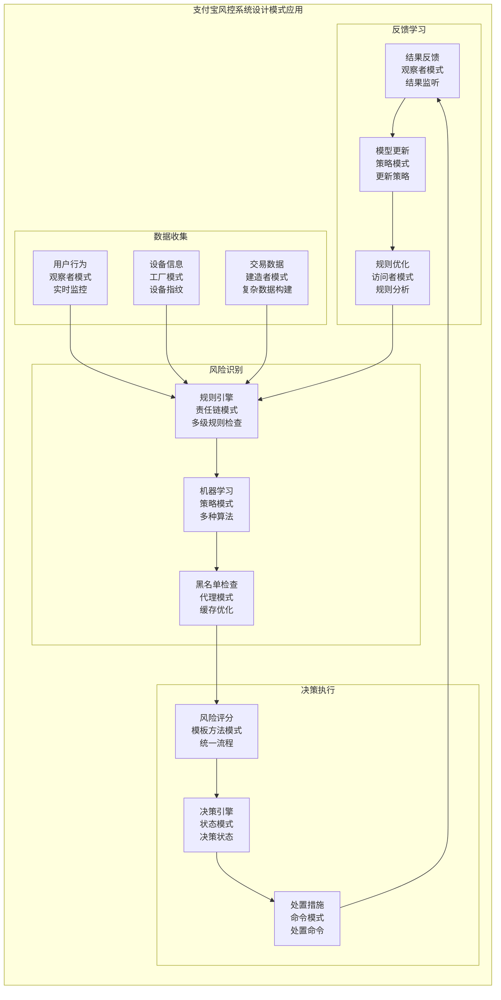

#### 支付宝交易风控责任链模式

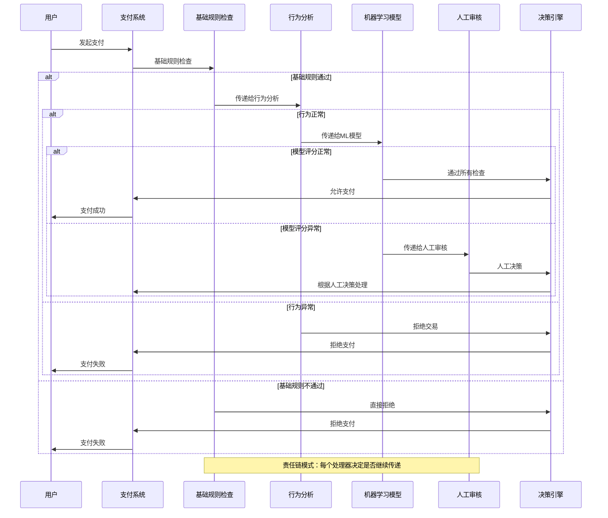

## 🚗 出行行业应用案例

### 滴滴出行调度系统

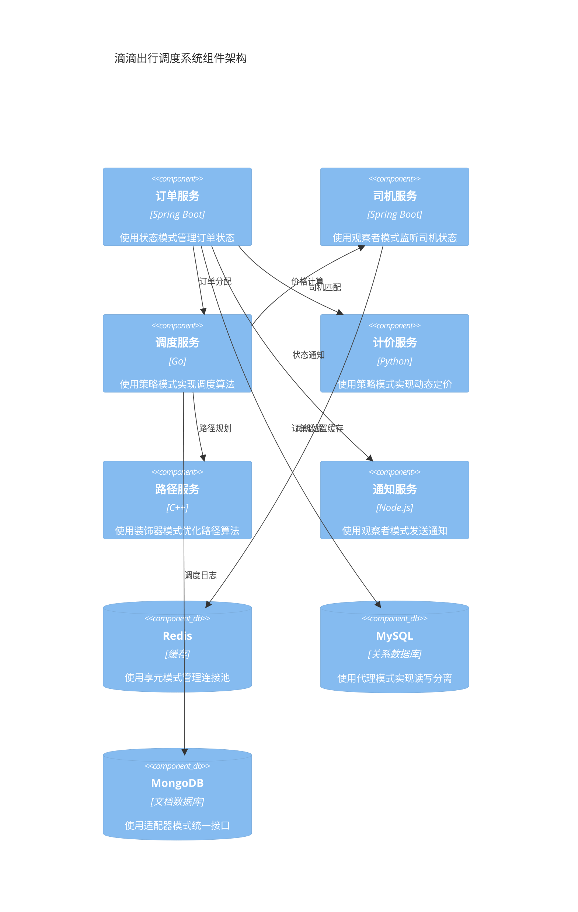

#### 滴滴订单状态管理

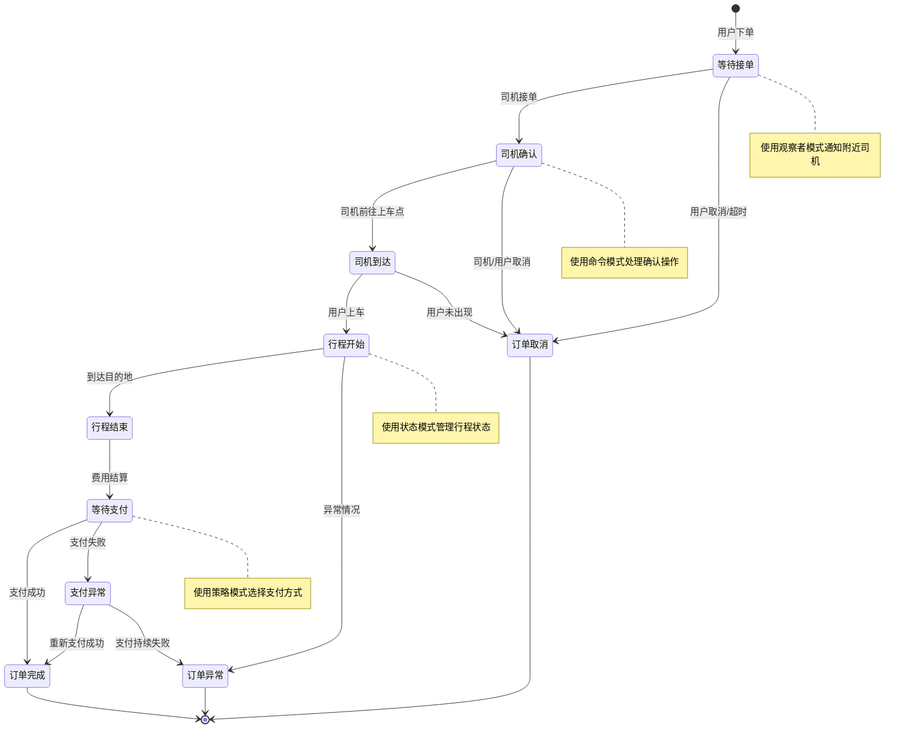

## 📊 数据分析与总结

### 设计模式在不同行业的使用频率

```mermaid
%%{init: {"xyChart": {"width": 900, "height": 600}}}%%
xychart-beta
    title "设计模式在不同行业的使用频率"
    x-axis [电商, 金融, 游戏, 出行, 社交, 教育]
    y-axis "使用频率(%)" 0 --> 100
    bar [85, 90, 95, 80, 75, 70]
```

### 最受欢迎的设计模式排行

```mermaid
%%{init: {"xyChart": {"width": 900, "height": 600}}}%%
xychart-beta
    title "业界最受欢迎的设计模式Top 10"
    x-axis [单例, 工厂, 观察者, 策略, 装饰器, 代理, 适配器, 外观, 命令, 状态]
    y-axis "使用频率" 0 --> 100
    bar [95, 88, 85, 82, 78, 75, 72, 68, 65, 62]
```

### 设计模式复杂度与收益分析

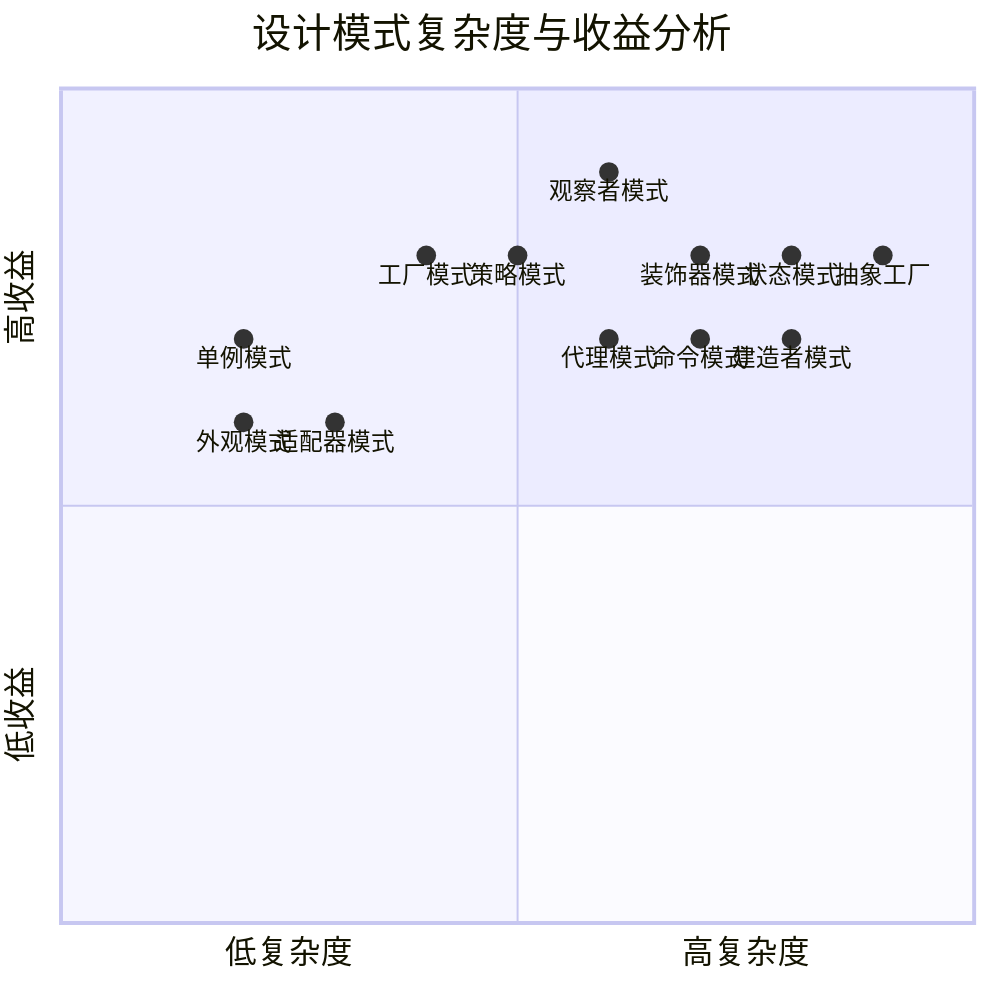

## 🎯 行业选择建议

### 不同行业推荐的设计模式组合

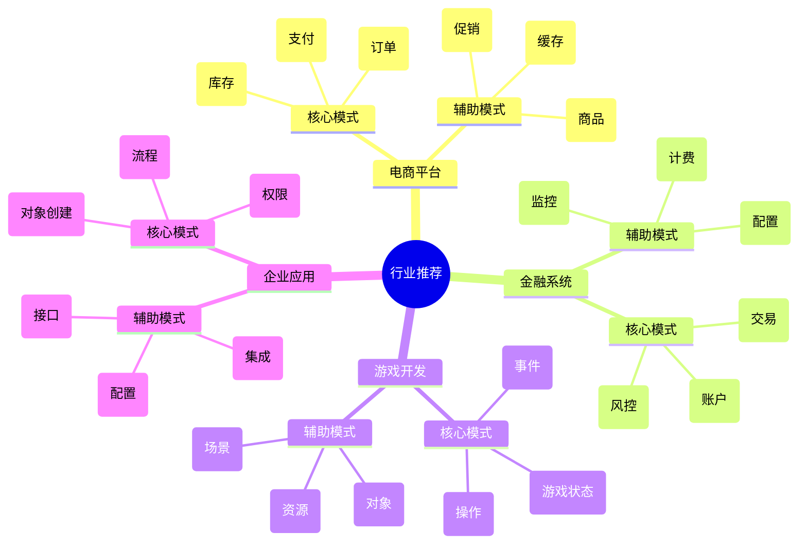

这份业界应用案例文档详细展示了知名公司和不同行业中设计模式的实际应用，为开发者提供了丰富的参考案例和实践指导。