# 设计模式对比分析与业界应用

## 📊 模式分类对比

### 创建型模式对比分析

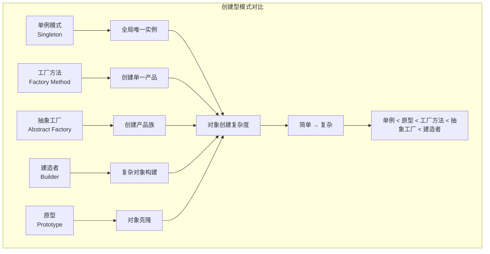

#### 详细对比表

| 模式 | 主要目的 | 适用场景 | 复杂度 | 扩展性 | 业界应用 |
|------|----------|----------|--------|--------|----------|
| **单例模式** | 确保唯一实例 | 配置管理、日志系统 | ⭐ | ⭐ | Spring Bean、数据库连接池 |
| **工厂方法** | 创建单一产品 | 对象创建逻辑复杂 | ⭐⭐ | ⭐⭐⭐ | JDBC驱动、日志框架 |
| **抽象工厂** | 创建产品族 | 跨平台、多主题 | ⭐⭐⭐ | ⭐⭐⭐⭐ | GUI框架、数据库适配 |
| **建造者模式** | 复杂对象构建 | 参数众多的对象 | ⭐⭐⭐⭐ | ⭐⭐⭐ | StringBuilder、HTTP客户端 |
| **原型模式** | 对象克隆 | 对象创建成本高 | ⭐⭐ | ⭐⭐ | 游戏对象、缓存系统 |

### 结构型模式对比分析

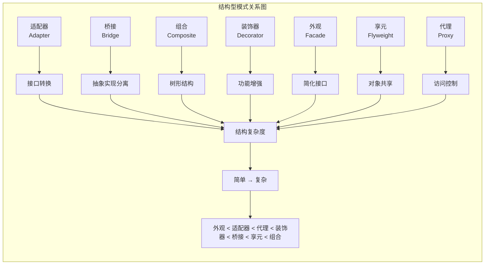

#### 结构型模式应用场景对比

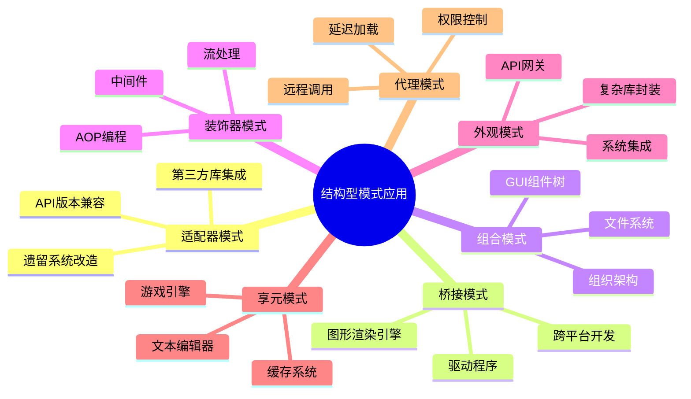

### 行为型模式对比分析

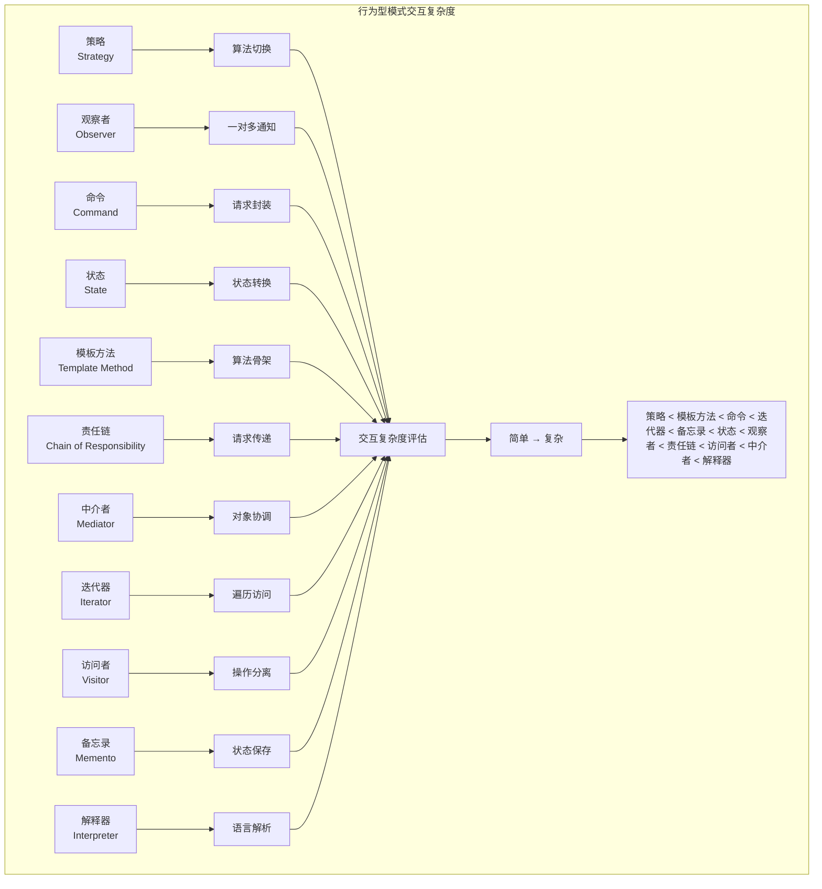

## 🏢 业界应用场景分析

### 互联网公司架构中的设计模式应用

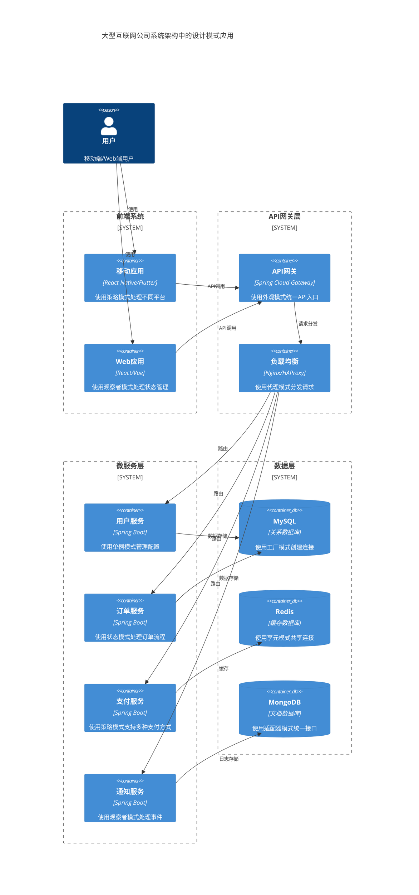

### 电商系统中的设计模式应用时序图

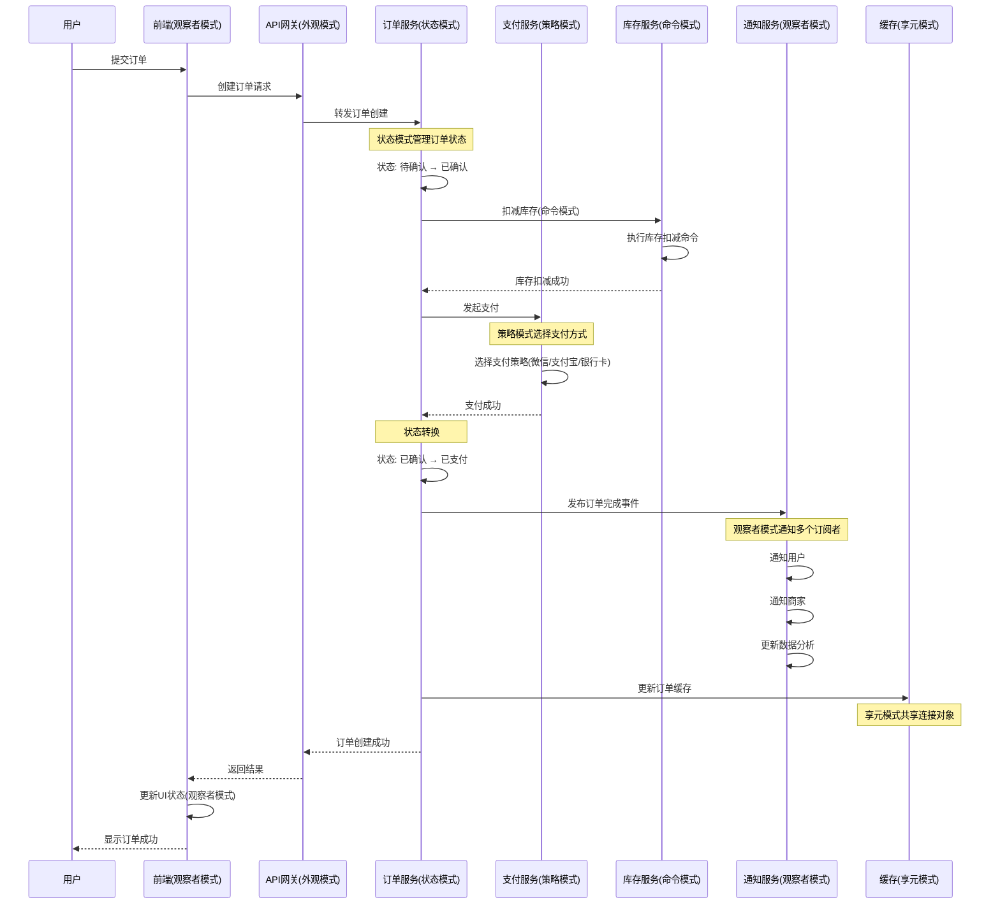

## 🔄 模式组合应用分析

### MVC架构中的设计模式组合

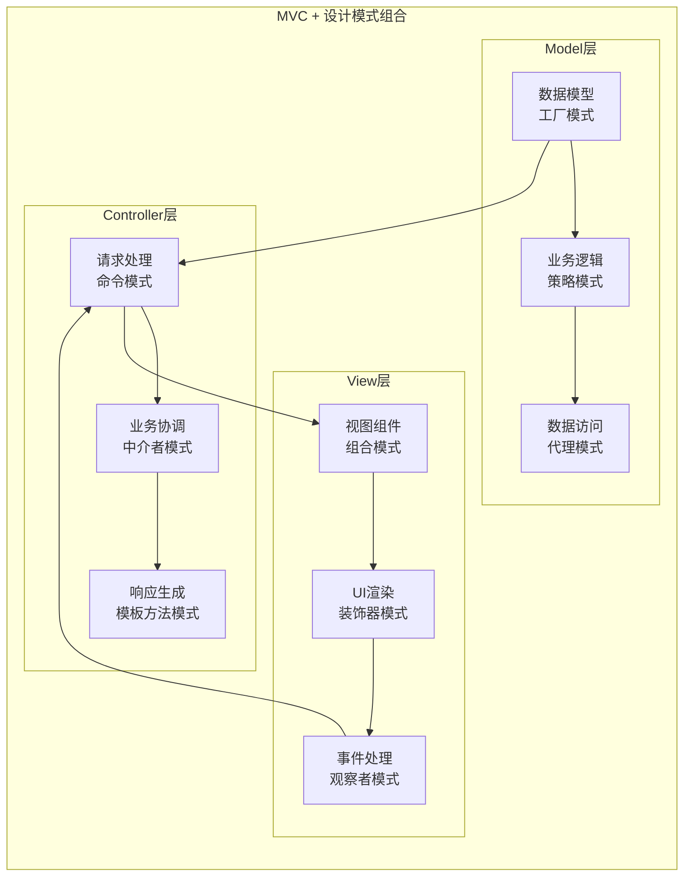

### 微服务架构中的设计模式应用

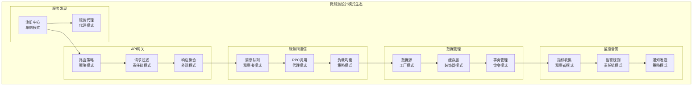

## 📈 性能对比分析

### 设计模式性能影响分析

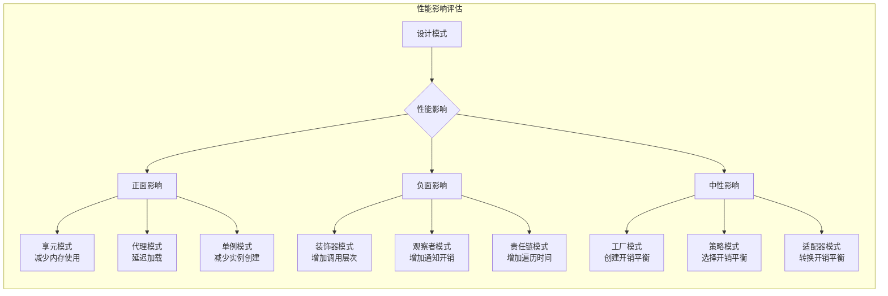

### 内存使用对比

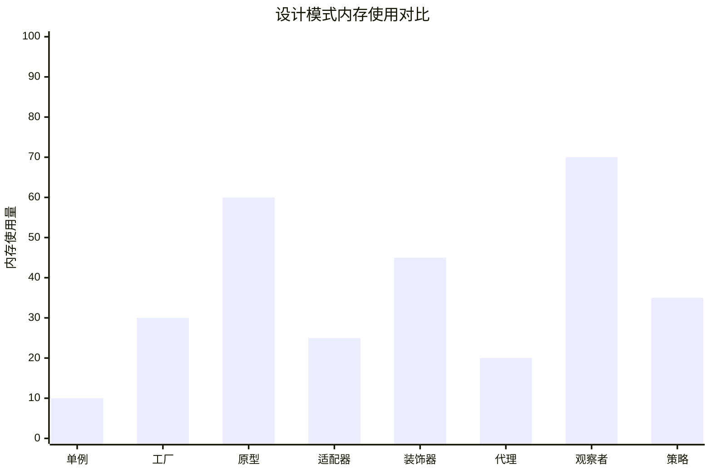

### 执行时间对比

```mermaid
%%{init: {"xyChart": {"width": 900, "height": 600}}}%%
xychart-beta
    title "设计模式执行时间对比"
    x-axis ["直接调用", "工厂模式", "代理模式", "装饰器", "责任链", "观察者"]
    y-axis "执行时间(ms)" 0 --> 50
    line [1, 3, 5, 8, 15, 25]
```

## 🎯 选择决策树

### 设计模式选择决策流程

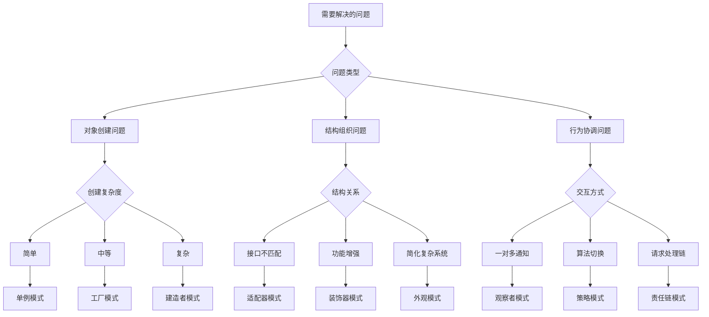

### 业务场景映射

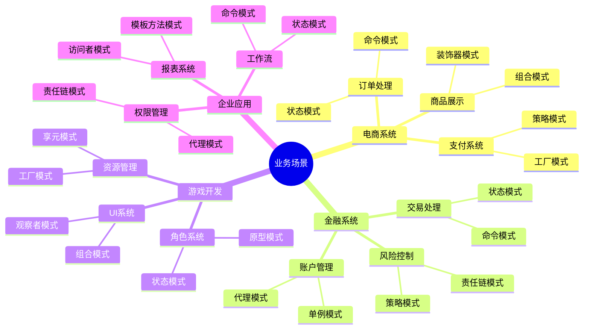

## 🚀 最佳实践建议

### 模式组合使用建议

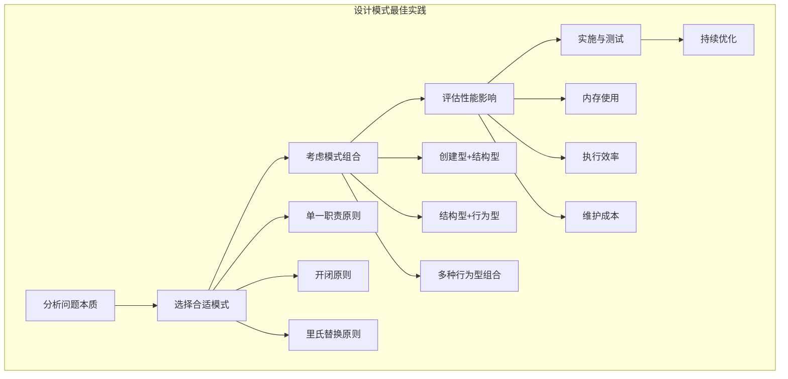

### 反模式警告

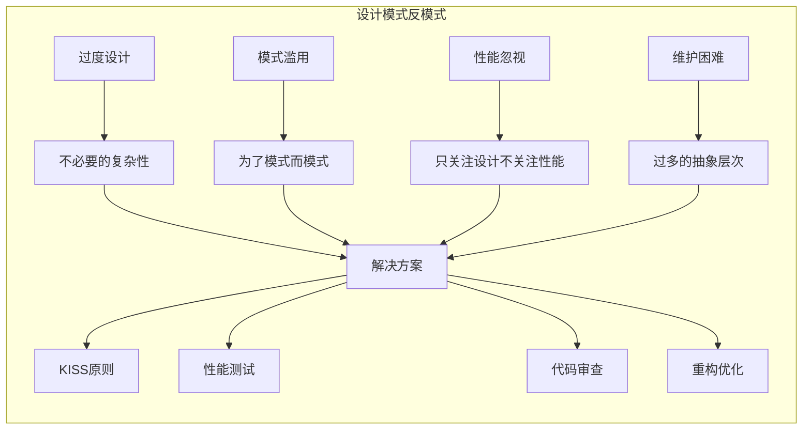

## 📊 模式使用统计

### 不同复杂度项目中的模式使用频率

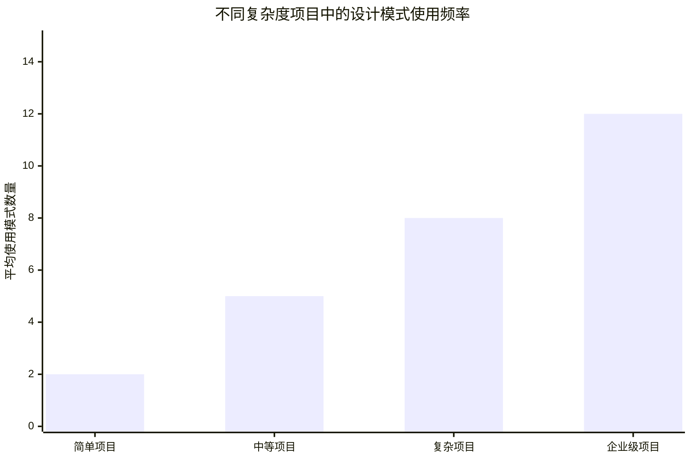

### 团队规模与模式应用关系

```mermaid
%%{init: {"xyChart": {"width": 900, "height": 600}}}%%
xychart-beta
    title "团队规模与设计模式应用关系"
    x-axis ["1-3人", "4-8人", "9-15人", "16+人"]
    y-axis "模式应用深度" 0 --> 10
    line [3, 6, 8, 9]
```

## 🎯 总结与建议

### 核心要点

1. **理解问题本质** - 在选择设计模式之前，深入理解要解决的问题
2. **渐进式应用** - 从简单模式开始，逐步应用复杂模式
3. **团队共识** - 确保团队成员都理解所选择的模式
4. **性能考量** - 在设计灵活性和性能之间找到平衡
5. **持续重构** - 随着需求变化，适时调整模式应用

### 学习路径建议

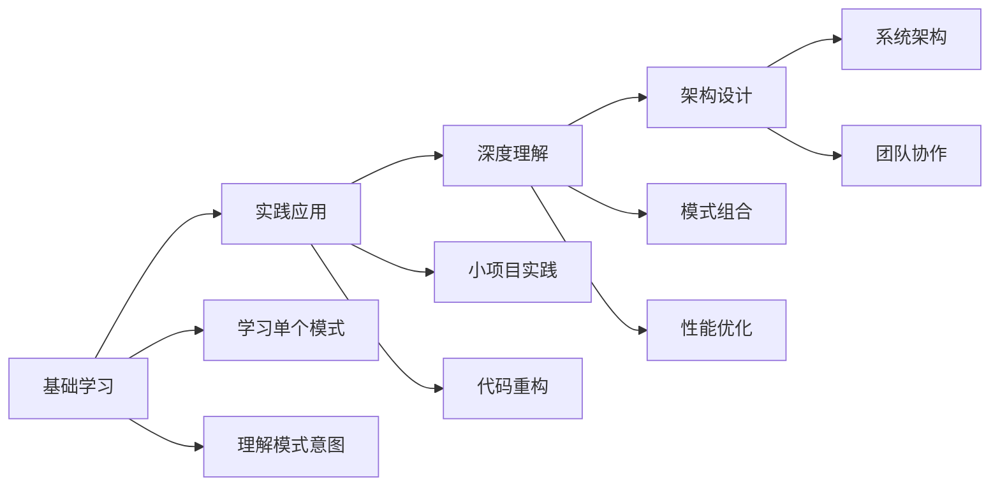

这份对比分析文档提供了全面的设计模式比较、业界应用场景分析和最佳实践建议，帮助开发者更好地理解和应用设计模式。