# 设计模式对比分析与业界应用

## 📊 模式分类对比

### 创建型模式对比分析

```mermaid
graph TB
    subgraph "创建型模式对比"
        A[单例模式<br/>Singleton] --> A1[全局唯一实例]
        B[工厂方法<br/>Factory Method] --> B1[创建单一产品]
        C[抽象工厂<br/>Abstract Factory] --> C1[创建产品族]
        D[建造者<br/>Builder] --> D1[复杂对象构建]
        E[原型<br/>Prototype] --> E1[对象克隆]
        
        A1 --> F[对象创建复杂度]
        B1 --> F
        C1 --> F
        D1 --> F
        E1 --> F
        
        F --> G[简单 → 复杂]
        G --> H[单例 < 原型 < 工厂方法 < 抽象工厂 < 建造者]
    end
```

#### 详细对比表

| 模式 | 主要目的 | 适用场景 | 复杂度 | 扩展性 | 业界应用 |
|------|----------|----------|--------|--------|----------|
| **单例模式** | 确保唯一实例 | 配置管理、日志系统 | ⭐ | ⭐ | Spring Bean、数据库连接池 |
| **工厂方法** | 创建单一产品 | 对象创建逻辑复杂 | ⭐⭐ | ⭐⭐⭐ | JDBC驱动、日志框架 |
| **抽象工厂** | 创建产品族 | 跨平台、多主题 | ⭐⭐⭐ | ⭐⭐⭐⭐ | GUI框架、数据库适配 |
| **建造者模式** | 复杂对象构建 | 参数众多的对象 | ⭐⭐⭐⭐ | ⭐⭐⭐ | StringBuilder、HTTP客户端 |
| **原型模式** | 对象克隆 | 对象创建成本高 | ⭐⭐ | ⭐⭐ | 游戏对象、缓存系统 |

### 结构型模式对比分析

```mermaid
graph LR
    subgraph "结构型模式关系图"
        A[适配器<br/>Adapter] --> A1[接口转换]
        B[桥接<br/>Bridge] --> B1[抽象实现分离]
        C[组合<br/>Composite] --> C1[树形结构]
        D[装饰器<br/>Decorator] --> D1[功能增强]
        E[外观<br/>Facade] --> E1[简化接口]
        F[享元<br/>Flyweight] --> F1[对象共享]
        G[代理<br/>Proxy] --> G1[访问控制]
        
        A1 --> H[结构复杂度]
        B1 --> H
        C1 --> H
        D1 --> H
        E1 --> H
        F1 --> H
        G1 --> H
        
        H --> I[简单 → 复杂]
        I --> J[外观 < 适配器 < 代理 < 装饰器 < 桥接 < 享元 < 组合]
    end
```

#### 结构型模式应用场景对比

```mermaid
mindmap
  root((结构型模式应用))
    适配器模式
      第三方库集成
      遗留系统改造
      API版本兼容
    桥接模式
      跨平台开发
      驱动程序
      图形渲染引擎
    组合模式
      文件系统
      GUI组件树
      组织架构
    装饰器模式
      中间件
      AOP编程
      流处理
    外观模式
      API网关
      系统集成
      复杂库封装
    享元模式
      游戏引擎
      文本编辑器
      缓存系统
    代理模式
      远程调用
      权限控制
      延迟加载
```

### 行为型模式对比分析

```mermaid
graph TD
    subgraph "行为型模式交互复杂度"
        A[策略<br/>Strategy] --> A1[算法切换]
        B[观察者<br/>Observer] --> B1[一对多通知]
        C[命令<br/>Command] --> C1[请求封装]
        D[状态<br/>State] --> D1[状态转换]
        E[模板方法<br/>Template Method] --> E1[算法骨架]
        F[责任链<br/>Chain of Responsibility] --> F1[请求传递]
        G[中介者<br/>Mediator] --> G1[对象协调]
        H[迭代器<br/>Iterator] --> H1[遍历访问]
        I[访问者<br/>Visitor] --> I1[操作分离]
        J[备忘录<br/>Memento] --> J1[状态保存]
        K[解释器<br/>Interpreter] --> K1[语言解析]
        
        A1 --> L[交互复杂度评估]
        B1 --> L
        C1 --> L
        D1 --> L
        E1 --> L
        F1 --> L
        G1 --> L
        H1 --> L
        I1 --> L
        J1 --> L
        K1 --> L
        
        L --> M[简单 → 复杂]
        M --> N[策略 < 模板方法 < 命令 < 迭代器 < 备忘录 < 状态 < 观察者 < 责任链 < 访问者 < 中介者 < 解释器]
    end
```

## 🏢 业界应用场景分析

### 互联网公司架构中的设计模式应用

```mermaid
C4Context
    title 大型互联网公司系统架构中的设计模式应用
    
    Person(user, "用户", "移动端/Web端用户")
    
    System_Boundary(frontend, "前端系统") {
        Container(mobile, "移动应用", "React Native/Flutter", "使用策略模式处理不同平台")
        Container(web, "Web应用", "React/Vue", "使用观察者模式处理状态管理")
    }
    
    System_Boundary(gateway, "API网关层") {
        Container(apigateway, "API网关", "Spring Cloud Gateway", "使用外观模式统一API入口")
        Container(loadbalancer, "负载均衡", "Nginx/HAProxy", "使用代理模式分发请求")
    }
    
    System_Boundary(microservices, "微服务层") {
        Container(userservice, "用户服务", "Spring Boot", "使用单例模式管理配置")
        Container(orderservice, "订单服务", "Spring Boot", "使用状态模式处理订单流程")
        Container(payservice, "支付服务", "Spring Boot", "使用策略模式支持多种支付方式")
        Container(notifyservice, "通知服务", "Spring Boot", "使用观察者模式处理事件")
    }
    
    System_Boundary(data, "数据层") {
        ContainerDb(mysql, "MySQL", "关系数据库", "使用工厂模式创建连接")
        ContainerDb(redis, "Redis", "缓存数据库", "使用享元模式共享连接")
        ContainerDb(mongodb, "MongoDB", "文档数据库", "使用适配器模式统一接口")
    }
    
    Rel(user, mobile, "使用")
    Rel(user, web, "使用")
    Rel(mobile, apigateway, "API调用")
    Rel(web, apigateway, "API调用")
    Rel(apigateway, loadbalancer, "请求分发")
    Rel(loadbalancer, userservice, "路由")
    Rel(loadbalancer, orderservice, "路由")
    Rel(loadbalancer, payservice, "路由")
    Rel(loadbalancer, notifyservice, "路由")
    Rel(userservice, mysql, "数据存储")
    Rel(orderservice, mysql, "数据存储")
    Rel(payservice, redis, "缓存")
    Rel(notifyservice, mongodb, "日志存储")
```

### 电商系统中的设计模式应用时序图

```mermaid
sequenceDiagram
    participant U as 用户
    participant F as 前端(观察者模式)
    participant G as API网关(外观模式)
    participant O as 订单服务(状态模式)
    participant P as 支付服务(策略模式)
    participant I as 库存服务(命令模式)
    participant N as 通知服务(观察者模式)
    participant C as 缓存(享元模式)
    
    U->>F: 提交订单
    F->>G: 创建订单请求
    G->>O: 转发订单创建
    
    Note over O: 状态模式管理订单状态
    O->>O: 状态: 待确认 → 已确认
    
    O->>I: 扣减库存(命令模式)
    I->>I: 执行库存扣减命令
    I-->>O: 库存扣减成功
    
    O->>P: 发起支付
    Note over P: 策略模式选择支付方式
    P->>P: 选择支付策略(微信/支付宝/银行卡)
    P-->>O: 支付成功
    
    Note over O: 状态转换
    O->>O: 状态: 已确认 → 已支付
    
    O->>N: 发布订单完成事件
    Note over N: 观察者模式通知多个订阅者
    N->>N: 通知用户
    N->>N: 通知商家
    N->>N: 更新数据分析
    
    O->>C: 更新订单缓存
    Note over C: 享元模式共享连接对象
    
    O-->>G: 订单创建成功
    G-->>F: 返回结果
    F->>F: 更新UI状态(观察者模式)
    F-->>U: 显示订单成功
```

### 金融系统中的设计模式应用

```mermaid
graph TB
    subgraph "银行核心系统架构"
        subgraph "接入层"
            A1[网银系统<br/>适配器模式] --> A2[手机银行<br/>适配器模式]
            A2 --> A3[ATM系统<br/>适配器模式]
        end
        
        subgraph "服务层"
            B1[账户服务<br/>单例模式] --> B2[交易服务<br/>命令模式]
            B2 --> B3[风控服务<br/>责任链模式]
            B3 --> B4[通知服务<br/>观察者模式]
        end
        
        subgraph "核心层"
            C1[账户管理<br/>工厂模式] --> C2[交易引擎<br/>状态模式]
            C2 --> C3[清算系统<br/>模板方法模式]
        end
        
        subgraph "数据层"
            D1[核心数据库<br/>代理模式] --> D2[历史数据<br/>享元模式]
            D2 --> D3[缓存系统<br/>装饰器模式]
        end
    end
    
    A1 --> B1
    A2 --> B1
    A3 --> B1
    B1 --> C1
    B2 --> C2
    B3 --> C2
    B4 --> C2
    C1 --> D1
    C2 --> D1
    C3 --> D1
```

### 游戏引擎中的设计模式应用

```mermaid
classDiagram
    class GameEngine {
        <<单例模式>>
        -instance: GameEngine
        +getInstance(): GameEngine
        +initialize(): void
        +update(): void
        +render(): void
    }
    
    class GameObject {
        <<原型模式>>
        +clone(): GameObject
        +update(): void
        +render(): void
    }
    
    class Component {
        <<组合模式>>
        +update(): void
        +render(): void
    }
    
    class RenderComponent {
        <<策略模式>>
        -renderStrategy: RenderStrategy
        +setRenderStrategy(): void
        +render(): void
    }
    
    class InputHandler {
        <<命令模式>>
        -commands: Map
        +handleInput(): void
        +executeCommand(): void
    }
    
    class GameState {
        <<状态模式>>
        +enter(): void
        +update(): void
        +exit(): void
    }
    
    class EventManager {
        <<观察者模式>>
        -listeners: List
        +subscribe(): void
        +notify(): void
    }
    
    class ResourceManager {
        <<享元模式>>
        -resources: Map
        +getResource(): Resource
        +loadResource(): void
    }
    
    GameEngine --> GameObject
    GameObject --> Component
    Component <|-- RenderComponent
    GameEngine --> InputHandler
    GameEngine --> GameState
    GameEngine --> EventManager
    GameEngine --> ResourceManager
```

## 🔄 模式组合应用分析

### MVC架构中的设计模式组合

```mermaid
graph LR
    subgraph "MVC + 设计模式组合"
        subgraph "Model层"
            M1[数据模型<br/>工厂模式] --> M2[业务逻辑<br/>策略模式]
            M2 --> M3[数据访问<br/>代理模式]
        end
        
        subgraph "View层"
            V1[视图组件<br/>组合模式] --> V2[UI渲染<br/>装饰器模式]
            V2 --> V3[事件处理<br/>观察者模式]
        end
        
        subgraph "Controller层"
            C1[请求处理<br/>命令模式] --> C2[业务协调<br/>中介者模式]
            C2 --> C3[响应生成<br/>模板方法模式]
        end
    end
    
    M1 --> C1
    C1 --> V1
    V3 --> C1
```

### 微服务架构中的设计模式应用

```mermaid
graph TD
    subgraph "微服务设计模式生态"
        subgraph "服务发现"
            SD1[注册中心<br/>单例模式] --> SD2[服务代理<br/>代理模式]
        end
        
        subgraph "API网关"
            AG1[路由策略<br/>策略模式] --> AG2[请求过滤<br/>责任链模式]
            AG2 --> AG3[响应聚合<br/>外观模式]
        end
        
        subgraph "服务间通信"
            SC1[消息队列<br/>观察者模式] --> SC2[RPC调用<br/>代理模式]
            SC2 --> SC3[负载均衡<br/>策略模式]
        end
        
        subgraph "数据管理"
            DM1[数据源<br/>工厂模式] --> DM2[缓存层<br/>装饰器模式]
            DM2 --> DM3[事务管理<br/>命令模式]
        end
        
        subgraph "监控告警"
            MA1[指标收集<br/>观察者模式] --> MA2[告警规则<br/>责任链模式]
            MA2 --> MA3[通知发送<br/>策略模式]
        end
    end
    
    SD1 --> AG1
    AG3 --> SC1
    SC3 --> DM1
    DM3 --> MA1
```

## 📈 性能对比分析

### 设计模式性能影响分析

```mermaid
graph LR
    subgraph "性能影响评估"
        A[设计模式] --> B{性能影响}
        
        B --> C[正面影响]
        B --> D[负面影响]
        B --> E[中性影响]
        
        C --> C1[享元模式<br/>减少内存使用]
        C --> C2[代理模式<br/>延迟加载]
        C --> C3[单例模式<br/>减少实例创建]
        
        D --> D1[装饰器模式<br/>增加调用层次]
        D --> D2[观察者模式<br/>增加通知开销]
        D --> D3[责任链模式<br/>增加遍历时间]
        
        E --> E1[工厂模式<br/>创建开销平衡]
        E --> E2[策略模式<br/>选择开销平衡]
        E --> E3[适配器模式<br/>转换开销平衡]
    end
```

### 内存使用对比

```mermaid
xychart-beta
    title "设计模式内存使用对比"
    x-axis [单例, 工厂, 原型, 适配器, 装饰器, 代理, 观察者, 策略]
    y-axis "内存使用量" 0 --> 100
    bar [10, 30, 60, 25, 45, 20, 70, 35]
```

### 执行时间对比

```mermaid
xychart-beta
    title "设计模式执行时间对比"
    x-axis [直接调用, 工厂模式, 代理模式, 装饰器, 责任链, 观察者]
    y-axis "执行时间(ms)" 0 --> 50
    line [1, 3, 5, 8, 15, 25]
```

## 🎯 选择决策树

### 设计模式选择决策流程

```mermaid
flowchart TD
    A[需要解决的问题] --> B{问题类型}
    
    B --> C[对象创建问题]
    B --> D[结构组织问题]
    B --> E[行为协调问题]
    
    C --> C1{创建复杂度}
    C1 --> C2[简单] --> C3[单例模式]
    C1 --> C4[中等] --> C5[工厂模式]
    C1 --> C6[复杂] --> C7[建造者模式]
    
    D --> D1{结构关系}
    D1 --> D2[接口不匹配] --> D3[适配器模式]
    D1 --> D4[功能增强] --> D5[装饰器模式]
    D1 --> D6[简化复杂系统] --> D7[外观模式]
    
    E --> E1{交互方式}
    E1 --> E2[一对多通知] --> E3[观察者模式]
    E1 --> E4[算法切换] --> E5[策略模式]
    E1 --> E6[请求处理链] --> E7[责任链模式]
```

### 业务场景映射

```mermaid
mindmap
  root((业务场景))
    电商系统
      订单处理
        状态模式
        命令模式
      支付系统
        策略模式
        工厂模式
      商品展示
        装饰器模式
        组合模式
    金融系统
      风险控制
        责任链模式
        策略模式
      交易处理
        命令模式
        状态模式
      账户管理
        单例模式
        代理模式
    游戏开发
      角色系统
        原型模式
        状态模式
      UI系统
        组合模式
        观察者模式
      资源管理
        享元模式
        工厂模式
    企业应用
      权限管理
        代理模式
        责任链模式
      工作流
        状态模式
        命令模式
      报表系统
        模板方法模式
        访问者模式
```

## 🚀 最佳实践建议

### 模式组合使用建议


### 反模式警告

```mermaid
graph LR
    subgraph "设计模式反模式"
        A[过度设计] --> A1[不必要的复杂性]
        B[模式滥用] --> B1[为了模式而模式]
        C[性能忽视] --> C1[只关注设计不关注性能]
        D[维护困难] --> D1[过多的抽象层次]
        
        A1 --> E[解决方案]
        B1 --> E
        C1 --> E
        D1 --> E
        
        E --> E1[KISS原则]
        E --> E2[性能测试]
        E --> E3[代码审查]
        E --> E4[重构优化]
    end
```

这份对比分析文档提供了全面的设计模式比较、业界应用场景分析和最佳实践建议，帮助开发者更好地理解和应用设计模式。