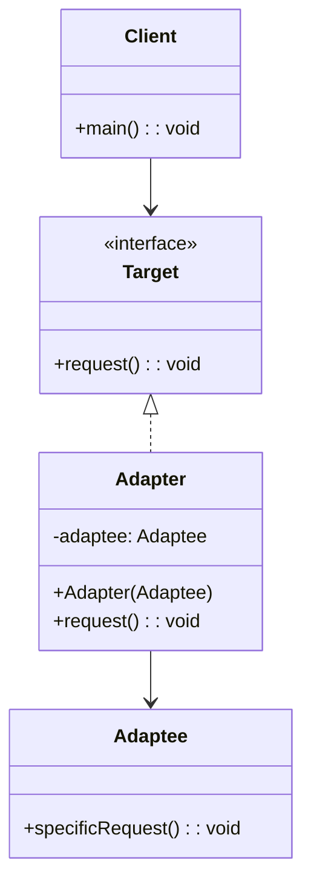
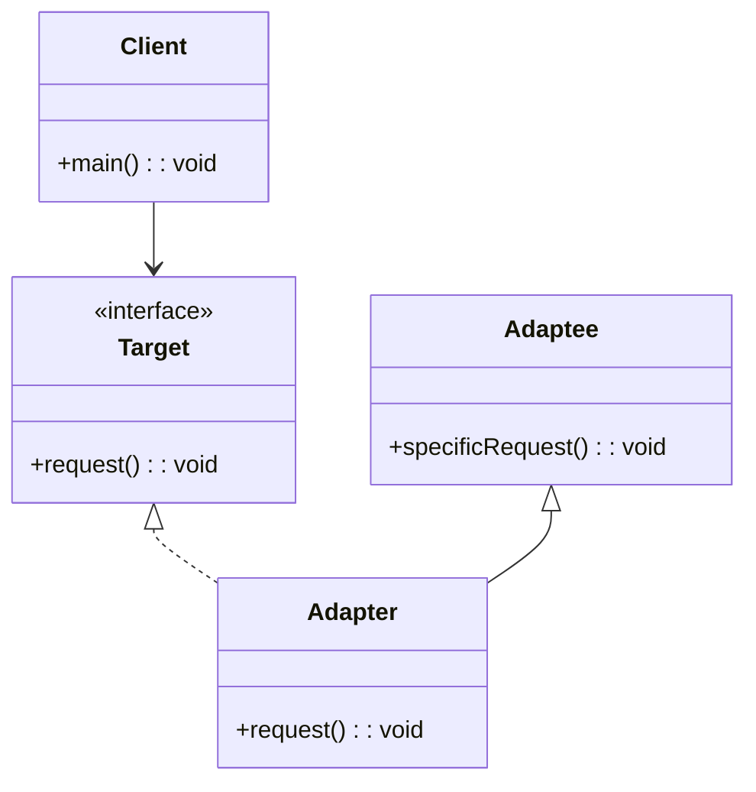
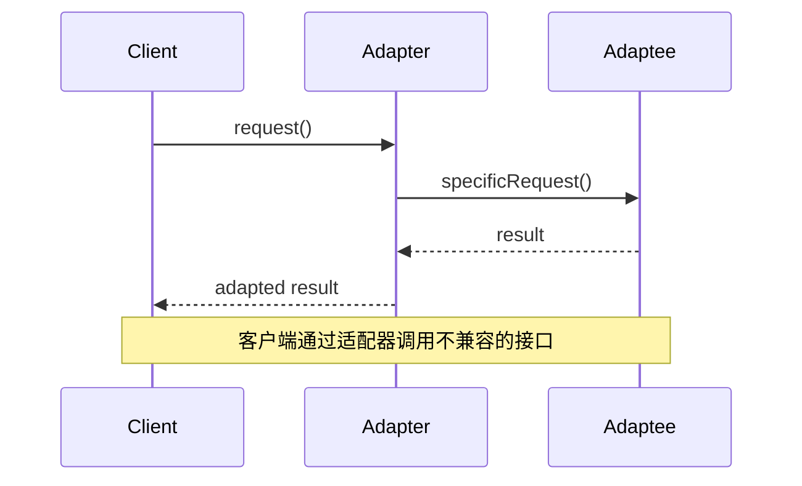

# 适配器模式 (Adapter Pattern)

## 📋 模式概述

### 定义
适配器模式将一个类的接口转换成客户希望的另一个接口，使得原本由于接口不兼容而不能一起工作的类可以一起工作。

### 意图
- 使接口不兼容的类能够相互合作
- 复用现有的类，即使其接口不符合需求
- 创建一个统一的接口来访问不同的类
- 在不修改现有代码的情况下集成新功能

## 🏗️ 结构图

### 对象适配器



### 类适配器



## ⏱️ 时序图



## 💻 代码实现

### 对象适配器实现

```java
/**
 * 目标接口 - 客户端期望的接口
 */
public interface Target {
    void request();
}

/**
 * 被适配者 - 需要被适配的现有类
 */
public class Adaptee {
    public void specificRequest() {
        System.out.println("Adaptee: 执行特定请求");
    }
}

/**
 * 对象适配器
 */
public class ObjectAdapter implements Target {
    private Adaptee adaptee;
    
    public ObjectAdapter(Adaptee adaptee) {
        this.adaptee = adaptee;
    }
    
    @Override
    public void request() {
        System.out.println("ObjectAdapter: 转换请求");
        adaptee.specificRequest();
    }
}
```

### 类适配器实现

```java
/**
 * 类适配器（通过继承实现）
 */
public class ClassAdapter extends Adaptee implements Target {
    @Override
    public void request() {
        System.out.println("ClassAdapter: 转换请求");
        specificRequest();
    }
}
```

## 🧪 实际应用示例

### 1. 媒体播放器适配器

```java
/**
 * 媒体播放器接口
 */
public interface MediaPlayer {
    void play(String audioType, String fileName);
}

/**
 * 高级媒体播放器接口
 */
public interface AdvancedMediaPlayer {
    void playVlc(String fileName);
    void playMp4(String fileName);
}

/**
 * VLC播放器
 */
public class VlcPlayer implements AdvancedMediaPlayer {
    @Override
    public void playVlc(String fileName) {
        System.out.println("播放VLC文件: " + fileName);
    }
    
    @Override
    public void playMp4(String fileName) {
        // VLC播放器不支持MP4
    }
}

/**
 * MP4播放器
 */
public class Mp4Player implements AdvancedMediaPlayer {
    @Override
    public void playVlc(String fileName) {
        // MP4播放器不支持VLC
    }
    
    @Override
    public void playMp4(String fileName) {
        System.out.println("播放MP4文件: " + fileName);
    }
}

/**
 * 媒体适配器
 */
public class MediaAdapter implements MediaPlayer {
    private AdvancedMediaPlayer advancedPlayer;
    
    public MediaAdapter(String audioType) {
        if ("vlc".equalsIgnoreCase(audioType)) {
            advancedPlayer = new VlcPlayer();
        } else if ("mp4".equalsIgnoreCase(audioType)) {
            advancedPlayer = new Mp4Player();
        }
    }
    
    @Override
    public void play(String audioType, String fileName) {
        if ("vlc".equalsIgnoreCase(audioType)) {
            advancedPlayer.playVlc(fileName);
        } else if ("mp4".equalsIgnoreCase(audioType)) {
            advancedPlayer.playMp4(fileName);
        }
    }
}

/**
 * 音频播放器
 */
public class AudioPlayer implements MediaPlayer {
    private MediaAdapter mediaAdapter;
    
    @Override
    public void play(String audioType, String fileName) {
        // 内置支持MP3格式
        if ("mp3".equalsIgnoreCase(audioType)) {
            System.out.println("播放MP3文件: " + fileName);
        }
        // 通过适配器支持其他格式
        else if ("vlc".equalsIgnoreCase(audioType) || "mp4".equalsIgnoreCase(audioType)) {
            mediaAdapter = new MediaAdapter(audioType);
            mediaAdapter.play(audioType, fileName);
        } else {
            System.out.println("不支持的音频格式: " + audioType);
        }
    }
}

// 使用示例
public class MediaPlayerDemo {
    public static void main(String[] args) {
        AudioPlayer audioPlayer = new AudioPlayer();
        
        audioPlayer.play("mp3", "beyond_the_horizon.mp3");
        audioPlayer.play("mp4", "alone.mp4");
        audioPlayer.play("vlc", "far_far_away.vlc");
        audioPlayer.play("avi", "mind_me.avi");
    }
}
```

### 2. 数据库适配器

```java
/**
 * 统一数据库接口
 */
public interface DatabaseConnection {
    void connect();
    void executeQuery(String sql);
    void close();
}

/**
 * MySQL数据库（现有系统）
 */
public class MySQLDatabase {
    public void mysqlConnect() {
        System.out.println("连接到MySQL数据库");
    }
    
    public void mysqlQuery(String sql) {
        System.out.println("MySQL执行查询: " + sql);
    }
    
    public void mysqlClose() {
        System.out.println("关闭MySQL连接");
    }
}

/**
 * Oracle数据库（现有系统）
 */
public class OracleDatabase {
    public void oracleConnect() {
        System.out.println("连接到Oracle数据库");
    }
    
    public void oracleExecute(String sql) {
        System.out.println("Oracle执行SQL: " + sql);
    }
    
    public void oracleDisconnect() {
        System.out.println("断开Oracle连接");
    }
}

/**
 * PostgreSQL数据库（现有系统）
 */
public class PostgreSQLDatabase {
    public void pgConnect() {
        System.out.println("连接到PostgreSQL数据库");
    }
    
    public void pgQuery(String sql) {
        System.out.println("PostgreSQL执行查询: " + sql);
    }
    
    public void pgClose() {
        System.out.println("关闭PostgreSQL连接");
    }
}

/**
 * MySQL适配器
 */
public class MySQLAdapter implements DatabaseConnection {
    private MySQLDatabase mysqlDb;
    
    public MySQLAdapter(MySQLDatabase mysqlDb) {
        this.mysqlDb = mysqlDb;
    }
    
    @Override
    public void connect() {
        mysqlDb.mysqlConnect();
    }
    
    @Override
    public void executeQuery(String sql) {
        mysqlDb.mysqlQuery(sql);
    }
    
    @Override
    public void close() {
        mysqlDb.mysqlClose();
    }
}

/**
 * Oracle适配器
 */
public class OracleAdapter implements DatabaseConnection {
    private OracleDatabase oracleDb;
    
    public OracleAdapter(OracleDatabase oracleDb) {
        this.oracleDb = oracleDb;
    }
    
    @Override
    public void connect() {
        oracleDb.oracleConnect();
    }
    
    @Override
    public void executeQuery(String sql) {
        oracleDb.oracleExecute(sql);
    }
    
    @Override
    public void close() {
        oracleDb.oracleDisconnect();
    }
}

/**
 * PostgreSQL适配器
 */
public class PostgreSQLAdapter implements DatabaseConnection {
    private PostgreSQLDatabase pgDb;
    
    public PostgreSQLAdapter(PostgreSQLDatabase pgDb) {
        this.pgDb = pgDb;
    }
    
    @Override
    public void connect() {
        pgDb.pgConnect();
    }
    
    @Override
    public void executeQuery(String sql) {
        pgDb.pgQuery(sql);
    }
    
    @Override
    public void close() {
        pgDb.pgClose();
    }
}

/**
 * 数据库管理器
 */
public class DatabaseManager {
    private List<DatabaseConnection> connections = new ArrayList<>();
    
    public void addDatabase(DatabaseConnection connection) {
        connections.add(connection);
    }
    
    public void executeQueryOnAllDatabases(String sql) {
        for (DatabaseConnection connection : connections) {
            connection.connect();
            connection.executeQuery(sql);
            connection.close();
            System.out.println("---");
        }
    }
}

// 使用示例
public class DatabaseAdapterDemo {
    public static void main(String[] args) {
        DatabaseManager manager = new DatabaseManager();
        
        // 添加不同类型的数据库
        manager.addDatabase(new MySQLAdapter(new MySQLDatabase()));
        manager.addDatabase(new OracleAdapter(new OracleDatabase()));
        manager.addDatabase(new PostgreSQLAdapter(new PostgreSQLDatabase()));
        
        // 在所有数据库上执行相同的查询
        manager.executeQueryOnAllDatabases("SELECT * FROM users");
    }
}
```

### 3. 支付系统适配器

```java
/**
 * 统一支付接口
 */
public interface PaymentProcessor {
    boolean processPayment(double amount, String currency);
    String getPaymentStatus(String transactionId);
}

/**
 * 支付宝支付（第三方API）
 */
public class AlipayService {
    public boolean alipayPay(double money, String currencyType) {
        System.out.println("使用支付宝支付: " + money + " " + currencyType);
        return true;
    }
    
    public String checkAlipayStatus(String orderId) {
        return "支付宝订单 " + orderId + " 状态: 成功";
    }
}

/**
 * 微信支付（第三方API）
 */
public class WeChatPayService {
    public boolean wechatPay(double amount, String currency) {
        System.out.println("使用微信支付: " + amount + " " + currency);
        return true;
    }
    
    public String getWeChatPaymentInfo(String transactionId) {
        return "微信支付交易 " + transactionId + " 状态: 完成";
    }
}

/**
 * PayPal支付（第三方API）
 */
public class PayPalService {
    public boolean makePayment(double sum, String currencyCode) {
        System.out.println("使用PayPal支付: " + sum + " " + currencyCode);
        return true;
    }
    
    public String retrievePaymentStatus(String paymentId) {
        return "PayPal支付 " + paymentId + " 状态: 已完成";
    }
}

/**
 * 支付宝适配器
 */
public class AlipayAdapter implements PaymentProcessor {
    private AlipayService alipayService;
    
    public AlipayAdapter(AlipayService alipayService) {
        this.alipayService = alipayService;
    }
    
    @Override
    public boolean processPayment(double amount, String currency) {
        return alipayService.alipayPay(amount, currency);
    }
    
    @Override
    public String getPaymentStatus(String transactionId) {
        return alipayService.checkAlipayStatus(transactionId);
    }
}

/**
 * 微信支付适配器
 */
public class WeChatPayAdapter implements PaymentProcessor {
    private WeChatPayService weChatPayService;
    
    public WeChatPayAdapter(WeChatPayService weChatPayService) {
        this.weChatPayService = weChatPayService;
    }
    
    @Override
    public boolean processPayment(double amount, String currency) {
        return weChatPayService.wechatPay(amount, currency);
    }
    
    @Override
    public String getPaymentStatus(String transactionId) {
        return weChatPayService.getWeChatPaymentInfo(transactionId);
    }
}

/**
 * PayPal适配器
 */
public class PayPalAdapter implements PaymentProcessor {
    private PayPalService payPalService;
    
    public PayPalAdapter(PayPalService payPalService) {
        this.payPalService = payPalService;
    }
    
    @Override
    public boolean processPayment(double amount, String currency) {
        return payPalService.makePayment(amount, currency);
    }
    
    @Override
    public String getPaymentStatus(String transactionId) {
        return payPalService.retrievePaymentStatus(transactionId);
    }
}

/**
 * 支付管理器
 */
public class PaymentManager {
    private Map<String, PaymentProcessor> processors = new HashMap<>();
    
    public void registerPaymentProcessor(String name, PaymentProcessor processor) {
        processors.put(name, processor);
    }
    
    public boolean processPayment(String paymentMethod, double amount, String currency) {
        PaymentProcessor processor = processors.get(paymentMethod);
        if (processor != null) {
            return processor.processPayment(amount, currency);
        } else {
            System.out.println("不支持的支付方式: " + paymentMethod);
            return false;
        }
    }
    
    public String getPaymentStatus(String paymentMethod, String transactionId) {
        PaymentProcessor processor = processors.get(paymentMethod);
        if (processor != null) {
            return processor.getPaymentStatus(transactionId);
        } else {
            return "不支持的支付方式: " + paymentMethod;
        }
    }
    
    public Set<String> getSupportedPaymentMethods() {
        return processors.keySet();
    }
}

// 使用示例
public class PaymentAdapterDemo {
    public static void main(String[] args) {
        PaymentManager paymentManager = new PaymentManager();
        
        // 注册不同的支付处理器
        paymentManager.registerPaymentProcessor("alipay", 
            new AlipayAdapter(new AlipayService()));
        paymentManager.registerPaymentProcessor("wechat", 
            new WeChatPayAdapter(new WeChatPayService()));
        paymentManager.registerPaymentProcessor("paypal", 
            new PayPalAdapter(new PayPalService()));
        
        // 显示支持的支付方式
        System.out.println("支持的支付方式: " + paymentManager.getSupportedPaymentMethods());
        System.out.println();
        
        // 使用不同的支付方式
        paymentManager.processPayment("alipay", 100.0, "CNY");
        System.out.println(paymentManager.getPaymentStatus("alipay", "ALI123456"));
        System.out.println();
        
        paymentManager.processPayment("wechat", 200.0, "CNY");
        System.out.println(paymentManager.getPaymentStatus("wechat", "WX789012"));
        System.out.println();
        
        paymentManager.processPayment("paypal", 50.0, "USD");
        System.out.println(paymentManager.getPaymentStatus("paypal", "PP345678"));
        System.out.println();
        
        // 尝试不支持的支付方式
        paymentManager.processPayment("bitcoin", 10.0, "BTC");
    }
}
```

## 🎯 适用场景

### 适合使用适配器模式的场景：

1. **系统集成** - 需要使用现有的类，但其接口不符合需求
2. **第三方库集成** - 集成第三方库或API
3. **遗留系统改造** - 在不修改遗留代码的情况下使用新接口
4. **接口标准化** - 为不同的类提供统一的接口

### 具体应用场景：

- **数据库访问层** - 适配不同数据库的API
- **支付系统** - 集成多种支付方式
- **日志系统** - 适配不同的日志框架
- **消息队列** - 适配不同的消息中间件
- **文件系统** - 适配不同的存储系统

## ✅ 优点

1. **提高类的复用性** - 可以复用现有的类
2. **分离接口和实现** - 客户端与具体实现解耦
3. **符合开闭原则** - 可以在不修改现有代码的情况下添加新的适配器
4. **提高系统灵活性** - 可以轻松切换不同的实现

## ❌ 缺点

1. **增加系统复杂性** - 引入了额外的抽象层
2. **代码量增加** - 需要编写适配器类
3. **性能开销** - 增加了一层间接调用

## 🔄 与其他模式的关系

- **桥接模式** - 都涉及接口转换，但桥接模式在设计时就考虑了抽象和实现的分离
- **装饰器模式** - 都使用组合，但装饰器模式是为了增强功能
- **外观模式** - 都提供了简化的接口，但外观模式是为了简化复杂系统
- **代理模式** - 都使用组合和委托，但代理模式是为了控制访问

## 📝 最佳实践

1. **优先使用对象适配器** - 比类适配器更灵活
2. **保持适配器简单** - 只做接口转换，不添加额外逻辑
3. **考虑双向适配器** - 在需要时支持双向转换
4. **使用工厂模式** - 结合工厂模式创建适配器
5. **文档化适配逻辑** - 清楚说明适配的规则和限制

## 🚨 注意事项

1. **接口语义一致性** - 确保适配后的接口语义正确
2. **异常处理** - 正确处理被适配类抛出的异常
3. **性能考虑** - 避免过多的适配器层次
4. **线程安全** - 确保适配器在多线程环境下的安全性

---

*适配器模式是系统集成中最常用的模式之一，它让不兼容的接口能够协同工作，是构建灵活系统的重要工具。*