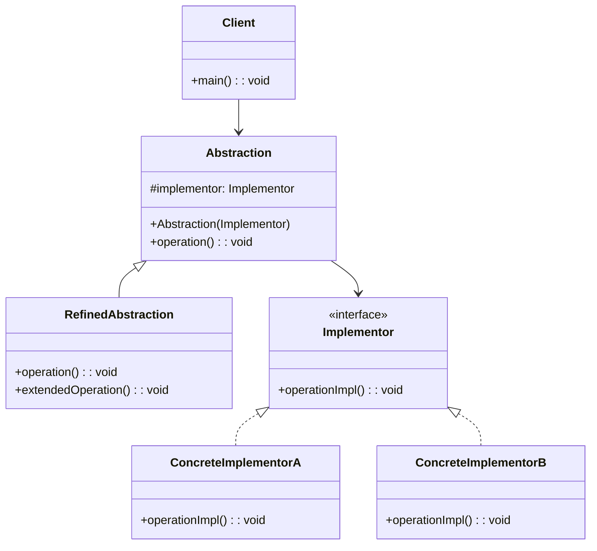
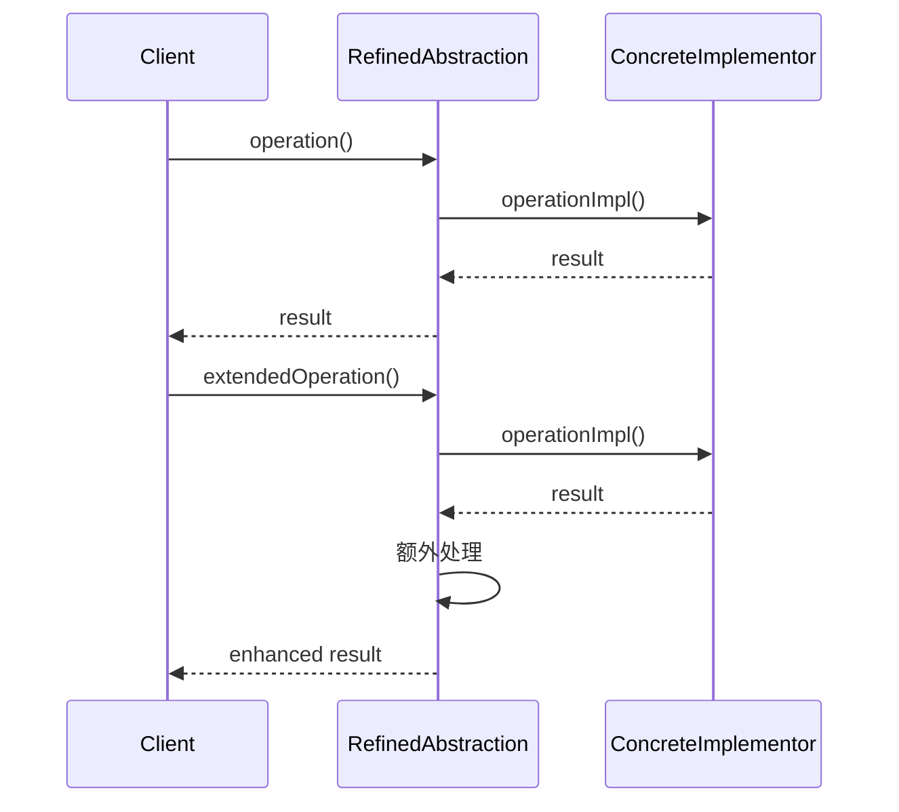

# 桥接模式 (Bridge Pattern)

## 📋 模式概述

### 定义
桥接模式将抽象部分与它的实现部分分离，使它们都可以独立地变化。

### 意图
- 将抽象与实现解耦，使二者可以独立变化
- 通过组合而不是继承来连接抽象和实现
- 避免在多个维度上的类爆炸
- 提高系统的可扩展性

## 🏗️ 结构图



## ⏱️ 时序图



## 💻 代码实现

### 基础实现

```java
/**
 * 实现接口
 */
public interface Implementor {
    void operationImpl();
}

/**
 * 具体实现A
 */
public class ConcreteImplementorA implements Implementor {
    @Override
    public void operationImpl() {
        System.out.println("ConcreteImplementorA: 具体实现A的操作");
    }
}

/**
 * 具体实现B
 */
public class ConcreteImplementorB implements Implementor {
    @Override
    public void operationImpl() {
        System.out.println("ConcreteImplementorB: 具体实现B的操作");
    }
}

/**
 * 抽象类
 */
public abstract class Abstraction {
    protected Implementor implementor;
    
    public Abstraction(Implementor implementor) {
        this.implementor = implementor;
    }
    
    public abstract void operation();
}

/**
 * 扩展抽象类
 */
public class RefinedAbstraction extends Abstraction {
    public RefinedAbstraction(Implementor implementor) {
        super(implementor);
    }
    
    @Override
    public void operation() {
        System.out.println("RefinedAbstraction: 执行操作");
        implementor.operationImpl();
    }
    
    public void extendedOperation() {
        System.out.println("RefinedAbstraction: 执行扩展操作");
        implementor.operationImpl();
        System.out.println("RefinedAbstraction: 额外的处理逻辑");
    }
}
```

## 🧪 实际应用示例

### 1. 图形绘制系统

```java
/**
 * 绘制API接口
 */
public interface DrawingAPI {
    void drawCircle(double x, double y, double radius);
    void drawRectangle(double x, double y, double width, double height);
    void drawLine(double x1, double y1, double x2, double y2);
}

/**
 * Windows绘制API
 */
public class WindowsDrawingAPI implements DrawingAPI {
    @Override
    public void drawCircle(double x, double y, double radius) {
        System.out.printf("Windows API: 在 (%.1f, %.1f) 绘制半径为 %.1f 的圆%n", x, y, radius);
    }
    
    @Override
    public void drawRectangle(double x, double y, double width, double height) {
        System.out.printf("Windows API: 在 (%.1f, %.1f) 绘制 %.1f x %.1f 的矩形%n", x, y, width, height);
    }
    
    @Override
    public void drawLine(double x1, double y1, double x2, double y2) {
        System.out.printf("Windows API: 从 (%.1f, %.1f) 到 (%.1f, %.1f) 绘制直线%n", x1, y1, x2, y2);
    }
}

/**
 * Linux绘制API
 */
public class LinuxDrawingAPI implements DrawingAPI {
    @Override
    public void drawCircle(double x, double y, double radius) {
        System.out.printf("Linux API: 在 (%.1f, %.1f) 绘制半径为 %.1f 的圆%n", x, y, radius);
    }
    
    @Override
    public void drawRectangle(double x, double y, double width, double height) {
        System.out.printf("Linux API: 在 (%.1f, %.1f) 绘制 %.1f x %.1f 的矩形%n", x, y, width, height);
    }
    
    @Override
    public void drawLine(double x1, double y1, double x2, double y2) {
        System.out.printf("Linux API: 从 (%.1f, %.1f) 到 (%.1f, %.1f) 绘制直线%n", x1, y1, x2, y2);
    }
}

/**
 * Web绘制API
 */
public class WebDrawingAPI implements DrawingAPI {
    @Override
    public void drawCircle(double x, double y, double radius) {
        System.out.printf("Web Canvas: 在 (%.1f, %.1f) 绘制半径为 %.1f 的圆%n", x, y, radius);
    }
    
    @Override
    public void drawRectangle(double x, double y, double width, double height) {
        System.out.printf("Web Canvas: 在 (%.1f, %.1f) 绘制 %.1f x %.1f 的矩形%n", x, y, width, height);
    }
    
    @Override
    public void drawLine(double x1, double y1, double x2, double y2) {
        System.out.printf("Web Canvas: 从 (%.1f, %.1f) 到 (%.1f, %.1f) 绘制直线%n", x1, y1, x2, y2);
    }
}

/**
 * 抽象形状类
 */
public abstract class Shape {
    protected DrawingAPI drawingAPI;
    protected double x, y;
    
    public Shape(DrawingAPI drawingAPI, double x, double y) {
        this.drawingAPI = drawingAPI;
        this.x = x;
        this.y = y;
    }
    
    public abstract void draw();
    public abstract void resize(double factor);
    
    public void move(double newX, double newY) {
        this.x = newX;
        this.y = newY;
    }
}

/**
 * 圆形
 */
public class Circle extends Shape {
    private double radius;
    
    public Circle(DrawingAPI drawingAPI, double x, double y, double radius) {
        super(drawingAPI, x, y);
        this.radius = radius;
    }
    
    @Override
    public void draw() {
        drawingAPI.drawCircle(x, y, radius);
    }
    
    @Override
    public void resize(double factor) {
        radius *= factor;
        System.out.printf("圆形大小调整为原来的 %.1f 倍，新半径: %.1f%n", factor, radius);
    }
    
    public double getRadius() {
        return radius;
    }
}

/**
 * 矩形
 */
public class Rectangle extends Shape {
    private double width, height;
    
    public Rectangle(DrawingAPI drawingAPI, double x, double y, double width, double height) {
        super(drawingAPI, x, y);
        this.width = width;
        this.height = height;
    }
    
    @Override
    public void draw() {
        drawingAPI.drawRectangle(x, y, width, height);
    }
    
    @Override
    public void resize(double factor) {
        width *= factor;
        height *= factor;
        System.out.printf("矩形大小调整为原来的 %.1f 倍，新尺寸: %.1f x %.1f%n", factor, width, height);
    }
    
    public double getWidth() { return width; }
    public double getHeight() { return height; }
}

/**
 * 线段
 */
public class Line extends Shape {
    private double x2, y2;
    
    public Line(DrawingAPI drawingAPI, double x1, double y1, double x2, double y2) {
        super(drawingAPI, x1, y1);
        this.x2 = x2;
        this.y2 = y2;
    }
    
    @Override
    public void draw() {
        drawingAPI.drawLine(x, y, x2, y2);
    }
    
    @Override
    public void resize(double factor) {
        // 线段的缩放是相对于起点的
        x2 = x + (x2 - x) * factor;
        y2 = y + (y2 - y) * factor;
        System.out.printf("线段长度调整为原来的 %.1f 倍%n", factor);
    }
    
    public double getX2() { return x2; }
    public double getY2() { return y2; }
}

// 使用示例
public class DrawingBridgeDemo {
    public static void main(String[] args) {
        // 创建不同的绘制API
        DrawingAPI windowsAPI = new WindowsDrawingAPI();
        DrawingAPI linuxAPI = new LinuxDrawingAPI();
        DrawingAPI webAPI = new WebDrawingAPI();
        
        // 使用Windows API绘制图形
        System.out.println("=== 使用Windows API ===");
        Shape circle1 = new Circle(windowsAPI, 10, 10, 5);
        Shape rectangle1 = new Rectangle(windowsAPI, 20, 20, 10, 8);
        Shape line1 = new Line(windowsAPI, 0, 0, 10, 10);
        
        circle1.draw();
        rectangle1.draw();
        line1.draw();
        
        // 使用Linux API绘制相同的图形
        System.out.println("\n=== 使用Linux API ===");
        Shape circle2 = new Circle(linuxAPI, 10, 10, 5);
        Shape rectangle2 = new Rectangle(linuxAPI, 20, 20, 10, 8);
        Shape line2 = new Line(linuxAPI, 0, 0, 10, 10);
        
        circle2.draw();
        rectangle2.draw();
        line2.draw();
        
        // 使用Web API绘制图形
        System.out.println("\n=== 使用Web API ===");
        Shape circle3 = new Circle(webAPI, 15, 15, 7);
        circle3.draw();
        circle3.resize(1.5);
        circle3.draw();
        
        // 移动和缩放操作
        System.out.println("\n=== 图形操作 ===");
        circle1.move(30, 30);
        circle1.resize(2.0);
        circle1.draw();
        
        rectangle1.resize(0.5);
        rectangle1.draw();
    }
}
```

### 2. 消息发送系统

```java
/**
 * 消息发送接口
 */
public interface MessageSender {
    void sendMessage(String message, String recipient);
    boolean isAvailable();
    String getSenderInfo();
}

/**
 * 邮件发送器
 */
public class EmailSender implements MessageSender {
    private String smtpServer;
    private int port;
    
    public EmailSender(String smtpServer, int port) {
        this.smtpServer = smtpServer;
        this.port = port;
    }
    
    @Override
    public void sendMessage(String message, String recipient) {
        System.out.println("通过邮件发送消息:");
        System.out.println("SMTP服务器: " + smtpServer + ":" + port);
        System.out.println("收件人: " + recipient);
        System.out.println("内容: " + message);
    }
    
    @Override
    public boolean isAvailable() {
        // 模拟检查SMTP服务器可用性
        return true;
    }
    
    @Override
    public String getSenderInfo() {
        return "邮件发送器 (" + smtpServer + ":" + port + ")";
    }
}

/**
 * 短信发送器
 */
public class SMSSender implements MessageSender {
    private String apiKey;
    private String provider;
    
    public SMSSender(String provider, String apiKey) {
        this.provider = provider;
        this.apiKey = apiKey;
    }
    
    @Override
    public void sendMessage(String message, String recipient) {
        System.out.println("通过短信发送消息:");
        System.out.println("短信服务商: " + provider);
        System.out.println("接收号码: " + recipient);
        System.out.println("内容: " + message);
    }
    
    @Override
    public boolean isAvailable() {
        // 模拟检查短信服务可用性
        return true;
    }
    
    @Override
    public String getSenderInfo() {
        return "短信发送器 (" + provider + ")";
    }
}

/**
 * 微信发送器
 */
public class WeChatSender implements MessageSender {
    private String appId;
    private String appSecret;
    
    public WeChatSender(String appId, String appSecret) {
        this.appId = appId;
        this.appSecret = appSecret;
    }
    
    @Override
    public void sendMessage(String message, String recipient) {
        System.out.println("通过微信发送消息:");
        System.out.println("应用ID: " + appId);
        System.out.println("接收用户: " + recipient);
        System.out.println("内容: " + message);
    }
    
    @Override
    public boolean isAvailable() {
        // 模拟检查微信API可用性
        return true;
    }
    
    @Override
    public String getSenderInfo() {
        return "微信发送器 (" + appId + ")";
    }
}

/**
 * 抽象消息类
 */
public abstract class Message {
    protected MessageSender sender;
    protected String content;
    protected String recipient;
    protected Date timestamp;
    
    public Message(MessageSender sender, String content, String recipient) {
        this.sender = sender;
        this.content = content;
        this.recipient = recipient;
        this.timestamp = new Date();
    }
    
    public abstract void send();
    
    public void setSender(MessageSender sender) {
        this.sender = sender;
    }
    
    public String getContent() { return content; }
    public String getRecipient() { return recipient; }
    public Date getTimestamp() { return timestamp; }
}

/**
 * 普通消息
 */
public class SimpleMessage extends Message {
    public SimpleMessage(MessageSender sender, String content, String recipient) {
        super(sender, content, recipient);
    }
    
    @Override
    public void send() {
        if (sender.isAvailable()) {
            System.out.println("发送普通消息 - " + sender.getSenderInfo());
            sender.sendMessage(content, recipient);
            System.out.println("发送时间: " + timestamp);
        } else {
            System.out.println("发送失败: " + sender.getSenderInfo() + " 不可用");
        }
    }
}

/**
 * 紧急消息
 */
public class UrgentMessage extends Message {
    private int priority;
    
    public UrgentMessage(MessageSender sender, String content, String recipient, int priority) {
        super(sender, content, recipient);
        this.priority = priority;
    }
    
    @Override
    public void send() {
        if (sender.isAvailable()) {
            System.out.println("发送紧急消息 (优先级: " + priority + ") - " + sender.getSenderInfo());
            String urgentContent = "[紧急] " + content;
            sender.sendMessage(urgentContent, recipient);
            System.out.println("发送时间: " + timestamp);
        } else {
            System.out.println("紧急消息发送失败: " + sender.getSenderInfo() + " 不可用");
        }
    }
    
    public int getPriority() { return priority; }
}

/**
 * 加密消息
 */
public class EncryptedMessage extends Message {
    private String encryptionKey;
    
    public EncryptedMessage(MessageSender sender, String content, String recipient, String encryptionKey) {
        super(sender, content, recipient);
        this.encryptionKey = encryptionKey;
    }
    
    @Override
    public void send() {
        if (sender.isAvailable()) {
            System.out.println("发送加密消息 - " + sender.getSenderInfo());
            String encryptedContent = encrypt(content);
            sender.sendMessage(encryptedContent, recipient);
            System.out.println("发送时间: " + timestamp);
        } else {
            System.out.println("加密消息发送失败: " + sender.getSenderInfo() + " 不可用");
        }
    }
    
    private String encrypt(String content) {
        // 简单的加密模拟
        return "[加密:" + encryptionKey + "] " + content;
    }
}

// 使用示例
public class MessageBridgeDemo {
    public static void main(String[] args) {
        // 创建不同的消息发送器
        MessageSender emailSender = new EmailSender("smtp.gmail.com", 587);
        MessageSender smsSender = new SMSSender("阿里云", "your-api-key");
        MessageSender wechatSender = new WeChatSender("wx123456", "secret123");
        
        // 创建不同类型的消息
        Message simpleEmail = new SimpleMessage(emailSender, "这是一封普通邮件", "user@example.com");
        Message urgentSMS = new UrgentMessage(smsSender, "系统故障，请立即处理", "13800138000", 1);
        Message encryptedWeChat = new EncryptedMessage(wechatSender, "机密信息", "wechat_user_id", "AES256");
        
        // 发送消息
        System.out.println("=== 发送消息 ===");
        simpleEmail.send();
        System.out.println();
        
        urgentSMS.send();
        System.out.println();
        
        encryptedWeChat.send();
        System.out.println();
        
        // 切换发送方式
        System.out.println("=== 切换发送方式 ===");
        simpleEmail.setSender(smsSender);
        simpleEmail.send();
        System.out.println();
        
        urgentSMS.setSender(wechatSender);
        urgentSMS.send();
    }
}
```

## 🎯 适用场景

### 适合使用桥接模式的场景：

1. **多维度变化** - 系统有多个变化维度
2. **运行时切换实现** - 需要在运行时切换实现
3. **避免类爆炸** - 避免继承层次过深
4. **抽象和实现分离** - 希望抽象和实现都能独立扩展

### 具体应用场景：

- **图形系统** - 形状和绘制API的分离
- **数据库驱动** - 数据库操作和具体数据库的分离
- **消息系统** - 消息类型和发送方式的分离
- **设备驱动** - 设备抽象和具体驱动的分离
- **UI框架** - 控件和渲染引擎的分离

## ✅ 优点

1. **分离抽象和实现** - 两者可以独立变化
2. **提高可扩展性** - 可以独立扩展抽象和实现层次
3. **隐藏实现细节** - 客户端不需要知道具体实现
4. **运行时切换实现** - 可以动态改变实现
5. **符合开闭原则** - 对扩展开放，对修改关闭

## ❌ 缺点

1. **增加系统复杂性** - 引入了额外的抽象层
2. **理解难度增加** - 需要理解抽象和实现的关系
3. **设计难度增加** - 需要正确识别变化维度

## 🔄 与其他模式的关系

- **适配器模式** - 都涉及接口转换，但桥接模式在设计时就考虑了分离
- **状态模式** - 状态模式可以看作是桥接模式的特殊情况
- **策略模式** - 都使用组合，但策略模式关注算法的切换
- **抽象工厂模式** - 可以一起使用来创建特定的实现

## 📝 最佳实践

1. **识别变化维度** - 正确识别系统的变化维度
2. **保持接口简单** - 实现接口应该简单明了
3. **使用工厂模式** - 结合工厂模式创建实现对象
4. **考虑性能影响** - 桥接可能带来性能开销
5. **文档化设计决策** - 清楚说明为什么使用桥接模式

## 🚨 注意事项

1. **不要过度设计** - 只有在确实需要时才使用桥接模式
2. **接口设计** - 实现接口应该稳定，不要频繁变化
3. **性能考虑** - 额外的间接层可能影响性能
4. **线程安全** - 确保实现类在多线程环境下的安全性

---

*桥接模式是处理多维度变化的强大工具，它通过分离抽象和实现，提供了高度的灵活性和可扩展性。*