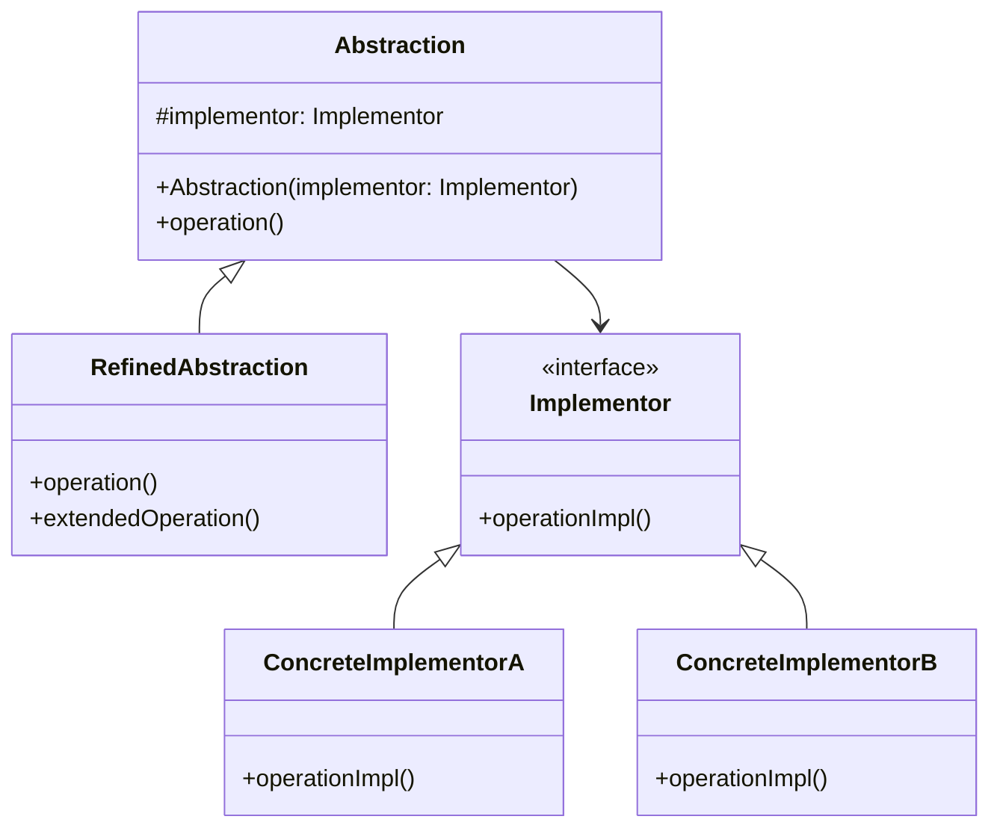
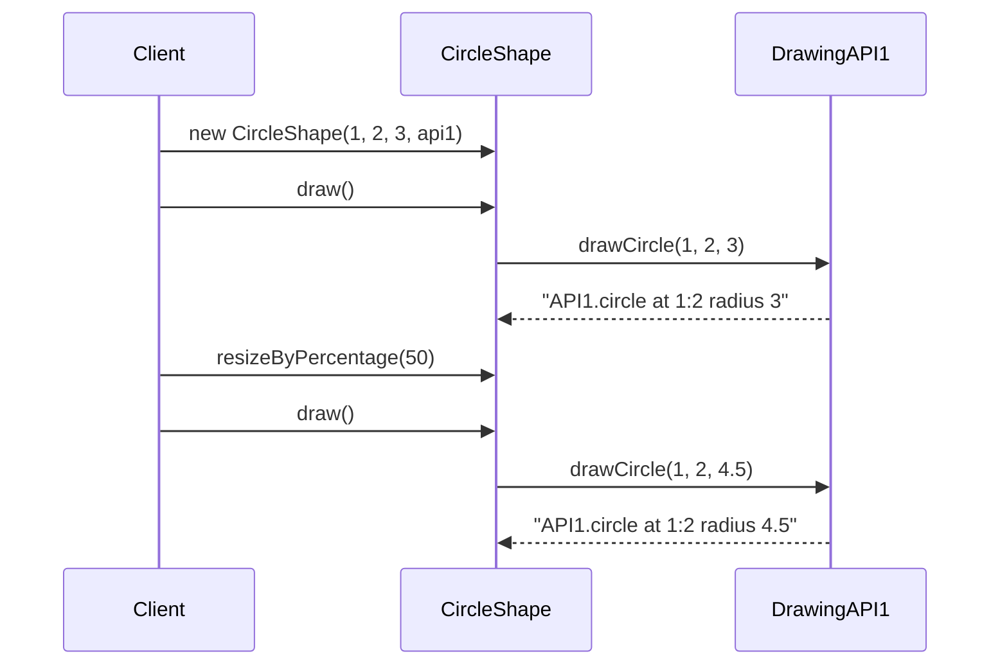

# 桥接模式 (Bridge Pattern) ⚠️ 低应用价值

> **⚠️ 注意：此模式在现代Java开发中应用价值较低**
> - Java的接口和抽象类已经提供了很好的抽象机制
> - 增加了不必要的复杂度
> - 现代框架提供更好的解耦方案
> - **代码已删除，仅保留文档作为学习参考**

## 📋 模式概述

### 定义
桥接模式将抽象部分与它的实现部分分离，使它们都可以独立地变化。它通过组合关系而不是继承关系来实现，从而降低了抽象和实现这两个可变维度的耦合度。

### 核心思想
- 分离抽象和实现
- 通过组合而非继承实现功能
- 两个维度可以独立变化
- 运行时选择实现

## 🎯 解决的问题

### 主要问题
1. **继承爆炸**：多维度变化导致类数量急剧增长
2. **紧耦合**：抽象和实现紧密绑定
3. **扩展困难**：添加新的抽象或实现需要修改现有代码
4. **运行时切换**：无法在运行时动态切换实现

### 适用场景（在Java中很少见）
- 需要在运行时切换实现
- 抽象和实现都需要独立扩展
- 不希望在抽象和实现之间建立静态绑定
- 多个对象共享实现

## 🏗️ 模式结构

### UML类图


## 💻 代码示例

### 基础实现（已删除源码）

```java
// 实现接口
public interface DrawingAPI {
    void drawCircle(double x, double y, double radius);
    void drawRectangle(double x, double y, double width, double height);
}

// 具体实现A
public class DrawingAPI1 implements DrawingAPI {
    @Override
    public void drawCircle(double x, double y, double radius) {
        System.out.println("API1.circle at " + x + ":" + y + " radius " + radius);
    }
    
    @Override
    public void drawRectangle(double x, double y, double width, double height) {
        System.out.println("API1.rectangle at " + x + ":" + y + " " + width + "x" + height);
    }
}

// 具体实现B
public class DrawingAPI2 implements DrawingAPI {
    @Override
    public void drawCircle(double x, double y, double radius) {
        System.out.println("API2.circle at " + x + ":" + y + " radius " + radius);
    }
    
    @Override
    public void drawRectangle(double x, double y, double width, double height) {
        System.out.println("API2.rectangle at " + x + ":" + y + " " + width + "x" + height);
    }
}

// 抽象类
public abstract class Shape {
    protected DrawingAPI drawingAPI;
    
    protected Shape(DrawingAPI drawingAPI) {
        this.drawingAPI = drawingAPI;
    }
    
    public abstract void draw();
    public abstract void resizeByPercentage(double pct);
}

// 精化抽象类
public class CircleShape extends Shape {
    private double x, y, radius;
    
    public CircleShape(double x, double y, double radius, DrawingAPI drawingAPI) {
        super(drawingAPI);
        this.x = x;
        this.y = y;
        this.radius = radius;
    }
    
    @Override
    public void draw() {
        drawingAPI.drawCircle(x, y, radius);
    }
    
    @Override
    public void resizeByPercentage(double pct) {
        radius *= (1.0 + pct / 100.0);
    }
}
```

## 🔄 时序图



## ⚡ 实际应用案例

### 案例1：数据库驱动（学术示例）
```java
// 数据库实现接口
public interface DatabaseDriver {
    void connect(String url);
    void executeQuery(String sql);
    void close();
}

// MySQL驱动实现
public class MySQLDriver implements DatabaseDriver {
    @Override
    public void connect(String url) {
        System.out.println("Connecting to MySQL: " + url);
    }
    
    @Override
    public void executeQuery(String sql) {
        System.out.println("Executing MySQL query: " + sql);
    }
    
    @Override
    public void close() {
        System.out.println("Closing MySQL connection");
    }
}

// 数据库抽象类
public abstract class Database {
    protected DatabaseDriver driver;
    
    public Database(DatabaseDriver driver) {
        this.driver = driver;
    }
    
    public abstract void query(String sql);
}

// 用户数据库
public class UserDatabase extends Database {
    public UserDatabase(DatabaseDriver driver) {
        super(driver);
    }
    
    @Override
    public void query(String sql) {
        driver.connect("user_db_url");
        driver.executeQuery(sql);
        driver.close();
    }
}
```

## ⚠️ 为什么在Java中应用价值低

### 主要问题
1. **Java已有更好机制**：
   - 接口提供了天然的抽象
   - 抽象类支持部分实现
   - 多态机制简化设计
   - 依赖注入框架

2. **增加不必要复杂度**：
   - 额外的抽象层
   - 更多的类和接口
   - 理解和维护成本高

3. **现代替代方案更好**：
   - 策略模式更直接
   - 依赖注入更灵活
   - 工厂模式更简单
   - 适配器模式更明确

### 更好的替代方案

```java
// 使用策略模式替代桥接模式
public interface RenderStrategy {
    void render(Shape shape);
}

public class OpenGLRenderer implements RenderStrategy {
    @Override
    public void render(Shape shape) {
        System.out.println("Rendering with OpenGL: " + shape);
    }
}

public class DirectXRenderer implements RenderStrategy {
    @Override
    public void render(Shape shape) {
        System.out.println("Rendering with DirectX: " + shape);
    }
}

public class Shape {
    private RenderStrategy renderStrategy;
    
    public Shape(RenderStrategy renderStrategy) {
        this.renderStrategy = renderStrategy;
    }
    
    public void render() {
        renderStrategy.render(this);
    }
    
    public void setRenderStrategy(RenderStrategy renderStrategy) {
        this.renderStrategy = renderStrategy;
    }
}

// 使用Spring依赖注入
@Service
public class ShapeService {
    @Autowired
    private RenderStrategy renderStrategy;
    
    public void renderShape(Shape shape) {
        renderStrategy.render(shape);
    }
}

// 使用工厂模式
public class RendererFactory {
    public static RenderStrategy createRenderer(String type) {
        switch (type.toLowerCase()) {
            case "opengl":
                return new OpenGLRenderer();
            case "directx":
                return new DirectXRenderer();
            default:
                throw new IllegalArgumentException("Unknown renderer type: " + type);
        }
    }
}

// 直接使用接口和多态
public interface Drawable {
    void draw();
}

public class Circle implements Drawable {
    private GraphicsContext context;
    
    public Circle(GraphicsContext context) {
        this.context = context;
    }
    
    @Override
    public void draw() {
        context.drawCircle(this);
    }
}
```

## 📊 优缺点分析

### 优点
- ✅ 分离抽象和实现
- ✅ 提高可扩展性
- ✅ 运行时切换实现

### 缺点（在Java中的问题）
- ❌ 增加系统复杂度
- ❌ Java已有更好机制
- ❌ 理解和维护成本高
- ❌ 现有模式更直接

## 🎯 总结

桥接模式在现代Java开发中应用价值较低：

1. **理论价值**：有助于理解抽象与实现分离的概念
2. **实用价值**：有限，Java语言特性已经提供了更好的支持
3. **建议**：优先使用更直接的设计模式

**推荐替代方案**：
- 使用策略模式处理算法变化
- 采用依赖注入实现解耦
- 利用工厂模式创建对象
- 直接使用接口和多态
- 采用适配器模式处理接口不兼容

> 💡 **学习建议**：理解其设计思想，但在Java项目中优先选择更符合语言特性的解决方案。桥接模式更适合C++等需要手动管理抽象与实现关系的语言。