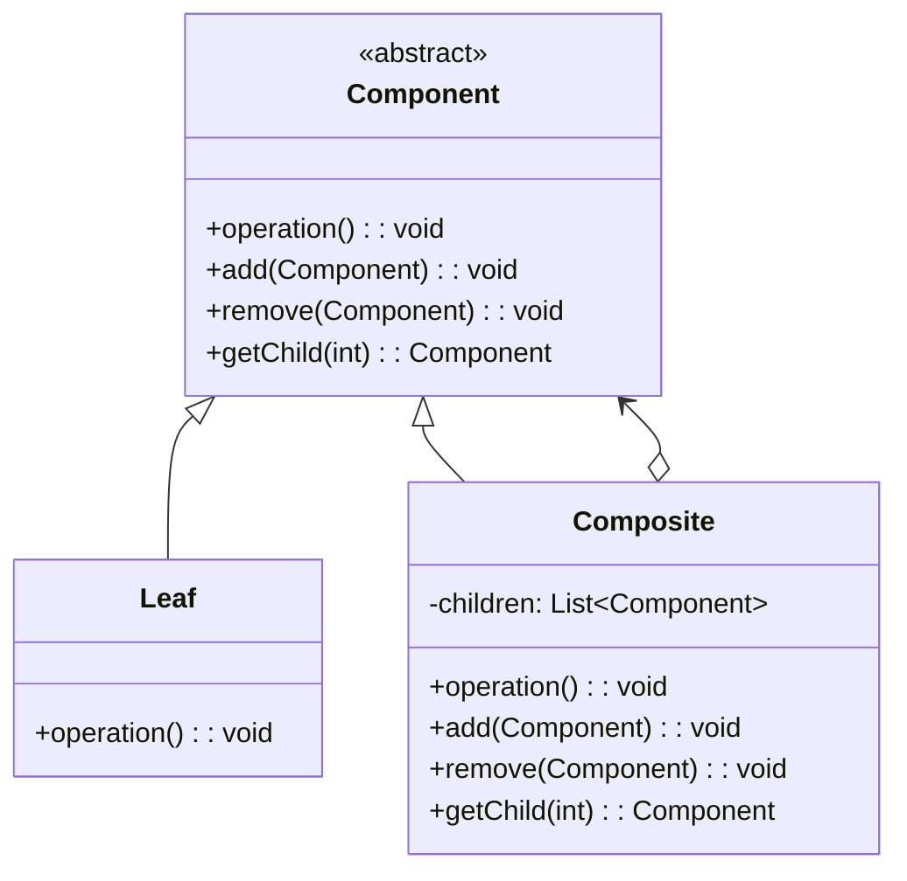

# 组合模式 (Composite Pattern)

## 📋 模式概述

### 定义
组合模式将对象组合成树形结构以表示"部分-整体"的层次结构，使得用户对单个对象和组合对象的使用具有一致性。

### 意图
- 表示对象的部分-整体层次结构
- 让客户端统一处理单个对象和组合对象
- 简化客户端代码，无需区分叶子和容器对象
- 更容易增加新类型的组件

## 🏗️ 结构图



## 💻 代码实现

### 基础实现

```java
/**
 * 抽象组件
 */
public abstract class Component {
    protected String name;
    
    public Component(String name) {
        this.name = name;
    }
    
    public abstract void operation();
    
    public void add(Component component) {
        throw new UnsupportedOperationException("不支持添加操作");
    }
    
    public void remove(Component component) {
        throw new UnsupportedOperationException("不支持删除操作");
    }
    
    public Component getChild(int index) {
        throw new UnsupportedOperationException("不支持获取子组件操作");
    }
    
    public String getName() {
        return name;
    }
}

/**
 * 叶子组件
 */
public class Leaf extends Component {
    public Leaf(String name) {
        super(name);
    }
    
    @Override
    public void operation() {
        System.out.println("叶子组件 " + name + " 执行操作");
    }
}

/**
 * 组合组件
 */
public class Composite extends Component {
    private List<Component> children = new ArrayList<>();
    
    public Composite(String name) {
        super(name);
    }
    
    @Override
    public void operation() {
        System.out.println("组合组件 " + name + " 执行操作");
        for (Component child : children) {
            child.operation();
        }
    }
    
    @Override
    public void add(Component component) {
        children.add(component);
    }
    
    @Override
    public void remove(Component component) {
        children.remove(component);
    }
    
    @Override
    public Component getChild(int index) {
        return children.get(index);
    }
}
```

## 🧪 实际应用示例

### 文件系统示例

```java
/**
 * 文件系统组件
 */
public abstract class FileSystemComponent {
    protected String name;
    
    public FileSystemComponent(String name) {
        this.name = name;
    }
    
    public abstract void display(int depth);
    public abstract long getSize();
    
    public void add(FileSystemComponent component) {
        throw new UnsupportedOperationException();
    }
    
    public void remove(FileSystemComponent component) {
        throw new UnsupportedOperationException();
    }
}

/**
 * 文件（叶子节点）
 */
public class File extends FileSystemComponent {
    private long size;
    
    public File(String name, long size) {
        super(name);
        this.size = size;
    }
    
    @Override
    public void display(int depth) {
        System.out.println("  ".repeat(depth) + "📄 " + name + " (" + size + " bytes)");
    }
    
    @Override
    public long getSize() {
        return size;
    }
}

/**
 * 目录（组合节点）
 */
public class Directory extends FileSystemComponent {
    private List<FileSystemComponent> children = new ArrayList<>();
    
    public Directory(String name) {
        super(name);
    }
    
    @Override
    public void display(int depth) {
        System.out.println("  ".repeat(depth) + "📁 " + name + "/");
        for (FileSystemComponent child : children) {
            child.display(depth + 1);
        }
    }
    
    @Override
    public long getSize() {
        return children.stream().mapToLong(FileSystemComponent::getSize).sum();
    }
    
    @Override
    public void add(FileSystemComponent component) {
        children.add(component);
    }
    
    @Override
    public void remove(FileSystemComponent component) {
        children.remove(component);
    }
}

// 使用示例
public class FileSystemDemo {
    public static void main(String[] args) {
        // 创建根目录
        Directory root = new Directory("root");
        
        // 创建子目录和文件
        Directory documents = new Directory("documents");
        Directory pictures = new Directory("pictures");
        
        File readme = new File("readme.txt", 1024);
        File photo1 = new File("photo1.jpg", 2048000);
        File photo2 = new File("photo2.png", 1536000);
        File report = new File("report.pdf", 512000);
        
        // 构建文件系统树
        root.add(documents);
        root.add(pictures);
        root.add(readme);
        
        documents.add(report);
        pictures.add(photo1);
        pictures.add(photo2);
        
        // 显示文件系统结构
        root.display(0);
        System.out.println("\n总大小: " + root.getSize() + " bytes");
    }
}
```

## 🎯 适用场景

### 适合使用组合模式的场景：

1. **树形结构** - 需要表示对象的部分-整体层次结构
2. **统一处理** - 希望统一处理单个对象和组合对象
3. **递归结构** - 对象结构具有递归特性
4. **忽略组合差异** - 客户端可以忽略组合对象与单个对象的差异

### 具体应用场景：

- **文件系统** - 文件和目录的层次结构
- **GUI组件** - 窗口、面板、按钮等UI组件
- **组织架构** - 公司、部门、员工的层次结构
- **菜单系统** - 菜单和菜单项的层次结构
- **表达式解析** - 数学表达式的树形结构

## ✅ 优点

1. **简化客户端代码** - 统一处理单个对象和组合对象
2. **易于扩展** - 容易增加新的组件类型
3. **符合开闭原则** - 对扩展开放，对修改关闭
4. **灵活的结构** - 可以构建复杂的树形结构

## ❌ 缺点

1. **设计过于宽泛** - 难以限制组合中的组件类型
2. **类型安全问题** - 运行时才能确定组件类型
3. **可能增加系统复杂性** - 对于简单结构可能过度设计

## 🔄 与其他模式的关系

- **装饰器模式** - 都使用递归组合，但装饰器用于增强功能
- **迭代器模式** - 可以用来遍历组合结构
- **访问者模式** - 可以在组合结构上定义新操作
- **享元模式** - 可以共享组合结构中的叶子节点

## 📝 最佳实践

1. **明确组件职责** - 清楚定义叶子和组合组件的职责
2. **考虑类型安全** - 在需要时进行类型检查
3. **提供便利方法** - 为常用操作提供便利方法
4. **处理循环引用** - 避免组合结构中的循环引用
5. **考虑性能** - 对于大型结构考虑性能优化

## 🚨 注意事项

1. **避免过度设计** - 简单结构不需要使用组合模式
2. **类型检查** - 在需要特定类型时进行检查
3. **内存管理** - 注意大型组合结构的内存使用
4. **线程安全** - 多线程环境下的安全性考虑

---

*组合模式是处理树形结构的经典模式，它让客户端能够统一处理单个对象和对象集合。*