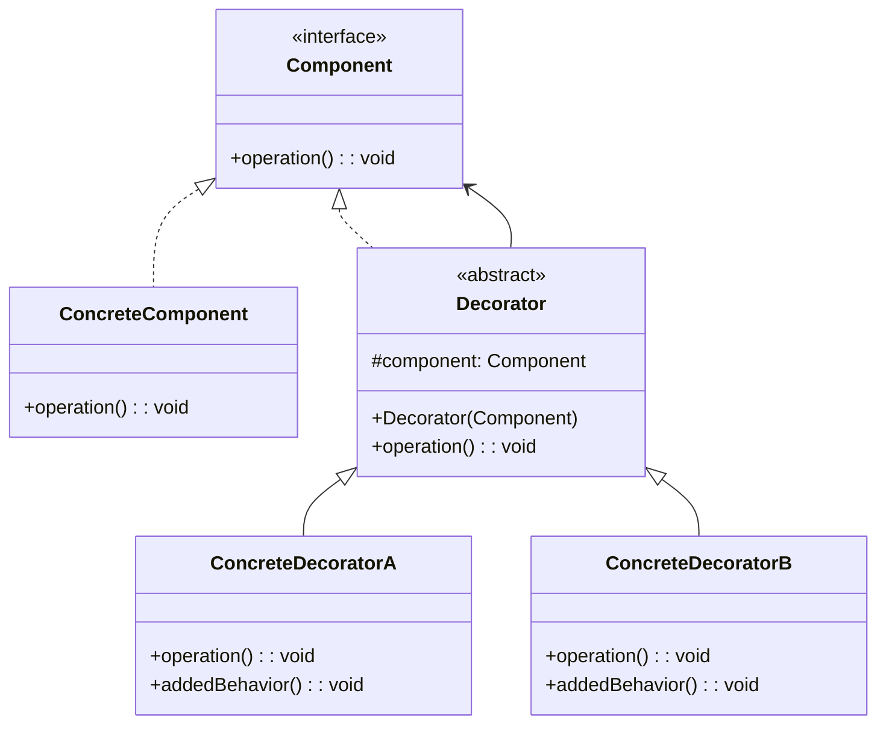
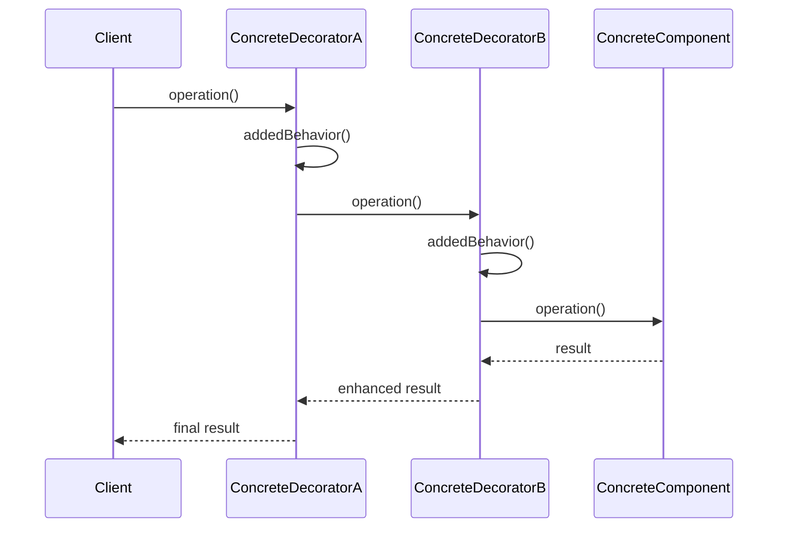

# 装饰器模式 (Decorator Pattern)

## 📋 模式概述

### 定义
装饰器模式动态地给一个对象添加一些额外的职责，就增加功能来说，装饰器模式相比生成子类更为灵活。

### 意图
- 动态地给对象添加新功能
- 提供比继承更灵活的扩展方式
- 避免使用大量子类来扩展功能
- 遵循开闭原则，对扩展开放，对修改关闭

## 🏗️ 结构图



## ⏱️ 时序图



## 💻 代码实现

### 基础实现

```java
/**
 * 组件接口
 */
public interface Component {
    void operation();
}

/**
 * 具体组件
 */
public class ConcreteComponent implements Component {
    @Override
    public void operation() {
        System.out.println("ConcreteComponent: 执行基本操作");
    }
}

/**
 * 抽象装饰器
 */
public abstract class Decorator implements Component {
    protected Component component;
    
    public Decorator(Component component) {
        this.component = component;
    }
    
    @Override
    public void operation() {
        component.operation();
    }
}

/**
 * 具体装饰器A
 */
public class ConcreteDecoratorA extends Decorator {
    public ConcreteDecoratorA(Component component) {
        super(component);
    }
    
    @Override
    public void operation() {
        super.operation();
        addedBehaviorA();
    }
    
    private void addedBehaviorA() {
        System.out.println("ConcreteDecoratorA: 添加功能A");
    }
}

/**
 * 具体装饰器B
 */
public class ConcreteDecoratorB extends Decorator {
    public ConcreteDecoratorB(Component component) {
        super(component);
    }
    
    @Override
    public void operation() {
        super.operation();
        addedBehaviorB();
    }
    
    private void addedBehaviorB() {
        System.out.println("ConcreteDecoratorB: 添加功能B");
    }
}
```

## 🧪 实际应用示例

### 1. 咖啡订单系统

```java
/**
 * 饮料接口
 */
public interface Beverage {
    String getDescription();
    double getCost();
}

/**
 * 基础咖啡
 */
public class Espresso implements Beverage {
    @Override
    public String getDescription() {
        return "浓缩咖啡";
    }
    
    @Override
    public double getCost() {
        return 1.99;
    }
}

/**
 * 美式咖啡
 */
public class HouseBlend implements Beverage {
    @Override
    public String getDescription() {
        return "美式咖啡";
    }
    
    @Override
    public double getCost() {
        return 0.89;
    }
}

/**
 * 抽象调料装饰器
 */
public abstract class CondimentDecorator implements Beverage {
    protected Beverage beverage;
    
    public CondimentDecorator(Beverage beverage) {
        this.beverage = beverage;
    }
    
    @Override
    public abstract String getDescription();
}

/**
 * 牛奶装饰器
 */
public class Milk extends CondimentDecorator {
    public Milk(Beverage beverage) {
        super(beverage);
    }
    
    @Override
    public String getDescription() {
        return beverage.getDescription() + ", 牛奶";
    }
    
    @Override
    public double getCost() {
        return beverage.getCost() + 0.10;
    }
}

/**
 * 摩卡装饰器
 */
public class Mocha extends CondimentDecorator {
    public Mocha(Beverage beverage) {
        super(beverage);
    }
    
    @Override
    public String getDescription() {
        return beverage.getDescription() + ", 摩卡";
    }
    
    @Override
    public double getCost() {
        return beverage.getCost() + 0.20;
    }
}

/**
 * 奶泡装饰器
 */
public class Whip extends CondimentDecorator {
    public Whip(Beverage beverage) {
        super(beverage);
    }
    
    @Override
    public String getDescription() {
        return beverage.getDescription() + ", 奶泡";
    }
    
    @Override
    public double getCost() {
        return beverage.getCost() + 0.15;
    }
}

// 使用示例
public class CoffeeShopDemo {
    public static void main(String[] args) {
        // 订购一杯浓缩咖啡
        Beverage beverage = new Espresso();
        System.out.println(beverage.getDescription() + " $" + beverage.getCost());
        
        // 订购一杯加双倍摩卡和奶泡的美式咖啡
        Beverage beverage2 = new HouseBlend();
        beverage2 = new Mocha(beverage2);
        beverage2 = new Mocha(beverage2);
        beverage2 = new Whip(beverage2);
        System.out.println(beverage2.getDescription() + " $" + beverage2.getCost());
        
        // 订购一杯加牛奶、摩卡和奶泡的浓缩咖啡
        Beverage beverage3 = new Espresso();
        beverage3 = new Milk(beverage3);
        beverage3 = new Mocha(beverage3);
        beverage3 = new Whip(beverage3);
        System.out.println(beverage3.getDescription() + " $" + beverage3.getCost());
    }
}
```

### 2. 文本处理系统

```java
/**
 * 文本处理接口
 */
public interface TextProcessor {
    String process(String text);
}

/**
 * 基础文本处理器
 */
public class PlainTextProcessor implements TextProcessor {
    @Override
    public String process(String text) {
        return text;
    }
}

/**
 * 抽象文本装饰器
 */
public abstract class TextDecorator implements TextProcessor {
    protected TextProcessor processor;
    
    public TextDecorator(TextProcessor processor) {
        this.processor = processor;
    }
    
    @Override
    public String process(String text) {
        return processor.process(text);
    }
}

/**
 * 加粗装饰器
 */
public class BoldDecorator extends TextDecorator {
    public BoldDecorator(TextProcessor processor) {
        super(processor);
    }
    
    @Override
    public String process(String text) {
        return "<b>" + super.process(text) + "</b>";
    }
}

/**
 * 斜体装饰器
 */
public class ItalicDecorator extends TextDecorator {
    public ItalicDecorator(TextProcessor processor) {
        super(processor);
    }
    
    @Override
    public String process(String text) {
        return "<i>" + super.process(text) + "</i>";
    }
}

/**
 * 下划线装饰器
 */
public class UnderlineDecorator extends TextDecorator {
    public UnderlineDecorator(TextProcessor processor) {
        super(processor);
    }
    
    @Override
    public String process(String text) {
        return "<u>" + super.process(text) + "</u>";
    }
}

/**
 * 颜色装饰器
 */
public class ColorDecorator extends TextDecorator {
    private String color;
    
    public ColorDecorator(TextProcessor processor, String color) {
        super(processor);
        this.color = color;
    }
    
    @Override
    public String process(String text) {
        return "<span style='color:" + color + "'>" + super.process(text) + "</span>";
    }
}

// 使用示例
public class TextProcessorDemo {
    public static void main(String[] args) {
        String originalText = "Hello, World!";
        
        // 基础文本
        TextProcessor processor = new PlainTextProcessor();
        System.out.println("原始文本: " + processor.process(originalText));
        
        // 加粗文本
        processor = new BoldDecorator(new PlainTextProcessor());
        System.out.println("加粗文本: " + processor.process(originalText));
        
        // 加粗 + 斜体文本
        processor = new ItalicDecorator(new BoldDecorator(new PlainTextProcessor()));
        System.out.println("加粗斜体: " + processor.process(originalText));
        
        // 加粗 + 斜体 + 下划线 + 红色文本
        processor = new ColorDecorator(
            new UnderlineDecorator(
                new ItalicDecorator(
                    new BoldDecorator(new PlainTextProcessor())
                )
            ), "red"
        );
        System.out.println("全部装饰: " + processor.process(originalText));
    }
}
```

### 3. 数据流处理系统

```java
/**
 * 数据流接口
 */
public interface DataStream {
    void writeData(String data);
    String readData();
}

/**
 * 文件数据流
 */
public class FileDataStream implements DataStream {
    private String filename;
    private String data = "";
    
    public FileDataStream(String filename) {
        this.filename = filename;
    }
    
    @Override
    public void writeData(String data) {
        this.data = data;
        System.out.println("写入文件 " + filename + ": " + data);
    }
    
    @Override
    public String readData() {
        System.out.println("从文件 " + filename + " 读取数据");
        return data;
    }
}

/**
 * 抽象数据流装饰器
 */
public abstract class DataStreamDecorator implements DataStream {
    protected DataStream stream;
    
    public DataStreamDecorator(DataStream stream) {
        this.stream = stream;
    }
    
    @Override
    public void writeData(String data) {
        stream.writeData(data);
    }
    
    @Override
    public String readData() {
        return stream.readData();
    }
}

/**
 * 加密装饰器
 */
public class EncryptionDecorator extends DataStreamDecorator {
    public EncryptionDecorator(DataStream stream) {
        super(stream);
    }
    
    @Override
    public void writeData(String data) {
        String encryptedData = encrypt(data);
        System.out.println("加密数据: " + data + " -> " + encryptedData);
        super.writeData(encryptedData);
    }
    
    @Override
    public String readData() {
        String data = super.readData();
        String decryptedData = decrypt(data);
        System.out.println("解密数据: " + data + " -> " + decryptedData);
        return decryptedData;
    }
    
    private String encrypt(String data) {
        // 简单的加密模拟
        return "ENCRYPTED(" + data + ")";
    }
    
    private String decrypt(String data) {
        // 简单的解密模拟
        if (data.startsWith("ENCRYPTED(") && data.endsWith(")")) {
            return data.substring(10, data.length() - 1);
        }
        return data;
    }
}

/**
 * 压缩装饰器
 */
public class CompressionDecorator extends DataStreamDecorator {
    public CompressionDecorator(DataStream stream) {
        super(stream);
    }
    
    @Override
    public void writeData(String data) {
        String compressedData = compress(data);
        System.out.println("压缩数据: " + data + " -> " + compressedData);
        super.writeData(compressedData);
    }
    
    @Override
    public String readData() {
        String data = super.readData();
        String decompressedData = decompress(data);
        System.out.println("解压数据: " + data + " -> " + decompressedData);
        return decompressedData;
    }
    
    private String compress(String data) {
        // 简单的压缩模拟
        return "COMPRESSED(" + data + ")";
    }
    
    private String decompress(String data) {
        // 简单的解压模拟
        if (data.startsWith("COMPRESSED(") && data.endsWith(")")) {
            return data.substring(11, data.length() - 1);
        }
        return data;
    }
}

// 使用示例
public class DataStreamDemo {
    public static void main(String[] args) {
        String testData = "Hello, Decorator Pattern!";
        
        // 基础文件流
        System.out.println("=== 基础文件流 ===");
        DataStream fileStream = new FileDataStream("test.txt");
        fileStream.writeData(testData);
        System.out.println("读取: " + fileStream.readData());
        System.out.println();
        
        // 加密文件流
        System.out.println("=== 加密文件流 ===");
        DataStream encryptedStream = new EncryptionDecorator(new FileDataStream("encrypted.txt"));
        encryptedStream.writeData(testData);
        System.out.println("读取: " + encryptedStream.readData());
        System.out.println();
        
        // 压缩 + 加密文件流
        System.out.println("=== 压缩加密文件流 ===");
        DataStream compressedEncryptedStream = new EncryptionDecorator(
            new CompressionDecorator(new FileDataStream("compressed_encrypted.txt"))
        );
        compressedEncryptedStream.writeData(testData);
        System.out.println("读取: " + compressedEncryptedStream.readData());
    }
}
```

## 🎯 适用场景

### 适合使用装饰器模式的场景：

1. **动态添加功能** - 需要在运行时动态地给对象添加功能
2. **避免子类爆炸** - 通过继承扩展功能会导致子类数量急剧增加
3. **功能组合** - 需要将多个功能进行组合
4. **透明扩展** - 扩展功能对客户端透明

### 具体应用场景：

- **IO流处理** - Java的InputStream/OutputStream
- **GUI组件** - 为UI组件添加边框、滚动条等
- **Web请求处理** - 添加认证、日志、缓存等功能
- **数据处理管道** - 添加验证、转换、过滤等步骤
- **游戏角色** - 为角色添加技能、装备等

## ✅ 优点

1. **灵活性高** - 比继承更灵活，可以动态组合功能
2. **符合开闭原则** - 可以在不修改现有代码的情况下扩展功能
3. **功能组合** - 可以将多个装饰器组合使用
4. **单一职责** - 每个装饰器只负责一个功能

## ❌ 缺点

1. **增加复杂性** - 会产生很多小对象，增加系统复杂性
2. **调试困难** - 多层装饰器嵌套时难以调试
3. **性能开销** - 多层装饰器会带来性能开销

## 🔄 与其他模式的关系

- **适配器模式** - 都使用组合，但适配器用于接口转换
- **组合模式** - 都使用递归组合，但组合模式用于树形结构
- **策略模式** - 都可以改变对象行为，但策略模式用于算法切换
- **代理模式** - 都使用组合和委托，但代理模式用于控制访问

## 📝 最佳实践

1. **保持装饰器简单** - 每个装饰器只负责一个功能
2. **考虑装饰顺序** - 某些装饰器的顺序可能影响结果
3. **提供便利方法** - 为常用的装饰器组合提供便利方法
4. **考虑性能** - 避免过多的装饰器嵌套
5. **文档化装饰器** - 清楚说明每个装饰器的作用

## 🚨 注意事项

1. **装饰顺序** - 注意装饰器的应用顺序
2. **类型检查** - 装饰后的对象类型可能发生变化
3. **内存管理** - 注意装饰器链的内存使用
4. **线程安全** - 确保装饰器在多线程环境下的安全性

---

*装饰器模式是扩展对象功能的优雅方式，它提供了比继承更灵活的功能扩展机制。*