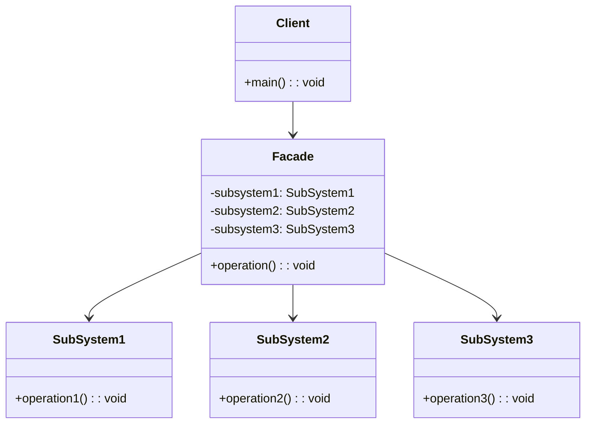
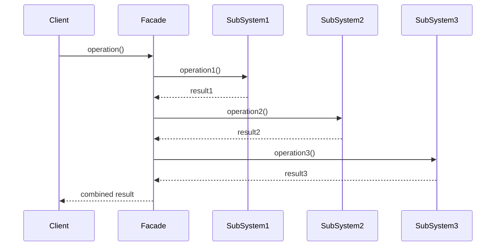

# 外观模式 (Facade Pattern)

## 📋 模式概述

### 定义
外观模式为子系统中的一组接口提供一个一致的界面，定义了一个高层接口，这个接口使得这一子系统更加容易使用。

### 意图
- 为复杂的子系统提供简单的接口
- 隐藏子系统的复杂性
- 降低客户端与子系统的耦合度
- 提供子系统的统一入口点

## 🏗️ 结构图



## ⏱️ 时序图



## 💻 代码实现

### 基础实现

```java
/**
 * 子系统1
 */
public class SubSystem1 {
    public void operation1() {
        System.out.println("SubSystem1: 执行操作1");
    }
}

/**
 * 子系统2
 */
public class SubSystem2 {
    public void operation2() {
        System.out.println("SubSystem2: 执行操作2");
    }
}

/**
 * 子系统3
 */
public class SubSystem3 {
    public void operation3() {
        System.out.println("SubSystem3: 执行操作3");
    }
}

/**
 * 外观类
 */
public class Facade {
    private SubSystem1 subSystem1;
    private SubSystem2 subSystem2;
    private SubSystem3 subSystem3;
    
    public Facade() {
        subSystem1 = new SubSystem1();
        subSystem2 = new SubSystem2();
        subSystem3 = new SubSystem3();
    }
    
    public void operation() {
        System.out.println("Facade: 开始执行复合操作");
        subSystem1.operation1();
        subSystem2.operation2();
        subSystem3.operation3();
        System.out.println("Facade: 复合操作完成");
    }
}
```

## 🧪 实际应用示例

### 1. 家庭影院系统

```java
/**
 * DVD播放器
 */
public class DVDPlayer {
    public void on() {
        System.out.println("DVD播放器开机");
    }
    
    public void off() {
        System.out.println("DVD播放器关机");
    }
    
    public void play(String movie) {
        System.out.println("DVD播放器播放电影: " + movie);
    }
    
    public void stop() {
        System.out.println("DVD播放器停止播放");
    }
}

/**
 * 投影仪
 */
public class Projector {
    public void on() {
        System.out.println("投影仪开机");
    }
    
    public void off() {
        System.out.println("投影仪关机");
    }
    
    public void setInput(String input) {
        System.out.println("投影仪设置输入源: " + input);
    }
    
    public void wideScreenMode() {
        System.out.println("投影仪设置为宽屏模式");
    }
}

/**
 * 音响系统
 */
public class StereoSystem {
    public void on() {
        System.out.println("音响系统开机");
    }
    
    public void off() {
        System.out.println("音响系统关机");
    }
    
    public void setVolume(int volume) {
        System.out.println("音响系统设置音量: " + volume);
    }
    
    public void setSurroundSound() {
        System.out.println("音响系统设置环绕声");
    }
}

/**
 * 灯光系统
 */
public class Lights {
    public void dim(int level) {
        System.out.println("灯光调暗至: " + level + "%");
    }
    
    public void on() {
        System.out.println("灯光开启");
    }
    
    public void off() {
        System.out.println("灯光关闭");
    }
}

/**
 * 爆米花机
 */
public class PopcornPopper {
    public void on() {
        System.out.println("爆米花机开机");
    }
    
    public void off() {
        System.out.println("爆米花机关机");
    }
    
    public void pop() {
        System.out.println("爆米花机开始制作爆米花");
    }
}

/**
 * 家庭影院外观
 */
public class HomeTheaterFacade {
    private DVDPlayer dvdPlayer;
    private Projector projector;
    private StereoSystem stereoSystem;
    private Lights lights;
    private PopcornPopper popcornPopper;
    
    public HomeTheaterFacade(DVDPlayer dvdPlayer, Projector projector, 
                           StereoSystem stereoSystem, Lights lights, 
                           PopcornPopper popcornPopper) {
        this.dvdPlayer = dvdPlayer;
        this.projector = projector;
        this.stereoSystem = stereoSystem;
        this.lights = lights;
        this.popcornPopper = popcornPopper;
    }
    
    public void watchMovie(String movie) {
        System.out.println("准备观看电影: " + movie);
        System.out.println("==================");
        
        popcornPopper.on();
        popcornPopper.pop();
        
        lights.dim(10);
        
        projector.on();
        projector.setInput("DVD");
        projector.wideScreenMode();
        
        stereoSystem.on();
        stereoSystem.setVolume(5);
        stereoSystem.setSurroundSound();
        
        dvdPlayer.on();
        dvdPlayer.play(movie);
        
        System.out.println("==================");
        System.out.println("电影开始，请享受观影时光！");
    }
    
    public void endMovie() {
        System.out.println("关闭家庭影院系统");
        System.out.println("==================");
        
        dvdPlayer.stop();
        dvdPlayer.off();
        
        stereoSystem.off();
        
        projector.off();
        
        lights.on();
        
        popcornPopper.off();
        
        System.out.println("==================");
        System.out.println("家庭影院系统已关闭");
    }
}

// 使用示例
public class HomeTheaterDemo {
    public static void main(String[] args) {
        // 创建子系统组件
        DVDPlayer dvdPlayer = new DVDPlayer();
        Projector projector = new Projector();
        StereoSystem stereoSystem = new StereoSystem();
        Lights lights = new Lights();
        PopcornPopper popcornPopper = new PopcornPopper();
        
        // 创建外观
        HomeTheaterFacade homeTheater = new HomeTheaterFacade(
            dvdPlayer, projector, stereoSystem, lights, popcornPopper
        );
        
        // 使用外观观看电影
        homeTheater.watchMovie("阿凡达");
        System.out.println();
        
        // 结束观影
        homeTheater.endMovie();
    }
}
```

### 2. 计算机启动系统

```java
/**
 * CPU
 */
public class CPU {
    public void freeze() {
        System.out.println("CPU: 冻结处理器");
    }
    
    public void jump(long position) {
        System.out.println("CPU: 跳转到地址 " + position);
    }
    
    public void execute() {
        System.out.println("CPU: 执行指令");
    }
}

/**
 * 内存
 */
public class Memory {
    public void load(long position, byte[] data) {
        System.out.println("Memory: 从地址 " + position + " 加载 " + data.length + " 字节数据");
    }
}

/**
 * 硬盘
 */
public class HardDrive {
    public byte[] read(long lba, int size) {
        System.out.println("HardDrive: 从扇区 " + lba + " 读取 " + size + " 字节");
        return new byte[size];
    }
}

/**
 * 计算机外观
 */
public class ComputerFacade {
    private static final long BOOT_ADDRESS = 0x00000000L;
    private static final long BOOT_SECTOR = 0L;
    private static final int SECTOR_SIZE = 512;
    
    private CPU cpu;
    private Memory memory;
    private HardDrive hardDrive;
    
    public ComputerFacade() {
        this.cpu = new CPU();
        this.memory = new Memory();
        this.hardDrive = new HardDrive();
    }
    
    public void start() {
        System.out.println("计算机启动序列开始...");
        System.out.println("========================");
        
        cpu.freeze();
        memory.load(BOOT_ADDRESS, hardDrive.read(BOOT_SECTOR, SECTOR_SIZE));
        cpu.jump(BOOT_ADDRESS);
        cpu.execute();
        
        System.out.println("========================");
        System.out.println("计算机启动完成！");
    }
}

// 使用示例
public class ComputerDemo {
    public static void main(String[] args) {
        ComputerFacade computer = new ComputerFacade();
        computer.start();
    }
}
```

### 3. 银行业务系统

```java
/**
 * 账户服务
 */
public class AccountService {
    public boolean validateAccount(String accountNumber) {
        System.out.println("AccountService: 验证账户 " + accountNumber);
        return true; // 简化实现
    }
    
    public double getBalance(String accountNumber) {
        System.out.println("AccountService: 获取账户 " + accountNumber + " 余额");
        return 1000.0; // 简化实现
    }
    
    public void debit(String accountNumber, double amount) {
        System.out.println("AccountService: 从账户 " + accountNumber + " 扣除 " + amount);
    }
    
    public void credit(String accountNumber, double amount) {
        System.out.println("AccountService: 向账户 " + accountNumber + " 存入 " + amount);
    }
}

/**
 * 安全服务
 */
public class SecurityService {
    public boolean authenticateUser(String username, String password) {
        System.out.println("SecurityService: 验证用户 " + username);
        return true; // 简化实现
    }
    
    public boolean authorizeTransaction(String username, double amount) {
        System.out.println("SecurityService: 授权用户 " + username + " 进行 " + amount + " 交易");
        return true; // 简化实现
    }
}

/**
 * 通知服务
 */
public class NotificationService {
    public void sendSMS(String phoneNumber, String message) {
        System.out.println("NotificationService: 发送短信到 " + phoneNumber + ": " + message);
    }
    
    public void sendEmail(String email, String message) {
        System.out.println("NotificationService: 发送邮件到 " + email + ": " + message);
    }
}

/**
 * 日志服务
 */
public class LoggingService {
    public void logTransaction(String accountNumber, String operation, double amount) {
        System.out.println("LoggingService: 记录交易 - 账户: " + accountNumber + 
                         ", 操作: " + operation + ", 金额: " + amount);
    }
}

/**
 * 银行业务外观
 */
public class BankingFacade {
    private AccountService accountService;
    private SecurityService securityService;
    private NotificationService notificationService;
    private LoggingService loggingService;
    
    public BankingFacade() {
        this.accountService = new AccountService();
        this.securityService = new SecurityService();
        this.notificationService = new NotificationService();
        this.loggingService = new LoggingService();
    }
    
    public boolean transfer(String fromAccount, String toAccount, double amount, 
                          String username, String password, String phone, String email) {
        System.out.println("开始转账操作...");
        System.out.println("=================");
        
        // 1. 用户认证
        if (!securityService.authenticateUser(username, password)) {
            System.out.println("用户认证失败");
            return false;
        }
        
        // 2. 验证账户
        if (!accountService.validateAccount(fromAccount) || 
            !accountService.validateAccount(toAccount)) {
            System.out.println("账户验证失败");
            return false;
        }
        
        // 3. 检查余额
        if (accountService.getBalance(fromAccount) < amount) {
            System.out.println("余额不足");
            return false;
        }
        
        // 4. 授权交易
        if (!securityService.authorizeTransaction(username, amount)) {
            System.out.println("交易授权失败");
            return false;
        }
        
        // 5. 执行转账
        accountService.debit(fromAccount, amount);
        accountService.credit(toAccount, amount);
        
        // 6. 记录日志
        loggingService.logTransaction(fromAccount, "转出", amount);
        loggingService.logTransaction(toAccount, "转入", amount);
        
        // 7. 发送通知
        notificationService.sendSMS(phone, "转账成功，金额: " + amount);
        notificationService.sendEmail(email, "转账成功，金额: " + amount);
        
        System.out.println("=================");
        System.out.println("转账操作完成");
        return true;
    }
    
    public double checkBalance(String accountNumber, String username, String password) {
        System.out.println("查询余额...");
        System.out.println("============");
        
        if (!securityService.authenticateUser(username, password)) {
            System.out.println("用户认证失败");
            return -1;
        }
        
        if (!accountService.validateAccount(accountNumber)) {
            System.out.println("账户验证失败");
            return -1;
        }
        
        double balance = accountService.getBalance(accountNumber);
        loggingService.logTransaction(accountNumber, "查询余额", 0);
        
        System.out.println("============");
        System.out.println("余额查询完成");
        return balance;
    }
}

// 使用示例
public class BankingDemo {
    public static void main(String[] args) {
        BankingFacade banking = new BankingFacade();
        
        // 转账操作
        boolean success = banking.transfer(
            "123456789", "987654321", 500.0,
            "john_doe", "password123", 
            "13800138000", "john@example.com"
        );
        
        System.out.println("转账结果: " + (success ? "成功" : "失败"));
        System.out.println();
        
        // 查询余额
        double balance = banking.checkBalance("123456789", "john_doe", "password123");
        System.out.println("账户余额: " + balance);
    }
}
```

## 🎯 适用场景

### 适合使用外观模式的场景：

1. **复杂子系统** - 子系统复杂，客户端需要简单接口
2. **分层架构** - 为每一层提供统一的入口点
3. **遗留系统集成** - 为遗留系统提供现代化接口
4. **API简化** - 为复杂的API提供简化版本

### 具体应用场景：

- **框架封装** - 为复杂框架提供简单接口
- **系统集成** - 集成多个子系统
- **API网关** - 为微服务提供统一入口
- **工具类库** - 封装复杂的工具操作
- **硬件抽象层** - 为硬件操作提供统一接口

## ✅ 优点

1. **简化接口** - 为复杂子系统提供简单接口
2. **降低耦合** - 客户端与子系统解耦
3. **更好的分层** - 促进系统分层设计
4. **易于使用** - 客户端更容易使用系统

## ❌ 缺点

1. **可能成为上帝对象** - 外观类可能变得过于复杂
2. **违反开闭原则** - 增加新功能可能需要修改外观类
3. **隐藏了系统复杂性** - 可能让开发者忽视系统的真实复杂性

## 🔄 与其他模式的关系

- **适配器模式** - 都提供不同的接口，但适配器用于接口转换
- **中介者模式** - 都简化对象间的交互，但中介者关注对象间通信
- **抽象工厂模式** - 外观可以使用抽象工厂来创建子系统对象
- **单例模式** - 外观通常设计为单例

## 📝 最佳实践

1. **保持外观简单** - 外观应该简单，不要包含业务逻辑
2. **不要暴露子系统** - 避免让客户端直接访问子系统
3. **考虑多个外观** - 为不同的客户端提供不同的外观
4. **文档化接口** - 清楚说明外观提供的功能
5. **考虑异常处理** - 统一处理子系统的异常

## 🚨 注意事项

1. **避免过度封装** - 不要隐藏客户端需要的功能
2. **性能考虑** - 外观可能带来额外的性能开销
3. **维护成本** - 子系统变化时需要更新外观
4. **测试复杂性** - 外观的测试可能比较复杂

---

*外观模式是简化复杂系统的有效方式，它为客户端提供了清晰、简单的接口，隐藏了系统的内部复杂性。*