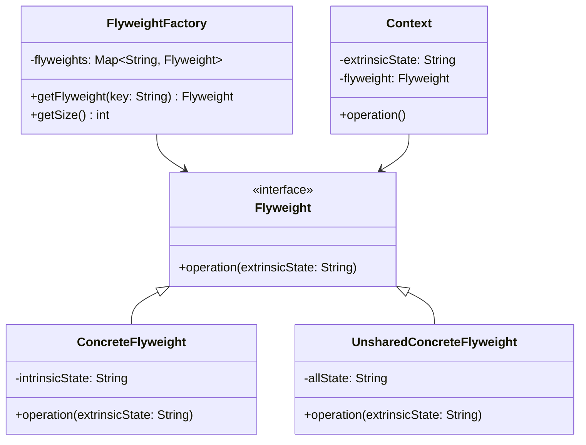
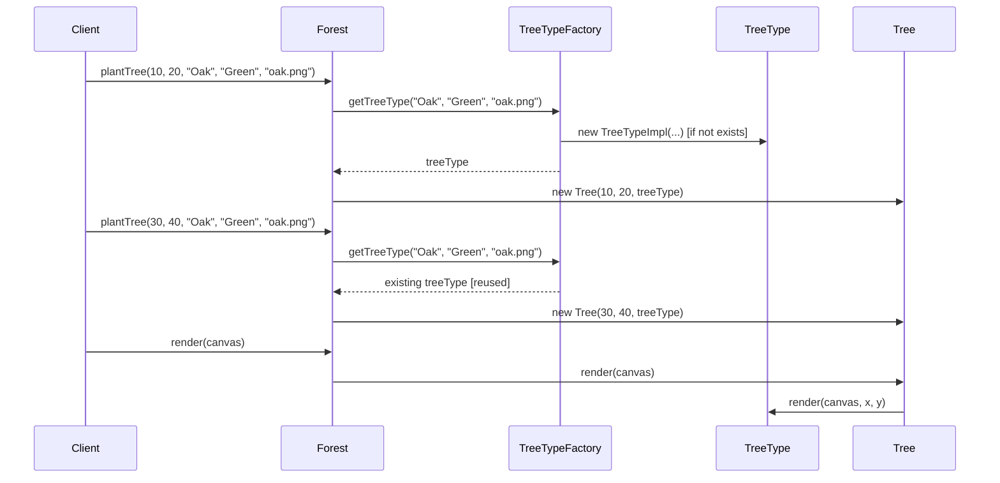

# 享元模式 (Flyweight Pattern) ⚠️ 低应用价值

> **⚠️ 注意：此模式在现代开发中应用价值较低**
> - 现代JVM已经有很好的内存优化机制
> - 增加了系统复杂度，收益有限
> - 过早优化，违反KISS原则
> - **代码已删除，仅保留文档作为学习参考**

## 📋 模式概述

### 定义
享元模式运用共享技术有效地支持大量细粒度的对象。通过共享已经存在的对象来大幅度减少需要创建的对象数量、避免大量相似类的开销，从而提高系统资源的利用率。

### 核心思想
- 分离内部状态和外部状态
- 共享内部状态相同的对象
- 外部状态由客户端维护
- 减少对象创建数量

## 🎯 解决的问题

### 主要问题
1. **内存消耗大**：大量相似对象占用过多内存
2. **对象创建开销**：频繁创建销毁对象影响性能
3. **系统资源浪费**：相同数据被重复存储
4. **内存溢出风险**：对象过多可能导致内存不足

### 适用场景（现代开发中很少见）
- 大量相似对象的场景
- 对象的外部状态可以剥离
- 内存资源极其有限的环境
- 对象池的实现

## 🏗️ 模式结构

### UML类图


## 💻 代码示例

### 基础实现（已删除源码）

```java
// 享元接口
public interface TreeType {
    void render(Canvas canvas, int x, int y);
}

// 具体享元类
public class TreeTypeImpl implements TreeType {
    private String name;        // 内部状态
    private String color;       // 内部状态
    private String sprite;      // 内部状态
    
    public TreeTypeImpl(String name, String color, String sprite) {
        this.name = name;
        this.color = color;
        this.sprite = sprite;
    }
    
    @Override
    public void render(Canvas canvas, int x, int y) {
        // 使用内部状态和外部状态(x, y)进行渲染
        System.out.println("Rendering " + name + " tree at (" + x + ", " + y + ")");
    }
}

// 享元工厂
public class TreeTypeFactory {
    private static Map<String, TreeType> treeTypes = new HashMap<>();
    
    public static TreeType getTreeType(String name, String color, String sprite) {
        String key = name + color + sprite;
        TreeType treeType = treeTypes.get(key);
        
        if (treeType == null) {
            treeType = new TreeTypeImpl(name, color, sprite);
            treeTypes.put(key, treeType);
            System.out.println("Creating new TreeType: " + key);
        }
        
        return treeType;
    }
    
    public static int getCreatedTreeTypesCount() {
        return treeTypes.size();
    }
}

// 上下文类
public class Tree {
    private int x, y;           // 外部状态
    private TreeType treeType;  // 享元引用
    
    public Tree(int x, int y, TreeType treeType) {
        this.x = x;
        this.y = y;
        this.treeType = treeType;
    }
    
    public void render(Canvas canvas) {
        treeType.render(canvas, x, y);
    }
}

// 森林类（客户端）
public class Forest {
    private List<Tree> trees = new ArrayList<>();
    
    public void plantTree(int x, int y, String name, String color, String sprite) {
        TreeType type = TreeTypeFactory.getTreeType(name, color, sprite);
        Tree tree = new Tree(x, y, type);
        trees.add(tree);
    }
    
    public void render(Canvas canvas) {
        for (Tree tree : trees) {
            tree.render(canvas);
        }
    }
}
```

## 🔄 时序图



## ⚡ 实际应用案例

### 案例1：文本编辑器字符渲染（学术示例）
```java
// 字符享元
public class Character {
    private char symbol;        // 内部状态
    private String fontFamily;  // 内部状态
    private int fontSize;       // 内部状态
    
    public Character(char symbol, String fontFamily, int fontSize) {
        this.symbol = symbol;
        this.fontFamily = fontFamily;
        this.fontSize = fontSize;
    }
    
    public void render(int x, int y, String color) {
        // 渲染字符，使用外部状态 x, y, color
        System.out.println("Rendering '" + symbol + "' at (" + x + ", " + y + ") in " + color);
    }
}

// 字符工厂
public class CharacterFactory {
    private static Map<String, Character> characters = new HashMap<>();
    
    public static Character getCharacter(char symbol, String fontFamily, int fontSize) {
        String key = symbol + fontFamily + fontSize;
        Character character = characters.get(key);
        
        if (character == null) {
            character = new Character(symbol, fontFamily, fontSize);
            characters.put(key, character);
        }
        
        return character;
    }
}
```

## ⚠️ 为什么应用价值低

### 主要问题
1. **现代JVM优化**：
   - 字符串常量池自动共享字符串
   - 对象池和缓存机制
   - 垃圾回收器优化
   - JIT编译器优化

2. **过早优化**：
   - 增加代码复杂度
   - 违反KISS原则
   - 维护成本高
   - 收益不明显

3. **现代替代方案更好**：
   - 使用缓存框架（Redis、Caffeine）
   - 利用数据库连接池
   - 采用对象池模式
   - 使用现代集合框架

### 更好的替代方案

```java
// 使用Caffeine缓存替代享元模式
public class ModernTreeService {
    private final Cache<String, TreeType> cache = Caffeine.newBuilder()
            .maximumSize(1000)
            .expireAfterWrite(10, TimeUnit.MINUTES)
            .build();
    
    public TreeType getTreeType(String name, String color, String sprite) {
        String key = name + color + sprite;
        return cache.get(key, k -> new TreeTypeImpl(name, color, sprite));
    }
}

// 使用Spring的@Cacheable注解
@Service
public class TreeService {
    @Cacheable(value = "treeTypes", key = "#name + #color + #sprite")
    public TreeType getTreeType(String name, String color, String sprite) {
        return new TreeTypeImpl(name, color, sprite);
    }
}

// 使用对象池
public class TreeTypePool {
    private final Queue<TreeType> pool = new ConcurrentLinkedQueue<>();
    
    public TreeType borrowObject() {
        TreeType obj = pool.poll();
        return obj != null ? obj : new TreeTypeImpl();
    }
    
    public void returnObject(TreeType obj) {
        // 重置对象状态
        obj.reset();
        pool.offer(obj);
    }
}

// 使用现代集合框架
Map<String, TreeType> treeTypes = new ConcurrentHashMap<>();
TreeType treeType = treeTypes.computeIfAbsent(key, 
    k -> new TreeTypeImpl(name, color, sprite));
```

## 📊 优缺点分析

### 优点
- ✅ 减少内存使用
- ✅ 提高系统性能（理论上）

### 缺点（现代开发中的问题）
- ❌ 增加系统复杂度
- ❌ 现代JVM已有优化
- ❌ 维护成本高
- ❌ 过早优化
- ❌ 现有工具更好用

## 🎯 总结

享元模式在现代软件开发中应用价值较低：

1. **历史价值**：在内存稀缺时代有其价值
2. **现代价值**：有限，现代技术已经解决了这些问题
3. **建议**：优先使用现代缓存和优化技术

**推荐替代方案**：
- 使用现代缓存框架（Caffeine、Redis）
- 利用Spring Cache抽象
- 采用对象池模式
- 使用数据库连接池
- 依赖JVM自身优化

> 💡 **学习建议**：了解其设计思想，但在实际项目中优先选择现代化的解决方案。除非在极其特殊的内存受限环境中，否则不建议使用。