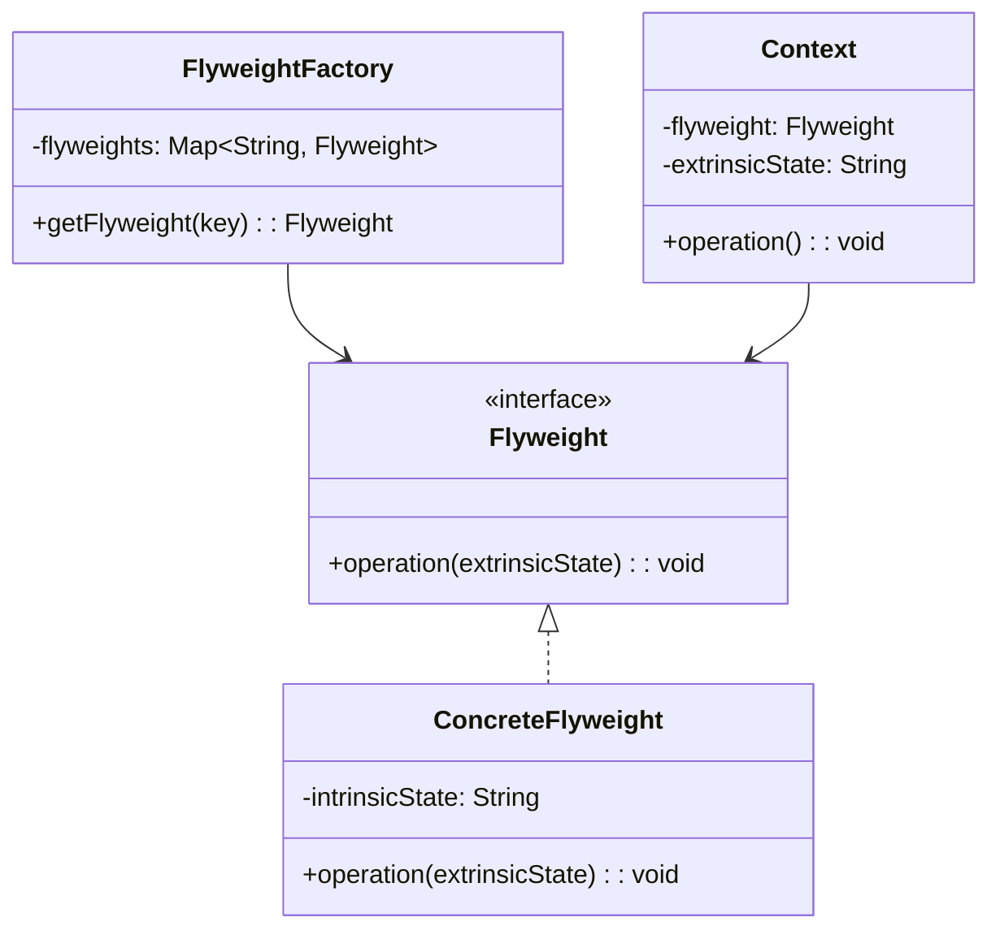

# 享元模式 (Flyweight Pattern)

## 📋 模式概述

### 定义
享元模式运用共享技术有效地支持大量细粒度的对象。通过共享已经存在的对象来大幅度减少需要创建的对象数量、避免大量相似类的开销，从而提高系统资源的利用率。

### 意图
- 运用共享技术有效地支持大量细粒度对象
- 减少创建对象的数量，降低内存占用
- 将对象的状态分为内部状态和外部状态
- 内部状态可以共享，外部状态由客户端维护

## 🏗️ 结构图



## 💻 代码实现

### 基础实现

```java
/**
 * 享元接口
 */
public interface Flyweight {
    void operation(String extrinsicState);
}

/**
 * 具体享元类
 */
public class ConcreteFlyweight implements Flyweight {
    private String intrinsicState; // 内部状态，可共享
    
    public ConcreteFlyweight(String intrinsicState) {
        this.intrinsicState = intrinsicState;
    }
    
    @Override
    public void operation(String extrinsicState) {
        System.out.println("ConcreteFlyweight: 内部状态=" + intrinsicState + 
                         ", 外部状态=" + extrinsicState);
    }
}

/**
 * 享元工厂
 */
public class FlyweightFactory {
    private Map<String, Flyweight> flyweights = new HashMap<>();
    
    public Flyweight getFlyweight(String key) {
        if (!flyweights.containsKey(key)) {
            flyweights.put(key, new ConcreteFlyweight(key));
            System.out.println("创建新的享元对象: " + key);
        } else {
            System.out.println("复用现有享元对象: " + key);
        }
        return flyweights.get(key);
    }
    
    public int getFlyweightCount() {
        return flyweights.size();
    }
}

/**
 * 上下文类
 */
public class Context {
    private Flyweight flyweight;
    private String extrinsicState; // 外部状态，不可共享
    
    public Context(String intrinsicState, String extrinsicState) {
        this.flyweight = FlyweightFactory.getInstance().getFlyweight(intrinsicState);
        this.extrinsicState = extrinsicState;
    }
    
    public void operation() {
        flyweight.operation(extrinsicState);
    }
}
```

## 🧪 实际应用示例

### 1. 文本编辑器字符渲染

```java
/**
 * 字符享元接口
 */
public interface CharacterFlyweight {
    void render(int x, int y, String color, String font);
}

/**
 * 具体字符享元
 */
public class ConcreteCharacter implements CharacterFlyweight {
    private char character; // 内部状态：字符本身
    
    public ConcreteCharacter(char character) {
        this.character = character;
    }
    
    @Override
    public void render(int x, int y, String color, String font) {
        // 模拟字符渲染
        System.out.printf("渲染字符 '%c' 在位置(%d,%d)，颜色:%s，字体:%s%n", 
                         character, x, y, color, font);
    }
    
    public char getCharacter() {
        return character;
    }
}

/**
 * 字符工厂
 */
public class CharacterFactory {
    private static CharacterFactory instance = new CharacterFactory();
    private Map<Character, CharacterFlyweight> characters = new HashMap<>();
    
    private CharacterFactory() {}
    
    public static CharacterFactory getInstance() {
        return instance;
    }
    
    public CharacterFlyweight getCharacter(char c) {
        CharacterFlyweight character = characters.get(c);
        if (character == null) {
            character = new ConcreteCharacter(c);
            characters.put(c, character);
            System.out.println("创建字符享元: " + c);
        }
        return character;
    }
    
    public int getCreatedCharactersCount() {
        return characters.size();
    }
    
    public void printStatistics() {
        System.out.println("字符享元统计:");
        System.out.println("创建的字符类型数量: " + characters.size());
        System.out.println("字符类型: " + characters.keySet());
    }
}

/**
 * 文档字符（上下文）
 */
public class DocumentCharacter {
    private CharacterFlyweight flyweight; // 享元对象
    private int x, y; // 外部状态：位置
    private String color; // 外部状态：颜色
    private String font; // 外部状态：字体
    
    public DocumentCharacter(char character, int x, int y, String color, String font) {
        this.flyweight = CharacterFactory.getInstance().getCharacter(character);
        this.x = x;
        this.y = y;
        this.color = color;
        this.font = font;
    }
    
    public void render() {
        flyweight.render(x, y, color, font);
    }
    
    // Getters and setters for extrinsic state
    public void setPosition(int x, int y) {
        this.x = x;
        this.y = y;
    }
    
    public void setColor(String color) {
        this.color = color;
    }
    
    public void setFont(String font) {
        this.font = font;
    }
}

/**
 * 文档类
 */
public class Document {
    private List<DocumentCharacter> characters = new ArrayList<>();
    
    public void addCharacter(char c, int x, int y, String color, String font) {
        DocumentCharacter docChar = new DocumentCharacter(c, x, y, color, font);
        characters.add(docChar);
    }
    
    public void render() {
        System.out.println("渲染文档:");
        for (DocumentCharacter character : characters) {
            character.render();
        }
    }
    
    public int getCharacterCount() {
        return characters.size();
    }
}

// 使用示例
public class TextEditorDemo {
    public static void main(String[] args) {
        Document document = new Document();
        
        // 添加文本 "Hello World!"
        String text = "Hello World!";
        int x = 10, y = 20;
        
        System.out.println("=== 创建文档字符 ===");
        for (int i = 0; i < text.length(); i++) {
            char c = text.charAt(i);
            String color = (i % 2 == 0) ? "黑色" : "红色";
            String font = (i < 5) ? "Arial" : "Times";
            
            document.addCharacter(c, x + i * 10, y, color, font);
        }
        
        System.out.println("\n=== 渲染文档 ===");
        document.render();
        
        System.out.println("\n=== 统计信息 ===");
        System.out.println("文档中字符总数: " + document.getCharacterCount());
        CharacterFactory.getInstance().printStatistics();
        
        // 添加更多相同字符
        System.out.println("\n=== 添加更多字符 ===");
        for (int i = 0; i < 5; i++) {
            document.addCharacter('H', x + i * 15, y + 30, "蓝色", "Arial");
        }
        
        System.out.println("添加5个'H'字符后:");
        System.out.println("文档中字符总数: " + document.getCharacterCount());
        CharacterFactory.getInstance().printStatistics();
    }
}
```

### 2. 游戏中的粒子系统

```java
/**
 * 粒子类型枚举
 */
public enum ParticleType {
    FIRE("🔥", "红色", 2),
    WATER("💧", "蓝色", 1),
    EARTH("🌍", "棕色", 3),
    AIR("💨", "白色", 1);
    
    private final String sprite;
    private final String color;
    private final int damage;
    
    ParticleType(String sprite, String color, int damage) {
        this.sprite = sprite;
        this.color = color;
        this.damage = damage;
    }
    
    public String getSprite() { return sprite; }
    public String getColor() { return color; }
    public int getDamage() { return damage; }
}

/**
 * 粒子享元接口
 */
public interface ParticleFlyweight {
    void render(int x, int y, int velocity, int direction);
    void move(int deltaX, int deltaY);
}

/**
 * 具体粒子享元
 */
public class ConcreteParticle implements ParticleFlyweight {
    private ParticleType type; // 内部状态：粒子类型
    
    public ConcreteParticle(ParticleType type) {
        this.type = type;
    }
    
    @Override
    public void render(int x, int y, int velocity, int direction) {
        System.out.printf("%s 粒子在位置(%d,%d)，速度:%d，方向:%d°，颜色:%s%n",
                         type.getSprite(), x, y, velocity, direction, type.getColor());
    }
    
    @Override
    public void move(int deltaX, int deltaY) {
        System.out.printf("%s 粒子移动 (%d,%d)%n", type.getSprite(), deltaX, deltaY);
    }
    
    public ParticleType getType() {
        return type;
    }
}

/**
 * 粒子工厂
 */
public class ParticleFactory {
    private static ParticleFactory instance = new ParticleFactory();
    private Map<ParticleType, ParticleFlyweight> particles = new HashMap<>();
    
    private ParticleFactory() {}
    
    public static ParticleFactory getInstance() {
        return instance;
    }
    
    public ParticleFlyweight getParticle(ParticleType type) {
        ParticleFlyweight particle = particles.get(type);
        if (particle == null) {
            particle = new ConcreteParticle(type);
            particles.put(type, particle);
            System.out.println("创建新的粒子享元: " + type);
        }
        return particle;
    }
    
    public int getParticleTypesCount() {
        return particles.size();
    }
    
    public void printStatistics() {
        System.out.println("粒子享元统计:");
        System.out.println("创建的粒子类型数量: " + particles.size());
        System.out.println("粒子类型: " + particles.keySet());
    }
}

/**
 * 游戏粒子（上下文）
 */
public class GameParticle {
    private ParticleFlyweight flyweight; // 享元对象
    private int x, y; // 外部状态：位置
    private int velocity; // 外部状态：速度
    private int direction; // 外部状态：方向
    private int lifeTime; // 外部状态：生命周期
    
    public GameParticle(ParticleType type, int x, int y, int velocity, int direction) {
        this.flyweight = ParticleFactory.getInstance().getParticle(type);
        this.x = x;
        this.y = y;
        this.velocity = velocity;
        this.direction = direction;
        this.lifeTime = 100; // 默认生命周期
    }
    
    public void render() {
        flyweight.render(x, y, velocity, direction);
    }
    
    public void update() {
        // 根据速度和方向更新位置
        int deltaX = (int) (velocity * Math.cos(Math.toRadians(direction)));
        int deltaY = (int) (velocity * Math.sin(Math.toRadians(direction)));
        
        x += deltaX;
        y += deltaY;
        lifeTime--;
        
        flyweight.move(deltaX, deltaY);
    }
    
    public boolean isAlive() {
        return lifeTime > 0;
    }
    
    // Getters
    public int getX() { return x; }
    public int getY() { return y; }
    public int getLifeTime() { return lifeTime; }
}

/**
 * 粒子系统
 */
public class ParticleSystem {
    private List<GameParticle> particles = new ArrayList<>();
    private Random random = new Random();
    
    public void createExplosion(int centerX, int centerY, int particleCount) {
        System.out.println("在位置(" + centerX + "," + centerY + ")创建爆炸效果");
        
        for (int i = 0; i < particleCount; i++) {
            ParticleType type = ParticleType.values()[random.nextInt(ParticleType.values().length)];
            int x = centerX + random.nextInt(20) - 10;
            int y = centerY + random.nextInt(20) - 10;
            int velocity = random.nextInt(10) + 1;
            int direction = random.nextInt(360);
            
            GameParticle particle = new GameParticle(type, x, y, velocity, direction);
            particles.add(particle);
        }
    }
    
    public void update() {
        System.out.println("更新粒子系统...");
        Iterator<GameParticle> iterator = particles.iterator();
        while (iterator.hasNext()) {
            GameParticle particle = iterator.next();
            particle.update();
            
            if (!particle.isAlive()) {
                iterator.remove();
            }
        }
    }
    
    public void render() {
        System.out.println("渲染粒子系统:");
        for (GameParticle particle : particles) {
            particle.render();
        }
    }
    
    public int getActiveParticleCount() {
        return particles.size();
    }
    
    public void printStatistics() {
        System.out.println("粒子系统统计:");
        System.out.println("活跃粒子数量: " + particles.size());
        ParticleFactory.getInstance().printStatistics();
    }
}

// 使用示例
public class ParticleSystemDemo {
    public static void main(String[] args) {
        ParticleSystem particleSystem = new ParticleSystem();
        
        System.out.println("=== 创建爆炸效果 ===");
        particleSystem.createExplosion(100, 100, 8);
        
        System.out.println("\n=== 初始渲染 ===");
        particleSystem.render();
        
        System.out.println("\n=== 统计信息 ===");
        particleSystem.printStatistics();
        
        // 模拟几帧更新
        for (int frame = 1; frame <= 3; frame++) {
            System.out.println("\n=== 第" + frame + "帧更新 ===");
            particleSystem.update();
            System.out.println("活跃粒子数: " + particleSystem.getActiveParticleCount());
        }
        
        // 创建更多爆炸
        System.out.println("\n=== 创建更多爆炸 ===");
        particleSystem.createExplosion(200, 150, 6);
        particleSystem.createExplosion(50, 200, 10);
        
        System.out.println("\n=== 最终统计 ===");
        particleSystem.printStatistics();
    }
}
```

## 🎯 适用场景

### 适合使用享元模式的场景：

1. **大量相似对象** - 系统中存在大量相似的对象
2. **内存优化** - 需要优化内存使用
3. **对象创建成本高** - 对象创建和销毁成本较高
4. **状态可分离** - 对象状态可以分为内部和外部状态

### 具体应用场景：

- **文本编辑器** - 字符对象的共享
- **游戏开发** - 粒子系统、瓦片地图
- **图形界面** - 图标、按钮等UI元素
- **数据库连接池** - 连接对象的复用
- **缓存系统** - 缓存对象的共享

## ✅ 优点

1. **减少内存使用** - 通过共享减少对象数量
2. **提高性能** - 减少对象创建和销毁的开销
3. **集中管理** - 通过工厂集中管理享元对象
4. **状态分离** - 清晰地分离内部和外部状态

## ❌ 缺点

1. **增加复杂性** - 需要分离内部和外部状态
2. **运行时开销** - 需要维护外部状态
3. **线程安全** - 共享对象的线程安全问题
4. **不适用于所有场景** - 只适用于有大量相似对象的场景

## 🔄 与其他模式的关系

- **单例模式** - 享元工厂通常设计为单例
- **工厂模式** - 使用工厂来管理享元对象
- **组合模式** - 享元可以作为组合模式的叶子节点
- **状态模式** - 可以使用享元来共享状态对象

## 📝 最佳实践

1. **正确分离状态** - 准确识别内部状态和外部状态
2. **工厂管理** - 使用工厂模式管理享元对象
3. **线程安全** - 确保享元对象的线程安全
4. **内存监控** - 监控享元对象的内存使用
5. **适度使用** - 只在确实需要时使用享元模式

## 🚨 注意事项

1. **状态分离的正确性** - 确保内部状态真正可以共享
2. **外部状态管理** - 正确管理外部状态的传递
3. **对象生命周期** - 考虑享元对象的生命周期管理
4. **性能测试** - 验证享元模式确实带来性能提升

---

*享元模式是优化内存使用的重要模式，通过对象共享技术有效减少系统中对象的数量，特别适用于需要创建大量相似对象的场景。*