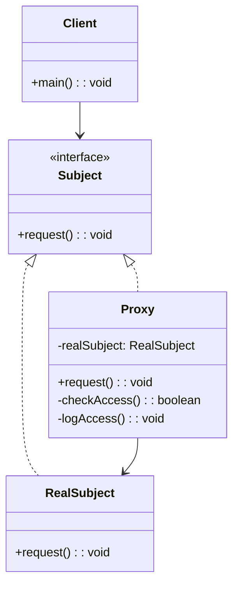
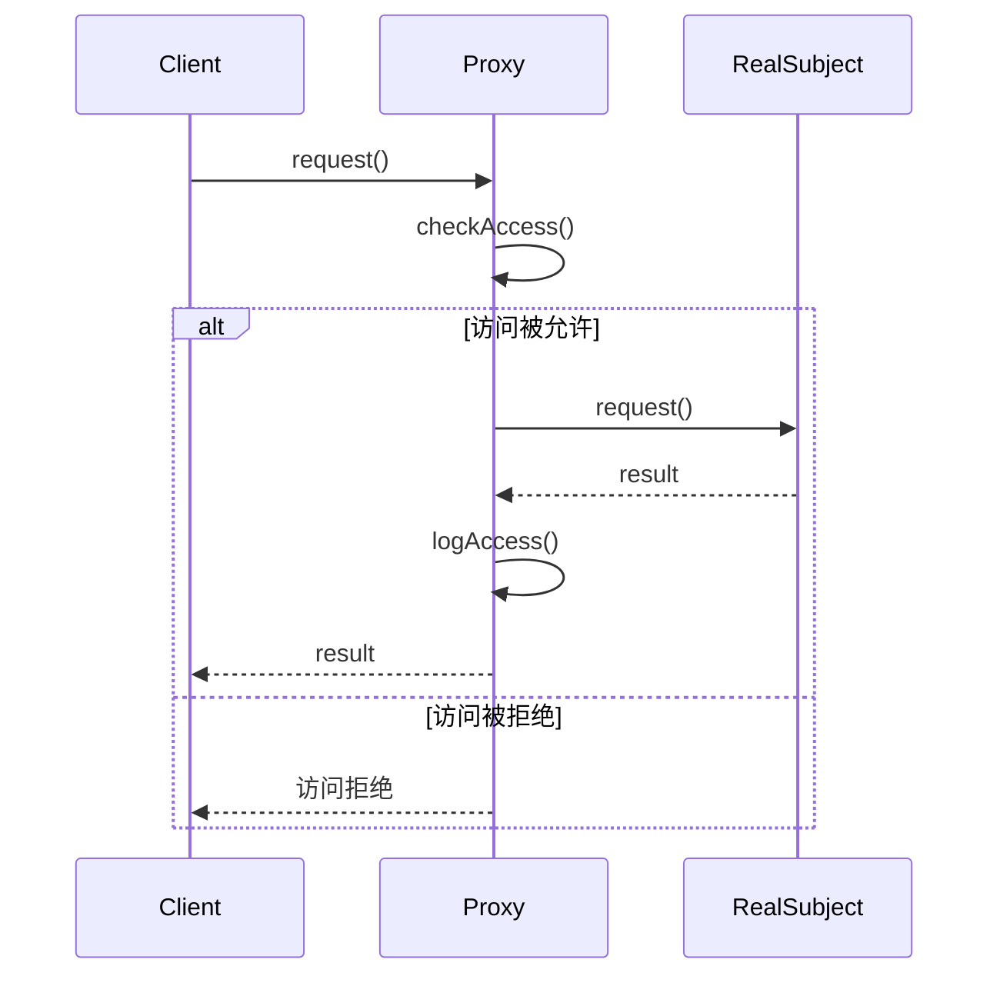

# 代理模式 (Proxy Pattern)

## 📋 模式概述

### 定义
代理模式为另一个对象提供一个替身或占位符以控制对这个对象的访问。

### 意图
- 控制对对象的访问
- 在访问对象时提供额外的功能
- 延迟对象的创建和初始化
- 提供本地代理来访问远程对象

## 🏗️ 结构图



## ⏱️ 时序图



## 💻 代码实现

### 基础实现

```java
/**
 * 主题接口
 */
public interface Subject {
    void request();
}

/**
 * 真实主题
 */
public class RealSubject implements Subject {
    @Override
    public void request() {
        System.out.println("RealSubject: 处理请求");
    }
}

/**
 * 代理
 */
public class Proxy implements Subject {
    private RealSubject realSubject;
    
    @Override
    public void request() {
        if (checkAccess()) {
            if (realSubject == null) {
                realSubject = new RealSubject();
            }
            realSubject.request();
            logAccess();
        } else {
            System.out.println("Proxy: 访问被拒绝");
        }
    }
    
    private boolean checkAccess() {
        System.out.println("Proxy: 检查访问权限");
        return true; // 简化实现
    }
    
    private void logAccess() {
        System.out.println("Proxy: 记录访问日志");
    }
}
```

## 🧪 实际应用示例

### 1. 虚拟代理 - 图片加载

```java
/**
 * 图片接口
 */
public interface Image {
    void display();
    String getInfo();
}

/**
 * 真实图片
 */
public class RealImage implements Image {
    private String filename;
    private byte[] imageData;
    
    public RealImage(String filename) {
        this.filename = filename;
        loadFromDisk();
    }
    
    private void loadFromDisk() {
        System.out.println("RealImage: 从磁盘加载图片 " + filename);
        // 模拟耗时的加载过程
        try {
            Thread.sleep(1000);
        } catch (InterruptedException e) {
            Thread.currentThread().interrupt();
        }
        imageData = new byte[1024]; // 模拟图片数据
        System.out.println("RealImage: 图片 " + filename + " 加载完成");
    }
    
    @Override
    public void display() {
        System.out.println("RealImage: 显示图片 " + filename);
    }
    
    @Override
    public String getInfo() {
        return "真实图片: " + filename + " (大小: " + imageData.length + " bytes)";
    }
}

/**
 * 图片代理
 */
public class ImageProxy implements Image {
    private String filename;
    private RealImage realImage;
    
    public ImageProxy(String filename) {
        this.filename = filename;
    }
    
    @Override
    public void display() {
        if (realImage == null) {
            System.out.println("ImageProxy: 首次访问，创建真实图片对象");
            realImage = new RealImage(filename);
        }
        realImage.display();
    }
    
    @Override
    public String getInfo() {
        if (realImage == null) {
            return "图片代理: " + filename + " (未加载)";
        }
        return realImage.getInfo();
    }
}

// 使用示例
public class ImageProxyDemo {
    public static void main(String[] args) {
        System.out.println("=== 创建图片代理 ===");
        Image image1 = new ImageProxy("photo1.jpg");
        Image image2 = new ImageProxy("photo2.jpg");
        
        System.out.println("图片信息: " + image1.getInfo());
        System.out.println("图片信息: " + image2.getInfo());
        
        System.out.println("\n=== 首次显示图片 ===");
        image1.display();
        
        System.out.println("\n=== 再次显示图片 ===");
        image1.display();
        
        System.out.println("\n=== 显示第二张图片 ===");
        image2.display();
    }
}
```

### 2. 保护代理 - 访问控制

```java
/**
 * 文档接口
 */
public interface Document {
    void read();
    void write(String content);
    void delete();
}

/**
 * 真实文档
 */
public class RealDocument implements Document {
    private String filename;
    private String content;
    
    public RealDocument(String filename) {
        this.filename = filename;
        this.content = "文档内容";
    }
    
    @Override
    public void read() {
        System.out.println("RealDocument: 读取文档 " + filename + " - " + content);
    }
    
    @Override
    public void write(String content) {
        this.content = content;
        System.out.println("RealDocument: 写入文档 " + filename + " - " + content);
    }
    
    @Override
    public void delete() {
        System.out.println("RealDocument: 删除文档 " + filename);
    }
}

/**
 * 用户角色枚举
 */
public enum UserRole {
    ADMIN, USER, GUEST
}

/**
 * 文档保护代理
 */
public class DocumentProtectionProxy implements Document {
    private RealDocument realDocument;
    private String filename;
    private UserRole userRole;
    
    public DocumentProtectionProxy(String filename, UserRole userRole) {
        this.filename = filename;
        this.userRole = userRole;
    }
    
    @Override
    public void read() {
        if (checkReadAccess()) {
            if (realDocument == null) {
                realDocument = new RealDocument(filename);
            }
            realDocument.read();
            logAccess("READ");
        } else {
            System.out.println("DocumentProxy: 读取权限被拒绝");
        }
    }
    
    @Override
    public void write(String content) {
        if (checkWriteAccess()) {
            if (realDocument == null) {
                realDocument = new RealDocument(filename);
            }
            realDocument.write(content);
            logAccess("WRITE");
        } else {
            System.out.println("DocumentProxy: 写入权限被拒绝");
        }
    }
    
    @Override
    public void delete() {
        if (checkDeleteAccess()) {
            if (realDocument == null) {
                realDocument = new RealDocument(filename);
            }
            realDocument.delete();
            logAccess("DELETE");
        } else {
            System.out.println("DocumentProxy: 删除权限被拒绝");
        }
    }
    
    private boolean checkReadAccess() {
        // 所有用户都可以读取
        return true;
    }
    
    private boolean checkWriteAccess() {
        // 只有管理员和普通用户可以写入
        return userRole == UserRole.ADMIN || userRole == UserRole.USER;
    }
    
    private boolean checkDeleteAccess() {
        // 只有管理员可以删除
        return userRole == UserRole.ADMIN;
    }
    
    private void logAccess(String operation) {
        System.out.println("DocumentProxy: 记录访问日志 - 用户角色: " + userRole + 
                         ", 操作: " + operation + ", 文档: " + filename);
    }
}

// 使用示例
public class DocumentProxyDemo {
    public static void main(String[] args) {
        System.out.println("=== 管理员用户 ===");
        Document adminDoc = new DocumentProtectionProxy("admin_doc.txt", UserRole.ADMIN);
        adminDoc.read();
        adminDoc.write("管理员修改的内容");
        adminDoc.delete();
        
        System.out.println("\n=== 普通用户 ===");
        Document userDoc = new DocumentProtectionProxy("user_doc.txt", UserRole.USER);
        userDoc.read();
        userDoc.write("用户修改的内容");
        userDoc.delete(); // 应该被拒绝
        
        System.out.println("\n=== 访客用户 ===");
        Document guestDoc = new DocumentProtectionProxy("guest_doc.txt", UserRole.GUEST);
        guestDoc.read();
        guestDoc.write("访客尝试修改"); // 应该被拒绝
        guestDoc.delete(); // 应该被拒绝
    }
}
```

### 3. 缓存代理 - 数据缓存

```java
/**
 * 数据服务接口
 */
public interface DataService {
    String getData(String key);
    void setData(String key, String value);
}

/**
 * 真实数据服务
 */
public class RealDataService implements DataService {
    @Override
    public String getData(String key) {
        // 模拟从数据库或远程服务获取数据的耗时操作
        System.out.println("RealDataService: 从数据库获取数据 " + key);
        try {
            Thread.sleep(500); // 模拟网络延迟
        } catch (InterruptedException e) {
            Thread.currentThread().interrupt();
        }
        return "数据值_" + key;
    }
    
    @Override
    public void setData(String key, String value) {
        System.out.println("RealDataService: 保存数据到数据库 " + key + " = " + value);
        try {
            Thread.sleep(300); // 模拟写入延迟
        } catch (InterruptedException e) {
            Thread.currentThread().interrupt();
        }
    }
}

/**
 * 缓存代理
 */
public class CacheProxy implements DataService {
    private RealDataService realDataService;
    private Map<String, String> cache;
    private Map<String, Long> cacheTimestamps;
    private static final long CACHE_EXPIRY_TIME = 5000; // 5秒缓存过期时间
    
    public CacheProxy() {
        this.cache = new HashMap<>();
        this.cacheTimestamps = new HashMap<>();
    }
    
    @Override
    public String getData(String key) {
        // 检查缓存是否存在且未过期
        if (cache.containsKey(key) && !isCacheExpired(key)) {
            System.out.println("CacheProxy: 从缓存获取数据 " + key);
            return cache.get(key);
        }
        
        // 缓存未命中或已过期，从真实服务获取数据
        if (realDataService == null) {
            realDataService = new RealDataService();
        }
        
        String data = realDataService.getData(key);
        
        // 更新缓存
        cache.put(key, data);
        cacheTimestamps.put(key, System.currentTimeMillis());
        System.out.println("CacheProxy: 数据已缓存 " + key);
        
        return data;
    }
    
    @Override
    public void setData(String key, String value) {
        if (realDataService == null) {
            realDataService = new RealDataService();
        }
        
        realDataService.setData(key, value);
        
        // 更新缓存
        cache.put(key, value);
        cacheTimestamps.put(key, System.currentTimeMillis());
        System.out.println("CacheProxy: 缓存已更新 " + key);
    }
    
    private boolean isCacheExpired(String key) {
        Long timestamp = cacheTimestamps.get(key);
        if (timestamp == null) {
            return true;
        }
        return System.currentTimeMillis() - timestamp > CACHE_EXPIRY_TIME;
    }
    
    public void clearCache() {
        cache.clear();
        cacheTimestamps.clear();
        System.out.println("CacheProxy: 缓存已清空");
    }
    
    public void showCacheStatus() {
        System.out.println("CacheProxy: 缓存状态 - 条目数: " + cache.size());
        for (String key : cache.keySet()) {
            boolean expired = isCacheExpired(key);
            System.out.println("  " + key + ": " + cache.get(key) + 
                             (expired ? " (已过期)" : " (有效)"));
        }
    }
}

// 使用示例
public class CacheProxyDemo {
    public static void main(String[] args) throws InterruptedException {
        DataService dataService = new CacheProxy();
        CacheProxy cacheProxy = (CacheProxy) dataService;
        
        System.out.println("=== 首次获取数据 ===");
        String data1 = dataService.getData("user1");
        System.out.println("获取到数据: " + data1);
        
        System.out.println("\n=== 再次获取相同数据（应该从缓存获取）===");
        String data2 = dataService.getData("user1");
        System.out.println("获取到数据: " + data2);
        
        System.out.println("\n=== 获取不同数据 ===");
        String data3 = dataService.getData("user2");
        System.out.println("获取到数据: " + data3);
        
        System.out.println("\n=== 显示缓存状态 ===");
        cacheProxy.showCacheStatus();
        
        System.out.println("\n=== 等待缓存过期 ===");
        Thread.sleep(6000); // 等待6秒，超过缓存过期时间
        
        System.out.println("=== 缓存过期后再次获取数据 ===");
        String data4 = dataService.getData("user1");
        System.out.println("获取到数据: " + data4);
        
        System.out.println("\n=== 设置数据 ===");
        dataService.setData("user3", "新数据值");
        
        System.out.println("\n=== 获取刚设置的数据 ===");
        String data5 = dataService.getData("user3");
        System.out.println("获取到数据: " + data5);
        
        System.out.println("\n=== 最终缓存状态 ===");
        cacheProxy.showCacheStatus();
    }
}
```

## 🎯 代理模式的类型

### 1. 虚拟代理 (Virtual Proxy)
- 延迟创建开销大的对象
- 只有在真正需要时才创建对象

### 2. 保护代理 (Protection Proxy)
- 控制对原始对象的访问
- 根据访问权限决定是否允许访问

### 3. 远程代理 (Remote Proxy)
- 为远程对象提供本地代表
- 隐藏网络通信的复杂性

### 4. 缓存代理 (Cache Proxy)
- 为开销大的运算结果提供暂时存储
- 允许多个客户端共享结果

### 5. 智能引用代理 (Smart Reference Proxy)
- 在访问对象时执行额外的操作
- 如引用计数、加载持久化对象等

## 🎯 适用场景

### 适合使用代理模式的场景：

1. **延迟初始化** - 对象创建开销大，需要延迟创建
2. **访问控制** - 需要控制对对象的访问权限
3. **缓存结果** - 需要缓存昂贵操作的结果
4. **远程对象访问** - 访问远程服务或对象
5. **日志记录** - 需要记录对象的访问日志

### 具体应用场景：

- **ORM框架** - 延迟加载数据库对象
- **Web服务** - 远程服务的本地代理
- **图片加载** - 大图片的延迟加载
- **权限系统** - 基于角色的访问控制
- **缓存系统** - 数据访问的缓存层

## ✅ 优点

1. **控制访问** - 可以在不修改目标对象的情况下控制访问
2. **延迟初始化** - 可以延迟创建开销大的对象
3. **增强功能** - 可以在访问时添加额外功能
4. **分离关注点** - 将访问控制与业务逻辑分离

## ❌ 缺点

1. **增加复杂性** - 引入了额外的抽象层
2. **性能开销** - 代理可能带来性能开销
3. **响应延迟** - 某些代理可能增加响应时间

## 🔄 与其他模式的关系

- **适配器模式** - 都使用组合，但适配器用于接口转换
- **装饰器模式** - 都可以增强对象功能，但装饰器关注功能增强
- **外观模式** - 都提供简化接口，但外观模式用于简化复杂系统
- **享元模式** - 代理可以管理享元对象的创建和访问

## 📝 最佳实践

1. **明确代理类型** - 根据需求选择合适的代理类型
2. **保持接口一致** - 代理和真实对象应该实现相同接口
3. **考虑线程安全** - 多线程环境下要确保代理的线程安全
4. **合理使用缓存** - 缓存代理要考虑缓存策略和过期机制
5. **异常处理** - 正确处理代理过程中的异常

## 🚨 注意事项

1. **避免过度代理** - 不要为简单对象创建代理
2. **内存泄漏** - 注意代理持有的对象引用
3. **性能影响** - 评估代理带来的性能影响
4. **调试困难** - 代理可能使调试变得复杂

---

*代理模式是控制对象访问的强大工具，它在不改变原有对象的情况下提供了访问控制、性能优化和功能增强的能力。*